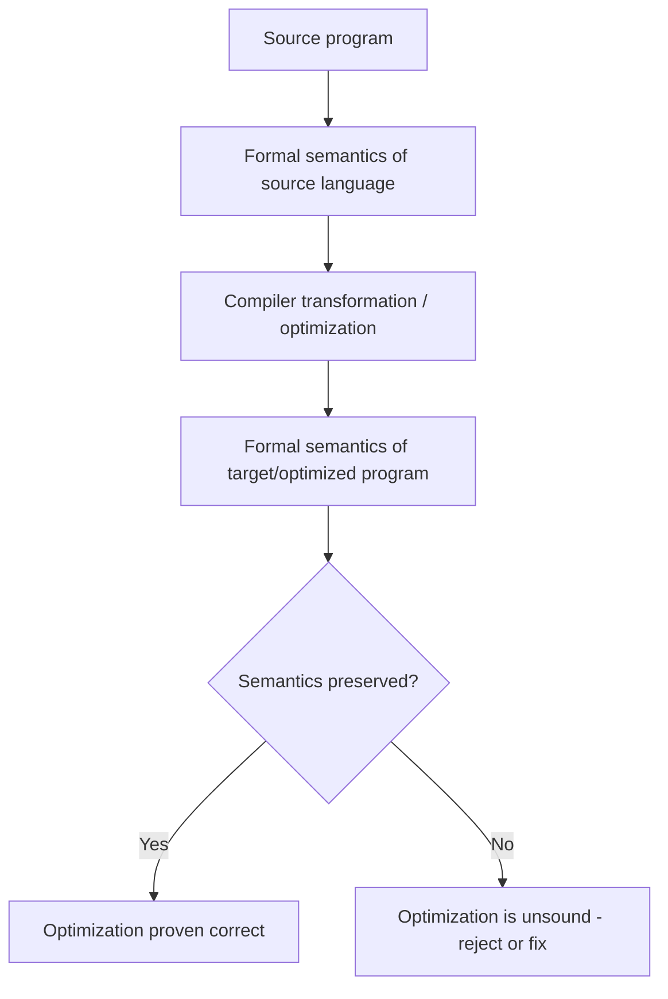
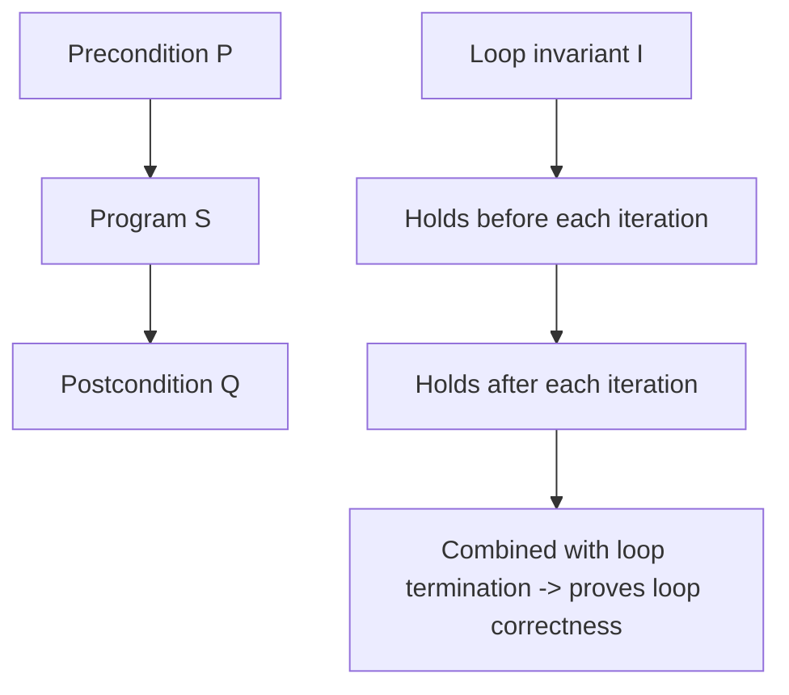

## Uses of Formal Semantics

### Overview

Formal semantics is the branch of programming language theory concerned with precisely and mathematically defining what programs mean — what a program computes, how its constructs behave, and under what conditions it is correct. Unlike informal documentation or reference manuals, which describe language behavior in natural language subject to ambiguity, formal semantics uses mathematical notation and rigorous definitions to leave no room for interpretation. This precision underlies a wide range of practical and theoretical applications across programming language design, compiler construction, formal verification, and software correctness.

### The Major Styles of Formal Semantics

**Key Points**

- **Operational semantics** defines meaning by specifying how a program executes step by step, typically via an abstract machine or a set of transition rules
- **Denotational semantics** defines meaning by mapping each program construct to a mathematical object (a function, typically) that represents its effect, independent of any particular execution mechanism
- **Axiomatic semantics** defines meaning through logical assertions about program states before and after execution, typically using preconditions and postconditions (as in Hoare logic)
- Different styles suit different purposes: operational semantics is often preferred for guiding interpreter/compiler implementation, denotational semantics for reasoning about program equivalence and compositional properties, and axiomatic semantics for program verification and proof of correctness

$$\{P\} \; S \; \{Q\}$$

The above is Hoare triple notation: if precondition $P$ holds before executing statement $S$, and $S$ terminates, then postcondition $Q$ holds afterward.

### Use in Language Specification and Standardization

**Key Points**

- Formal semantics removes ambiguity from language specifications, ensuring that different implementations of the same language behave identically for a given program, rather than relying on possibly divergent natural-language descriptions
- Several programming languages have had formal semantic definitions developed specifically to support standardization efforts, allowing compiler vendors to verify conformance against a precise mathematical reference rather than an informally worded manual
- Standard ML is frequently cited as a language whose design was accompanied by a full formal definition (denotational and later structural operational semantics), intended to make the language's behavior precisely specified from its inception [Inference — this is a widely repeated characterization in programming language theory literature regarding Standard ML's development process; the precise historical role and completeness of the formal definition relative to the language's actual usage is a matter with some nuance beyond a brief summary]
- Formal semantics for a language's core can also serve as an unambiguous arbiter when informal specification documents contain apparent contradictions or edge cases not clearly addressed

### Use in Compiler Correctness and Optimization

**Key Points**

- A compiler optimization is only safe if it preserves the formal semantics of the original program — formal semantics provides the precise standard against which "preserves meaning" can be checked, rather than relying on informal intuition
- Verified compilers, such as the CompCert project for a subset of C, use formal semantics of both source and target languages to mathematically prove that compilation does not alter program behavior, a guarantee that ordinary compilers do not typically provide [Inference — CompCert's general approach and goals are documented in academic publications describing the project; specific claims about the exact scope and completeness of its verification guarantees involve technical nuance beyond a brief summary]
- Formal semantics enables reasoning about whether two different pieces of code are semantically equivalent (produce the same observable behavior), which is foundational to justifying many compiler optimizations such as common subexpression elimination or loop transformations
- Without a formal semantic foundation, claims of optimization correctness rest on informal reasoning or extensive testing, neither of which can provide the same exhaustive guarantee as a mathematical proof

### Use in Program Verification

**Key Points**

- **Axiomatic semantics** (Hoare logic and its extensions, such as separation logic) provides the formal foundation for proving that a program meets its specification — that given valid inputs (precondition), it produces valid outputs (postcondition)
- Verification tools and proof assistants (e.g., Coq, Isabelle/HOL, Dafny) rely on formal semantic definitions of the target programming language to construct machine-checked proofs of program correctness
- Loop invariants, a core technique in axiomatic program verification, are themselves formal semantic assertions that must hold before and after each loop iteration, used to prove properties about loops without needing to reason about every possible number of iterations individually
- This style of verification is particularly valued in safety-critical and security-critical software domains (aerospace, medical devices, cryptographic implementations), where the cost of formal proof is justified by the severity of potential failures [Inference — the association between formal verification and safety/security-critical domains is a commonly cited pattern in formal methods literature and industry case studies; the extent of adoption varies considerably by specific industry and organization]

### Use in Type System Design and Soundness Proofs

**Key Points**

- Formal semantics underlies the proof technique known as **progress and preservation** (or type soundness), which establishes that a well-typed program in a given type system either produces a value or can take a further evaluation step (progress), and that evaluation steps preserve well-typedness (preservation)
- This proof methodology, formalized using operational semantics paired with a formal type system, is the standard way language designers rigorously demonstrate that "well-typed programs don't go wrong" — a foundational goal of static type system design
- New language features (generics, effect systems, dependent types, gradual typing) are commonly validated through formal soundness proofs before being adopted into mainstream language designs, reducing the risk of subtle type-system unsoundness reaching production compilers
- Formal semantics thus serves a gatekeeping role in language feature design: a proposed feature that cannot be shown sound within a formal model is a strong signal of underlying design problems, even before any implementation exists

### Use in Comparing and Relating Different Languages or Paradigms

**Key Points**

- Formal semantics enables precise comparison of seemingly different language constructs by translating them into a shared mathematical framework (commonly, variants of the lambda calculus for functional constructs, or small-step operational semantics for imperative constructs)
- This has allowed researchers to formally demonstrate relationships such as the equivalence of certain imperative and functional idioms, or to precisely characterize what expressive power is gained or lost when a language feature is added or removed
- The lambda calculus itself, augmented with various formal semantic treatments (call-by-value vs. call-by-name evaluation, for example), serves as a common theoretical substrate for reasoning about functional language semantics across many different concrete languages
- This comparative use of formal semantics supports both academic language design research and practical decisions about which language or feature best fits a given problem, by grounding otherwise informal comparisons in precise mathematical terms

### Use in Concurrency and Memory Model Specification

**Key Points**

- Formal semantics is essential for precisely specifying **memory models** in concurrent and multi-threaded programming languages — defining exactly which behaviors are permitted when multiple threads access shared memory without explicit synchronization
- Ambiguity in a memory model's informal description can lead to different compiler or hardware implementations making different (and mutually incompatible) assumptions, causing subtle concurrency bugs that only manifest on certain platforms
- The Java Memory Model and the C++11 memory model are examples of concurrency semantics that received significant formal treatment specifically because informal descriptions proved insufficient to prevent inconsistent implementations across compilers and hardware architectures [Inference — the general narrative that informal specification proved insufficient and motivated more formal treatment is documented in language design retrospectives and academic papers on these specific memory models; the precise sequence of events and completeness of the resulting formalizations involves technical detail beyond a brief summary]
- Formal treatment of concurrency semantics also supports the development of race-detection tools and concurrent program verification techniques, since such tools require a precise definition of what constitutes a "data race" or other concurrency error

### Comparative Table of Semantic Styles and Their Primary Uses

| Semantic Style | Core Idea | Primary Practical Use |
| --- | --- | --- |
| Operational | Step-by-step execution rules | Interpreter/compiler implementation guidance; type soundness proofs |
| Denotational | Mapping constructs to mathematical objects | Reasoning about program equivalence; language comparison |
| Axiomatic | Pre/postcondition assertions (Hoare logic) | Program verification; loop invariant reasoning |
| Structural Operational Semantics (SOS) | Rule-based small-step or big-step transitions | Formal language definition; soundness proofs |

### Illustration: Formal Semantics as a Hub for Multiple Applications

<svg xmlns="http://www.w3.org/2000/svg" viewBox="0 0 700 420">
<text x="350" y="30" text-anchor="middle" font-size="18" font-weight="bold" fill="#1a1a1a">Formal Semantics: Central Applications (svg_diagram)</text>
<circle cx="350" cy="220" r="75" fill="#e0d4fa" stroke="#6b46c1" stroke-width="2" />
<text x="350" y="215" text-anchor="middle" font-size="13" font-weight="bold" fill="#3c1a78">Formal Semantics</text>
<text x="350" y="232" text-anchor="middle" font-size="9" fill="#3c1a78">(Operational, Denotational,</text>
<text x="350" y="245" text-anchor="middle" font-size="9" fill="#3c1a78">Axiomatic)</text>
<rect x="30" y="60" width="170" height="45" rx="6" fill="#cfe8ff" stroke="#2b6cb0" stroke-width="2" />
<text x="115" y="87" text-anchor="middle" font-size="10" fill="#1a3d5c">Language Standardization</text>
<line x1="180" y1="105" x2="300" y2="175" stroke="#333" stroke-width="1" marker-end="url(#h1)" />
<rect x="500" y="60" width="170" height="45" rx="6" fill="#d6f5d6" stroke="#2f855a" stroke-width="2" />
<text x="585" y="87" text-anchor="middle" font-size="10" fill="#1a4d2e">Compiler Correctness</text>
<line x1="520" y1="105" x2="400" y2="175" stroke="#333" stroke-width="1" marker-end="url(#h1)" />
<rect x="30" y="330" width="170" height="45" rx="6" fill="#ffe8cc" stroke="#c05621" stroke-width="2" />
<text x="115" y="357" text-anchor="middle" font-size="10" fill="#7c2d12">Program Verification</text>
<line x1="180" y1="330" x2="300" y2="265" stroke="#333" stroke-width="1" marker-end="url(#h1)" />
<rect x="500" y="330" width="170" height="45" rx="6" fill="#fde8e8" stroke="#c53030" stroke-width="2" />
<text x="585" y="357" text-anchor="middle" font-size="10" fill="#742a2a">Type Soundness Proofs</text>
<line x1="520" y1="330" x2="400" y2="265" stroke="#333" stroke-width="1" marker-end="url(#h1)" />
<rect x="30" y="200" width="150" height="45" rx="6" fill="#fff5cc" stroke="#b7891f" stroke-width="2" />
<text x="105" y="227" text-anchor="middle" font-size="10" fill="#5c4a15">Language Comparison</text>
<line x1="180" y1="222" x2="275" y2="220" stroke="#333" stroke-width="1" marker-end="url(#h1)" />
<rect x="520" y="200" width="150" height="45" rx="6" fill="#d4e8fa" stroke="#1a5c8c" stroke-width="2" />
<text x="595" y="227" text-anchor="middle" font-size="10" fill="#0f3a5c">Concurrency Memory Models</text>
<line x1="520" y1="222" x2="425" y2="220" stroke="#333" stroke-width="1" marker-end="url(#h1)" />
</svg>

### Use in Security Analysis

**Key Points**

- Formal semantics underlies **information flow analysis**, which reasons about whether sensitive data (e.g., secret keys, personal information) could leak into observable outputs through a program's execution paths — a property that requires a precise semantic model of what "observable" means
- Security type systems (extending ordinary type systems with confidentiality/integrity labels) rely on formal soundness proofs, structured similarly to standard type soundness proofs, to guarantee that well-typed programs cannot leak labeled-secret information through normal execution
- Formal models of cryptographic protocols use semantics-based reasoning to prove security properties (such as secrecy or authentication) hold under precisely defined adversary models, an approach central to modern protocol verification tools
- This application illustrates how formal semantics extends beyond "does the program compute the right answer" into "does the program preserve security properties throughout its execution," a distinct but related class of correctness concern

### Educational and Pedagogical Uses

**Key Points**

- Formal semantics provides a precise, language-independent vocabulary for teaching core programming language concepts (scoping, evaluation order, parameter passing) without relying on the idiosyncrasies of any single concrete language's informal documentation
- Small formal calculi (such as simplified subsets of a language, sometimes called "core" or "featherweight" versions, e.g., Featherweight Java) are commonly used in both research and teaching to study specific language features in isolation, stripped of the complexity of a full production language
- This pedagogical use allows students and researchers to rigorously explore "what if" questions about language design (e.g., "what changes if we add mutable references to this small functional calculus?") in a tractable formal setting before considering full-scale language implementation
- Understanding formal semantics is often considered foundational for advanced programming language research and design work, distinguishing language theorists from practitioners who work primarily with informal specifications [Inference — this characterization of formal semantics as foundational specifically for research/design roles, as distinct from general practitioner work, reflects a common framing in programming language theory pedagogy rather than a precisely measurable claim]

### Common Pitfalls in Applying Formal Semantics

**Key Points**

- Assuming a formal semantic model fully captures real-world implementation behavior — formal models often abstract away details (specific hardware behavior, compiler bugs, resource limits) that matter in practice, so a proof relative to the model does not guarantee identical real-world behavior in every respect
- Conflating the different semantic styles' purposes — for example, expecting a denotational semantics to directly guide an efficient interpreter implementation, when operational semantics is generally better suited to that particular goal
- Underestimating the effort required to produce and maintain a full formal semantics for a large, evolving production language, which is part of why many widely used languages (in contrast to research languages like Standard ML) rely primarily on informal specifications supplemented by test suites and reference implementations
- Treating a formal proof of one property (e.g., type soundness) as if it implies unrelated properties (e.g., overall program correctness or security), when in fact each formal guarantee is scoped precisely to what was actually proven

### Related Topics

- Operational, denotational, and axiomatic semantics in individual technical depth
- Hoare logic and program verification techniques in detail
- Type soundness proofs: progress and preservation methodology
- The lambda calculus as a foundational formal semantic substrate
- Verified compilation and the CompCert project as a case study
- Memory models for concurrency (Java Memory Model, C++11 memory model)
- Information flow security type systems and their soundness proofs
- Featherweight Java and other minimal formal calculi used in language research