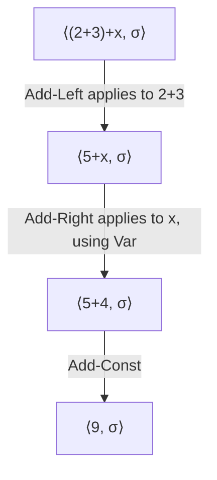
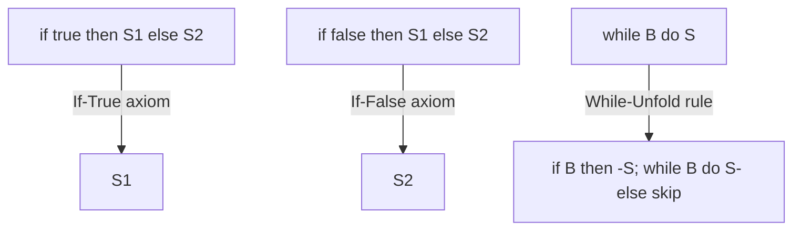
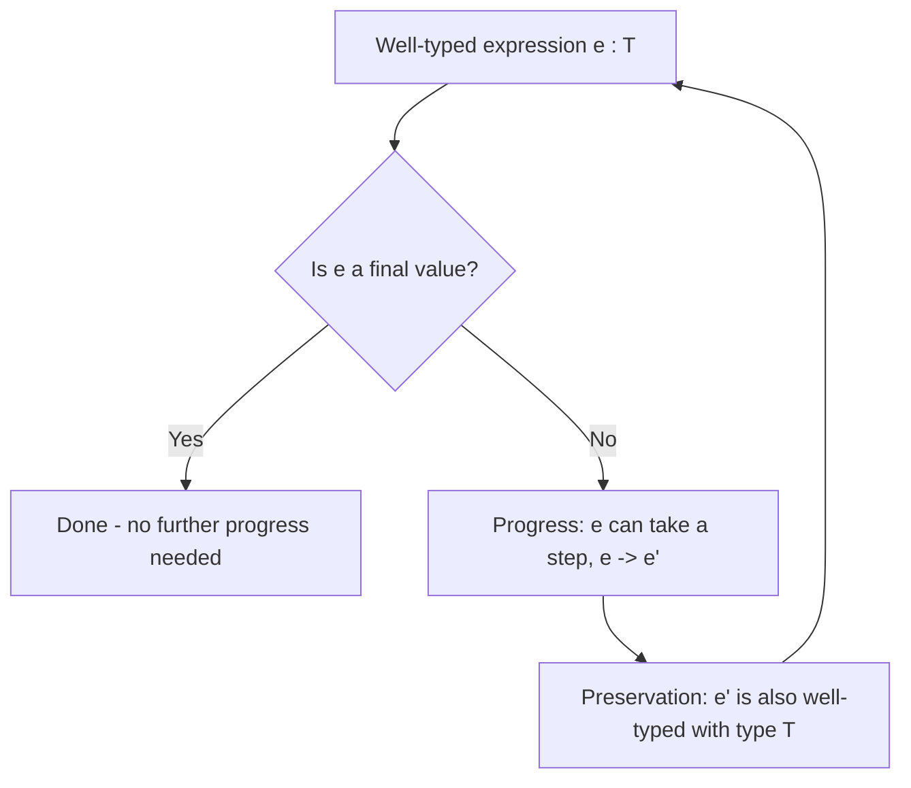

## Operational Semantics Revisited

### Overview

Operational semantics defines the meaning of a program by specifying precisely how it executes — as a sequence of computational steps transforming one program state into another. This revisits and deepens the foundational concept with a focus on the technical machinery: the distinction between small-step and big-step styles, the formal notation used to express transition rules, how these rules compose to describe full language behavior, and the proof techniques (notably progress and preservation) that operational semantics enables.

### Small-Step vs. Big-Step Semantics

**Key Points**

- **Small-step (structural) operational semantics** defines a single-step relation $\rightarrow$ between program configurations, where each rule describes one atomic computation step, and full evaluation is the reflexive-transitive closure of that relation
- **Big-step (natural) operational semantics** defines a relation $\Downarrow$ directly between a program (or expression) and its final result, describing the overall outcome of evaluation without exposing intermediate steps
- Small-step semantics is generally preferred when reasoning about non-termination, interleaving (as in concurrency), or intermediate program states, since each individual step is explicitly observable
- Big-step semantics is often more concise for defining the semantics of terminating deterministic computations, and maps more directly onto how an interpreter might be implemented recursively

$$\text{Small-step: } \langle e, \sigma \rangle \rightarrow \langle e', \sigma' \rangle$$

$$\text{Big-step: } \langle e, \sigma \rangle \Downarrow v$$

Here $e$ is an expression, $\sigma$ a state (mapping variables to values), $e'$ a reduced expression, $\sigma'$ an updated state, and $v$ a final value.

### Configurations and Transition Rules

**Key Points**

- A **configuration** captures everything needed to describe the current state of a computation — typically an expression or statement paired with an environment or store
- **Transition rules** (also called inference rules) are written in a fraction-like notation: premises above a horizontal line, conclusion below, meaning "if the premises hold, the conclusion follows"
- Rules with no premises are called **axioms**, representing base computation steps that always apply directly
- Rules are typically organized by the syntactic structure of the language, with one or more rules per language construct (arithmetic expressions, conditionals, assignments, loops, and so on)

$$\frac{}{\langle n, \sigma \rangle \Downarrow n} \quad \text{(axiom: a numeral evaluates to itself)}$$

$$\frac{\langle e_1, \sigma \rangle \Downarrow n_1 \qquad \langle e_2, \sigma \rangle \Downarrow n_2}{\langle e_1 + e_2, \sigma \rangle \Downarrow n_1 + n_2} \quad \text{(rule: addition evaluates both operands, then adds)}$$

### A Worked Small-Step Example: Arithmetic Expressions

Consider a small imperative language fragment with arithmetic expressions and a store $\sigma$ mapping variable names to integer values.

$$\frac{}{\langle x, \sigma \rangle \rightarrow \langle \sigma(x), \sigma \rangle} \quad \text{(Var)}$$

$$\frac{\langle e_1, \sigma \rangle \rightarrow \langle e_1', \sigma \rangle}{\langle e_1 + e_2, \sigma \rangle \rightarrow \langle e_1' + e_2, \sigma \rangle} \quad \text{(Add-Left)}$$

$$\frac{\langle e_2, \sigma \rangle \rightarrow \langle e_2', \sigma \rangle}{\langle n + e_2, \sigma \rangle \rightarrow \langle n + e_2', \sigma \rangle} \quad \text{(Add-Right)}$$

$$\frac{}{\langle n_1 + n_2, \sigma \rangle \rightarrow \langle n_1 + n_2 \text{ (computed)}, \sigma \rangle} \quad \text{(Add-Const)}$$

**Key Points**

- (Var) looks up a variable's value in the store — an axiom, since it requires no sub-derivation
- (Add-Left) and (Add-Right) specify evaluation order: the left operand is reduced first (Add-Left applies only when $e_1$ is not yet a value), then the right, reflecting a left-to-right evaluation strategy choice made explicit by the rule structure
- (Add-Const) performs the actual arithmetic once both operands have been reduced to numerals
- The specific choice of which rules can fire (e.g., restricting Add-Right to apply only when the left side is already a numeral $n$) is exactly how operational semantics formally encodes evaluation order decisions that might otherwise be left ambiguous in informal descriptions

### Tracing a Small-Step Derivation

For the expression `(2 + 3) + x` with store $\sigma = \{x \mapsto 4\}$:

**Key Points**

- Each arrow represents exactly one application of a transition rule — this is the defining characteristic of small-step semantics, exposing every intermediate configuration
- The reflexive-transitive closure of $\rightarrow$, often written $\rightarrow^*$, captures "zero or more steps," allowing the overall relationship $\langle (2+3)+x, \sigma \rangle \rightarrow^* \langle 9, \sigma \rangle$ to be stated concisely
- This step-by-step exposure is precisely what makes small-step semantics well suited to describing non-terminating computations (which never reach a final configuration) or interleaved computations (where steps from different threads can be arbitrarily interspersed)

### Handling Control Flow: Conditionals and Loops

$$\frac{}{\langle \text{if true then } S_1 \text{ else } S_2, \sigma \rangle \rightarrow \langle S_1, \sigma \rangle} \quad \text{(If-True)}$$

$$\frac{}{\langle \text{while } B \text{ do } S, \sigma \rangle \rightarrow \langle \text{if } B \text{ then } (S; \text{while } B \text{ do } S) \text{ else skip}, \sigma \rangle} \quad \text{(While-Unfold)}$$

**Key Points**

- Loops are commonly given semantics by **unfolding**: a `while` loop is defined as equivalent to one conditional check followed by either the loop body plus a repeated while, or `skip` if the condition is false
- This unfolding rule elegantly reduces the semantics of iteration to already-defined constructs (conditionals and sequencing), avoiding the need for a separate primitive "loop" computation step
- Non-termination is naturally represented in small-step semantics: a `while true do skip` loop simply never reaches a configuration with no further applicable rule, and the transition sequence $\rightarrow, \rightarrow, \rightarrow, \dots$ continues indefinitely without ever halting

### Sequencing and Structural Congruence

$$\frac{\langle S_1, \sigma \rangle \rightarrow \langle S_1', \sigma' \rangle}{\langle S_1; S_2, \sigma \rangle \rightarrow \langle S_1'; S_2, \sigma' \rangle} \quad \text{(Seq-Step)}$$

$$\frac{}{\langle \text{skip}; S_2, \sigma \rangle \rightarrow \langle S_2, \sigma \rangle} \quad \text{(Seq-Skip)}$$

**Key Points**

- (Seq-Step) allows the first statement in a sequence to take a step, carrying the remainder of the sequence along unchanged
- (Seq-Skip) discards a completed first statement (represented as `skip`) once it has finished, advancing to the second statement
- Together, these rules formally capture the intuitive notion of "execute statements in order," without needing to treat sequencing as a primitive, indivisible operation

### Progress and Preservation: The Central Soundness Proof

Operational semantics, paired with a static type system, enables the standard technique for proving **type soundness**: the guarantee that well-typed programs cannot get "stuck" in an undefined state.

**Key Points**

- **Progress**: if an expression $e$ is well-typed (and not already a final value), then $e$ can take a step — $e \rightarrow e'$ for some $e'$. This ensures a well-typed program never gets stuck with no applicable rule.
- **Preservation** (also called subject reduction): if $e$ is well-typed with type $T$, and $e \rightarrow e'$, then $e'$ is also well-typed with the same type $T$. This ensures type correctness is maintained across every computation step.
- Together, progress and preservation formally establish "well-typed programs don't go wrong" — informally, if a program passes type checking, it will either produce a value of the expected type or run forever, but it will never crash due to a type error (like applying addition to a boolean)
- This proof methodology is one of the most widely used applications of small-step operational semantics in programming language theory, precisely because the step-by-step structure makes an inductive proof over the number of steps natural to construct

### Environments, Stores, and Closures in Operational Semantics

**Key Points**

- Function-based languages require operational semantics to track **closures** — a function's code paired with the environment in which it was defined — to correctly model lexical scoping during evaluation
- The distinction between an **environment** (mapping variable names to values or locations, used for scoping) and a **store** (mapping locations to mutable values, used for state) is often made explicit in operational semantics for languages combining functional and imperative features
- This separation allows the formal treatment of mutable references to be layered cleanly onto an otherwise substitution- or environment-based functional core, a common technique in semantics for multi-paradigm languages

$$\langle \lambda x.\, e, \rho \rangle \quad \text{(a closure: function body paired with defining environment } \rho \text{)}$$

### Substitution-Based vs. Environment-Based Semantics

**Key Points**

- A **substitution-based** operational semantics (common for pure lambda calculus presentations) defines function application by literally substituting the argument for the bound variable throughout the function body: $(\lambda x.\, e)\, v \rightarrow e[x := v]$
- An **environment-based** semantics instead carries an explicit mapping of variables to values alongside the expression, avoiding the need to traverse and rewrite the expression itself on every application
- Substitution-based semantics is often preferred for its mathematical elegance and closeness to the original lambda calculus tradition, while environment-based semantics more closely mirrors how real interpreters are typically implemented
- Both styles are provably equivalent in their observable behavior for many core calculi, but the choice affects how directly the formal semantics can be transcribed into working interpreter code [Inference — the general claim of equivalence for many core calculi is a standard result presented in programming language theory texts; the precise conditions under which equivalence holds involve technical qualification specific to the calculus being studied]

### Comparative Table: Small-Step vs. Big-Step Semantics

| Aspect | Small-Step Semantics | Big-Step Semantics |
| --- | --- | --- |
| Relation defined | Single-step transition ($\rightarrow$) | Direct evaluation to final result ($\Downarrow$) |
| Intermediate states | Explicitly visible | Not directly visible |
| Best suited for | Non-termination, concurrency, interleaving | Concise definition of deterministic terminating evaluation |
| Proof technique fit | Progress and preservation (type soundness) | Simpler direct induction on derivation structure |
| Closeness to interpreter implementation | Models an explicit step function | Models a direct recursive evaluator |

### Illustration: Small-Step Derivation as a Chain

<svg xmlns="http://www.w3.org/2000/svg" viewBox="0 0 700 260">
<text x="350" y="30" text-anchor="middle" font-size="18" font-weight="bold" fill="#1a1a1a">Small-Step Reduction Chain (svg_diagram)</text>
<rect x="20" y="80" width="140" height="50" rx="8" fill="#cfe8ff" stroke="#2b6cb0" stroke-width="2" />
<text x="90" y="110" text-anchor="middle" font-size="11" fill="#1a3d5c">⟨(2+3)+x, σ⟩</text>
<line x1="160" y1="105" x2="200" y2="105" stroke="#333" stroke-width="1.5" marker-end="url(#i1)" />
<text x="180" y="95" text-anchor="middle" font-size="9" fill="#333">Add-Left</text>
<rect x="200" y="80" width="140" height="50" rx="8" fill="#d6f5d6" stroke="#2f855a" stroke-width="2" />
<text x="270" y="110" text-anchor="middle" font-size="11" fill="#1a4d2e">⟨5+x, σ⟩</text>
<line x1="340" y1="105" x2="380" y2="105" stroke="#333" stroke-width="1.5" marker-end="url(#i1)" />
<text x="360" y="95" text-anchor="middle" font-size="9" fill="#333">Add-Right/Var</text>
<rect x="380" y="80" width="140" height="50" rx="8" fill="#ffe8cc" stroke="#c05621" stroke-width="2" />
<text x="450" y="110" text-anchor="middle" font-size="11" fill="#7c2d12">⟨5+4, σ⟩</text>
<line x1="520" y1="105" x2="560" y2="105" stroke="#333" stroke-width="1.5" marker-end="url(#i1)" />
<text x="540" y="95" text-anchor="middle" font-size="9" fill="#333">Add-Const</text>
<rect x="560" y="80" width="120" height="50" rx="8" fill="#fde8e8" stroke="#c53030" stroke-width="2" />
<text x="620" y="110" text-anchor="middle" font-size="12" fill="#742a2a">⟨9, σ⟩</text>

<text x="350" y="180" text-anchor="middle" font-size="12" fill="#333">Each arrow = one rule application; the full chain = →* (reflexive-transitive closure)</text>

</svg>

### Practical Applications of This Formal Machinery

**Key Points**

- Small-step semantics with progress and preservation is the standard toolkit used in academic papers introducing new type system features, providing the rigor needed to convince reviewers and implementers that a proposed feature is sound before it is built into a real compiler
- Interpreters can be directly derived from a small-step semantics by implementing the step relation as a function and repeatedly applying it until no rule matches (signaling either a final value or, if the term is not a value and no rule applies, a stuck/erroneous state)
- Concurrency semantics for languages with threads or processes typically extend small-step semantics with interleaving rules, where the overall transition relation allows steps from different threads to be freely interspersed, directly modeling the non-deterministic scheduling behavior of real concurrent execution
- Language documentation and reference implementations for research languages (and some production languages, to varying degrees) sometimes include a companion operational semantics specifically to resolve ambiguity in edge cases not clearly covered by prose descriptions

### Common Pitfalls

**Key Points**

- Confusing which operand evaluation order a set of rules encodes — the specific structure of rules like (Add-Left) versus (Add-Right) is what determines left-to-right versus right-to-left evaluation, and misreading this structure leads to incorrect assumptions about a language's actual evaluation order
- Assuming big-step semantics can equally well express non-termination — a non-terminating computation has no final value to relate via $\Downarrow$, so big-step semantics alone provides no direct way to distinguish "does not terminate" from "the semantics is simply undefined here" without additional machinery
- Treating progress and preservation as proving full program correctness, when they specifically guarantee only the absence of "stuck" states due to type errors — a well-typed program can still loop forever, produce a logically wrong (but type-correct) answer, or otherwise fail to meet its intended specification
- Overlooking those cases where a term is neither a value nor able to take a step (a genuinely stuck state) — this is precisely the situation progress is designed to rule out for well-typed programs, but a semantics for an ill-typed or partial language fragment may permit such stuck states, and recognizing this distinction is essential to correctly stating what progress actually guarantees

### Related Topics

- Denotational and axiomatic semantics as alternative formal styles
- Progress and preservation (type soundness) in fuller technical detail
- The lambda calculus and substitution-based reduction semantics
- Environment-based vs. substitution-based interpreter implementation strategies
- Concurrency semantics and interleaving models for multi-threaded languages
- Structural Operational Semantics (SOS) notation conventions in depth
- Verified compilation and its reliance on precise operational semantics
- Uses of formal semantics across language design, verification, and security