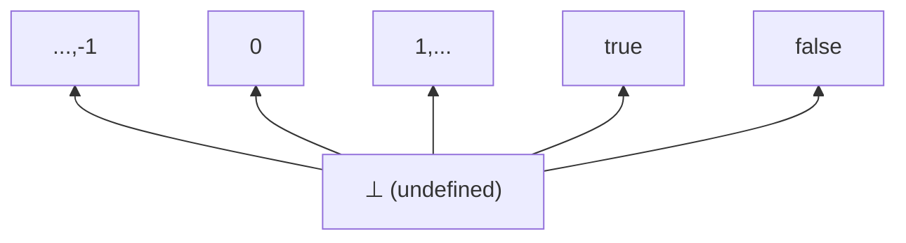
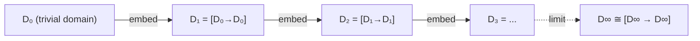
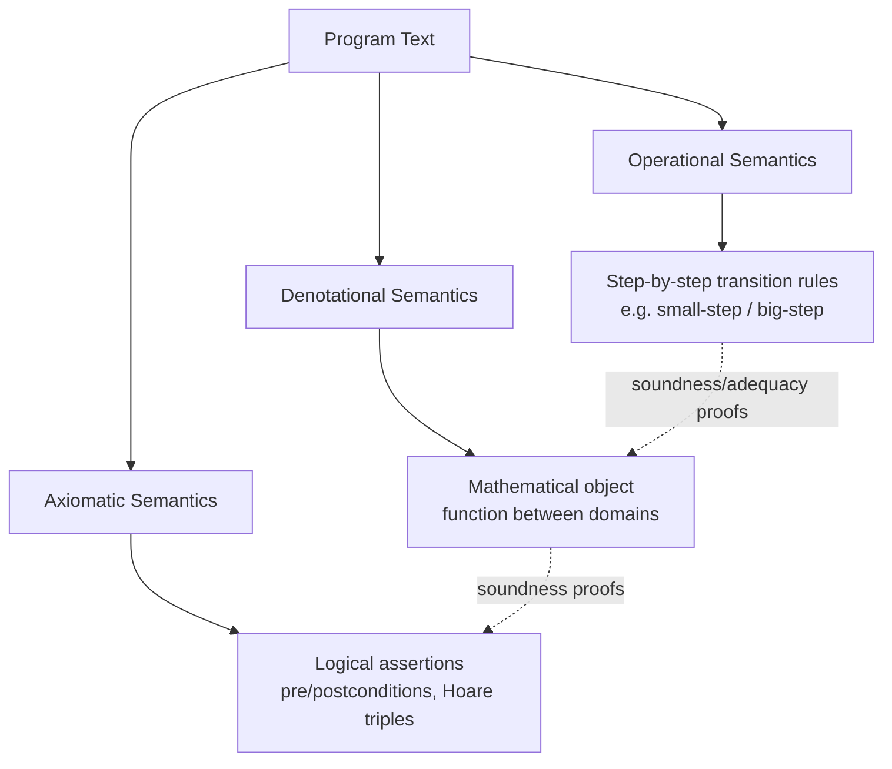
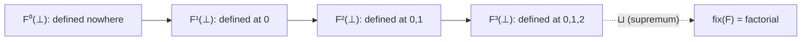

## Denotational Semantics

### Overview

Denotational semantics assigns mathematical meaning to programs by mapping syntactic constructs to elements of well-defined semantic domains, typically using functions between sets equipped with order-theoretic structure. A program is understood not by how it executes step by step but by what it *denotes*: a mathematical object such as a function from inputs to outputs. This approach was developed by Christopher Strachey and Dana Scott in the late 1960s, with Scott's domain theory supplying the mathematical foundation needed to make recursive and higher-order definitions rigorous.

The central design commitment is **compositionality**: the meaning of a compound expression is built strictly from the meanings of its parts, combined according to the syntactic structure. This stands in contrast to operational semantics, which specifies meaning via transition rules describing how configurations evolve, and axiomatic semantics, which specifies meaning via logical assertions about program states (pre/post-conditions).

### Why Domains, Not Just Sets

A naive attempt to model programs as plain set-theoretic functions runs into trouble almost immediately once recursion or looping enters the picture. Consider a function defined by an equation such as $f = F(f)$, where $F$ is some functional built from the program text. For this to have a well-defined solution — particularly when the program might not terminate — the semantic universe needs:

- A notion of **partial information**, so that "the computation hasn't produced a value yet" is itself a legitimate semantic object.
- A notion of **approximation**, so that partial results can be ordered by how much information they carry.
- Guaranteed **existence of least fixed points** for the kinds of functions programs induce.

This is what domain theory provides. A domain is a set equipped with a partial order $\sqsubseteq$ representing "is no more defined than," structured so that every directed subset has a least upper bound (a **directed-complete partial order**, or dcpo), and typically pointed with a least element $\bot$ representing complete undefinedness (non-termination).

### Core Domain-Theoretic Structures

**Complete Partial Orders (CPOs)**

A partial order $(D, \sqsubseteq)$ is a CPO when every directed subset $S \subseteq D$ has a supremum $\bigsqcup S$ in $D$. A directed subset is one where any two elements have an upper bound within the subset — capturing the idea of a consistent sequence of ever-more-defined approximations converging to a limit.

**Pointed CPOs**

A CPO is pointed if it has a least element $\bot$, satisfying $\bot \sqsubseteq d$ for all $d \in D$. $\bot$ denotes the value of a non-terminating computation — not an error, but the total absence of information about a result.

**Continuous Functions**

A function $f: D \to E$ between CPOs is continuous when it is monotone ($x \sqsubseteq y \implies f(x) \sqsubseteq f(y)$) and preserves suprema of directed sets:

$$f\left(\bigsqcup S\right) = \bigsqcup f(S)$$

Continuity is the domain-theoretic analogue of "computable in the limit" — it guarantees that the meaning of a loop or recursive call can be approximated by finite unfoldings without introducing discontinuous jumps.

**The Fixed-Point Theorem**

For any continuous function $F: D \to D$ on a pointed CPO, a least fixed point exists and is given by:

$$\text{fix}(F) = \bigsqcup_{n=0}^{\infty} F^n(\bot)$$

This is the theorem that makes recursive definitions meaningful. Each $F^n(\bot)$ is a finite approximation ($F^0(\bot) = \bot$, $F^1(\bot) = F(\bot)$, and so on), and the chain $\bot \sqsubseteq F(\bot) \sqsubseteq F^2(\bot) \sqsubseteq \cdots$ is directed by monotonicity, so its supremum exists and equals the least fixed point.

### Constructing Domains for a Language

**Flat Domains**

For base types like integers or booleans, the semantic domain is usually a flat domain: all proper values are pairwise incomparable, and only $\bot$ sits below them.



**Product Domains**

For pairs and tuples, $D \times E$ is ordered componentwise: $(d_1, e_1) \sqsubseteq (d_2, e_2)$ iff $d_1 \sqsubseteq d_2$ and $e_1 \sqsubseteq e_2$.

**Function Domains**

For function types, $D \to E$ consists of all continuous functions from $D$ to $E$, ordered pointwise: $f \sqsubseteq g$ iff $f(d) \sqsubseteq g(d)$ for all $d$. Restricting to continuous functions (rather than all set-theoretic functions) is essential — it keeps the space well-behaved and keeps the fixed-point theorem applicable.

**Sum Domains**

For variant or tagged-union types, $D + E$ combines tagged copies of $D$ and $E$ with a shared bottom, modeling choice between alternatives.

**Lifted Domains**

Lifting, written $D_\bot$, adds a new bottom element beneath an existing domain $D$, used when a computation over $D$ might separately fail to terminate versus a value in $D$ already having its own notion of definedness.

### The Self-Application Problem and Scott's Solution

For untyped or dynamically-typed languages (and for modeling the untyped lambda calculus), one needs a domain $D$ satisfying $D \cong [D \to D]$ — a domain that is isomorphic to its own continuous function space, since terms can be applied to themselves or to arbitrary other terms. Naive set theory forbids this by a cardinality argument: $|[D \to D]| $ generally exceeds $|D|$ for nontrivial $D$ (a Cantor-style diagonalization).

Scott's resolution constructs such a $D$ as an **inverse limit** (or projective limit) of a sequence of increasingly rich approximating domains:

$$D_0 \xleftarrow{p_0} D_1 \xleftarrow{p_1} D_2 \xleftarrow{p_2} \cdots$$

where each $D_{n+1}$ is built from continuous self-maps on $D_n$, connected by projection and embedding pairs. The limit $D_\infty$ of this system satisfies $D_\infty \cong [D_\infty \to D_\infty]$ within the category of CPOs and continuous functions, because the function space is restricted to continuous — not arbitrary — functions, which is a strictly smaller and more tractable space than the naive full function space.



### Denotational Semantics of a Simple Imperative Language

Consider a minimal language with integer expressions, boolean expressions, assignment, sequencing, conditionals, and while loops. Let $\text{Store} = \text{Var} \to \mathbb{Z}$ be the domain of states.

**Expressions** are given meaning as functions from stores to values:

$$\mathcal{E}[\![e]\!] : \text{Store} \to \mathbb{Z}$$

with clauses such as:

$$\mathcal{E}[\![n]\!]\,\sigma = n \qquad \mathcal{E}[\![x]\!]\,\sigma = \sigma(x) \qquad \mathcal{E}[\![e_1 + e_2]\!]\,\sigma = \mathcal{E}[\![e_1]\!]\,\sigma + \mathcal{E}[\![e_2]\!]\,\sigma$$

**Commands** are given meaning as partial functions on stores, modeled as continuous functions into a lifted store domain $\text{Store}_\bot$:

$$\mathcal{C}[\![\cdot]\!] : \text{Com} \to (\text{Store} \to \text{Store}_\bot)$$

Key clauses:

$$\mathcal{C}[\![x := e]\!]\,\sigma = \sigma[x \mapsto \mathcal{E}[\![e]\!]\,\sigma]$$


$$\mathcal{C}[\![c_1 ; c_2]\!]\,\sigma = \mathcal{C}[\![c_2]\!]^{\dagger}(\mathcal{C}[\![c_1]\!]\,\sigma)$$

where $(\cdot)^{\dagger}$ denotes Kleisli extension lifting a function on $\text{Store}$ to one on $\text{Store}_\bot$ that propagates $\bot$.

$$\mathcal{C}[\![\text{if } b \text{ then } c_1 \text{ else } c_2]\!]\,\sigma = \begin{cases} \mathcal{C}[\![c_1]\!]\,\sigma & \text{if } \mathcal{B}[\![b]\!]\,\sigma = \text{true} \\ \mathcal{C}[\![c_2]\!]\,\sigma & \text{if } \mathcal{B}[\![b]\!]\,\sigma = \text{false} \end{cases}$$

**While loops** are the construct that forces the fixed-point machinery into view. Define $W = \mathcal{C}[\![\text{while } b \text{ do } c]\!]$ as the solution to:

$$W\,\sigma = \begin{cases} W^{\dagger}(\mathcal{C}[\![c]\!]\,\sigma) & \text{if } \mathcal{B}[\![b]\!]\,\sigma = \text{true} \\ \sigma & \text{if } \mathcal{B}[\![b]\!]\,\sigma = \text{false} \end{cases}$$

This equation defines $W$ in terms of itself, so $W$ is taken to be the least fixed point of the functional $\Phi: (\text{Store} \to \text{Store}_\bot) \to (\text{Store} \to \text{Store}_\bot)$ given by:

$$\Phi(g)\,\sigma = \text{if } \mathcal{B}[\![b]\!]\,\sigma \text{ then } g^{\dagger}(\mathcal{C}[\![c]\!]\,\sigma) \text{ else } \sigma$$

so that $\mathcal{C}[\![\text{while } b \text{ do } c]\!] = \text{fix}(\Phi)$. A non-terminating loop denotes a function that maps its starting states to $\bot$, and each finite unfolding $\Phi^n(\bot)$ correctly captures the semantics of running the loop for at most $n$ iterations.

### Denotational Semantics for Functional Languages

For languages with first-class functions and recursion (e.g., a PCF-like calculus), function types $\sigma \to \tau$ are interpreted as continuous function domains $[\![\sigma]\!] \to [\![\tau]\!]$, and recursive definitions `letrec f = e in ...` are interpreted via the fixed-point operator on the appropriate domain — the same mathematical device as the while-loop case above, now surfaced directly at the language level rather than hidden inside a semantic clause.

This uniformity is one of denotational semantics' distinguishing strengths: recursion in the source language and recursion in the metalanguage (mathematics) are unified through a single fixed-point theorem, rather than requiring separate operational machinery for each recursive construct.

### Relating Denotational and Operational Semantics

A central theoretical concern is showing that denotational and operational accounts of a language agree — that they are, in an appropriate sense, describing the same thing from different angles.

- **Soundness** (also called adequacy in one direction): if the operational semantics says a term evaluates to a value, the denotational semantics assigns it a denotation consistent with that value.
- **Adequacy**: conversely, if the denotational semantics assigns a term a "defined" (non-$\bot$) meaning, the term operationally terminates.
- **Full Abstraction**: the strongest and most delicate property — two terms have equal denotations if and only if they are operationally indistinguishable in all program contexts (contextually equivalent).

[Unverified] Full abstraction is notoriously difficult to achieve for languages with features like control operators or concurrency; the classical result that the standard Scott-domain model of PCF is *not* fully abstract (due to the presence of "parallel-or"-like non-definable elements) is well established in the literature, though specific claims about which extensions restore full abstraction (e.g., game-semantic models) involve technical subtleties that vary by source and are best confirmed against a primary reference before being cited precisely.

### Denotational Semantics vs. Other Semantic Styles



| Aspect | Denotational | Operational | Axiomatic |
| --- | --- | --- | --- |
| Meaning is... | A mathematical object (function) | A sequence of computation steps | A logical property (assertions) |
| Compositional? | Yes, by construction | Not inherently | Partially (via Hoare rules) |
| Handles non-termination via | $\bot$ in domain | Non-terminating derivation | Partial vs. total correctness |
| Good for | Equivalence proofs, language design, abstract interpretation foundations | Implementation guidance, compiler correctness | Program verification, proving correctness of specific programs |
| Weakness | Can be mathematically heavy; full abstraction is hard | Meanings not automatically compositional | Doesn't directly explain *what a program computes*, only that it satisfies a spec |

### Modern Extensions and Relevance

**Domain Theory and Probabilistic Semantics**

[Inference] Extending denotational semantics to probabilistic or randomized programs generally involves replacing plain domains with domains of probability distributions or measures (e.g., using the probabilistic powerdomain), an active research direction connecting domain theory to measure theory; exact formulations differ across papers and this area should be treated as evolving rather than settled.

**Domain Theory and Concurrency**

Powerdomains (Smyth, Hoare, Plotkin powerdomains) extend the basic framework to model nondeterministic choice, representing a computation's meaning as a set of possible outcomes ordered appropriately, rather than a single deterministic result.

**Synthetic Domain Theory and Type Theory**

Denotational semantics has influenced, and been reformulated within, category-theoretic and type-theoretic frameworks, including realizability models and synthetic domain theory, which internalize domain-theoretic notions inside a suitable topos or type theory rather than building them externally from set theory.

**Abstract Interpretation**

Abstract interpretation, a static analysis framework, is directly descended from denotational semantics: it approximates the "true" denotational semantics of a program with a computable, sound over-approximation, used to prove properties like absence of runtime errors without executing the program.

### Worked Example: Factorial via Fixed Points

Consider the recursive definition:



```
fact = λn. if n = 0 then 1 else n * fact(n - 1)
```

Define the functional $F$ on the domain of (partial) functions $\mathbb{Z} \to \mathbb{Z}_\bot$:

$$F(f)(n) = \text{if } n = 0 \text{ then } 1 \text{ else } n \times f(n-1)$$

The successive approximations are:

- $F^0(\bot) = \bot$ (the totally undefined function — every input maps to $\bot$)
- $F^1(\bot)(n) = \text{if } n = 0 \text{ then } 1 \text{ else } n \times \bot = \bot$ for $n \neq 0$, so $F^1(\bot)$ is defined only at $0$
- $F^2(\bot)$ is defined at $0$ and $1$
- $F^n(\bot)$ is defined exactly on $\{0, 1, \ldots, n-1\}$

The least fixed point $\text{fix}(F) = \bigsqcup_n F^n(\bot)$ is defined on all of $\mathbb{Z}_{\geq 0}$ and coincides with the usual factorial function — each finite approximation contributes correct values for a larger initial segment, and the supremum assembles them into the total (on naturals) function.



### Key Points

- Denotational semantics maps programs to mathematical objects (typically functions between domains), built compositionally from the meanings of subexpressions.
- CPOs and continuous functions provide the mathematical scaffolding; the least fixed-point theorem is what makes recursive and iterative constructs well-defined.
- $\bot$ represents non-termination as a legitimate semantic value rather than an error or exception.
- Scott's inverse-limit construction solves the self-application problem for untyped/dynamic languages by restricting attention to continuous function spaces.
- Denotational, operational, and axiomatic semantics are complementary; soundness, adequacy, and full abstraction are the formal bridges connecting denotational models to operational behavior.
- The framework underlies later developments including powerdomains for nondeterminism, probabilistic domains for randomized computation, and abstract interpretation for static analysis.

### Related Topics

- Operational Semantics: Small-Step and Big-Step Styles
- Axiomatic Semantics and Hoare Logic
- Category Theory Foundations for Programming Language Semantics
- Domain Theory: Powerdomains and Nondeterminism
- Game Semantics and Full Abstraction for PCF
- Abstract Interpretation and Static Analysis
- The Untyped Lambda Calculus and Scott's D∞ Model
- Type Systems and Their Semantic Interpretations (Logical Relations)