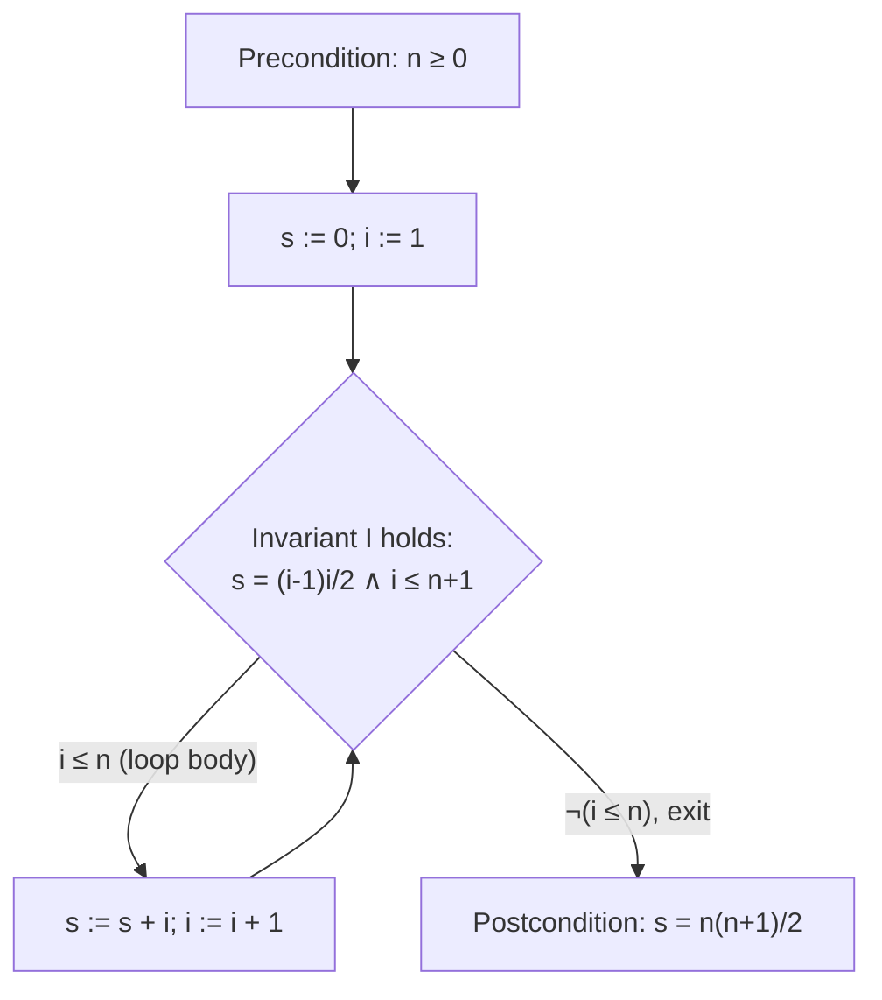

## Axiomatic Semantics and Weakest Preconditions

### Overview

Axiomatic semantics defines the meaning of a program not by describing its execution steps or by mapping it to a mathematical function, but by specifying what can be logically proven about the program's effect on the state. Meaning is given through assertions — logical formulas about program variables — attached before and after program fragments. This approach, pioneered by Robert Floyd for flowcharts and formalized by Tony Hoare for structured programs, ties program correctness directly to formal logical deduction, and was later extended by Edsger Dijkstra into the weakest-precondition calculus, which reframes correctness reasoning as a backward-moving predicate transformer.

### Hoare Logic: Core Framework

**Hoare Triples**

The fundamental unit of axiomatic semantics is the Hoare triple:

$$\{P\} \; c \; \{Q\}$$

where $P$ is the **precondition**, $c$ is a command, and $Q$ is the **postcondition**. The triple asserts a correctness claim relating the state before and after execution of $c$.

**Partial vs. Total Correctness**

- **Partial correctness**, written $\{P\} \, c \, \{Q\}$: if $c$ is executed in a state satisfying $P$ and $c$ terminates, the resulting state satisfies $Q$. Non-termination is not ruled out.
- **Total correctness**, written $[P] \, c \, [Q]$ or $\{P\} \, c \, \{Q\}_{\text{tot}}$: as above, but additionally guarantees that $c$ terminates when started in a state satisfying $P$.

The distinction matters because most Hoare-logic proof rules (as originally formulated) establish only partial correctness; proving total correctness requires an additional termination argument, typically via a **variant function** (also called a ranking function) that strictly decreases on a well-founded order with each loop iteration.

### Proof Rules

**Assignment Axiom**

$$\{P[e/x]\} \; x := e \; \{P\}$$

Read backward: to establish $P$ after the assignment, it suffices that $P$ with $e$ substituted for $x$ held beforehand. This rule is an axiom (not derived from anything more basic) and is the base case upon which all other reasoning is built.

**Sequencing Rule**

$$\dfrac{\{P\} \, c_1 \, \{R\} \quad \{R\} \, c_2 \, \{Q\}}{\{P\} \, c_1 ; c_2 \, \{Q\}}$$

**Conditional Rule**

$$\dfrac{\{P \wedge b\} \, c_1 \, \{Q\} \quad \{P \wedge \neg b\} \, c_2 \, \{Q\}}{\{P\} \; \text{if } b \text{ then } c_1 \text{ else } c_2 \; \{Q\}}$$

**While Rule (Partial Correctness)**

$$\dfrac{\{P \wedge b\} \, c \, \{P\}}{\{P\} \; \text{while } b \text{ do } c \; \{P \wedge \neg b\}}$$

Here $P$ is a **loop invariant**: a condition that holds before the loop, is preserved by each iteration (given the guard $b$ holds), and combined with the negated guard on exit yields the desired postcondition. Finding the right invariant is typically the hardest step in a Hoare-logic proof and is not mechanically derivable from the loop body in general.

**Rule of Consequence**

$$\dfrac{P \Rightarrow P' \quad \{P'\} \, c \, \{Q'\} \quad Q' \Rightarrow Q}{\{P\} \, c \, \{Q\}}$$

This rule allows strengthening the precondition or weakening the postcondition using ordinary logical implication, and is essential for connecting the mechanically-generated conditions from other rules to the actual goal.

### Worked Example: Summing to N

Consider a loop that computes $\sum_{i=1}^{n} i$ into variable `s`:



```
s := 0;
i := 1;
while (i <= n) do
    s := s + i;
    i := i + 1
```

Goal: $\{n \geq 0\} \; \text{(program)} \; \{s = n(n+1)/2\}$

Invariant candidate: $I \equiv s = \dfrac{(i-1)i}{2} \wedge i \leq n+1$

- **Initialization**: after `s := 0; i := 1`, $s = 0 = \frac{0 \cdot 1}{2}$ and $i = 1 \leq n+1$ (given $n \geq 0$) — $I$ holds.
- **Preservation**: assume $I \wedge (i \leq n)$ before the loop body. After `s := s + i; i := i + 1`, the new $s' = s + i = \frac{(i-1)i}{2} + i = \frac{i(i+1)}{2} = \frac{(i'-1)i'}{2}$ where $i' = i+1$, and $i' \leq n+1$ follows from $i \leq n$. So $I$ is preserved.
- **Termination of correctness argument**: on exit, $I \wedge \neg(i \leq n)$ gives $i = n+1$, so $s = \frac{n(n+1)}{2}$ — the desired postcondition.

This establishes partial correctness. Total correctness additionally requires a variant, e.g., $n + 1 - i$, which is a natural number that strictly decreases each iteration and is bounded below by $0$, guaranteeing loop termination.



### Weakest Preconditions: Dijkstra's Predicate Transformer Approach

Dijkstra reformulated axiomatic reasoning around **predicate transformers**: functions mapping postconditions to preconditions, computed by working backward through the program text.

**Definition**

For a command $c$ and postcondition $Q$, the weakest precondition $\text{wp}(c, Q)$ is the *weakest* (logically least restrictive) predicate $P$ such that executing $c$ from any state satisfying $P$ is **guaranteed to terminate** in a state satisfying $Q$. Because termination is baked into the definition, $\text{wp}$ directly encodes total correctness — this is a deliberate departure from the partial-correctness default of basic Hoare triples.

The companion notion $\text{wlp}(c, Q)$ (weakest liberal precondition) drops the termination requirement, corresponding to partial correctness: it is the weakest $P$ such that *if* $c$ terminates starting from $P$, the result satisfies $Q$.

**Predicate Transformer Semantics for Core Constructs**

$$\text{wp}(\text{skip}, Q) = Q$$


$$\text{wp}(x := e, Q) = Q[e/x]$$


$$\text{wp}(c_1 ; c_2, Q) = \text{wp}(c_1, \text{wp}(c_2, Q))$$


$$\text{wp}(\text{if } b \text{ then } c_1 \text{ else } c_2, Q) = (b \Rightarrow \text{wp}(c_1, Q)) \wedge (\neg b \Rightarrow \text{wp}(c_2, Q))$$

equivalently written as $(b \wedge \text{wp}(c_1,Q)) \vee (\neg b \wedge \text{wp}(c_2,Q))$.

**Weakest Precondition for Loops**

Loops are the subtle case, since $\text{wp}(\text{while } b \text{ do } c, Q)$ cannot be given a single finite formula in general — it is defined as a limit over approximations $H_k$, where $H_k$ is the weakest precondition guaranteeing termination within at most $k$ iterations with $Q$ established:

$$H_0 = \neg b \wedge Q$$


$$H_{k+1} = (b \wedge \text{wp}(c, H_k)) \vee (\neg b \wedge Q)$$


$$\text{wp}(\text{while } b \text{ do } c, Q) = \bigvee_{k=0}^{\infty} H_k$$

In practice, verifying a loop against a specification via wp reasoning uses a programmer-supplied invariant $I$ and variant $t$, checking:

1. The actual precondition implies $I$.
2. $I \wedge b \Rightarrow \text{wp}(c, I)$ (invariant preserved by the body).
3. $I \wedge \neg b \Rightarrow Q$ (invariant plus exit condition implies the goal).
4. $I \wedge b \Rightarrow t > 0$ and executing $c$ strictly decreases $t$ (termination).

This is the same essential content as the Hoare while-rule augmented with a variant, now phrased as implication-checking rather than triple-derivation.

### Predicate Transformer Properties

A predicate transformer $\text{wp}(c, \cdot)$ satisfies several algebraic properties that Dijkstra used to characterize what counts as a legitimate deterministic (or guarded-command) construct:

- **Excluded Miracle**: $\text{wp}(c, \text{false}) = \text{false}$ — no command can guarantee an unsatisfiable postcondition, since that would mean the command guarantees non-termination from every state, which is excluded for well-formed deterministic commands operating from a defined starting point.
- **Monotonicity**: if $Q_1 \Rightarrow Q_2$ then $\text{wp}(c, Q_1) \Rightarrow \text{wp}(c, Q_2)$.
- **Conjunctivity**: $\text{wp}(c, Q_1 \wedge Q_2) = \text{wp}(c, Q_1) \wedge \text{wp}(c, Q_2)$ for deterministic commands (this can fail for nondeterministic or demonic-choice constructs, motivating separate treatment of guarded commands).

### Guarded Commands and Nondeterminism

Dijkstra's guarded command language extends the core constructs with nondeterministic choice, used to avoid over-specifying execution order when it is irrelevant to correctness:

$$\text{if } b_1 \to c_1 \; \Box \; b_2 \to c_2 \; \Box \cdots \Box \; b_n \to c_n \; \text{fi}$$

executes some $c_i$ whose guard $b_i$ is true (chosen nondeterministically among the true guards); if no guard is true, the construct aborts. The corresponding weakest precondition is:

$$\text{wp}(\text{if} \ldots \text{fi}, Q) = \left(\bigvee_{i} b_i\right) \wedge \bigwedge_i \left(b_i \Rightarrow \text{wp}(c_i, Q)\right)$$

requiring both that some guard is enabled and that every enabled branch would establish $Q$ — the second clause reflecting demonic nondeterminism, where the specification must hold regardless of which nondeterministic choice occurs.

### wp vs. Hoare Triples: Relationship

$$\{P\} \, c \, \{Q\}_{\text{total}} \iff P \Rightarrow \text{wp}(c, Q)$$


$$\{P\} \, c \, \{Q\}_{\text{partial}} \iff P \Rightarrow \text{wlp}(c, Q)$$

So the wp/wlp calculus and Hoare triples are two views of the same underlying logic: Hoare triples state a correctness relationship to be proven via inference rules, while wp computes the strongest (least demanding) such precondition directly as a formula, against which any candidate precondition can be checked by implication.

### Soundness and (Relative) Completeness

- **Soundness**: every triple derivable using the Hoare proof rules is semantically true — the deductive system does not prove false correctness claims. This is proven by showing each rule preserves truth with respect to the underlying operational or denotational semantics of the language.
- **(Relative) Completeness**: Cook's theorem establishes that Hoare logic is complete *relative to* an oracle for validity in the assertion language (typically first-order arithmetic) — meaning any true partial-correctness triple has a formal proof, provided the underlying arithmetic assertions used as invariants can themselves be validated. [Unverified] The precise statement and scope of Cook's relative completeness result (including required assumptions like expressiveness of the assertion language) involves technical conditions that are best confirmed against a primary source when citing it precisely; the general shape of the result — completeness modulo the undecidability of arithmetic — is well established.

### Comparison Table

| Aspect | Hoare Logic | Weakest Preconditions |
| --- | --- | --- |
| Direction of reasoning | Forward or annotated (rules relate pre/post) | Backward (postcondition → precondition) |
| Default correctness notion | Partial (termination separate) | Total (termination built in) |
| Loops require | Invariant (+ variant for total) | Invariant (+ variant), phrased as fixed-point limit |
| Style | Triple derivation via inference rules | Predicate transformer computation |
| Best suited for | Manual/textbook proof presentation | Mechanized verification, program derivation |

### Applications

**Program Derivation ("Programming as a Discipline")**

Dijkstra and collaborators (notably David Gries) promoted deriving programs *from* their specifications by working backward through wp calculations, constructing the program and its correctness proof simultaneously rather than verifying an already-written program after the fact.

**Automated Verification Tools**

[Inference] Modern deductive verification tools (such as Dafny, Why3, and Frama-C's WP plugin) are generally built around wp-style verification condition generation, translating annotated source code into logical proof obligations discharged by SMT solvers; specific architectural details vary by tool and version, so implementation particulars should be checked against current tool documentation rather than assumed to be uniform across the category.

**Separation Logic**

An extension of Hoare logic designed to handle pointers and mutable heap structures cleanly, introducing the separating conjunction $P * Q$ to assert that $P$ and $Q$ describe disjoint regions of memory — addressing a well-known weakness of plain Hoare logic when reasoning about aliasing.

### Illustration: wp as Backward Predicate Flow

wp calculation flowing backward through sequential code (svg_diagram)

<svg xmlns="http://www.w3.org/2000/svg" viewBox="0 0 720 380">
<text x="360" y="30" text-anchor="middle" font-size="18" font-weight="bold" fill="#222">wp calculation flowing backward through sequential code (svg_diagram)</text>
<rect x="260" y="60" width="200" height="40" rx="6" fill="#eef" stroke="#446" />
<text x="360" y="85" text-anchor="middle" font-size="14" fill="#222">Q: s = n(n+1)/2</text>
<line x1="360" y1="100" x2="360" y2="140" stroke="#446" stroke-width="2" marker-end="url(#arrow)" />
<text x="470" y="125" font-size="12" fill="#555">wp(i:=i+1, Q)</text>
<rect x="220" y="140" width="280" height="40" rx="6" fill="#eef" stroke="#446" />
<text x="360" y="165" text-anchor="middle" font-size="13" fill="#222">s = n(n+1)/2 [i+1/i]</text>
<line x1="360" y1="180" x2="360" y2="220" stroke="#446" stroke-width="2" marker-end="url(#arrow)" />
<text x="470" y="205" font-size="12" fill="#555">wp(s:=s+i, ...)</text>
<rect x="180" y="220" width="360" height="40" rx="6" fill="#eef" stroke="#446" />
<text x="360" y="245" text-anchor="middle" font-size="12" fill="#222">substitute s+i for s in prior condition</text>
<line x1="360" y1="260" x2="360" y2="300" stroke="#446" stroke-width="2" marker-end="url(#arrow)" />
<text x="470" y="285" font-size="12" fill="#555">resulting precondition</text>
<rect x="240" y="300" width="240" height="40" rx="6" fill="#dfd" stroke="#464" />
<text x="360" y="325" text-anchor="middle" font-size="13" fill="#222">P: loop invariant I</text>
</svg>

### Key Points

- Axiomatic semantics defines program meaning via provable assertions rather than execution traces or mathematical functions; the Hoare triple $\{P\}\,c\,\{Q\}$ is its central unit.
- Partial correctness (Hoare triples by default) ignores non-termination; total correctness requires an additional variant/ranking-function argument.
- The assignment axiom substitutes backward through code; the while rule depends on a manually-supplied loop invariant, which is generally the hardest part of any proof.
- Dijkstra's weakest precondition calculus computes preconditions backward from postconditions and builds termination into its definition by default, unifying with Hoare logic via $P \Rightarrow \text{wp}(c, Q)$.
- Guarded commands extend wp to nondeterministic choice, with the excluded-miracle and conjunctivity properties characterizing well-behaved predicate transformers.
- Cook's theorem gives Hoare logic relative completeness; modern deductive verifiers (Dafny, Why3, and similar) operationalize wp-style reasoning at scale.

### Related Topics

- Denotational Semantics Revisited
- Operational Semantics: Small-Step and Big-Step Styles
- Separation Logic and Reasoning About the Heap
- Loop Invariant Synthesis and Automated Invariant Discovery
- Guarded Command Language and Formal Program Derivation
- SMT Solvers and Verification Condition Generation
- Total vs. Partial Correctness and Termination Proofs
- Refinement Calculus and Stepwise Program Construction