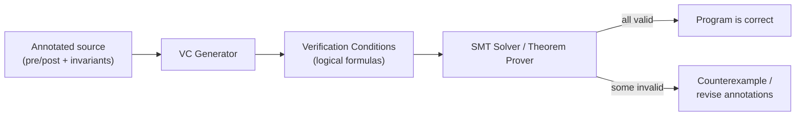
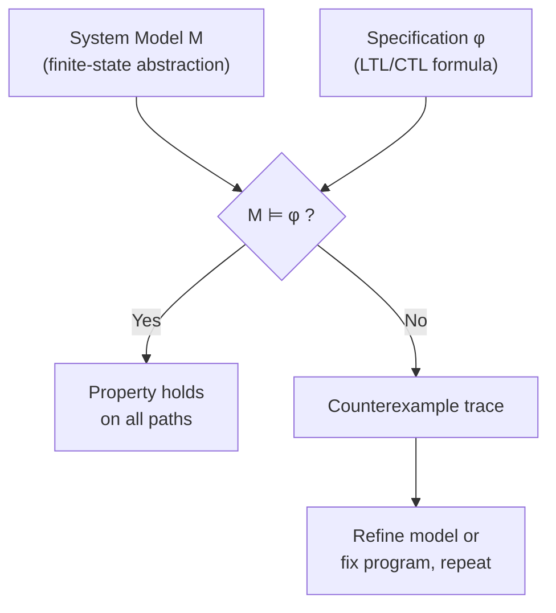

## Proof of Program Correctness

### Overview

Proof of program correctness is the discipline of establishing, through formal or rigorous semi-formal argument, that a program satisfies its specification. This spans several complementary approaches: axiomatic reasoning via Hoare logic and weakest preconditions, denotational arguments comparing a program's meaning to a mathematical specification, operational arguments about trace behavior, model checking of finite-state abstractions, and mechanized proof in interactive theorem provers. Because "correctness" is only meaningful relative to a stated specification, the first and often hardest task in any such proof is stating precisely what the program is supposed to do.

### What Counts as a Specification

A specification typically includes some combination of:

- **Functional correctness**: the program computes the intended input-output relation.
- **Safety properties**: "nothing bad happens" — no null dereference, no array-bounds violation, no assertion failure, no data race.
- **Liveness properties**: "something good eventually happens" — termination, eventual response to a request, progress under fair scheduling.
- **Security properties**: noninterference between confidentiality levels, absence of information leakage through timing or other side channels.

[Inference] The distinction between safety and liveness properties is formalized in temporal logic and topology-of-traces terms (a safety property is one whose violation is witnessed by a finite prefix; a liveness property is one where no finite prefix suffices to witness violation), a classification generally attributed to Lamport and later given a precise topological characterization by Alpern and Schneider; the exact attribution and formal framing are best checked against the primary sources if cited precisely.

### Partial Correctness vs. Total Correctness

- **Partial correctness**: if the program terminates, the output is correct. Says nothing about whether it terminates.
- **Total correctness**: the program terminates *and* the output is correct.

Total correctness proofs decompose into a partial correctness argument plus a separate termination argument, standardly via a **variant function** — a mapping from program states to elements of a well-founded order (most commonly the natural numbers under $<$) that strictly decreases with every loop iteration or recursive call:

$$\forall \text{ states } s \text{ reachable in the loop}, \quad t(s') < t(s) \text{ whenever the loop body executes } s \to s'$$

Well-foundedness guarantees no infinite strictly-decreasing sequence exists, so the loop cannot iterate forever.

### Method 1: Hoare-Logic Proofs

Built from the inference rules for assignment, sequencing, conditionals, and loops (assignment axiom, sequencing rule, conditional rule, while rule, and the rule of consequence). A full worked derivation for a summation loop, along with the invariant/variant methodology, is covered in the companion material on axiomatic semantics and weakest preconditions; the same invariant-discovery challenge — finding a predicate that is initialized, preserved, and sufficient — is the central difficulty in any Hoare-style correctness proof.

### Method 2: Weakest Precondition / Verification Condition Generation

Rather than deriving a triple by hand, a **verification condition generator (VCGen)** mechanically produces a set of logical formulas (verification conditions, or VCs) from an annotated program — one where the programmer has supplied loop invariants and function pre/postconditions as annotations. Discharging all VCs (proving them valid, typically via an automated SMT solver) constitutes a correctness proof.

This is the architecture behind most modern auto-active verifiers.

### Method 3: Refinement-Based Proofs

Rather than proving correctness of a fixed program against a fixed specification after the fact, **refinement calculus** treats program construction as a sequence of correctness-preserving transformations, starting from an abstract specification (itself expressed as a generalized command) and stepwise refining it toward executable code:

$$S_0 \sqsubseteq S_1 \sqsubseteq S_2 \sqsubseteq \cdots \sqsubseteq S_n = \text{executable program}$$

where $\sqsubseteq$ denotes a refinement ordering (roughly, "$S_{i+1}$ is at least as deterministic and at least as defined as $S_i$"). Correctness of the final program relative to the original specification follows from transitivity of $\sqsubseteq$ across the chain, so no separate end-to-end proof is needed once each refinement step is independently justified.

### Method 4: Denotational Equivalence Proofs

A program $c$ is proven correct against a mathematical specification function $f$ by showing $\mathcal{C}[\![c]\!] = f$ (or $\sqsubseteq$, for partial correctness up to termination), where $\mathcal{C}[\![\cdot]\!]$ is the program's denotational semantics. This method is most natural when the specification is itself most clearly expressed as a mathematical function rather than as a relation between pre- and post-states — e.g., proving a sorting routine's denotation equals the mathematical sorting function on sequences.

### Method 5: Bisimulation and Operational Equivalence

For proving that an optimized or compiled program behaves identically to a reference implementation (rather than proving correctness against an abstract mathematical spec), **bisimulation** is often the tool of choice. Two labeled transition systems are bisimilar if there is a relation $R$ between their states such that whenever $(s_1, s_2) \in R$ and $s_1 \xrightarrow{a} s_1'$, there exists $s_2'$ with $s_2 \xrightarrow{a} s_2'$ and $(s_1', s_2') \in R$, and symmetrically. This underlies compiler-correctness arguments (source and target programs simulate each other step-for-step, up to the abstraction gap between them) and is central to process-calculus reasoning about concurrent systems.

### Method 6: Model Checking

For finite-state (or finite-abstraction) systems, correctness with respect to a temporal-logic specification (LTL, CTL) can be checked **automatically and exhaustively** rather than by hand-constructed proof:

$$M \models \phi$$

meaning every execution path of the model $M$ satisfies the temporal formula $\phi$. Model checking trades proof effort for state-space size: it is fully automatic but suffers from state-space explosion, mitigated by techniques such as symbolic model checking (BDD-based), bounded model checking (SAT/SMT-based, checking only paths up to some bound $k$), and abstraction-refinement loops (CEGAR) that iteratively coarsen and refine an abstract model based on spurious counterexamples.

### Method 7: Interactive Theorem Proving / Mechanized Proof

For proofs too intricate or too foundational to trust to informal argument or automated solvers alone, correctness is encoded and checked inside a **proof assistant** (Coq/Rocq, Isabelle/HOL, Lean, Agda), where the program, its specification, and the proof connecting them are all machine-checked terms in a formal logic — often a dependently-typed one, so that "proof" and "program" can share the same underlying type-theoretic foundation (via the Curry–Howard correspondence).

[Inference] Landmark mechanized-correctness projects commonly cited in this space include CompCert (a formally verified C compiler, showing semantic preservation between source and generated assembly) and seL4 (a formally verified microkernel, proving functional correctness and certain security properties down to the binary); exact scope claims for each project (which properties are proven, under what assumptions, for which configurations) are best verified against the projects' own published papers rather than assumed from general reputation, since verification claims are precise and easy to overstate secondhand.

### Comparing the Approaches

| Method | Automation Level | Scales To | Typical Weakness |
| --- | --- | --- | --- |
| Hoare logic (manual) | Low (manual derivation) | Small programs, teaching | Labor-intensive, invariant discovery is hard |
| VCGen + SMT | High (once annotated) | Real-world code (annotated) | Annotation burden; SMT incompleteness on complex theories |
| Refinement calculus | Medium | Structured stepwise design | Requires disciplined top-down process |
| Denotational equivalence | Low–Medium | Compact functional specs | Needs a domain-theoretic model of the language |
| Bisimulation | Medium | Compiler passes, protocols | Relation construction can be intricate |
| Model checking | Fully automatic | Finite/finite-abstracted systems | State-space explosion; needs finite abstraction |
| Interactive theorem proving | Low (proof effort), high trust | Anything expressible in the logic | Very high manual proof effort |

### Undecidability and Its Practical Consequences

By Rice's theorem, no algorithm can decide arbitrary nontrivial semantic properties of programs in a Turing-complete language — correctness in full generality is undecidable. This is not a practical obstacle so much as a structural fact that shapes tool design: automated tools achieve usefulness by trading completeness for decidability, either by:

- Restricting to a decidable or semi-decidable logic fragment (SMT theories with decision procedures).
- Requiring human-supplied guidance (loop invariants, ranking functions, proof tactics).
- Settling for sound-but-incomplete over-approximation (accepting some false alarms in exchange for no missed bugs) — the abstract interpretation approach.
- Restricting to finite-state models (model checking).

No tool escapes this trilemma-like tradeoff entirely; understanding *which* corner a given tool occupies is essential to interpreting what a "correctness" result from that tool actually guarantees.

### Illustration: Landscape of Correctness-Proof Techniques

Landscape of program correctness proof techniques (svg_diagram)

<svg xmlns="http://www.w3.org/2000/svg" viewBox="0 0 760 420">
<text x="380" y="28" text-anchor="middle" font-size="17" font-weight="bold" fill="#222">Landscape of program correctness proof techniques (svg_diagram)</text>
<line x1="80" y1="360" x2="700" y2="360" stroke="#333" stroke-width="1.5" />
<text x="390" y="385" text-anchor="middle" font-size="12" fill="#333">automation ↑ (left = manual, right = fully automatic)</text>
<line x1="80" y1="360" x2="80" y2="60" stroke="#333" stroke-width="1.5" />
<text x="55" y="200" text-anchor="middle" font-size="12" fill="#333" transform="rotate(-90 55 200)">assurance / trust level</text>
<circle cx="150" cy="320" r="8" fill="#c55" />
<text x="150" y="342" text-anchor="middle" font-size="11" fill="#333">Manual Hoare proofs</text>
<circle cx="260" cy="140" r="8" fill="#55c" />
<text x="260" y="120" text-anchor="middle" font-size="11" fill="#333">Interactive theorem proving</text>
<circle cx="420" cy="200" r="8" fill="#5a5" />
<text x="420" y="222" text-anchor="middle" font-size="11" fill="#333">VCGen + SMT</text>
<circle cx="480" cy="260" r="8" fill="#a5a" />
<text x="480" y="282" text-anchor="middle" font-size="11" fill="#333">Refinement calculus</text>
<circle cx="600" cy="180" r="8" fill="#c95" />
<text x="600" y="160" text-anchor="middle" font-size="11" fill="#333">Model checking</text>
<circle cx="640" cy="300" r="8" fill="#999" />
<text x="640" y="322" text-anchor="middle" font-size="11" fill="#333">Abstract interpretation</text>
</svg>

### Key Points

- Correctness proofs are only as meaningful as the specification they check against; stating the specification precisely is itself a nontrivial and error-prone step.
- Partial correctness and total correctness are distinct claims; total correctness requires an explicit termination argument via a well-founded variant.
- The major proof methodologies — Hoare/wp reasoning, refinement calculus, denotational equivalence, bisimulation, model checking, and mechanized theorem proving — trade off automation, scalability, and assurance level differently.
- Undecidability (Rice's theorem) means no single technique can be complete and fully automatic and generally applicable simultaneously; every practical tool occupies a specific tradeoff point.
- Mechanized, machine-checked proofs (CompCert, seL4, and similar projects) represent the highest-assurance end of the spectrum, at the cost of substantial manual proof effort.

### Related Topics

- Denotational Semantics Revisited
- Axiomatic Semantics and Weakest Preconditions
- Model Checking: LTL, CTL, and Symbolic Techniques
- Abstract Interpretation and Static Analysis
- Refinement Calculus and Stepwise Program Construction
- Bisimulation and Process Calculi
- Dependent Types and the Curry–Howard Correspondence
- Rice's Theorem and the Limits of Static Analysis