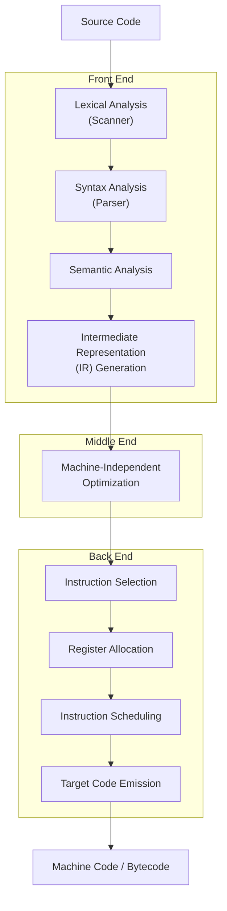
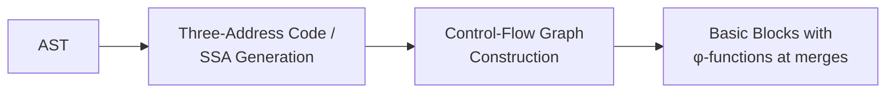

## The Compilation Process


### Overview

Compilation is the process of translating source code written in one language into an equivalent program in another language — typically a lower-level target such as machine code, bytecode, or another high-level language — while preserving the source program's observable behavior. A compiler is conventionally organized as a pipeline of phases, each transforming the program into a progressively more explicit and machine-amenable representation. This staged structure is not merely an implementation convenience: it lets each phase reason about a single, well-defined concern (lexical structure, syntax, meaning, optimization, or machine layout) independently of the others.

### The Front End, Middle End, and Back End

Compilers are broadly divided into three sections:

- **Front end**: language-specific analysis — lexing, parsing, semantic analysis. Produces an intermediate representation (IR) independent (or largely independent) of the source language's surface syntax.
- **Middle end**: IR-to-IR transformations — optimizations that are largely target-independent (constant folding, dead code elimination, inlining).
- **Back end**: target-specific — instruction selection, register allocation, instruction scheduling, final code emission.

This separation is what allows multiple front ends (C, Fortran, Rust) to share a common middle/back end infrastructure (as in GCC and LLVM), and what allows a single front end to target multiple architectures.



### Phase 1: Lexical Analysis

The **lexer** (or scanner) reads the raw character stream and groups it into **tokens** — the smallest meaningful units (identifiers, keywords, literals, operators, punctuation) — discarding whitespace and comments (or converting them to specific tokens, if the language is whitespace-sensitive, as with Python's indentation).

Lexers are typically specified via **regular expressions** and implemented as **deterministic finite automata (DFAs)**, often generated automatically from a specification by tools like `lex`/`flex` using the Thompson construction (regex → NFA) followed by subset construction (NFA → DFA).

Example: for input `x = y + 42;`, the lexer produces:



```
IDENT(x)  ASSIGN  IDENT(y)  PLUS  INTLIT(42)  SEMI
```

**Maximal munch**: lexers greedily consume the longest possible match at each position, which is why `<=` is lexed as one token rather than `<` followed by `=`.

### Phase 2: Syntax Analysis (Parsing)

The **parser** consumes the token stream and builds a **parse tree** or, more commonly in practice, an **abstract syntax tree (AST)** — a tree that discards syntactic detail not needed for later phases (redundant parentheses, some punctuation) while retaining hierarchical structure.

Parsing is grounded in **context-free grammars (CFGs)**, typically written in Backus–Naur Form (BNF) or a variant. Two major parsing strategies dominate practice:

- **Top-down parsing** (e.g., recursive descent, LL(k)): builds the tree from the root downward, predicting productions from the next token(s) of lookahead.
- **Bottom-up parsing** (e.g., LR(k), LALR(1), used by tools like `yacc`/`bison`): builds the tree from the leaves upward, shifting tokens onto a stack and reducing according to grammar productions.

$$\text{Grammar rule example:} \quad \langle \text{expr} \rangle ::= \langle \text{expr} \rangle \; ' + ' \; \langle \text{term} \rangle \mid \langle \text{term} \rangle$$

**Ambiguity and precedence**: a grammar like the one above is ambiguous without additional disambiguation rules (associativity, precedence), since `a + b + c` could parse two ways; parser generators resolve this via declared precedence/associativity tables or grammar rewriting into layered nonterminals (expr → term → factor).

### Phase 3: Semantic Analysis

Syntactic well-formedness does not imply meaningfulness. Semantic analysis checks context-sensitive properties that a CFG cannot express, including:

- **Type checking**: verifying expressions are used consistently with their declared or inferred types.
- **Scope resolution**: binding each identifier use to its declaration, respecting nested scoping rules.
- **Declaration-before-use** and other name-resolution constraints (language-dependent).

This phase typically builds and threads a **symbol table** mapping identifiers to their attributes (type, scope, storage location) and decorates the AST with this resolved information, producing what is sometimes called an **annotated** or **decorated AST**.

[Inference] Type checking itself may involve substantial algorithmic machinery beyond simple table lookup — e.g., Hindley–Milner-style type inference with unification for languages supporting parametric polymorphism without full type annotations; the specific inference algorithm used varies significantly by language and is a large topic in its own right, not reducible to a single uniform procedure across languages.

### Phase 4: Intermediate Representation Generation

The AST is lowered into an **intermediate representation (IR)** — a form more explicit about control flow and evaluation order than the tree structure, and more amenable to systematic optimization. Common IR styles include:

- **Three-address code**: instructions with at most one operator and up to three operands, e.g., `t1 = b * c; t2 = a + t1;`
- **Static Single Assignment (SSA) form**: every variable is assigned exactly once; control-flow merge points introduce **φ (phi) functions** selecting a value based on which predecessor block execution arrived from. SSA form is the dominant IR style in modern optimizing compilers (LLVM IR, for instance) because it makes many dataflow facts (reaching definitions, def-use chains) syntactically explicit.
- **Control-flow graphs (CFGs)**: basic blocks (straight-line instruction sequences with a single entry and exit) connected by edges representing possible control transfers.



### Phase 5: Machine-Independent Optimization

Operating on the IR without reference to the target architecture, this phase applies transformations that provably preserve program semantics while improving some cost metric (typically execution time, sometimes code size or energy use). Common optimizations include:

- **Constant folding**: replacing `3 + 4` with `7` at compile time.
- **Common subexpression elimination**: reusing a previously computed value instead of recomputing an identical expression.
- **Dead code elimination**: removing computations whose results are never used.
- **Loop-invariant code motion**: hoisting computations that don't change across loop iterations out of the loop.
- **Inlining**: replacing a call site with the callee's body, enabling further optimization across the former call boundary.

These optimizations are typically justified and implemented via **dataflow analysis** — computing, for each program point, facts such as "which definitions may reach here" (reaching definitions) or "which variables might be used after this point" (liveness), generally formulated as fixed-point computations over lattices — connecting this phase conceptually back to the fixed-point machinery central to denotational semantics, though applied here to finite abstract lattices rather than infinite semantic domains.

### Phase 6: Instruction Selection

The optimized IR is translated into target-machine instructions. Because a single IR operation may correspond to several possible instruction sequences (and a single instruction may implement several IR operations at once, as with fused multiply-add), instruction selection is commonly framed as a **tree-pattern-matching / tiling problem**: cover the IR (viewed as trees or DAGs) with instruction patterns at minimum cost, solvable via dynamic programming for tree-structured IR.

### Phase 7: Register Allocation

Machines have a small, fixed number of registers, while the IR after instruction selection may reference arbitrarily many virtual registers/temporaries. Register allocation assigns each temporary to a physical register or, when registers are exhausted, to memory (**spilling**).

The dominant classical technique is **graph coloring**: construct an **interference graph** where nodes are temporaries and edges connect temporaries simultaneously live (from a liveness dataflow analysis), then attempt to color the graph with $k$ colors ($k$ = number of physical registers) such that no two adjacent nodes share a color. If $k$-coloring fails, a temporary is chosen to spill to memory, and the process repeats.

$$\text{Two temporaries interfere} \iff \text{both are live at some program point}$$

### Phase 8: Instruction Scheduling and Final Code Emission

**Instruction scheduling** reorders instructions (without violating data dependencies) to better exploit pipelining, avoid stalls, and hide memory latency on the target microarchitecture. Final emission produces the actual output — assembly text, a relocatable object file, or bytecode for a virtual machine — including layout of the symbol/relocation information a linker will later need.

### Symbol Tables and Error Handling Across Phases

Two concerns cut across the whole pipeline rather than belonging to a single phase:

- **Symbol table management**: built incrementally (often during parsing or semantic analysis), consulted and updated by later phases, and typically implemented with scoped/nested structure mirroring the language's block or module structure.
- **Error detection and reporting**: each phase can detect its own class of errors (lexical errors — invalid tokens; syntax errors — malformed structure; semantic errors — type mismatches, undeclared identifiers), and a well-engineered compiler aims to recover after an error to keep reporting further genuine errors rather than stopping at the first one, while avoiding cascades of spurious errors caused by the recovery itself.

### Compilation vs. Interpretation vs. Hybrid Approaches

| Approach | When translation happens | Typical performance profile | Examples |
| --- | --- | --- | --- |
| Pure compilation (AOT) | Entirely before execution | Fast startup and steady-state; no runtime translation cost | C, Rust, traditional Fortran |
| Pure interpretation | Instruction-by-instruction at runtime | Slower steady-state; simplest implementation | Early BASIC interpreters, simple tree-walking interpreters |
| Bytecode + VM interpretation | Compiled to bytecode ahead of time, interpreted at runtime | Portable; moderate performance | Early Java (pre-JIT), CPython |
| Just-in-time (JIT) compilation | Bytecode compiled to native code during execution, often adaptively | Can match or approach AOT performance after warm-up | JVM HotSpot, JavaScript V8, .NET RyuJIT |

[Inference] Modern JIT systems often combine tiers (a fast baseline interpreter/compiler plus a slower, more aggressively optimizing compiler triggered by profiling "hot" code paths); the specific tiering strategy, thresholds, and optimization techniques differ substantially across runtimes (V8, HotSpot, RyuJIT) and change across versions, so architecture specifics for any particular runtime should be checked against that runtime's current documentation rather than assumed to generalize.

### Compiler Correctness

A compiler is correct when it preserves the source program's semantics under translation — formally, when the target program's observable behavior matches what the source language's semantics specifies, for every input. This connects directly to the semantic frameworks covered elsewhere: proving a compiler correct typically means proving a **simulation** or **bisimulation** relationship between source-level and target-level execution steps (operational approach), or proving equality/refinement between denotational meanings of source and generated code (denotational approach). Mechanized compiler-correctness projects such as CompCert exemplify the highest-assurance end of this spectrum, machine-checking semantic preservation across the entire pipeline rather than trusting each phase's implementation informally.

### Illustration: Data Representations Across the Pipeline

Program representations transformed across compiler phases (svg_diagram)

<svg xmlns="http://www.w3.org/2000/svg" viewBox="0 0 740 300">
<text x="370" y="26" text-anchor="middle" font-size="16" font-weight="bold" fill="#222">Program representations transformed across compiler phases (svg_diagram)</text>
<rect x="20" y="60" width="120" height="50" rx="6" fill="#eef" stroke="#446" />
<text x="80" y="90" text-anchor="middle" font-size="11" fill="#222">Character<br />Stream</text>
<rect x="170" y="60" width="120" height="50" rx="6" fill="#eef" stroke="#446" />
<text x="230" y="90" text-anchor="middle" font-size="11" fill="#222">Token<br />Stream</text>
<rect x="320" y="60" width="120" height="50" rx="6" fill="#eef" stroke="#446" />
<text x="380" y="90" text-anchor="middle" font-size="11" fill="#222">AST</text>
<rect x="470" y="60" width="120" height="50" rx="6" fill="#eef" stroke="#446" />
<text x="530" y="85" text-anchor="middle" font-size="11" fill="#222">Annotated /<br />Decorated AST</text>
<rect x="620" y="60" width="100" height="50" rx="6" fill="#dfe" stroke="#464" />
<text x="670" y="90" text-anchor="middle" font-size="11" fill="#222">IR (SSA)</text>
<rect x="470" y="180" width="120" height="50" rx="6" fill="#fde" stroke="#a46" />
<text x="530" y="205" text-anchor="middle" font-size="11" fill="#222">Optimized IR</text>
<rect x="320" y="180" width="120" height="50" rx="6" fill="#fde" stroke="#a46" />
<text x="380" y="205" text-anchor="middle" font-size="11" fill="#222">Target<br />Instructions</text>
<rect x="170" y="180" width="120" height="50" rx="6" fill="#fde" stroke="#a46" />
<text x="230" y="205" text-anchor="middle" font-size="11" fill="#222">Register-<br />Allocated Code</text>
<rect x="20" y="180" width="120" height="50" rx="6" fill="#dfd" stroke="#464" />
<text x="80" y="205" text-anchor="middle" font-size="11" fill="#222">Machine Code /<br />Bytecode</text>
<line x1="140" y1="85" x2="170" y2="85" stroke="#446" stroke-width="2" marker-end="url(#a2)" />
<line x1="290" y1="85" x2="320" y2="85" stroke="#446" stroke-width="2" marker-end="url(#a2)" />
<line x1="440" y1="85" x2="470" y2="85" stroke="#446" stroke-width="2" marker-end="url(#a2)" />
<line x1="590" y1="85" x2="620" y2="85" stroke="#446" stroke-width="2" marker-end="url(#a2)" />
<line x1="670" y1="110" x2="670" y2="150" stroke="#446" stroke-width="2" />
<line x1="670" y1="150" x2="530" y2="150" stroke="#446" stroke-width="2" marker-end="url(#a2)" />
<line x1="470" y1="205" x2="440" y2="205" stroke="#a46" stroke-width="2" marker-end="url(#a2)" />
<line x1="320" y1="205" x2="290" y2="205" stroke="#a46" stroke-width="2" marker-end="url(#a2)" />
<line x1="170" y1="205" x2="140" y2="205" stroke="#a46" stroke-width="2" marker-end="url(#a2)" />
</svg>

### Key Points

- Compilation proceeds through lexical analysis, syntax analysis, semantic analysis, IR generation, optimization, and a back end of instruction selection, register allocation, scheduling, and emission.
- The front end/middle end/back end division lets a single optimizing infrastructure serve multiple source languages and multiple target architectures.
- SSA form and control-flow graphs are the dominant IR structures in modern optimizing compilers, chosen because they make dataflow facts syntactically explicit.
- Register allocation via graph coloring and instruction selection via tree-pattern matching are the two classical back-end problems with well-studied algorithmic treatments.
- Compilation, interpretation, and JIT compilation represent different points on a spectrum trading startup cost, steady-state performance, and implementation complexity.
- Compiler correctness connects directly to formal semantics: proving a compiler correct means proving a simulation, bisimulation, or denotational-equivalence relationship between source and target behavior.

### Related Topics

- Proof of Program Correctness
- Denotational Semantics Revisited
- Type Inference and the Hindley–Milner Algorithm
- Static Single Assignment Form and Dataflow Analysis
- Parsing Theory: LL, LR, and Parser Combinators
- Register Allocation via Graph Coloring
- Just-In-Time Compilation and Adaptive Optimization
- Compiler Correctness and Verified Compilation (CompCert)