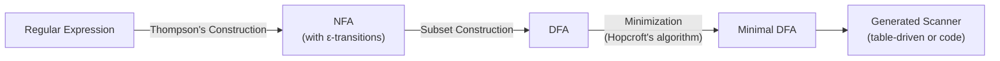
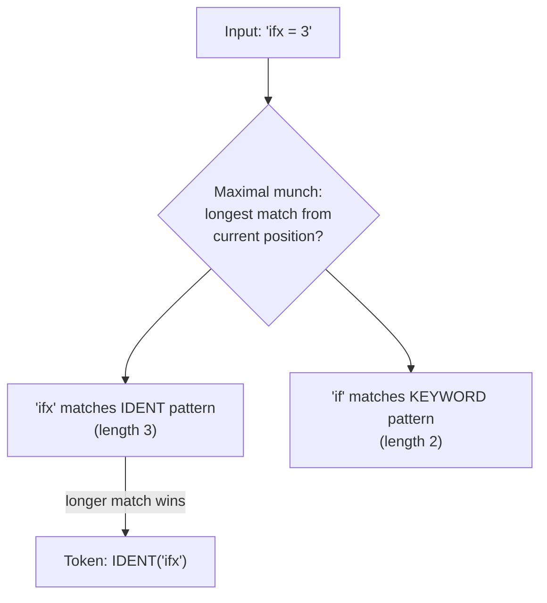

## Lexical Analysis

### Overview

Lexical analysis is the first phase of compilation, responsible for converting a raw stream of characters into a stream of **tokens** — the smallest units of meaning the rest of the compiler will operate on. The component performing this task is called a **lexer**, **scanner**, or **tokenizer**. Lexical analysis reduces the combinatorial complexity that later phases would otherwise face if they had to work directly with individual characters, and it isolates a well-understood class of pattern-matching problems (regular languages) from the more complex problem of recognizing nested/recursive structure, which is deferred to the parser.

### Tokens, Lexemes, and Patterns

Three related but distinct concepts are easy to conflate:

- **Lexeme**: the actual substring of source text matched, e.g., `total`, `42`, `+`.
- **Token**: the category/class assigned to a lexeme, typically represented as a (type, value) pair, e.g., `IDENT("total")`, `INTLIT(42)`, `PLUS`.
- **Pattern**: the rule (usually a regular expression) describing which lexemes belong to a given token class, e.g., identifiers matching `[a-zA-Z_][a-zA-Z0-9_]*`.

$$\text{Lexeme} \xrightarrow{\text{matched against}} \text{Pattern} \xrightarrow{\text{produces}} \text{Token}$$

### Regular Expressions as the Specification Mechanism

Token patterns are specified using regular expressions over the input alphabet. Common patterns for a typical imperative language:

| Token Class | Example Regular Expression |
| --- | --- |
| Identifier | `[a-zA-Z_][a-zA-Z0-9_]*` |
| Integer literal | `[0-9]+` |
| Floating-point literal | `[0-9]+\.[0-9]+([eE][+-]?[0-9]+)?` |
| String literal | `"([^"\\]|\\.)*"` |
| Whitespace (discarded) | `[ \t\n\r]+` |
| Line comment | `//[^\n]*` |

Regular expressions are the right tool here because token structure is, by design, non-recursive and non-nested — a well-formed identifier or numeric literal never requires matching balanced/nested constructs, which is precisely the class of languages regular expressions can express (and, by the pumping lemma, the class beyond which they cannot go).

### From Regular Expressions to Finite Automata

**The construction pipeline**: Lexers are not usually implemented by directly interpreting regular expressions at runtime (too slow); instead, they are compiled ahead of time into finite automata.

**Step 1 — Thompson's Construction**: Each regular expression is translated into a **nondeterministic finite automaton (NFA)** with epsilon-transitions, built compositionally from the structure of the regex (concatenation, alternation `|`, Kleene star `*`) using a small fixed set of NFA fragment templates that compose cleanly.

**Step 2 — Subset Construction**: The NFA is converted to an equivalent **deterministic finite automaton (DFA)** via the subset construction algorithm, where each DFA state corresponds to a set of NFA states reachable without consuming input (the epsilon-closure of a set of NFA states).

**Step 3 — DFA Minimization** (optional but common): Equivalent states are merged (via partition-refinement algorithms such as Hopcroft's algorithm) to produce the smallest DFA recognizing the same language, reducing table size and improving cache behavior in the generated scanner.

**Why determinism matters at runtime**: an NFA may need to explore multiple simultaneous states per input character (or use backtracking), while a DFA transitions to exactly one next state per character — giving lexical analysis its characteristic $O(n)$ runtime in the length of the input, independent of the complexity of the token patterns, once the automaton is built.

### Combining Multiple Token Patterns

A real lexer must recognize many token classes simultaneously, not just one regular expression. The standard technique combines all patterns into a single NFA (a large alternation with distinct **accepting states**, each tagged with which token class it accepts), converts this combined NFA to a DFA, and uses the tagged accepting states to determine, upon reaching acceptance, which token was matched.

### Maximal Munch and Priority Rules

Two disambiguation rules resolve cases where more than one token pattern could match:

- **Maximal munch (longest match)**: the lexer always consumes the longest possible lexeme matching some pattern at the current position. This is why `<=` lexes as a single `LEQ` token rather than `LT` followed by `ASSIGN`, and why `foobar` lexes as one identifier rather than being split.
- **Priority/rule ordering**: when multiple patterns match the *same* longest lexeme (e.g., `if` matches both the keyword pattern `if` and the general identifier pattern `[a-zA-Z_][a-zA-Z0-9_]*`), an explicit priority order (keywords typically listed and checked before, or given precedence over, the generic identifier rule) resolves the tie.

### Handling Lexical Errors

A character sequence that matches no defined pattern (e.g., an unterminated string literal, or a stray `@` in a language where it has no meaning) constitutes a **lexical error**. Practical lexers typically:

1. Report the error with source location (line/column) information.
2. Attempt **error recovery** — commonly by skipping the offending character(s) and resuming scanning — so that a single bad character does not prevent detection of further, independent errors later in the file.

### Handling Context-Sensitive Lexical Issues

Some languages have lexical rules that strain the "pure regular language, single unambiguous DFA" model:

- **Whitespace-sensitive layout** (Python, Haskell): indentation changes must be turned into synthetic `INDENT`/`DEDENT` tokens, typically requiring the lexer to maintain a stack of indentation levels — a small piece of state beyond what a plain DFA carries, though still implementable within a slightly extended scanning framework.
- **The "most vexing parse" and lexer/parser ambiguity** in C++-family languages, where distinguishing a type name from an identifier can require consulting the symbol table during lexing (the so-called **lexer hack**), blurring the traditionally clean separation between lexical and syntactic analysis.
- **Template angle-bracket ambiguity** in C++ (`a < b > c` could be a comparison chain or template instantiation), historically requiring context to disambiguate at the token level or deferring the decision to the parser with a more permissive token.

[Inference] The precise mechanisms modern production compilers use to handle these context-sensitive lexical corner cases vary by compiler and have evolved over language-standard revisions (e.g., C++11's handling of `>>` in nested templates changed lexical behavior from earlier standards); implementation specifics should be checked against the relevant language standard and compiler documentation rather than treated as fixed general knowledge.

### Lexer Generators

Rather than hand-writing a scanner, many toolchains use **lexer generator** tools that take a specification of token patterns (as regular expressions with associated actions) and emit a ready-to-compile scanner implementation:

| Tool | Target Language | Notes |
| --- | --- | --- |
| `lex` / `flex` | C/C++ | Classic Unix tool; produces table-driven DFA-based scanners |
| `JFlex` | Java | Flex-inspired, Java-targeted |
| `ocamllex` | OCaml | Standard OCaml scanner generator |
| Logos | Rust | Derive-macro-based, compiles patterns to fast DFAs |

Hand-written scanners remain common in production compilers (for performance tuning, easier integration of context-sensitive logic, or avoiding a build-time code-generation dependency), especially in compilers targeting very high scanning throughput.

### Worked Example: Building a Small DFA by Hand

Consider a minilanguage needing only two token classes: identifiers (`[a-z]+`) and the single-character operator `+`.

**States**: $q_0$ (start), $q_1$ (accepting — identifier), $q_2$ (accepting — plus), $q_{\text{err}}$ (dead state)

**Transition table**:

| State | on `a`–`z` | on `+` | on other |
| --- | --- | --- | --- |
| $q_0$ | $q_1$ | $q_2$ | $q_{\text{err}}$ |
| $q_1$ (accept: IDENT) | $q_1$ | (emit token, restart at $q_0$) | (emit token, restart at $q_0$) |
| $q_2$ (accept: PLUS) | (emit token, restart at $q_0$) | (emit token, restart at $q_0$) | (emit token, restart at $q_0$) |

Scanning `ab+cd` proceeds: $q_0 \to q_1$ (on `a`) $\to q_1$ (on `b`) $\to$ emit `IDENT(ab)`, restart, $q_0 \to q_2$ (on `+`) $\to$ emit `PLUS`, restart, $q_0 \to q_1 \to q_1$ (on `c`, `d`) $\to$ emit `IDENT(cd)` at end of input.

### Performance Characteristics

A DFA-based scanner processes input in **$O(n)$ time** for input of length $n$, examining each character a constant number of times (typically exactly once, with careful implementation, aside from limited lookahead for maximal-munch decisions). This linear-time guarantee is one of the reasons lexical analysis is kept as a distinct phase rather than folded into a more general (and potentially super-linear) parsing algorithm — the regular-language restriction is precisely what buys this efficiency.

### Illustration: NFA to DFA for Pattern `a(b|c)*`

NFA and equivalent DFA for the pattern a(b|c)* (svg_diagram)

<svg xmlns="http://www.w3.org/2000/svg" viewBox="0 0 740 320">
<text x="370" y="26" text-anchor="middle" font-size="16" font-weight="bold" fill="#222">NFA and equivalent DFA for the pattern a(b|c)* (svg_diagram)</text>

<text x="150" y="55" text-anchor="middle" font-size="13" fill="#444" font-weight="bold">NFA (Thompson Construction)</text>

<circle cx="40" cy="120" r="18" fill="#eef" stroke="#446" stroke-width="2" />
<text x="40" y="125" text-anchor="middle" font-size="11">0</text>
<circle cx="120" cy="120" r="18" fill="#eef" stroke="#446" stroke-width="2" />
<text x="120" y="125" text-anchor="middle" font-size="11">1</text>
<circle cx="200" cy="80" r="18" fill="#eef" stroke="#446" stroke-width="2" />
<text x="200" y="85" text-anchor="middle" font-size="11">2</text>
<circle cx="200" cy="160" r="18" fill="#eef" stroke="#446" stroke-width="2" />
<text x="200" y="165" text-anchor="middle" font-size="11">3</text>
<circle cx="280" cy="120" r="18" fill="#dfd" stroke="#464" stroke-width="3" />
<text x="280" y="125" text-anchor="middle" font-size="11">4*</text>
<line x1="58" y1="120" x2="102" y2="120" stroke="#446" marker-end="url(#a3)" />
<text x="80" y="112" font-size="10">a</text>
<path d="M138,115 Q170,90 182,84" stroke="#446" fill="none" marker-end="url(#a3)" />
<text x="155" y="88" font-size="10">b</text>
<path d="M138,125 Q170,150 182,156" stroke="#446" fill="none" marker-end="url(#a3)" />
<text x="155" y="158" font-size="10">c</text>
<path d="M218,84 Q250,100 262,114" stroke="#446" fill="none" marker-end="url(#a3)" />
<path d="M218,156 Q250,140 262,124" stroke="#446" fill="none" marker-end="url(#a3)" />
<path d="M280,102 Q240,60 200,80" stroke="#888" fill="none" marker-end="url(#a3)" stroke-dasharray="3,2" />
<text x="240" y="55" font-size="9" fill="#888">ε (loop back)</text>
<line x1="330" y1="160" x2="330" y2="160" stroke="#ccc" />
<line x1="370" y1="60" x2="370" y2="280" stroke="#ccc" stroke-width="1" />

<text x="560" y="55" text-anchor="middle" font-size="13" fill="#444" font-weight="bold">Equivalent Minimal DFA</text>

<circle cx="440" cy="150" r="20" fill="#eef" stroke="#446" stroke-width="2" />
<text x="440" y="155" text-anchor="middle" font-size="11">S0</text>
<circle cx="560" cy="150" r="20" fill="#dfd" stroke="#464" stroke-width="3" />
<text x="560" y="155" text-anchor="middle" font-size="11">S1*</text>
<line x1="460" y1="150" x2="540" y2="150" stroke="#446" stroke-width="2" marker-end="url(#a3)" />
<text x="500" y="140" text-anchor="middle" font-size="11">a</text>
<path d="M560,130 Q600,90 560,130" stroke="#446" fill="none" stroke-width="2" marker-end="url(#a3)" />
<path d="M545,130 Q560,95 590,125" stroke="#446" fill="none" stroke-width="2" marker-end="url(#a3)" />
<text x="600" y="105" text-anchor="middle" font-size="11">b, c</text>
</svg>

### Key Points

- Lexical analysis converts a character stream into a token stream, separating the concerns of "what are the atomic units" from "how are they structured" (the parser's job).
- Token patterns are specified as regular expressions and compiled through Thompson's construction (regex → NFA), subset construction (NFA → DFA), and optionally minimization, yielding an efficient table-driven scanner.
- Maximal munch and explicit priority ordering resolve ambiguity when multiple patterns could match the input.
- DFA-based scanning runs in $O(n)$ time in the input length, which is why lexical analysis is kept as a distinct, simpler phase rather than merged into parsing.
- Some languages introduce genuinely context-sensitive lexical wrinkles (indentation-based layout, the C++ lexer hack, template angle-bracket disambiguation) that strain the pure-regular-language model and require extensions or coordination with the parser.
- Lexer generator tools (`flex`, `JFlex`, `ocamllex`, Logos) automate the regex-to-DFA pipeline, though hand-written scanners remain common in performance-sensitive or highly context-sensitive settings.

### Related Topics

- The Compilation Process Overview
- Parsing Theory: LL, LR, and Parser Combinators
- Context-Free Grammars and Ambiguity Resolution
- Symbol Tables and Scope Resolution
- Finite Automata Theory and the Pumping Lemma
- Error Recovery Strategies in Compiler Front Ends
- Whitespace-Sensitive Syntax Design (Python, Haskell)
- DFA Minimization Algorithms (Hopcroft's Algorithm)