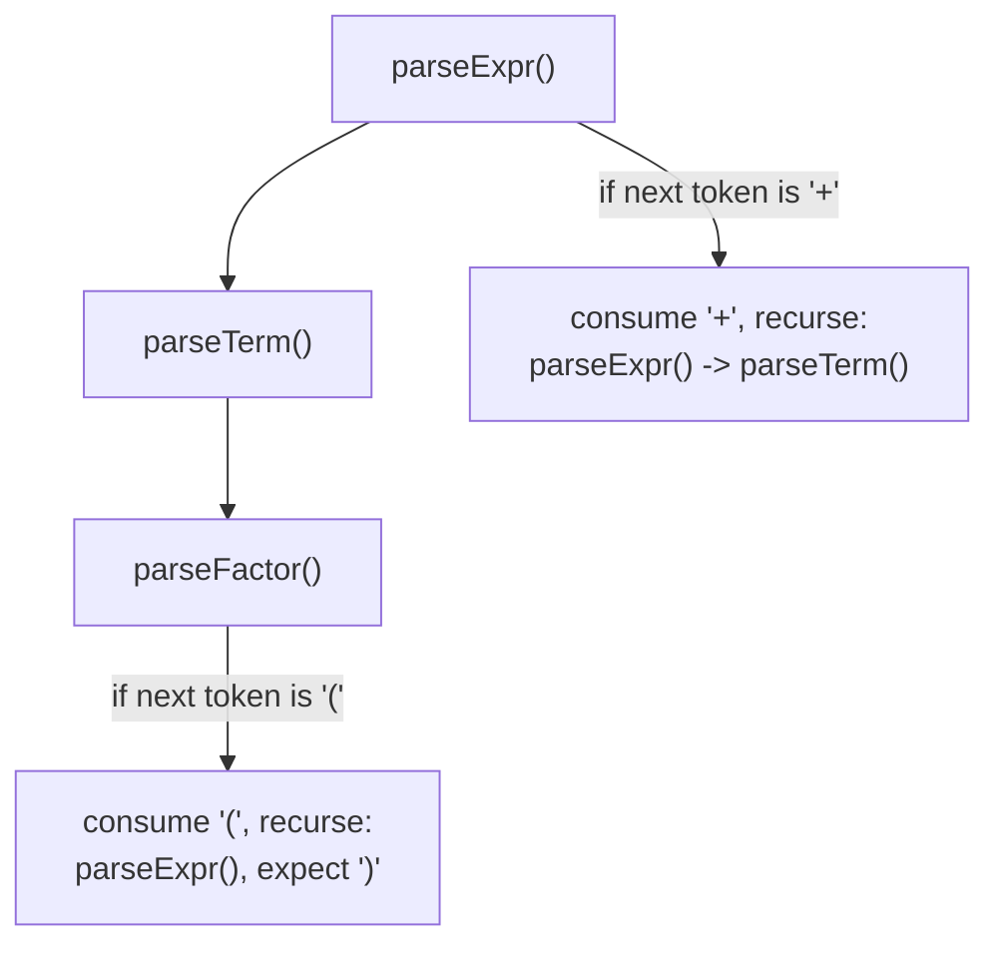

## Syntax Analysis and Parsing Techniques


### Overview

Syntax analysis, or **parsing**, takes the token stream produced by lexical analysis and determines whether it conforms to the language's grammatical structure, building a tree representation — a **parse tree** (concrete syntax tree) or, more commonly retained downstream, an **abstract syntax tree (AST)** — that captures that structure for use by later compiler phases. Where lexical analysis handles the regular (non-recursive) structure of tokens, parsing handles the recursive, nested structure of expressions, statements, and declarations, which requires strictly more expressive power than regular expressions can provide.

### Context-Free Grammars: The Formal Foundation

Parsing is grounded in **context-free grammars (CFGs)**, defined by a 4-tuple $(N, \Sigma, P, S)$: a set of nonterminals $N$, terminals $\Sigma$ (the tokens), production rules $P$, and a start symbol $S \in N$. A typical expression grammar, layered to encode precedence:

$$\langle \text{expr} \rangle ::= \langle \text{expr} \rangle \; {+} \; \langle \text{term} \rangle \mid \langle \text{term} \rangle$$


$$\langle \text{term} \rangle ::= \langle \text{term} \rangle \; {*} \; \langle \text{factor} \rangle \mid \langle \text{factor} \rangle$$


$$\langle \text{factor} \rangle ::= ( \langle \text{expr} \rangle ) \mid \text{INTLIT}$$

**Why context-free and not regular**: constructs like balanced parentheses or nested block structure require unbounded matching of "how deep am I" — provably beyond what any finite automaton can track (by the pumping lemma for regular languages) but expressible with a CFG's stack-like recursive structure, which corresponds naturally to the pushdown automaton model of computation.

**Ambiguity**: a grammar is ambiguous if some string has more than one valid parse tree. The classic "dangling else" problem —



```
if b1 then if b2 then s1 else s2
```

— is ambiguous because the `else` could attach to either `if`. Resolution is typically done by grammar rewriting (introducing separate nonterminals for "matched" and "unmatched" conditionals) or by a stated disambiguation convention (attach `else` to the nearest unmatched `if`).

### Derivations and Parse Trees

A **derivation** is a sequence of production applications starting from $S$ and ending at a target string. A **leftmost derivation** always expands the leftmost nonterminal; a **rightmost derivation** always expands the rightmost. Both types of derivation for the same unambiguous string produce the same parse tree — they differ only in the order productions are applied, not in the resulting structure — and this correspondence is exactly what top-down parsers (which construct leftmost derivations) and bottom-up parsers (which construct rightmost derivations, in reverse) each exploit.

### Top-Down Parsing

**Recursive Descent**

The most directly hand-implementable strategy: write one function per nonterminal, each function inspecting the current lookahead token to decide which production to apply, and recursively calling functions for the nonterminals on the right-hand side.



**LL(k) Parsing**: a formalization of top-down parsing that reads input **L**eft-to-right, constructs a **L**eftmost derivation, using $k$ tokens of lookahead. LL(1) — one token of lookahead — is the most common variant, sufficient for many practical language grammars provided they satisfy certain structural conditions.

**The Left-Recursion Problem**: LL parsers cannot directly handle left-recursive productions like $\langle \text{expr} \rangle ::= \langle \text{expr} \rangle + \langle \text{term} \rangle$, since a recursive-descent function for `expr` would call itself immediately without consuming any input, causing infinite recursion (non-termination) rather than a parse. The standard fix is **left-recursion elimination**, rewriting:

$$A ::= A\alpha \mid \beta \quad \Longrightarrow \quad A ::= \beta A' \qquad A' ::= \alpha A' \mid \epsilon$$

which preserves the language generated while removing the left-recursive form, at the cost of a less directly readable grammar (and, for the mechanically rewritten expr grammar, an AST-construction step that must re-associate the resulting right-recursive parse into the intended left-associative structure).

**FIRST and FOLLOW Sets**: to build an LL(1) parsing table (or decide which alternative to take in recursive descent), the parser generator computes, for each nonterminal $A$: $\text{FIRST}(A)$ — the set of terminals that can begin a string derived from $A$ — and $\text{FOLLOW}(A)$ — the set of terminals that can immediately follow $A$ in some derivation. A grammar is LL(1) exactly when, for any two productions of the same nonterminal, their FIRST sets are disjoint (with a further FOLLOW-set condition when one alternative can derive $\epsilon$).

### Bottom-Up Parsing

**Shift-Reduce Parsing**

Bottom-up parsers maintain a stack and the remaining input, repeatedly choosing to either **shift** (push the next input token onto the stack) or **reduce** (pop symbols matching the right-hand side of some production and push the corresponding left-hand-side nonterminal), building a rightmost derivation in reverse.

```mermaid
flowchart LR
    A["Stack: (empty)<br/>Input: id + id"] -->|"shift id"| B["Stack: id<br/>Input: + id"]
    B -->|"reduce id -> factor -> term -> expr"| C["Stack: expr<br/>Input: + id"]
    C -->|"shift +"| D["Stack: expr +<br/>Input: id"]
    D -->|"shift id"| E["Stack: expr + id<br/>Input: (empty)"]
    E -->|"reduce id -> factor -> term"| F["Stack: expr + term"]
    F -->|"reduce expr + term -> expr"| G["Stack: expr<br/>ACCEPT"]
```



**LR(k) Parsing**: reads input **L**eft-to-right, constructs a **R**ightmost derivation in reverse, using $k$ tokens of lookahead. LR parsers are strictly more powerful than LL parsers of the same lookahead — LR(1) can handle a substantially larger class of grammars, including many left-recursive ones directly, without the rewriting LL parsing requires.

**The LR Family, by Increasing Table Size and Decreasing Practicality of Hand Construction**:

| Variant | Description | Typical Use |
| --- | --- | --- |
| SLR(1) (Simple LR) | Uses FOLLOW sets to resolve reduce decisions; weakest LR variant | Simple grammars; rarely sufficient alone for real languages |
| LALR(1) (Look-Ahead LR) | Merges LR(1) states with identical cores, shrinking table size at some cost in power | Most widely used in practice (`yacc`/`bison` default) |
| Canonical LR(1) | Full LR(1) construction; most powerful, largest tables | Used when LALR(1) conflicts are unacceptable |

LALR(1) is the dominant choice in practice because it recognizes nearly all grammars of practical interest while producing tables orders of magnitude smaller than canonical LR(1), a tradeoff that made it the design point for most classic parser generators.

**Shift-Reduce and Reduce-Reduce Conflicts**: when a parser generator's table construction finds a state where either a shift or a reduce action is valid (shift-reduce conflict) or where more than one reduction is valid (reduce-reduce conflict), the grammar is not parseable directly by that LR variant without disambiguation — typically resolved via declared operator precedence/associativity (for shift-reduce conflicts arising from expression grammars) or grammar restructuring.

### Comparing LL and LR

| Aspect | LL(k) | LR(k) |
| --- | --- | --- |
| Derivation constructed | Leftmost | Rightmost (in reverse) |
| Direction of construction | Top-down | Bottom-up |
| Left recursion | Not handled directly; requires rewriting | Handled directly |
| Grammar class power | Smaller (proper subset for same k, generally) | Larger |
| Ease of hand-writing | Easy (recursive descent) | Hard (typically generator-only) |
| Error messages | Often more intuitive (mirrors top-down structure) | Can be less directly localized |
| Common tools | ANTLR (LL(*)), hand-written recursive descent | `yacc`/`bison`, `menhir` |

### Operator Precedence Parsing

A specialized, lightweight technique for parsing expressions specifically (not full grammars), which encodes precedence and associativity directly as a table of $\lessdot, \doteq, \gtrdot$ relations between adjacent operators, avoiding the need for a layered term/factor grammar. This technique predates and is subsumed in generality by full LR parsing but remains conceptually useful and is sometimes used as a fast-path expression parser embedded within a broader recursive-descent parser (a hybrid approach common in practical hand-written parsers).

### Parser Combinators

An alternative, compositional approach popular in functional-programming settings: parsers are ordinary first-class values (functions from input to a result-plus-remaining-input, or failure), and larger parsers are built by combining smaller ones with combinators such as sequencing, alternation, and repetition — directly mirroring the recursive descent structure but expressed as data rather than as hand-written control flow, and gaining composability and reusability from being ordinary values in the host language.

$$\text{seq} : \text{Parser}\,A \to \text{Parser}\,B \to \text{Parser}\,(A \times B)$$


$$\text{alt} : \text{Parser}\,A \to \text{Parser}\,A \to \text{Parser}\,A$$

[Inference] Parser combinator libraries generally trade some raw performance (compared to a table-driven LR parser or a hand-tuned recursive descent parser) for substantially improved composability, testability, and ease of embedding parsing logic directly in the host language without a separate code-generation build step; the magnitude of any performance gap depends heavily on the specific library, language, and grammar, so this should be treated as a general tendency rather than a precise, universally quantified tradeoff.

### PEG (Parsing Expression Grammars)

A related but formally distinct formalism from CFGs: PEGs resolve ambiguity **by construction**, since choice (`/`) is ordered — the first alternative that succeeds is taken, with no backtracking to explore other parses once one succeeds. This eliminates grammar ambiguity as a possible failure mode entirely (a PEG is always unambiguous in the sense that it defines a unique parse, though it may fail to parse strings a human intended it to accept if alternatives are ordered incorrectly), and PEGs support unlimited backtracking within a single alternative's attempt, giving them recognition power that is not simply a subset or superset of CFGs but a genuinely different (though overlapping) formal class.

### Error Recovery in Parsers

Practical parsers must handle malformed input gracefully rather than halting at the first error. Common strategies:

- **Panic mode**: on error, discard tokens until a designated synchronizing token (e.g., a statement-terminating semicolon or a block-closing brace) is found, then resume parsing from that point.
- **Phrase-level recovery**: attempt local repair (insert a likely missing token, delete an unexpected one) to continue parsing as if the input were well-formed.
- **Error productions**: extend the grammar itself with productions anticipating common mistakes, generating targeted diagnostic messages for them.

[Inference] The specific error-recovery strategy a given production compiler uses (and the quality of resulting diagnostics) varies significantly across implementations and has been an active area of engineering investment in modern compilers (for example, efforts to produce more precise, example-driven diagnostic messages); specific claims about any one compiler's current error-recovery behavior should be verified against that compiler's own documentation or source rather than assumed from general principles.

### Illustration: Parse Tree for `2 + 3 * 4`

Parse tree for the expression 2 + 3 * 4 showing precedence (svg_diagram)

<svg xmlns="http://www.w3.org/2000/svg" viewBox="0 0 600 340">
<text x="300" y="26" text-anchor="middle" font-size="16" font-weight="bold" fill="#222">Parse tree for the expression 2 + 3 * 4 showing precedence (svg_diagram)</text>
<circle cx="300" cy="70" r="24" fill="#eef" stroke="#446" stroke-width="2" />
<text x="300" y="75" text-anchor="middle" font-size="11">expr</text>
<circle cx="180" cy="150" r="24" fill="#eef" stroke="#446" stroke-width="2" />
<text x="180" y="155" text-anchor="middle" font-size="10">term</text>
<circle cx="300" cy="150" r="20" fill="#fee" stroke="#a44" stroke-width="2" />
<text x="300" y="155" text-anchor="middle" font-size="12">+</text>
<circle cx="420" cy="150" r="24" fill="#eef" stroke="#446" stroke-width="2" />
<text x="420" y="155" text-anchor="middle" font-size="10">term</text>
<circle cx="180" cy="230" r="20" fill="#dfd" stroke="#464" stroke-width="2" />
<text x="180" y="235" text-anchor="middle" font-size="10">factor</text>
<circle cx="360" cy="230" r="24" fill="#eef" stroke="#446" stroke-width="2" />
<text x="360" y="235" text-anchor="middle" font-size="10">factor</text>
<circle cx="450" cy="230" r="18" fill="#fee" stroke="#a44" stroke-width="2" />
<text x="450" y="235" text-anchor="middle" font-size="12">*</text>
<circle cx="480" cy="290" r="20" fill="#dfd" stroke="#464" stroke-width="2" />
<text x="480" y="295" text-anchor="middle" font-size="10">factor</text>
<circle cx="180" cy="300" r="16" fill="#fff" stroke="#333" />
<text x="180" y="305" text-anchor="middle" font-size="11">2</text>
<circle cx="360" cy="300" r="16" fill="#fff" stroke="#333" />
<text x="360" y="305" text-anchor="middle" font-size="11">3</text>
<circle cx="480" cy="300" r="16" fill="#fff" stroke="#333" />
<text x="480" y="305" text-anchor="middle" font-size="11">4</text>
<line x1="300" y1="94" x2="180" y2="126" stroke="#446" stroke-width="1.5" />
<line x1="300" y1="94" x2="300" y2="130" stroke="#446" stroke-width="1.5" />
<line x1="300" y1="94" x2="420" y2="126" stroke="#446" stroke-width="1.5" />
<line x1="180" y1="174" x2="180" y2="210" stroke="#446" stroke-width="1.5" />
<line x1="420" y1="174" x2="360" y2="206" stroke="#446" stroke-width="1.5" />
<line x1="420" y1="174" x2="450" y2="212" stroke="#446" stroke-width="1.5" />
<line x1="180" y1="250" x2="180" y2="284" stroke="#446" stroke-width="1.5" />
<line x1="360" y1="254" x2="360" y2="284" stroke="#446" stroke-width="1.5" />
<line x1="450" y1="248" x2="480" y2="270" stroke="#446" stroke-width="1.5" />
</svg>

### Key Points

- Parsing recognizes the recursive, nested structure of a language, using context-free grammars — strictly more expressive than the regular expressions used for lexical analysis.
- Top-down (LL) parsers construct a leftmost derivation and are naturally hand-writable as recursive descent, but cannot handle left recursion directly.
- Bottom-up (LR) parsers construct a rightmost derivation in reverse via shift-reduce actions and handle a strictly larger grammar class than LL, at the cost of being far harder to hand-write; LALR(1) is the dominant practical variant.
- Ambiguous grammars (dangling-else being the canonical example) require either grammar rewriting or an explicit disambiguation rule.
- PEGs sidestep CFG ambiguity entirely through ordered choice and unlimited local backtracking, at the cost of being a formally distinct language class from CFGs.
- Robust parsers implement error recovery (panic mode, phrase-level repair, or dedicated error productions) so a single malformed construct does not prevent detection of later, independent errors.

### Related Topics

- Lexical Analysis Phase
- The Compilation Process Overview
- Context-Free Grammars and Ambiguity Resolution
- Abstract Syntax Trees and Tree-Walking Interpreters
- Parser Combinators in Functional Languages
- Parsing Expression Grammars (PEGs) vs. Context-Free Grammars
- LALR Parser Generators (yacc/bison) Internals
- Semantic Analysis Phase