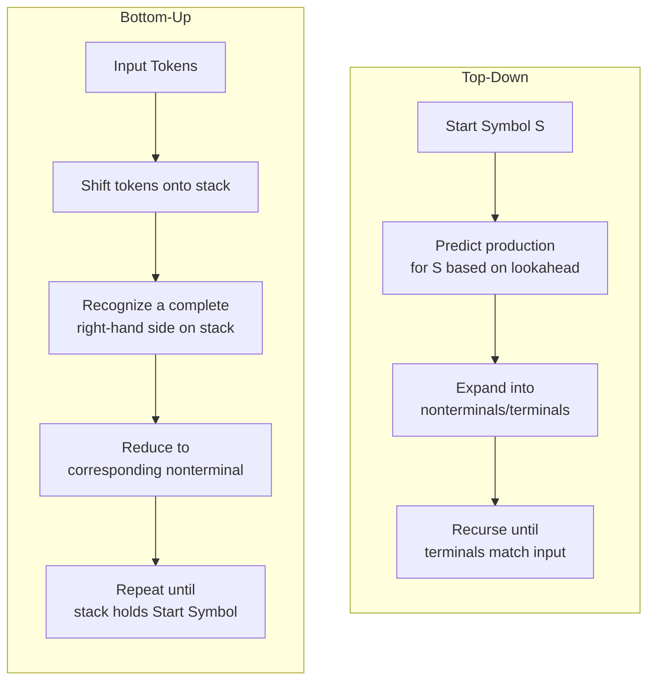
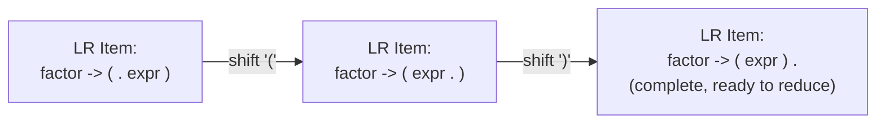

## Top-Down and Bottom-Up Parsing

### Overview

Top-down and bottom-up parsing are the two fundamental strategies for constructing a parse tree from a token stream against a context-free grammar, distinguished by the order in which they build the tree and the direction of the derivation each one produces. Top-down parsers start from the grammar's start symbol and work toward the input, predicting structure before seeing all of it; bottom-up parsers start from the input tokens and work toward the start symbol, confirming structure only once enough evidence has accumulated. Both strategies are sound and complete for the grammar classes they support, but they differ sharply in implementation style, expressive power, and practical tooling.

### The Core Distinction

$$\text{Top-down: builds tree root} \to \text{leaves, produces a leftmost derivation}$$


$$\text{Bottom-up: builds tree leaves} \to \text{root, produces a rightmost derivation in reverse}$$

A useful mental model: a top-down parser asks "given what I've seen so far, which production should I expand next?" — a *predictive* question answered using lookahead. A bottom-up parser asks "given what's on my stack right now, have I just completed a right-hand side I can collapse?" — a *recognition* question answered by pattern-matching against completed structure.



### Top-Down Parsing in Detail

**Recursive Descent**

The direct, hand-codable realization of top-down parsing: one function per nonterminal. Each function examines the current lookahead token(s) to choose among the nonterminal's productions, then calls the functions corresponding to symbols on the right-hand side of the chosen production, in order.



```
function parseExpr():
    t = parseTerm()
    while lookahead == '+':
        consume('+')
        t2 = parseTerm()
        t = makeAddNode(t, t2)
    return t
```

This example shows the standard technique for handling **left-recursive-looking constructs iteratively** within recursive descent — rather than writing genuinely left-recursive calls (which would loop forever), the repetition is flattened into a `while` loop, which is the recursive-descent analogue of the grammar-rewriting left-recursion-elimination transformation.

**Predictive Parsing and LL(k)**

When the choice of production can always be determined from $k$ tokens of lookahead without any backtracking, the grammar is **LL(k)**. LL(1) — using a single token of lookahead — is the workhorse case, requiring that for every nonterminal, the FIRST sets of its alternative productions be pairwise disjoint (with an additional FOLLOW-based condition for nullable alternatives).

**Table-Driven LL(1) Parsing**: rather than hand-writing recursive functions, an LL(1) grammar can drive a generic stack-based parsing engine using a precomputed parsing table $M[A, a]$ indicating which production to apply when nonterminal $A$ is on top of the parse stack and terminal $a$ is the current lookahead.

|  | Lookahead: `id` | Lookahead: `+` | Lookahead: `(` | Lookahead: `)` | Lookahead: `$` |
| --- | --- | --- | --- | --- | --- |
| `expr` | `expr → term expr'` | — | `expr → term expr'` | — | — |
| `expr'` | — | `expr' → + term expr'` | — | `expr' → ε` | `expr' → ε` |
| `term` | `term → factor` | — | `term → factor` | — | — |
| `factor` | `factor → id` | — | `factor → ( expr )` | — | — |

**Backtracking Top-Down Parsers**: a more general (but slower) variant that tries each production in turn and backtracks on failure, rather than committing based on fixed lookahead — used by some parser-combinator libraries and PEG-based tools, trading the LL(k) disjointness restriction for potential exponential blowup on adversarial grammars unless memoized (as in packrat parsing).

### Bottom-Up Parsing in Detail

**Shift-Reduce Mechanics**

A bottom-up parser maintains a stack (initially empty) and repeatedly performs one of two actions:

- **Shift**: push the next input token onto the stack.
- **Reduce**: when the top of the stack matches the right-hand side of some production $A \to \beta$, pop $\beta$ off the stack and push $A$.

Parsing succeeds when the stack contains only the start symbol and the input is exhausted.

**Handles**: the substring on the stack eligible for reduction at a given step is called a **handle** — specifically, the right-hand side of the production that, when reduced, is a step in a valid rightmost derivation in reverse. Identifying handles correctly (versus reducing prematurely or too late) is the central algorithmic problem bottom-up parsing must solve.

**LR(k) Parsing**: the formal umbrella for bottom-up parsers reading **L**eft-to-right and constructing a **R**ightmost derivation in reverse, with $k$ tokens of lookahead. Unlike LL parsers, LR parsers use a **stack of states** (not just grammar symbols) computed from an automaton built over "characteristic" items — productions annotated with a marker showing how much of the right-hand side has been recognized so far (LR(0)/LR(1) items).



**The LR Table Construction Pipeline**: build the canonical collection of LR(0) or LR(1) item sets (via a closure and goto operation over the grammar), then derive ACTION and GOTO tables from that collection. The size and precision of this construction is what distinguishes SLR(1), LALR(1), and canonical LR(1) — a distinction not needed to understand basic shift-reduce mechanics, but essential for understanding why some grammars parse under one LR variant and not another.

**Conflicts**: a state where the table construction finds two valid actions is a **conflict**:

- **Shift-reduce conflict**: both shifting the next token and reducing by some production are valid: classically arises from operator-expression grammars and is standardly resolved via declared precedence and associativity.
- **Reduce-reduce conflict**: two different productions could both be validly reduced at this point — usually indicates a genuine grammar ambiguity or an insufficiently refined grammar, and is harder to resolve by a simple declared rule.

### Direct Comparison

| Dimension | Top-Down (LL) | Bottom-Up (LR) |
| --- | --- | --- |
| Derivation | Leftmost | Rightmost, in reverse |
| Tree construction order | Root → leaves | Leaves → root |
| Decision basis | "What should I expand?" (prediction) | "What can I collapse?" (recognition) |
| Left recursion | Fails directly; needs elimination or loop-rewriting | Handled natively |
| Grammar class | LL(k) — proper subset of LR(k) for equal k, in general | LR(k) — strictly more grammars accepted |
| Hand implementation | Natural (recursive descent) | Impractical by hand for real grammars; needs a generator |
| Lookahead role | Chooses which production to try | Chooses shift vs. reduce, and which reduction |
| Error locality | Errors detected as soon as a prediction fails, often intuitive to report | Errors detected when no valid shift/reduce exists; can be less directly tied to "what the user meant" |
| Typical tools | Hand-written parsers, ANTLR (LL(*)) | `yacc`/`bison`, `menhir` |

### Why LR Is Strictly More Powerful

Every LL(k) grammar is also an LR(k) grammar (in fact, typically parseable by a weaker LR variant than the full power of LR(k)), but the converse fails: there are useful, natural grammars — including any grammar with genuine left recursion left unmodified, and various grammars needing to see more right context before committing to a reduction — that LR parsers handle without difficulty but that no LL(k) parser (for any fixed $k$) can parse without grammar transformation. This asymmetry is the formal reason left-recursive expression grammars (the most natural way to write left-associative operators) are the default in LR-oriented grammar specifications, while LL-based tools typically require or automatically apply the right-recursive rewriting shown earlier.

### Practical Hybrid: Operator Precedence Climbing

A widely used middle ground, especially inside otherwise-recursive-descent (top-down) parsers, is **precedence climbing** (also called the Pratt parsing technique in its more general form): rather than encoding operator precedence via a deeply layered grammar (expr → term → factor → ...), a single loop-based function directly consults a precedence table and recursively parses only as deep as the current precedence level warrants. This achieves LR-like efficient handling of left-associative operator chains while keeping the overall parser structure top-down and hand-writable — illustrating that the top-down/bottom-up distinction is somewhat orthogonal to the specific problem of expression parsing, where hybrid techniques are common in practice.

### Choosing Between Them in Practice

[Inference] In practice, the choice between top-down and bottom-up parsing for a new compiler or language tool is often driven less by raw grammar-class power (since most real programming-language grammars can be made to fit either style with sufficient grammar engineering) and more by factors such as: desired error-message quality, whether a parser-generator toolchain is acceptable versus a hand-written parser being preferred for maintainability, and the parsing-technique conventions already established in a language's ecosystem or toolchain; these are engineering tradeoffs that vary by project and are not derivable from the formal grammar-class hierarchy alone.

### Illustration: Same Grammar, Two Traversal Orders

Top-down expansion order vs bottom-up reduction order on the same parse tree (svg_diagram)

<svg xmlns="http://www.w3.org/2000/svg" viewBox="0 0 700 380">
<text x="350" y="26" text-anchor="middle" font-size="16" font-weight="bold" fill="#222">Top-down expansion order vs bottom-up reduction order on the same parse tree (svg_diagram)</text>

<text x="175" y="55" text-anchor="middle" font-size="13" font-weight="bold" fill="#446">Top-Down: numbers show expansion order</text>

<text x="525" y="55" text-anchor="middle" font-size="13" font-weight="bold" fill="#a46">Bottom-Up: numbers show reduction order</text>

<circle cx="175" cy="90" r="20" fill="#eef" stroke="#446" stroke-width="2" />
<text x="175" y="95" text-anchor="middle" font-size="10">expr</text>
<text x="200" y="80" font-size="12" fill="#446" font-weight="bold">1</text>
<circle cx="120" cy="160" r="18" fill="#eef" stroke="#446" stroke-width="2" />
<text x="120" y="165" text-anchor="middle" font-size="9">term</text>
<text x="95" y="150" font-size="12" fill="#446" font-weight="bold">2</text>
<circle cx="230" cy="160" r="18" fill="#eef" stroke="#446" stroke-width="2" />
<text x="230" y="165" text-anchor="middle" font-size="9">term</text>
<text x="255" y="150" font-size="12" fill="#446" font-weight="bold">4</text>
<circle cx="120" cy="230" r="14" fill="#fff" stroke="#333" />
<text x="120" y="235" text-anchor="middle" font-size="10">a</text>
<text x="95" y="220" font-size="12" fill="#446" font-weight="bold">3</text>
<circle cx="230" cy="230" r="14" fill="#fff" stroke="#333" />
<text x="230" y="235" text-anchor="middle" font-size="10">b</text>
<text x="255" y="220" font-size="12" fill="#446" font-weight="bold">5</text>
<line x1="175" y1="110" x2="120" y2="142" stroke="#446" stroke-width="1.5" />
<line x1="175" y1="110" x2="230" y2="142" stroke="#446" stroke-width="1.5" />
<line x1="120" y1="178" x2="120" y2="216" stroke="#446" stroke-width="1.5" />
<line x1="230" y1="178" x2="230" y2="216" stroke="#446" stroke-width="1.5" />
<circle cx="525" cy="90" r="20" fill="#fed" stroke="#a46" stroke-width="2" />
<text x="525" y="95" text-anchor="middle" font-size="10">expr</text>
<text x="550" y="80" font-size="12" fill="#a46" font-weight="bold">4</text>
<circle cx="470" cy="160" r="18" fill="#fed" stroke="#a46" stroke-width="2" />
<text x="470" y="165" text-anchor="middle" font-size="9">term</text>
<text x="445" y="150" font-size="12" fill="#a46" font-weight="bold">2</text>
<circle cx="580" cy="160" r="18" fill="#fed" stroke="#a46" stroke-width="2" />
<text x="580" y="165" text-anchor="middle" font-size="9">term</text>
<text x="605" y="150" font-size="12" fill="#a46" font-weight="bold">3</text>
<circle cx="470" cy="230" r="14" fill="#fff" stroke="#333" />
<text x="470" y="235" text-anchor="middle" font-size="10">a</text>
<text x="445" y="220" font-size="12" fill="#a46" font-weight="bold">1</text>
<circle cx="580" cy="230" r="14" fill="#fff" stroke="#333" />
<text x="580" y="235" text-anchor="middle" font-size="10">b</text>
<text x="605" y="220" font-size="12" fill="#a46" font-weight="bold">1</text>
<line x1="525" y1="110" x2="470" y2="142" stroke="#a46" stroke-width="1.5" />
<line x1="525" y1="110" x2="580" y2="142" stroke="#a46" stroke-width="1.5" />
<line x1="470" y1="178" x2="470" y2="216" stroke="#a46" stroke-width="1.5" />
<line x1="580" y1="178" x2="580" y2="216" stroke="#a46" stroke-width="1.5" />
</svg>

### Key Points

- Top-down parsing builds the parse tree from the start symbol downward, predicting productions from lookahead; bottom-up parsing builds it from the tokens upward, recognizing completed right-hand sides and reducing them.
- LL(k) grammars support direct top-down parsing; LR(k) grammars support bottom-up parsing and form a strictly larger class than LL(k) for equal $k$.
- Left recursion breaks naive recursive descent (infinite recursion) but is handled natively by LR parsers; LL-oriented tools require left-recursion elimination or loop-based rewriting.
- Shift-reduce conflicts (resolved via precedence/associativity) and reduce-reduce conflicts (usually indicating real ambiguity) are the two conflict types an LR table construction can encounter.
- LALR(1) is the practical sweet spot in the LR family, balancing grammar-class power against parsing-table size, and underlies most classic parser-generator tools.
- Precedence-climbing/Pratt parsing is a widely used hybrid that gets LR-like efficient operator handling inside an otherwise top-down, hand-written parser structure.

### Related Topics

- Syntax Analysis and Parsing Techniques
- Lexical Analysis Phase
- Context-Free Grammars and Ambiguity Resolution
- LALR Parser Generators (yacc/bison) Internals
- Pratt Parsing and Precedence Climbing
- Parsing Expression Grammars (PEGs) vs. Context-Free Grammars
- Parser Combinators in Functional Languages
- Semantic Analysis Phase