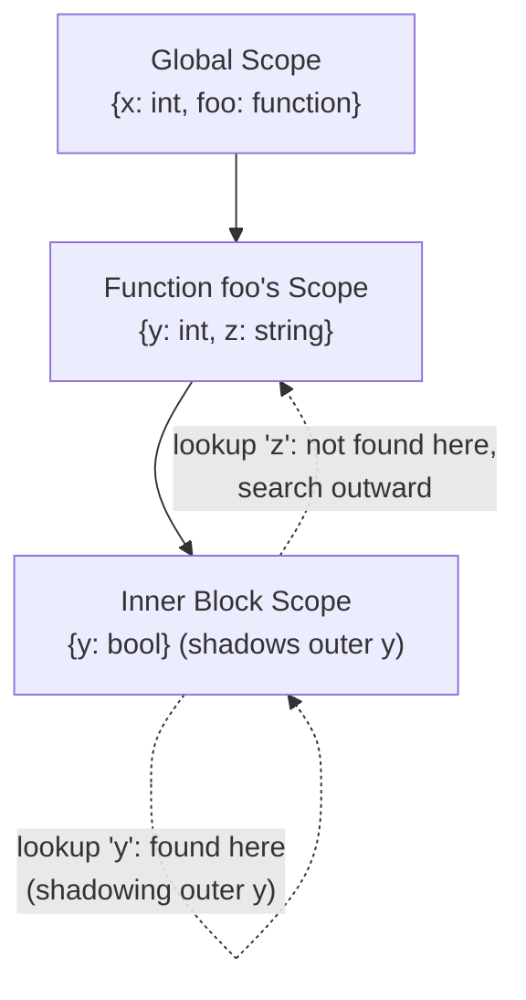
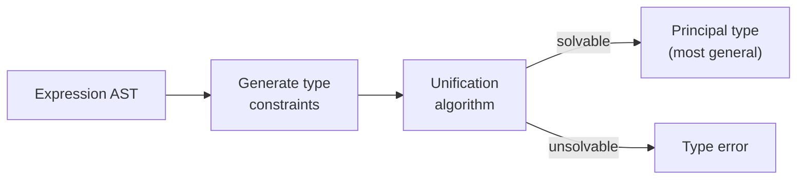

## Semantic Analysis

### Overview

Semantic analysis is the compiler phase that checks context-sensitive properties of a program that a context-free grammar cannot express — properties depending on relationships between potentially distant parts of the program, such as whether a variable was declared before use, whether an expression's types are consistent, and whether a name is visible in the scope where it is referenced. Where parsing confirms a program is *structurally* well-formed, semantic analysis confirms it is *meaningfully* well-formed relative to the language's static rules, and it produces the decorated intermediate representation that all subsequent phases depend on.

### Why Semantic Analysis Cannot Be Folded Into Parsing

Context-free grammars generate languages defined purely by nesting/recursive structure; they have no mechanism to enforce a constraint like "every use of identifier `x` must be preceded, somewhere in an enclosing scope, by a declaration of `x`" — this is a **context-sensitive** constraint, since whether `x` is valid depends on information (the set of declarations in scope) that is not locally visible in the grammar's derivation structure at the point of use. Formally, the languages definable by such constraints generally exceed the context-free class, which is precisely why a distinct phase, equipped with auxiliary data structures like a symbol table, is needed after parsing rather than folding these checks into the grammar itself.

### The Symbol Table

The **symbol table** is the central data structure of semantic analysis: a mapping from identifiers to their attributes — type, kind (variable, function, type, module), scope, and often additional information like memory offset or calling convention.

**Scoped Symbol Tables**: most languages have nested scopes (blocks, functions, classes, modules), so symbol tables are typically implemented as a **chain of scopes** — a new scope is pushed when entering a block and popped when leaving it, with lookups searching the current scope and then outward through enclosing scopes until a match is found or the chain is exhausted.

**Shadowing** occurs when an inner-scope declaration reuses a name from an outer scope; the inner declaration takes precedence within its scope, and the outer binding becomes inaccessible by that name (though it may still be reachable via language-specific qualification mechanisms) until the inner scope ends.

### Scope Resolution and Binding

**Static (lexical) scoping**, used by the overwhelming majority of modern languages, determines a name's binding from the program's textual structure alone, independent of the runtime call sequence. **Dynamic scoping**, by contrast, resolves a name based on the most recent binding in the active call chain at runtime, regardless of textual nesting.

[Inference] Dynamic scoping is comparatively rare in mainstream general-purpose languages today, though it persists in specific corners (e.g., certain constructs in Emacs Lisp, or `local` semantics in some shell scripting languages) and remains pedagogically important for illustrating the contrast; the precise set of languages using dynamic scoping today, and the extent to which they use it exclusively versus alongside static scoping, changes over time and is best confirmed for any specific language of interest rather than assumed.

**Declaration-before-use** rules vary by language: strictly enforced in some (a use before the corresponding textual declaration is an error), while others permit forward references (e.g., mutual recursion between functions or classes) via a preliminary declaration-collection pass that populates the symbol table with all top-level names before checking uses against it.

### Type Checking

Type checking verifies that operations are applied to operands of compatible types, according to the language's type system rules. Its core judgment form is typically written:

$$\Gamma \vdash e : \tau$$

read as "under type environment $\Gamma$ (a mapping from variables to types — essentially the type-relevant projection of the symbol table), expression $e$ has type $\tau$."

**Typing rules** are given inductively over the structure of expressions, mirroring the grammar's structure but adding type constraints:

$$\dfrac{\Gamma \vdash e_1 : \text{int} \quad \Gamma \vdash e_2 : \text{int}}{\Gamma \vdash e_1 + e_2 : \text{int}}$$

$$\dfrac{\Gamma, x:\tau_1 \vdash e : \tau_2}{\Gamma \vdash \lambda x{:}\tau_1.\,e : \tau_1 \to \tau_2}$$

**Static vs. Dynamic Typing**: static typing checks these judgments entirely before execution (at compile time), rejecting ill-typed programs before they run; dynamic typing defers type checking (or type-tag checking) to runtime, checking operand compatibility only when an operation actually executes. Many languages combine both, statically checking what they can and deferring the rest (gradual typing).

**Type Inference**: rather than requiring the programmer to annotate every expression's type, an inference algorithm derives types automatically. The best-known algorithm, associated with **Hindley–Milner** type systems (as used in ML-family languages), uses **unification** — solving a system of type-equality constraints generated by walking the expression — to find the most general (principal) type for an expression without explicit annotations, supporting **parametric polymorphism** via automatically generalized type variables.

[Inference] Beyond Hindley–Milner, richer type systems (dependent types, higher-rank polymorphism, subtyping with variance) generally require correspondingly more sophisticated checking algorithms — bidirectional type checking, subtyping-constraint solving, or full dependent-type-checking with normalization — and the specific algorithm used is closely tied to which type-system features a given language supports; this is a substantial area of its own rather than a simple extension of unification-based inference.

**Type Coercion and Implicit Conversion**: semantic analysis also determines where implicit conversions are inserted (e.g., an `int` promoted to a `float` in a mixed arithmetic expression), which is itself governed by explicit typing/coercion rules in the language specification rather than being ad hoc.

### Other Semantic Checks

Beyond scope and type checking, semantic analysis typically performs several further well-formedness checks, language-dependent in specifics:

- **Uniqueness checks**: no two declarations of the same name in the same scope (unless overloading is explicitly permitted and resolvable).
- **Flow-related checks**: definite assignment (a variable must be assigned before use on all control-flow paths reaching a use), reachability of code (detecting genuinely unreachable statements), and — in languages requiring it — that all control paths through a function return a value.
- **Overload resolution**: when multiple declarations share a name but differ in parameter types, determining at each call site which declaration is meant, based on argument types and the language's overload-resolution rules (which can involve ranking candidate matches by conversion cost).
- **Access control checks**: verifying that private/protected members are only accessed from contexts the language's visibility rules permit.

### Attribute Grammars: A Formal Framework

**Attribute grammars** provide a formal, systematic way to specify semantic analysis (and other AST-directed computations) by attaching **attributes** to grammar symbols and **semantic rules** to productions that compute those attributes.

- **Synthesized attributes**: computed from a node's children, flowing information upward (e.g., an expression's computed type, synthesized from its subexpressions' types).
- **Inherited attributes**: computed from a node's parent or siblings, flowing information downward or sideways (e.g., propagating the expected type into a subexpression, or threading a symbol table down into nested scopes).

$$\text{Production: } E \to E_1 + E_2 \qquad \text{Rule: } E.\text{type} = \text{combine}(E_1.\text{type}, E_2.\text{type})$$

An attribute grammar is **S-attributed** if it uses only synthesized attributes (evaluable in a single bottom-up pass, fitting naturally with bottom-up parsing) and **L-attributed** if it permits inherited attributes restricted so that a left-to-right, single-pass evaluation order remains possible (fitting naturally with top-down, recursive-descent-style traversal, where inherited attributes can be passed as function arguments).

### The Decorated AST as Output

The tangible output of semantic analysis is typically a **decorated** (or **annotated**) AST: the same tree structure produced by parsing, but with each relevant node now carrying resolved semantic information — a type, a reference to the symbol-table entry it resolves to, and possibly further language-specific annotations (constness, mutability, ownership/lifetime information, effect annotations). This decorated tree, not the bare syntactic AST, is what intermediate-representation generation consumes to produce the compiler's IR.

### Semantic Errors and Diagnostics

Semantic errors are reported once a violation of a static rule is detected, generally with richer, more specific messages than syntax errors can offer, since the compiler now has resolved type and binding information to reference directly (e.g., "cannot add `int` and `string`" rather than merely "unexpected token"). As with parsing, practical compilers aim to **recover** from a semantic error and continue checking (often by assigning a special "error type" that is treated as compatible with everything downstream, suppressing a cascade of secondary errors that would otherwise follow from a single root-cause mistake) rather than halting analysis at the first detected problem.

### Semantic Analysis and Formal Semantics: The Connection

Semantic analysis, as a compiler phase, should not be confused with **formal (denotational/operational/axiomatic) semantics** as a theoretical framework, though the two are closely related: semantic analysis implements a decidable, checkable *approximation* of the language's full static and dynamic semantics — specifically the parts checkable before execution — while formal semantics defines what programs *mean* in full generality, including runtime behavior no static check can fully anticipate (by Rice's theorem, most interesting runtime properties are undecidable in general). A language's static **type soundness** theorem (informally: "well-typed programs don't go wrong") is exactly the formal bridge connecting these two: it states that the semantic-analysis phase's type-checking judgment $\Gamma \vdash e : \tau$ correctly predicts an aspect of the term's *actual*, operationally or denotationally defined runtime behavior — commonly decomposed into **progress** (a well-typed term is either a value or can take a step) and **preservation** (stepping preserves well-typedness).

### Comparison: Checks Performed at Each Analysis Level

| Check | Performed by | Example Violation |
| --- | --- | --- |
| Well-formed nesting/structure | Parser (syntax analysis) | Unbalanced parentheses |
| Declared-before-use | Semantic analysis (scope resolution) | Using `x` before any declaration of `x` |
| Type compatibility | Semantic analysis (type checking) | `"hello" + 5` in a language without implicit numeric-string coercion |
| Definite assignment | Semantic analysis (flow-sensitive check) | Reading a variable on a path where it was never assigned |
| Runtime behavior correctness | Not statically checkable in general | A function that type-checks but computes the wrong result |

### Illustration: Type Checking an Expression Bottom-Up

Bottom-up synthesis of types through an expression tree (svg_diagram)

<svg xmlns="http://www.w3.org/2000/svg" viewBox="0 0 620 320">
<text x="310" y="26" text-anchor="middle" font-size="16" font-weight="bold" fill="#222">Bottom-up synthesis of types through an expression tree (svg_diagram)</text>
<circle cx="310" cy="80" r="26" fill="#dfd" stroke="#464" stroke-width="2" />
<text x="310" y="78" text-anchor="middle" font-size="10">+</text>
<text x="310" y="92" text-anchor="middle" font-size="9" fill="#464">: float</text>
<circle cx="200" cy="160" r="26" fill="#dfd" stroke="#464" stroke-width="2" />
<text x="200" y="158" text-anchor="middle" font-size="10">x</text>
<text x="200" y="172" text-anchor="middle" font-size="9" fill="#464">: int</text>
<circle cx="420" cy="160" r="26" fill="#dfd" stroke="#464" stroke-width="2" />
<text x="420" y="152" text-anchor="middle" font-size="10">*</text>
<text x="420" y="172" text-anchor="middle" font-size="9" fill="#464">: float</text>
<circle cx="360" cy="240" r="24" fill="#eef" stroke="#446" stroke-width="2" />
<text x="360" y="238" text-anchor="middle" font-size="9">y</text>
<text x="360" y="252" text-anchor="middle" font-size="9" fill="#446">: float</text>
<circle cx="470" cy="240" r="24" fill="#eef" stroke="#446" stroke-width="2" />
<text x="470" y="238" text-anchor="middle" font-size="9">2.0</text>
<text x="470" y="252" text-anchor="middle" font-size="9" fill="#446">: float</text>
<line x1="310" y1="106" x2="200" y2="136" stroke="#464" stroke-width="1.5" />
<line x1="310" y1="106" x2="420" y2="136" stroke="#464" stroke-width="1.5" />
<line x1="420" y1="186" x2="360" y2="218" stroke="#464" stroke-width="1.5" />
<line x1="420" y1="186" x2="470" y2="218" stroke="#464" stroke-width="1.5" />

<text x="310" y="300" text-anchor="middle" font-size="11" fill="#555">int + float → float (via implicit coercion rule, synthesized upward)</text>

</svg>

### Key Points

- Semantic analysis checks context-sensitive properties (scope, type, flow) that context-free grammars structurally cannot express, using the symbol table as its central data structure.
- Scoped symbol tables implement nested visibility and shadowing; static (lexical) scoping dominates modern language design over dynamic scoping.
- Type checking is formalized via typing judgments $\Gamma \vdash e : \tau$ and inductive typing rules; type inference (e.g., Hindley–Milner with unification) automates this without requiring full annotation.
- Attribute grammars formalize semantic-rule computation via synthesized (bottom-up) and inherited (top-down/sideways) attributes, with S-attributed and L-attributed subclasses tied naturally to bottom-up and top-down traversal respectively.
- The phase's output is a decorated AST carrying resolved types and bindings, consumed directly by IR generation.
- Type soundness (progress + preservation) is the formal theorem connecting a language's static semantic-analysis checks to guarantees about its actual runtime behavior.

### Related Topics

- Syntax Analysis and Parsing Techniques
- Denotational Semantics Revisited
- Type Inference and the Hindley–Milner Algorithm
- Type Soundness: Progress and Preservation
- Symbol Tables and Scope Resolution Strategies
- Attribute Grammars and Syntax-Directed Translation
- Static vs. Dynamic Typing and Gradual Typing
- The Compilation Process Overview