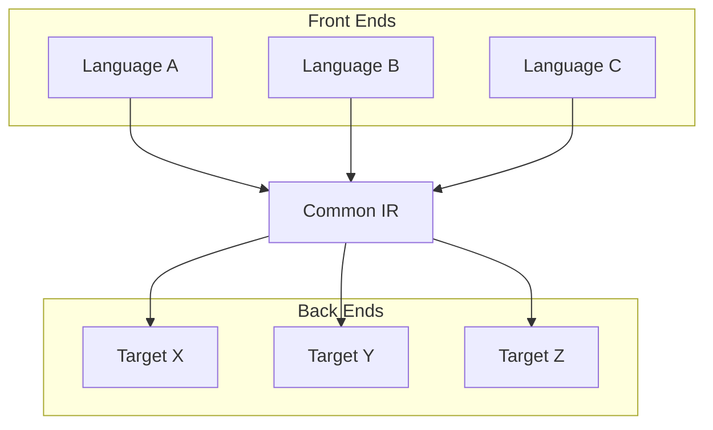
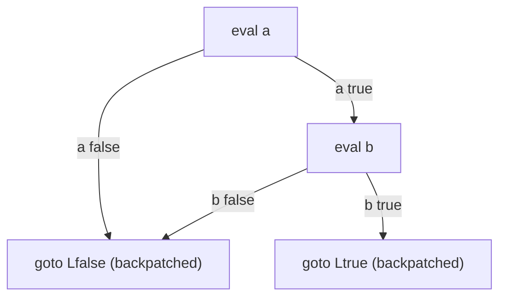
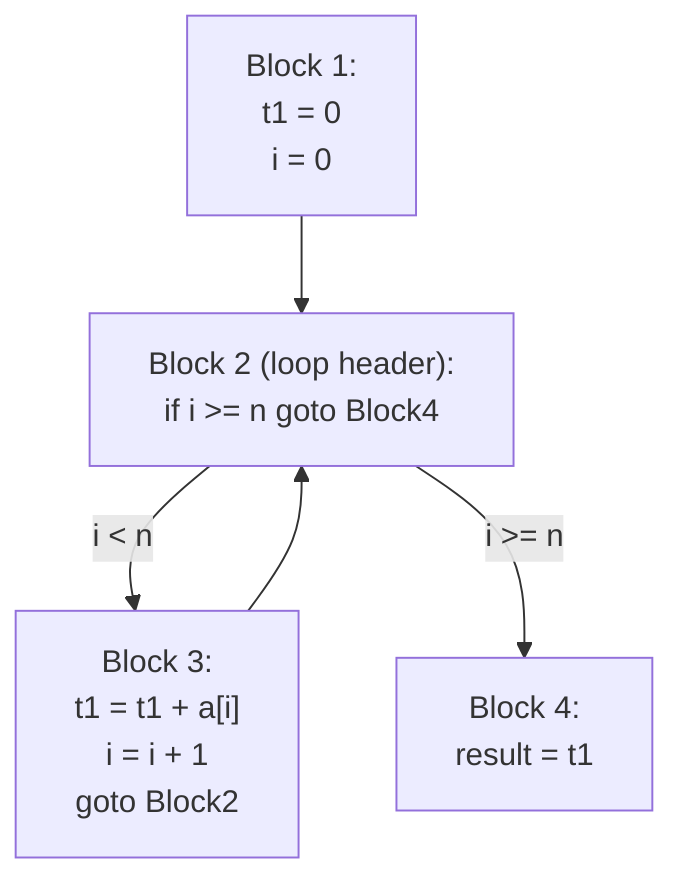
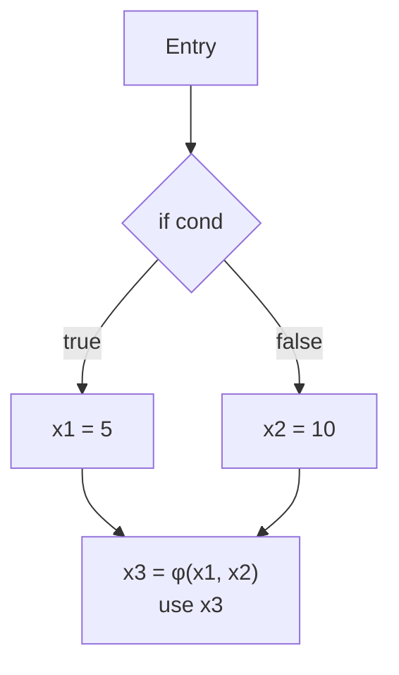

## Intermediate Code Generation

### Overview

Intermediate code generation is the compiler phase that lowers a decorated abstract syntax tree into an **intermediate representation (IR)** — a form that is more explicit about control flow, operation order, and operand naming than a tree, while remaining independent (or largely independent) of any specific target machine. This independence is the phase's central design payoff: a single IR-generation strategy lets the middle-end optimizer and, with an appropriate back end, multiple target architectures, all operate on the same representation, decoupling "what the program computes" from "which CPU will run it."

### Why an Intermediate Representation Is Needed

Translating directly from AST to machine code in a single step would force every source-language front end to duplicate the logic of every optimization and every target back end — an $O(\text{languages} \times \text{targets})$ engineering problem. Introducing an IR as a common midpoint reduces this to $O(\text{languages} + \text{targets})$: each front end targets the IR once, and each back end consumes the IR once, with optimizations implemented against the IR shared by all of them.



### Desirable Properties of an IR

A well-designed IR generally aims for:

- **Explicitness of order and effect**: side effects and evaluation order, left implicit in source syntax, become explicit sequences of primitive operations.
- **A small instruction set**: few enough distinct operation kinds that optimization and code-generation logic doesn't need to special-case a combinatorially large surface.
- **Ease of manipulation**: convenient to analyze (via dataflow analysis) and to transform (rewrite one instruction sequence into an equivalent, better one) without disturbing unrelated parts of the program.
- **Closeness to both ends**: high-level enough to still express source-level structure without loss (so no semantic information needed by an optimization is already gone), yet low-level enough that mapping to real machine instructions is not a large further leap.

### Three-Address Code

**Three-address code (3AC)** is a classic and still widely used IR style in which each instruction has at most one operator and at most three operands (typically: one destination, two sources), using **temporaries** to hold intermediate results that would otherwise require a tree structure to express.

Example — lowering `a = b * c + d`:



```
t1 = b * c
a  = t1 + d
```

Standard three-address instruction forms include:

| Form | Example | Meaning |
| --- | --- | --- |
| Binary op | `t1 = t2 op t3` | Arithmetic/logical operation |
| Copy | `t1 = t2` | Simple assignment |
| Unconditional jump | `goto L` | Transfer control to label `L` |
| Conditional jump | `if t1 relop t2 goto L` | Branch based on comparison |
| Indexed / address-of | `t1 = a[t2]`, `t1 = &a` | Array access, address computation |
| Procedure call | `param t1; call p, n` | Argument passing and call |

**Syntax-Directed Translation**: 3AC is typically produced by attaching code-generation actions to grammar productions, generating instructions recursively as the (decorated) AST is walked, with each node returning the name of the temporary holding its result and appending whatever instructions were needed to compute it — an application of the attribute-grammar synthesized-attribute pattern directly to code generation.

### Control-Flow Translation: Short-Circuit and Backpatching

Translating control-flow constructs (if/while/boolean expressions with `&&`/`||`) into 3AC requires generating and later resolving jump targets. **Backpatching** is the standard technique: generate jump instructions with placeholder (unfilled) targets, track lists of instructions needing each label via synthesized attributes, and fill in (patch) the actual label once it becomes known during the tree walk — avoiding the need for a separate pass purely to resolve labels.

Short-circuit evaluation of `a && b` illustrates the pattern: if `a` evaluates false, control should jump directly past evaluation of `b`, rather than always evaluating both operands and then combining them.



### Control-Flow Graphs and Basic Blocks

Once 3AC is generated, it is standardly organized into a **control-flow graph (CFG)**: nodes are **basic blocks** — maximal straight-line instruction sequences with a single entry point (the first instruction) and single exit point (the last instruction, typically a jump or fall-through) — and edges represent possible control transfers between blocks.

**Basic block identification** proceeds by finding **leaders**: the first instruction, any instruction that is the target of a jump, and any instruction immediately following a jump or conditional jump. Each leader starts a new basic block extending up to (but not including) the next leader.



CFGs are the standard input to virtually all subsequent dataflow analyses and optimizations, since flow-sensitive facts (liveness, reaching definitions, available expressions) are defined and computed in terms of paths through this graph.

### Static Single Assignment (SSA) Form

**SSA form** refines 3AC/CFG-style IR with one additional invariant: **every variable is assigned exactly once**, textually. When a variable would naturally be reassigned along different control-flow paths (e.g., different values inside the two branches of an `if`), SSA introduces a fresh version of the variable on each path and merges them at the confluence point using a **φ (phi) function**:

$$x_3 = \phi(x_1, x_2)$$

meaning $x_3$ takes the value $x_1$ if control arrived from the predecessor block where $x_1$ was defined, or $x_2$ if it arrived from the other predecessor.



**Why SSA Simplifies Optimization**: because each variable has exactly one definition, many dataflow facts that otherwise require iterative fixed-point computation over a lattice (as in classical reaching-definitions analysis) become directly readable from the IR's syntactic structure — a use of $x_3$ can only refer to that single definition, with no ambiguity requiring separate analysis to resolve. This is the primary reason SSA became the dominant IR style in modern optimizing compilers (it underlies LLVM IR, for instance), since it makes def-use chains, constant propagation, and dead-code elimination all considerably more direct to implement correctly.

**Constructing SSA**: the standard algorithm (due to Cytron, Ferrante, Rosen, Wegman, and Zadeck) computes, for each variable, the minimal set of CFG nodes needing a φ-function using the concept of a **dominance frontier** — informally, the set of blocks where two or more control-flow paths carrying potentially different definitions of a variable first merge — then renames variables to give each definition a fresh version.

$$\text{Dominance: } a \text{ dominates } b \iff \text{every path from entry to } b \text{ passes through } a$$

**Leaving SSA**: because most target machine instruction sets have no notion of φ-functions, a final "out-of-SSA" translation phase converts φ-functions back into ordinary copy instructions placed appropriately in predecessor blocks before code generation proceeds to the back end.

### Other IR Styles

| IR Style | Structure | Typical Use |
| --- | --- | --- |
| Three-address code (non-SSA) | Flat list of simple instructions | Classic textbook compilers, simpler pipelines |
| SSA form | 3AC + single-assignment + φ-functions | Modern optimizing compilers (LLVM IR, and similar) |
| Register Transfer Language (RTL) | Explicit register/memory-transfer operations, closer to hardware | Compiler back ends (e.g., historically in GCC) |
| Stack-based bytecode | Operand-stack-relative instructions, no named temporaries | Virtual machines (JVM bytecode, CPython bytecode) |
| Continuation-Passing Style (CPS) | Every call takes an explicit "what to do next" continuation argument; no implicit return | Functional-language compilers (historically, e.g., early Scheme compilers) |
| A-Normal Form (ANF) | Every intermediate computation bound to a name via `let`, restricted nesting | Functional-language compilers as an alternative to CPS |

[Inference] The choice between CPS-style and ANF-style intermediate representations in functional-language compiler construction has been the subject of ongoing debate and differing conventions across compiler projects, generally trading off ease of expressing certain control-flow transformations (tail calls, exceptions) against the directness of representing straightforward sequential computation; there is no single settled consensus dictating which is superior in general, and specific compilers' choices should be understood as engineering decisions particular to that project rather than an industry-wide standard.

### Illustration: From Decorated AST to SSA-Form CFG

Lowering pipeline from decorated AST through 3AC to SSA-form CFG (svg_diagram)

<svg xmlns="http://www.w3.org/2000/svg" viewBox="0 0 760 300">
<text x="380" y="26" text-anchor="middle" font-size="16" font-weight="bold" fill="#222">Lowering pipeline from decorated AST through 3AC to SSA-form CFG (svg_diagram)</text>
<rect x="20" y="60" width="160" height="60" rx="6" fill="#eef" stroke="#446" />
<text x="100" y="85" text-anchor="middle" font-size="11" fill="#222">Decorated AST</text>
<text x="100" y="102" text-anchor="middle" font-size="9" fill="#555">(types, bindings resolved)</text>
<rect x="240" y="60" width="180" height="60" rx="6" fill="#eef" stroke="#446" />
<text x="330" y="82" text-anchor="middle" font-size="11" fill="#222">Three-Address Code</text>
<text x="330" y="99" text-anchor="middle" font-size="9" fill="#555">(syntax-directed translation)</text>
<rect x="480" y="60" width="180" height="60" rx="6" fill="#dfe" stroke="#464" />
<text x="570" y="82" text-anchor="middle" font-size="11" fill="#222">Control-Flow Graph</text>
<text x="570" y="99" text-anchor="middle" font-size="9" fill="#555">(basic blocks + edges)</text>
<rect x="240" y="200" width="180" height="60" rx="6" fill="#fde" stroke="#a46" />
<text x="330" y="222" text-anchor="middle" font-size="11" fill="#222">SSA Form</text>
<text x="330" y="239" text-anchor="middle" font-size="9" fill="#555">(φ-functions at merges)</text>
<line x1="180" y1="90" x2="240" y2="90" stroke="#446" stroke-width="2" marker-end="url(#a4)" />
<line x1="420" y1="90" x2="480" y2="90" stroke="#446" stroke-width="2" marker-end="url(#a4)" />
<line x1="570" y1="120" x2="570" y2="160" stroke="#446" stroke-width="2" />
<line x1="570" y1="160" x2="420" y2="200" stroke="#446" stroke-width="2" marker-end="url(#a4)" />
<text x="500" y="150" font-size="10" fill="#555">dominance frontier +</text>
<text x="500" y="163" font-size="10" fill="#555">φ-insertion + renaming</text>
</svg>

### Key Points

- Intermediate code generation lowers the decorated AST into a machine-independent representation, letting front ends and back ends be developed independently against a shared IR.
- Three-address code expresses computation as simple instructions with at most one operator and three operands, generated via syntax-directed translation with backpatching for control-flow jumps.
- Control-flow graphs organize 3AC into basic blocks connected by control-transfer edges, identified via leader instructions, and form the substrate for all subsequent dataflow analysis.
- SSA form adds the single-assignment invariant plus φ-functions at control-flow merges, making many optimizations directly readable from IR structure rather than requiring iterative dataflow computation; it is constructed using dominance-frontier analysis.
- Alternative IR styles (RTL, stack-based bytecode, CPS, ANF) suit different compiler architectures and language paradigms, with no single universally superior choice.
- The IR produced in this phase is precisely what the subsequent machine-independent optimization phase operates on before instruction selection begins.

### Related Topics

- Semantic Analysis
- The Compilation Process Overview
- Static Single Assignment Form and Dataflow Analysis
- Control-Flow Graph Construction and Dominance
- Machine-Independent Code Optimization Techniques
- Register Allocation via Graph Coloring
- Continuation-Passing Style in Functional Compilers
- Attribute Grammars and Syntax-Directed Translation