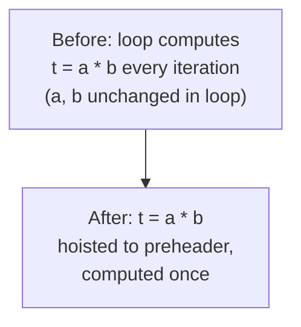
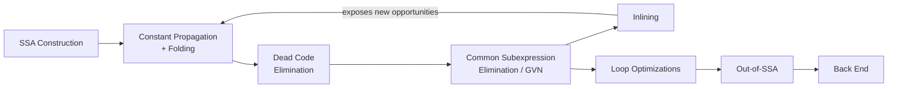

## Code Optimization Strategies


### Overview

Code optimization transforms a program's intermediate representation (or, less commonly, its target code) into a semantically equivalent form that improves some cost metric — typically execution time, but sometimes code size, memory usage, or energy consumption — without changing observable behavior. Optimizations are proven correct relative to the language's semantics (an optimization that changes behavior is a bug, not an optimization) and are organized by scope: **local** optimizations operate within a single basic block, **global** (intraprocedural) optimizations operate across a whole function's control-flow graph, and **interprocedural** optimizations reason across function-call boundaries.

### The Correctness Constraint

Every optimization must preserve the program's **observable behavior** as defined by the source language's semantics — this typically means preserving output values, side effects (I/O, exceptions), and, in languages with defined memory/concurrency models, preserving the set of legal behaviors under that model. This is precisely why optimization is discussed alongside formal semantics and compiler correctness: an optimization pass is, in effect, a small claim of program equivalence, and aggressive optimizations that violate subtle semantic guarantees (undefined-behavior exploitation being the most infamous modern example) are a recurring source of real-world compiler bugs and controversy.

### Local Optimizations

Local optimizations operate on a single basic block, requiring no analysis of control flow beyond the block's boundaries, which makes them simple to implement correctly and cheap to apply.

**Constant Folding**: evaluating constant subexpressions at compile time.



```
t1 = 3 + 4        →    t1 = 7
```

**Constant Propagation**: substituting a variable's known constant value at its uses, often enabling further constant folding.



```
x = 5             →    x = 5
y = x + 2         →    y = 7
```

**Algebraic Simplification**: rewriting expressions using algebraic identities.



```
x * 1  →  x        x + 0  →  x        x * 0  →  0        2 * x  →  x + x (or x << 1, if beneficial on target)
```

**Local Common Subexpression Elimination**: reusing a previously computed value within the same block instead of recomputing an identical expression, provided no intervening instruction could have changed the operands' values.



```
t1 = a + b             t1 = a + b
t2 = a + b        →    t2 = t1
```

**Strength Reduction**: replacing an expensive operation with a cheaper equivalent, most classically replacing multiplication inside a loop induction variable with repeated addition, or replacing multiplication/division by a power of two with a shift.

### Global (Intraprocedural) Optimizations

Global optimizations require analysis across the whole control-flow graph of a function, generally formulated as **dataflow analyses** — computations that propagate facts along CFG edges until a fixed point is reached.

**Global Common Subexpression Elimination**: extends local CSE across basic-block boundaries, using an **available expressions** dataflow analysis to determine, at each program point, which expressions have already been computed and not since invalidated by a redefinition of an operand.

**Dead Code Elimination**: removes computations whose results are never subsequently used, determined via a **liveness analysis** that computes, at each program point, which variables may be read later along some path.

$$\text{Dead code elimination example:} \quad x = 5; \; y = x + 1; \; \text{(x, y never used again)} \; \Longrightarrow \; \text{(both statements removed)}$$

**Copy Propagation**: replaces uses of a variable that is merely a copy of another (`x = y`) with the original variable directly, often exposing additional dead code once the copy instruction itself becomes unused.

**Loop-Invariant Code Motion**: identifies computations inside a loop body whose operands do not change across iterations and hoists them to the loop's preheader (a block executed exactly once before the loop), so the computation runs once instead of on every iteration.



**Induction Variable Elimination and Strength Reduction**: identifies variables that change by a fixed amount each loop iteration (induction variables) and, where a derived induction variable's value can be computed via cheaper incremental addition rather than recomputing a multiplication each iteration, rewrites it accordingly — a loop-specific instance of the general strength-reduction idea, requiring loop-structure-aware analysis to apply correctly.

### The Dataflow Analysis Framework

Most global optimizations rest on a common mathematical framework: a **lattice** of possible facts, a **transfer function** describing how each instruction transforms facts, and a **meet/join operator** combining facts from multiple predecessors, iterated to a **fixed point**.

$$\text{OUT}[B] = f_B(\text{IN}[B]) \qquad \text{IN}[B] = \bigsqcup_{P \in \text{preds}(B)} \text{OUT}[P]$$

| Analysis | Direction | Meet Operator | Facts Computed |
| --- | --- | --- | --- |
| Reaching definitions | Forward | Union | Which assignments may reach a point |
| Available expressions | Forward | Intersection | Which expressions are already computed and still valid |
| Liveness | Backward | Union | Which variables may be used later |
| Very busy expressions | Backward | Intersection | Which expressions will definitely be computed again soon |

This is a direct application of the same fixed-point machinery underlying denotational semantics' treatment of recursion, applied here over finite lattices of program facts rather than infinite semantic domains — the iteration is guaranteed to terminate because the lattices involved are finite (or satisfy a finite-height/ascending-chain condition) and transfer functions are monotone, so Kleene iteration reaches a unique least (or greatest) fixed point in a bounded number of steps.

### SSA-Enabled Optimizations

Because SSA form gives each variable exactly one definition, several optimizations become considerably more direct to express and implement:

- **Sparse Conditional Constant Propagation (SCCP)**: combines constant propagation with reachability analysis, discovering that some branches are provably never taken and propagating constants more aggressively than either analysis alone, since unreachable-branch definitions can be safely ignored when merging φ-function operands.
- **Global Value Numbering (GVN)**: assigns a canonical "value number" to each distinct computed value, identifying redundant computations that are syntactically different but provably compute the same result (subsuming and generalizing common subexpression elimination).
- **Aggressive Dead Code Elimination**: starting from provably-live instructions (those with observable side effects) and working backward through def-use chains, marking everything reachable as live and removing everything else — directly enabled by SSA's explicit, unambiguous def-use edges.

### Interprocedural and Whole-Program Optimizations

Optimizations that reason across function boundaries can find opportunities invisible to any single-function analysis, at the cost of substantially higher analysis complexity:

- **Inlining**: replaces a call site with a copy of the callee's body (parameters substituted with argument expressions), eliminating call overhead and — critically — exposing the callee's internals to further optimization in the context of the specific call site (constant arguments can now propagate into the inlined body, for instance). Inlining decisions balance code-size growth against the optimization opportunities it unlocks, generally guided by heuristics (callee size, call-site frequency estimates) rather than a single universal rule.
- **Interprocedural Constant Propagation**: propagates constant argument values across call sites into callee bodies without full inlining.
- **Escape Analysis**: determines whether a value's lifetime can be proven to not "escape" its allocating function (e.g., never stored into a heap-reachable location or returned), enabling stack allocation or elimination of an allocation entirely in place of a heap allocation the source otherwise implies.
- **Devirtualization**: in languages with dynamic dispatch, determines that a virtual/dynamic call site can only ever target one concrete implementation (via whole-program class-hierarchy analysis) and replaces the dynamic dispatch with a direct call, which may then become inlinable.

[Inference] Whole-program and link-time optimization (LTO) techniques generally require visibility across translation-unit or module boundaries not available during ordinary per-file compilation, and the specific set of interprocedural optimizations enabled, along with their compile-time cost, varies considerably across toolchains and build configurations; claims about which optimizations a specific compiler applies under LTO should be checked against that compiler's current documentation.

### Loop Optimizations Beyond Invariant Motion

- **Loop Unrolling**: replicates the loop body multiple times per iteration of the (adjusted) loop counter, reducing branch/counter overhead relative to work done, at the cost of code-size growth and potential instruction-cache pressure.
- **Loop Fusion**: merges two adjacent loops iterating over the same range into a single loop, improving locality and reducing loop-overhead duplication, when data dependencies between the loops permit it.
- **Loop Tiling / Blocking**: restructures nested loops over large arrays to operate on smaller sub-blocks that fit in cache, trading loop-structure complexity for substantially improved memory-locality behavior on cache-sensitive workloads.
- **Vectorization**: transforms a loop operating on scalar values one at a time into one using SIMD (single-instruction-multiple-data) hardware instructions operating on multiple values simultaneously, requiring a dependence analysis proving iterations can be safely reordered/parallelized.

### The Optimization Pipeline in Practice

Optimizing compilers apply passes iteratively, since one optimization frequently exposes new opportunities for another (constant propagation revealing dead code, dead code elimination shrinking a function enough to become inlinable, inlining exposing new constants at the call site, and so on) — this feedback loop is why production compilers run many passes in a carefully tuned sequence, sometimes repeating certain cheap passes multiple times, rather than a single linear pass per optimization.



### Optimization Levels: A Practical Tradeoff

Compilers typically expose tunable optimization levels balancing compile time, code size, and runtime performance:

| Level (typical convention) | Focus | Compile-Time Cost |
| --- | --- | --- |
| None / `-O0` | No optimization; fastest compilation, easiest debugging | Lowest |
| Basic / `-O1` | Cheap local + some global optimizations | Low |
| Standard / `-O2` | Most global optimizations, moderate inlining | Moderate |
| Aggressive / `-O3` | Adds vectorization, more aggressive inlining, loop transformations | Higher |
| Size-focused / `-Os` | Prioritizes code size over speed | Moderate |

[Inference] The exact set of passes enabled at each numbered optimization level, and even the naming convention itself, is compiler-specific (GCC, Clang/LLVM, and other toolchains each define their own level semantics, which have also changed across versions); specific behavior at a given level for a given compiler version should be checked against that compiler's current documentation rather than assumed to be a universal standard.

### Illustration: A Chain of Optimizations Interacting

Sequential passes revealing new optimization opportunities (svg_diagram)

<svg xmlns="http://www.w3.org/2000/svg" viewBox="0 0 740 340">
<text x="370" y="26" text-anchor="middle" font-size="16" font-weight="bold" fill="#222">Sequential passes revealing new optimization opportunities (svg_diagram)</text>
<rect x="20" y="60" width="220" height="70" rx="6" fill="#eef" stroke="#446" />
<text x="130" y="85" text-anchor="middle" font-size="11" fill="#222">n = 4</text>
<text x="130" y="102" text-anchor="middle" font-size="11" fill="#222">t = n * 2</text>
<text x="130" y="119" text-anchor="middle" font-size="9" fill="#555">(original 3AC)</text>
<rect x="270" y="60" width="220" height="70" rx="6" fill="#dfe" stroke="#464" />
<text x="380" y="85" text-anchor="middle" font-size="11" fill="#222">n = 4</text>
<text x="380" y="102" text-anchor="middle" font-size="11" fill="#222">t = 8</text>
<text x="380" y="119" text-anchor="middle" font-size="9" fill="#555">(after constant propagation + folding)</text>
<rect x="520" y="60" width="200" height="70" rx="6" fill="#fde" stroke="#a46" />
<text x="620" y="90" text-anchor="middle" font-size="11" fill="#222">t = 8</text>
<text x="620" y="107" text-anchor="middle" font-size="9" fill="#555">(n = 4 removed:<br />dead after propagation)</text>
<line x1="240" y1="95" x2="270" y2="95" stroke="#446" stroke-width="2" marker-end="url(#a5)" />
<line x1="490" y1="95" x2="520" y2="95" stroke="#446" stroke-width="2" marker-end="url(#a5)" />

<text x="370" y="180" text-anchor="middle" font-size="12" fill="#555" font-style="italic">Each pass creates the precondition for the next —</text>

<text x="370" y="198" text-anchor="middle" font-size="12" fill="#555" font-style="italic">this is why passes iterate rather than run once each</text>

</svg>

### Key Points

- Optimizations must provably preserve observable program behavior; scope ranges from local (single basic block) to global (whole function) to interprocedural (across call boundaries).
- Local optimizations (constant folding, algebraic simplification, local CSE) require no control-flow analysis; global optimizations (dead code elimination, global CSE, loop-invariant code motion) rest on dataflow analysis computed to a fixed point over a lattice of facts.
- SSA form's single-assignment property directly enables sparse conditional constant propagation, global value numbering, and simplified dead-code elimination via explicit def-use chains.
- Interprocedural optimizations — inlining, escape analysis, devirtualization — find opportunities invisible within a single function, at higher analysis cost, and interact strongly with other passes (inlining exposing new constants, for instance).
- Loop-specific optimizations (unrolling, fusion, tiling, vectorization) target the disproportionate runtime cost loops represent, often trading code size or structural complexity for locality or parallelism gains.
- Optimization passes are applied iteratively because one pass routinely exposes new opportunities for another, which is why production compilers run carefully sequenced, sometimes repeated, pass pipelines rather than a single linear pass per technique.

### Related Topics

- Intermediate Code Generation
- Static Single Assignment Form and Dataflow Analysis
- The Compilation Process Overview
- Register Allocation via Graph Coloring
- Loop Optimization and Automatic Vectorization
- Interprocedural Analysis and Whole-Program Optimization
- Undefined Behavior and Compiler Correctness
- Proof of Program Correctness