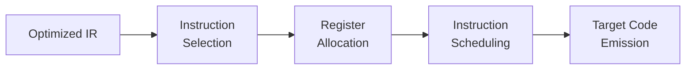
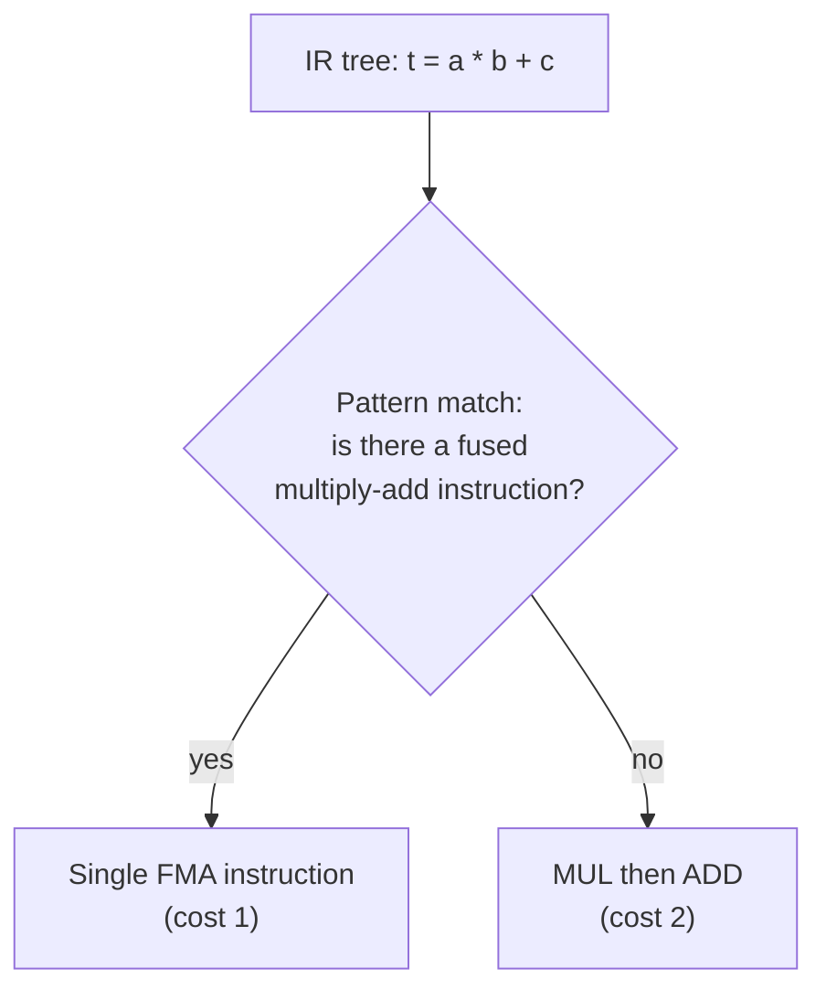
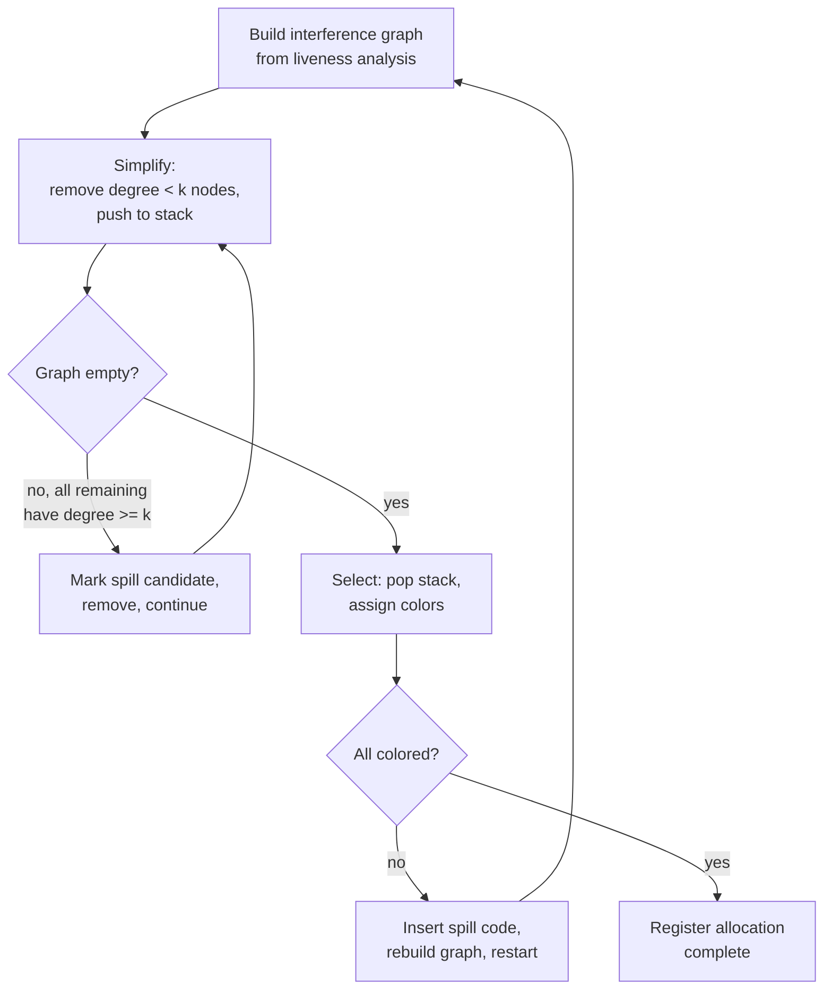

## Code Generation

### Overview

Code generation is the final major phase of the compiler back end, responsible for translating optimized intermediate representation into actual target-machine instructions — assembly text, a relocatable object file, or bytecode for a virtual machine. This phase must resolve three interdependent problems: **instruction selection** (which machine instructions implement which IR operations), **register allocation** (which physical register or memory location holds each value), and **instruction scheduling** (in what order to emit instructions for best performance on the target's microarchitecture). These problems interact — the best instruction selection depends on what's in registers, and the best register allocation depends on which instructions were selected — which is why, despite being conceptually separable, they are frequently intertwined or iterated in practical code generators.

### The Three Core Sub-Problems

### Instruction Selection

Instruction selection maps IR operations onto the target instruction set architecture (ISA). This is nontrivial because the mapping is rarely one-to-one: a single IR operation may correspond to several possible instruction sequences of differing cost, and conversely a single machine instruction may implement several IR operations at once (a fused multiply-add instruction computing `a*b+c` in one step being the canonical example).

**Tree-Pattern Matching and Tiling**: a standard formalization treats the IR (viewed as an expression tree or DAG per basic block) and the target's available instructions (each modeled as a small tree pattern with an associated cost) as a **tiling problem**: cover the IR tree with instruction patterns at minimum total cost. For tree-structured IR, this is solvable optimally via **dynamic programming** — computing, bottom-up, the minimum cost of covering each subtree using each possible "top-level" pattern, then selecting the overall minimum-cost cover.

**Instruction Selection via Maximal Munch**: a simpler greedy heuristic (related to, but distinct from, the lexical-analysis technique of the same name) that repeatedly matches the largest possible pattern starting from the root of the (sub)tree, emits the corresponding instruction, and recurses on the unmatched children — fast and reasonably effective in practice, though not guaranteed optimal the way full dynamic-programming tiling is.

**DAG-Based Selection**: when the same computed value is used more than once (common subexpression sharing), representing the IR as a DAG rather than a tree avoids selecting instructions to recompute a value redundantly, though DAG-covering is a harder combinatorial problem than tree-covering in general and typically relies on heuristics rather than a guaranteed-optimal algorithm.

**Peephole Optimization**: a lightweight, local pass often run after (or interleaved with) instruction selection, examining a small sliding window ("peephole") of adjacent generated instructions and replacing recognizable inefficient patterns with better equivalents — e.g., collapsing a store immediately followed by a load of the same location into a direct register move, or eliminating a jump to an immediately following instruction.

### Register Allocation

Machines provide a small, fixed number of physical registers, while the IR after instruction selection typically references arbitrarily many virtual registers or temporaries. Register allocation must assign each temporary a physical register, or — when demand exceeds supply — **spill** it to memory.

**Liveness and Interference**: two temporaries **interfere** if there is some program point at which both are simultaneously live (i.e., each holds a value that may still be used later along some path), which is exactly why they cannot share a register. Liveness itself is computed via the standard backward dataflow analysis introduced under global optimization.

**Graph Coloring**: the dominant classical formulation, due to Chaitin and refined by Briggs and others, builds an **interference graph** $G = (V, E)$ where $V$ is the set of temporaries and $(u,v) \in E$ iff $u$ and $v$ interfere, then seeks a **proper $k$-coloring** — an assignment of one of $k$ colors (registers) to each node such that no edge connects two same-colored nodes.

$$\text{Register allocation is possible with } k \text{ registers} \iff G \text{ is } k\text{-colorable}$$

Graph coloring is NP-complete in general, so practical allocators use a heuristic simplification-based algorithm:

1. **Simplify**: repeatedly remove any node with degree $< k$ from the graph (pushing it onto a stack), since such a node can always be colored once its neighbors are colored — a node with fewer than $k$ neighbors can never be "trapped" without an available color.
2. **Spill candidate selection**: if no node has degree $< k$, pick a node to mark as a potential spill (using a cost heuristic — typically favoring low-use-frequency, high-degree temporaries), remove it, and continue simplifying.
3. **Select (color assignment)**: pop nodes off the stack in reverse order, assigning each a color not used by its already-colored neighbors; if a marked spill candidate can actually still be colored at this stage (its neighbors happen to leave a free color), it is colored instead of spilled — an **optimistic coloring** refinement.
4. **Actual spilling**: for nodes that genuinely cannot be colored, insert load/store instructions to move the value to and from memory around each use, then rebuild the interference graph (spilled values typically have much shorter live ranges post-rewrite) and repeat the whole process.

**Register Coalescing**: an additional refinement that merges (coalesces) two temporaries connected by a copy instruction and not otherwise interfering, so they can share a register and the copy instruction itself can be eliminated — directly reducing instruction count, though naive coalescing can increase interference-graph degree elsewhere and must be applied conservatively to avoid making the graph harder to color.

**Linear Scan Allocation**: an alternative to graph coloring, popular in **just-in-time** compilers where allocation speed matters more than allocation optimality, that treats each temporary's live range as an interval on a linearized instruction sequence and greedily assigns registers by scanning these intervals in order, spilling whichever active interval extends furthest into the future when registers run out — asymptotically faster than graph-coloring approaches, at some cost in allocation quality.

### Instruction Scheduling

Even after instructions are selected and registers assigned, their emission order affects performance on pipelined and superscalar processors: an instruction whose result is needed immediately by the next instruction may force a pipeline stall if the target's latency for that operation exceeds one cycle, whereas reordering independent instructions between them can hide that latency.

**Data Dependence Graph**: scheduling operates over a dependence graph capturing which instructions must precede others — **true (read-after-write) dependencies** that cannot be reordered without changing meaning, alongside **anti-dependencies (write-after-read)** and **output dependencies (write-after-write)**, which are artifacts of register/memory reuse rather than genuine data flow and can sometimes be eliminated by renaming.

**List Scheduling**: the standard heuristic algorithm — maintain a ready list of instructions whose dependencies are already satisfied, repeatedly select the highest-priority ready instruction (by some heuristic, commonly favoring instructions on the critical path) for the next issue slot, and update the ready list as dependencies are satisfied.

**Basic Block vs. Global Scheduling**: scheduling confined to a single basic block ("local scheduling") is simpler but limits opportunities; **global scheduling** techniques (trace scheduling, superblock scheduling) move instructions across basic-block boundaries — following the statistically likely execution path — to expose more reordering opportunity, at the cost of needing compensation code on less-likely paths where the reordering assumption doesn't hold.

[Inference] The relative importance of software instruction scheduling has shifted over processor generations: it mattered most acutely for in-order pipelined and VLIW/EPIC architectures lacking hardware out-of-order execution, whereas modern out-of-order superscalar processors perform substantial dynamic reordering themselves; the degree to which compiler-level scheduling still meaningfully affects performance on a given contemporary processor is architecture-specific and best assessed empirically for that target rather than assumed uniformly important or unimportant.

### Target Code Emission

The final step produces the actual output artifact:

- **Assembly text**: human-readable mnemonic instructions, typically passed to a separate assembler.
- **Relocatable object code**: binary machine instructions plus a **symbol table** and **relocation records** describing addresses not yet finalized (external references, absolute addresses depending on final memory layout), to be resolved later by a **linker**.
- **Bytecode**: instructions for a virtual machine (rather than physical hardware) — for stack-based VMs, this step also includes lowering register/temporary-based IR back down to an operand-stack discipline, an interesting inversion relative to native code generation, which moves the other direction (from operand-stack-like intermediate forms toward register-based real hardware).

### Calling Conventions and the Activation Record

Code generation must also correctly implement the target platform's **calling convention** — the agreed protocol for how arguments are passed (registers vs. stack, and in what order), how return values are communicated, which registers a callee must preserve ("callee-saved") versus may freely overwrite ("caller-saved"), and how the **activation record** (stack frame) is laid out for each function call, holding local variables, saved registers, and the return address. Getting this exactly right is essential for correct interoperation with separately compiled code (libraries, other compilers targeting the same platform) and is one of the most platform-specific aspects of the entire code generator.

### Retargetability

A **retargetable** code generator is architected so that target-specific knowledge (instruction patterns, register set, calling convention, cost models) is isolated in a well-defined machine-description component, while the surrounding algorithms (the tiling/dynamic-programming selection engine, the graph-coloring allocator, the list scheduler) remain target-independent and are reused across targets by supplying a different machine description. This architectural separation is what allows infrastructures like LLVM to support dozens of target architectures from a largely shared back-end codebase, differing primarily in their per-target machine descriptions rather than in fundamentally different allocation or scheduling algorithms.

### Comparison of Register Allocation Strategies

| Strategy | Allocation Quality | Speed | Typical Use |
| --- | --- | --- | --- |
| Graph coloring (Chaitin-Briggs style) | High | Slower (iterative rebuild-on-spill) | Ahead-of-time optimizing compilers |
| Linear scan | Moderate | Fast | JIT compilers (startup latency matters) |
| Naive (no allocation, all-memory) | Low | Fastest to implement | `-O0` / debug builds prioritizing compile speed |

### Illustration: Interference Graph and Coloring

Interference graph for four temporaries colored with three registers (svg_diagram)

<svg xmlns="http://www.w3.org/2000/svg" viewBox="0 0 620 340">
<text x="310" y="26" text-anchor="middle" font-size="16" font-weight="bold" fill="#222">Interference graph for four temporaries colored with three registers (svg_diagram)</text>
<circle cx="200" cy="100" r="26" fill="#fee" stroke="#a44" stroke-width="2" />
<text x="200" y="95" text-anchor="middle" font-size="10">t1</text>
<text x="200" y="112" text-anchor="middle" font-size="9">R1</text>
<circle cx="420" cy="100" r="26" fill="#dfe" stroke="#464" stroke-width="2" />
<text x="420" y="95" text-anchor="middle" font-size="10">t2</text>
<text x="420" y="112" text-anchor="middle" font-size="9">R2</text>
<circle cx="200" cy="250" r="26" fill="#dfe" stroke="#464" stroke-width="2" />
<text x="200" y="245" text-anchor="middle" font-size="10">t3</text>
<text x="200" y="262" text-anchor="middle" font-size="9">R2</text>
<circle cx="420" cy="250" r="26" fill="#eef" stroke="#446" stroke-width="2" />
<text x="420" y="245" text-anchor="middle" font-size="10">t4</text>
<text x="420" y="262" text-anchor="middle" font-size="9">R3</text>
<line x1="226" y1="100" x2="394" y2="100" stroke="#333" stroke-width="1.5" />
<line x1="200" y1="126" x2="200" y2="224" stroke="#333" stroke-width="1.5" />
<line x1="420" y1="126" x2="420" y2="224" stroke="#333" stroke-width="1.5" />
<line x1="226" y1="115" x2="394" y2="235" stroke="#333" stroke-width="1.5" />

<text x="310" y="310" text-anchor="middle" font-size="11" fill="#555">t1–t2, t1–t3, t2–t4, t1–t4 interfere; t3–t4 do not, and t2–t3 share color R2 safely</text>

</svg>

### Key Points

- Code generation resolves instruction selection, register allocation, and instruction scheduling — three interdependent problems, each with its own well-studied algorithmic treatment.
- Instruction selection is standardly framed as tree-pattern tiling, solvable optimally via dynamic programming for tree-structured IR, or approximated faster via maximal-munch heuristics.
- Register allocation via graph coloring builds an interference graph from liveness data and applies simplify/spill/select/coalesce phases; linear scan trades allocation quality for speed and is preferred in JIT settings.
- Instruction scheduling reorders independent instructions to hide pipeline latency, operating over a data-dependence graph via heuristics such as list scheduling; its practical impact varies with how much reordering the target hardware itself performs.
- Correct calling-convention and activation-record implementation is essential for interoperability with separately compiled code and is among the most platform-specific parts of code generation.
- Retargetable back-end architectures isolate target-specific knowledge in a machine description, letting largely shared algorithms support many different target architectures — the design underlying infrastructures like LLVM.

### Related Topics

- Code Optimization Strategies
- Intermediate Code Generation
- The Compilation Process Overview
- Register Allocation via Graph Coloring
- Just-In-Time Compilation and Adaptive Optimization
- Calling Conventions and Activation Records
- Retargetable Compiler Back-End Architecture
- Proof of Program Correctness