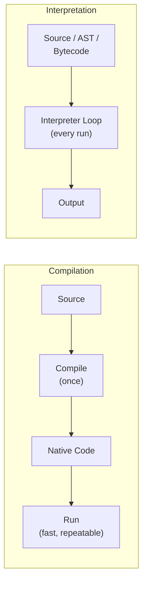
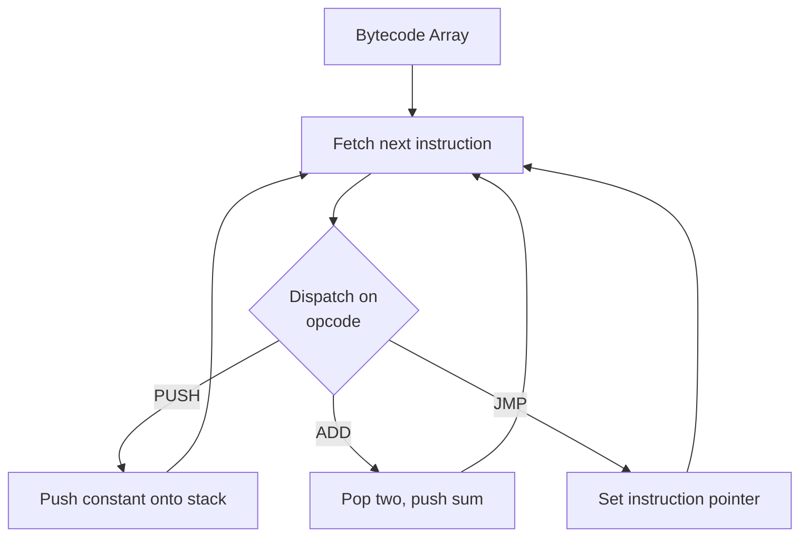
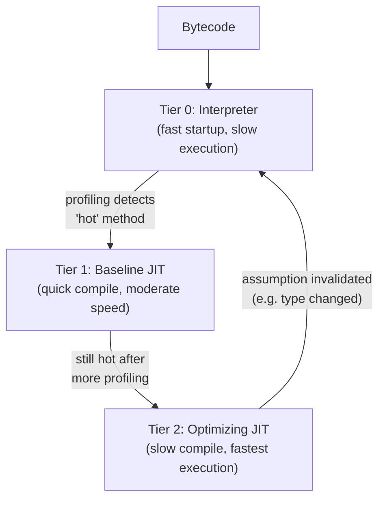

## Interpretation Versus Compilation Trade-offs

### Overview

Interpretation and compilation are the two fundamental strategies for executing programs written in a high-level language, distinguished by *when* and *how* source code is translated into a form the underlying machine can actually run. Compilation performs translation ahead of time, producing a standalone artifact (native machine code, or another lower-level form) that is later executed directly; interpretation performs translation and execution together, at runtime, typically re-examining source or near-source representations on every execution. In practice, most modern language implementations occupy points along a spectrum between these poles rather than sitting at either extreme, combining techniques to balance startup latency, steady-state throughput, portability, and implementation complexity.

### The Core Distinction

$$\text{Compilation: } \text{source} \xrightarrow{\text{translate (once, ahead of time)}} \text{target code} \xrightarrow{\text{execute (many times)}} \text{output}$$

$$\text{Interpretation: } \text{source} \xrightarrow{\text{translate + execute (interleaved, every run)}} \text{output}$$

The key structural difference is *reuse of translation work*: a compiled program pays translation cost once and reaps execution benefits on every subsequent run, while a naively interpreted program repeats at least some translation-equivalent work (dispatch, decoding) on every execution.

### Tree-Walking Interpretation

The simplest interpretation strategy: directly traverse the AST (or a similarly high-level representation) at runtime, evaluating each node according to its type — an `if` node evaluates its condition and recurses into the appropriate branch, a `+` node recursively evaluates its children and adds the results, and so on.

**Advantages**: minimal implementation complexity; no separate code-generation phase; naturally close to the language's denotational or operational semantics, making a tree-walking interpreter often the most direct and most easily-verified-correct implementation of a language specification.

**Disadvantages**: repeated tree traversal and dynamic type dispatch on every evaluation impose substantial per-operation overhead — evaluating `a + b` a million times inside a loop re-traverses the same AST nodes and re-dispatches on the same node types a million times, work a compiled version would have resolved once.

### Bytecode Interpretation

An intermediate strategy: compile the source (ahead of time, or lazily on first use) into a compact, linear **bytecode** representation — typically for a simple abstract stack machine or register machine — and then interpret that bytecode via a dispatch loop, rather than walking a tree.

**Why bytecode is faster than tree-walking**: bytecode is flat and pre-decoded relative to source syntax — the dispatch loop's per-instruction overhead (typically a switch/jump-table dispatch and a handful of stack operations) is smaller and more uniform than re-traversing and re-classifying tree nodes, and the bytecode itself is far more compact and cache-friendly than an AST's pointer-heavy node structure.

**Dispatch Techniques**: the efficiency of the central "fetch-dispatch-execute" loop matters enough to have its own well-studied variants — a simple `switch` statement (compiler-dependent jump-table generation), computed/direct **threaded code** (each bytecode's handler ends by jumping directly to the next handler's address, avoiding a return to a central loop), and inline caching (described below) for further specialization of common dispatch patterns.

### Just-In-Time (JIT) Compilation

JIT compilation compiles some or all of a program to native machine code **during** execution rather than entirely ahead of time, aiming to combine bytecode/interpretation's portability and fast startup with native compilation's steady-state speed.

**Basic JIT (Method-at-a-time)**: compiles each method/function to native code the first time it is called (or after a fixed number of calls), caching the result for subsequent calls — avoiding repeated interpretation overhead for hot code, at the cost of upfront compilation latency for every method, whether it turns out to be hot or not.

**Tiered / Adaptive JIT Compilation**: a more sophisticated strategy used by most modern high-performance JITs — start with a fast, low-optimization tier (interpretation or quick baseline compilation) for all code, use runtime **profiling** to identify "hot" code paths executed disproportionately often, and recompile only those hot paths with a slower, more aggressively optimizing compiler tier.

**Speculative Optimization and Deoptimization**: because a JIT compiles based on *observed* runtime behavior rather than statically guaranteed properties (e.g., "this call site has always seen integer arguments so far"), optimized code frequently embeds **guards** checking that the assumption still holds, with a **deoptimization** fallback path reverting to a less-optimized tier (or the interpreter) if a guard fails — allowing genuinely aggressive, speculative optimizations that would be unsound to apply unconditionally at compile time in a purely ahead-of-time setting.

**Inline Caching**: a specific, widely used JIT/interpreter optimization for dynamically-typed method dispatch — caching the result of a previous dispatch decision (e.g., "the last time this call site executed, the receiver was of type T and resolved to method M") directly at the call site, so that a repeat of the same type can skip the general dispatch lookup entirely, falling back to the general path only on a cache miss (a different type observed at that site).

[Inference] Specific JIT architectures (V8, HotSpot, RyuJIT, PyPy's tracing JIT, and others) differ substantially in tiering strategy, the granularity at which they compile (per-method vs. per-trace), and the specific profiling and deoptimization mechanisms used; general architectural claims here should be understood as illustrating common patterns across the field rather than describing any one specific runtime's current implementation precisely, which should be checked against that runtime's own documentation.

### Trace-Based JIT Compilation

A variant JIT architecture that compiles not whole methods but **hot execution traces** — actual observed linear sequences of executed instructions, potentially spanning multiple methods or loop iterations, following one specific control-flow path through the program. Because a trace represents one concrete path, the compiler can specialize aggressively for that exact path (eliminating branches never observed to be taken), inserting a guard at each point where the trace could have diverged and falling back to the interpreter (or trace recording for an alternate path) on divergence.

### Comparative Table

| Approach | Startup Latency | Steady-State Speed | Portability | Implementation Complexity |
| --- | --- | --- | --- | --- |
| Tree-walking interpretation | Lowest | Slowest | Highest (interprets source-level structure directly) | Lowest |
| Bytecode interpretation | Low | Moderate | High (bytecode is machine-independent) | Moderate |
| Ahead-of-time (AOT) compilation | Highest (full compile before any execution) | Fastest (no runtime translation cost) | Lowest (target-specific binary) | High |
| Basic (method-at-a-time) JIT | Moderate | Fast for long-running hot code | Moderate (bytecode portable; JIT output is not) | High |
| Tiered/adaptive JIT | Low (starts interpreting immediately) | Can approach AOT for genuinely hot code | Moderate | Highest |

### Why No Single Point Dominates

Each strategy's weaknesses are direct consequences of its design point, which is why the field has not converged on a single universal answer:

- **Pure AOT compilation** cannot exploit runtime-observed information (actual argument types, actual branch frequencies, actual polymorphic call-site behavior) that only becomes available once the program is actually running — a fundamentally different kind of information than what static analysis, however sophisticated, can derive from source code alone.
- **Pure interpretation** repeats translation-equivalent work on every execution, imposing overhead that scales with how many times code runs rather than being paid once — devastating for hot loops executed millions of times, comparatively harmless for code executed once (like most top-level module-initialization code).
- **JIT compilation** pays a startup-latency and memory-footprint cost (the JIT infrastructure itself, plus compiling hot code at runtime rather than ahead of time) in exchange for runtime adaptivity — a poor trade for short-lived processes (a script run once and exited) and a good trade for long-running processes (a server handling requests for hours).

### Practical Implications for Language Implementation Choices

[Inference] The choice among these strategies for a new language implementation is generally driven by the expected deployment profile: short-lived scripts and command-line tools tend to favor interpretation or lightweight bytecode execution (where JIT warm-up cost would dominate total runtime), long-running server or application workloads tend to favor JIT compilation (where warm-up cost amortizes over a long execution), and contexts demanding predictable, ahead-of-time-verifiable performance (some embedded or safety-critical systems) tend to favor pure AOT compilation; these are general tendencies reflecting common engineering tradeoffs rather than strict rules, and real systems frequently combine strategies (AOT-compiled "cold start" paths alongside JIT-compiled hot loops, for instance) rather than choosing one exclusively.

### Hybrid Approaches in Practice

Many widely used language runtimes combine multiple points on this spectrum simultaneously rather than choosing one exclusively:

- **AOT + interpreter fallback**: compile what can be statically resolved ahead of time, falling back to an interpreter for dynamically-loaded or reflectively-invoked code paths unknown at compile time.
- **Bytecode + tiered JIT** (the dominant pattern for mainstream managed runtimes): bytecode provides portability and fast startup, while a tiered JIT provides steady-state performance for code that runs long enough to justify the investment.
- **AOT compilation of a JIT-oriented language**: some ecosystems offer ahead-of-time compilation modes for languages more commonly JIT-compiled, trading runtime adaptivity for startup-latency improvements and reduced runtime memory footprint, particularly attractive for short-lived processes or memory-constrained deployment targets.

### Illustration: Total Execution Time vs. Program Run Length

Crossover point where compilation's upfront cost is repaid by execution speed (svg_diagram)

<svg xmlns="http://www.w3.org/2000/svg" viewBox="0 0 680 360">
<text x="340" y="26" text-anchor="middle" font-size="16" font-weight="bold" fill="#222">Crossover point where compilation's upfront cost is repaid by execution speed (svg_diagram)</text>
<line x1="70" y1="310" x2="620" y2="310" stroke="#333" stroke-width="1.5" />
<text x="345" y="335" text-anchor="middle" font-size="12" fill="#333">program run length / number of executions</text>
<line x1="70" y1="310" x2="70" y2="60" stroke="#333" stroke-width="1.5" />
<text x="45" y="185" text-anchor="middle" font-size="12" fill="#333" transform="rotate(-90 45 185)">total time</text>
<path d="M70,290 L620,80" stroke="#a44" stroke-width="2.5" fill="none" />
<text x="560" y="100" font-size="11" fill="#a44">Interpreted (no upfront cost, higher per-run cost)</text>
<path d="M70,240 L620,250" stroke="#446" stroke-width="2.5" fill="none" />
<text x="450" y="270" font-size="11" fill="#446">Compiled (upfront cost, low per-run cost)</text>
<line x1="300" y1="60" x2="300" y2="310" stroke="#888" stroke-dasharray="4,3" />
<text x="300" y="55" text-anchor="middle" font-size="11" fill="#555">crossover point</text>
</svg>

### Key Points

- Compilation translates ahead of time and reuses that work across many executions; interpretation interleaves translation and execution, repeating work each run.
- Tree-walking interpretation is simplest to implement and closest to a language's semantics but pays the highest per-operation overhead; bytecode interpretation trades some directness for a flatter, faster-to-dispatch representation.
- JIT compilation compiles at runtime, allowing genuinely runtime-adaptive optimization (informed by actual observed types and branch behavior) unavailable to purely ahead-of-time compilation, at the cost of startup latency and implementation complexity.
- Tiered/adaptive JIT architectures and speculative optimization with deoptimization guards are the dominant modern pattern for balancing fast startup against eventual near-native steady-state performance.
- No single strategy dominates across all deployment profiles: short-lived processes favor low-startup-cost strategies (interpretation, lightweight bytecode), long-running processes favor strategies that amortize upfront compilation cost (AOT or JIT) across many executions.
- Most production language runtimes are hybrids, combining bytecode, interpretation, and tiered JIT compilation (or AOT-plus-interpreter-fallback) rather than adopting any single strategy exclusively.

### Related Topics

- Code Generation
- Code Optimization Strategies
- The Compilation Process Overview
- Just-In-Time Compilation and Adaptive Optimization (Tiering, Deoptimization)
- Virtual Machine Design and Bytecode Formats
- Inline Caching and Dynamic Dispatch Optimization
- Trace-Based Compilation
- Denotational Semantics Revisited