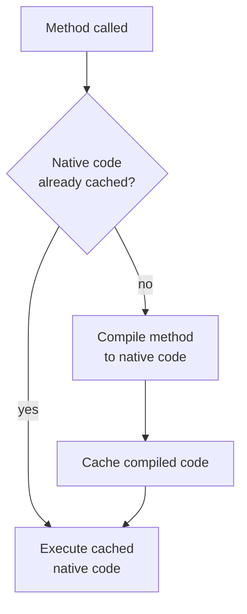
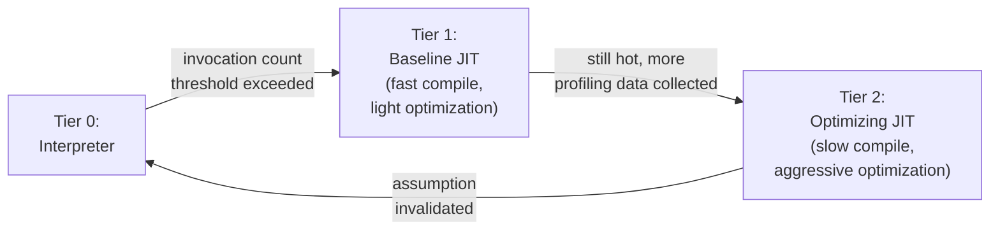
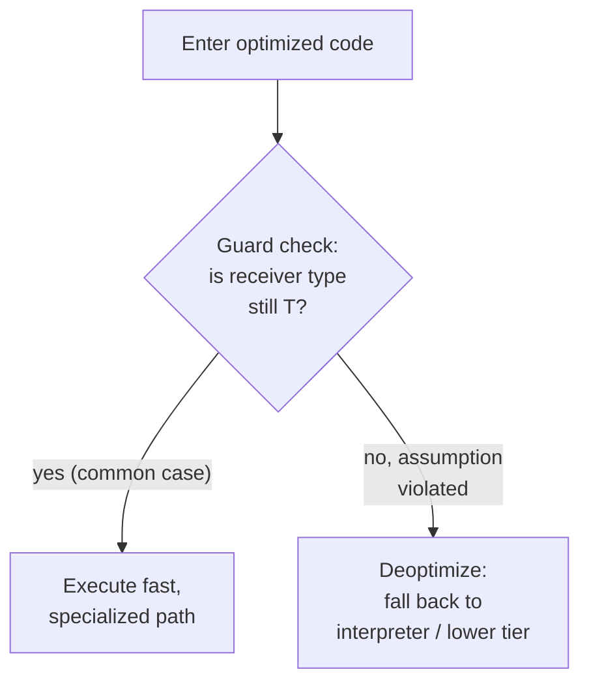

## Just-In-Time Compilation

### Overview

Just-in-time (JIT) compilation translates program code to native machine instructions during program execution, rather than entirely before it begins. This positions JIT compilation as a deliberate middle ground between pure ahead-of-time (AOT) compilation and pure interpretation: it retains an interpreter's or bytecode-loader's fast startup and portability while working to approach AOT compilation's steady-state execution speed, by exploiting information — actual observed argument types, actual branch frequencies, actual hot-path shapes — that is only available once the program is genuinely running.

### The Fundamental Motivation

A pure interpreter re-examines and re-dispatches on program structure every time a piece of code executes, so cost scales with execution count. A pure AOT compiler translates once, but only has access to whatever can be determined statically — it cannot know, for instance, that a particular polymorphic call site will overwhelmingly see arguments of one specific type in practice, or that one specific loop will run millions of iterations while another runs zero. JIT compilation resolves this by deferring the *compile* decision until runtime, when actual behavior is observable, and compiling only the code that has demonstrated it is worth the compilation investment.

$$\text{Interpretation cost} \approx N_{\text{executions}} \times \text{per-execution overhead}$$

$$\text{JIT cost} \approx \text{compilation cost (paid once, for hot code)} + N_{\text{executions}} \times \text{near-native per-execution cost}$$

JIT compilation is a good trade precisely when a piece of code executes often enough that the amortized savings from compiling it exceed the one-time compilation cost — which is why JIT architectures are built around *identifying* which code meets that bar rather than compiling everything uniformly.

### Basic (Method-at-a-Time) JIT Compilation

The simplest JIT design compiles each method or function to native code the first time it is invoked (or after a small fixed invocation count), caching the resulting native code for all subsequent calls.

**The weakness of this design**: it compiles indiscriminately — a method called exactly once still pays full compilation cost before that single execution, which can make total time *worse* than pure interpretation for code that is not actually hot. This weakness directly motivates tiered compilation.

### Tiered / Adaptive JIT Compilation

The dominant modern architecture avoids the basic JIT's indiscriminate-compilation problem by using multiple execution tiers of increasing optimization aggressiveness (and increasing compilation cost), promoting code between tiers based on runtime **profiling** evidence that it is actually hot.

- **Tier 0 (interpretation or a simple template interpreter)**: handles all code initially, at low per-execution speed but zero compilation latency — appropriate since most code in a typical program is never executed often enough to justify compiling it at all.
- **Tier 1 (baseline/quick JIT)**: a fast-to-run compiler applying minimal optimization, triggered once invocation counts cross a threshold, used both to speed up moderately-hot code directly and to collect richer type/branch profiling data to inform tier 2 decisions.
- **Tier 2 (optimizing JIT)**: a slower, far more aggressive compiler reserved for code proven genuinely hot by sustained profiling evidence, applying optimizations (inlining, loop transformations, type specialization) whose compilation cost would be wasteful to pay for cold code.

This tiering directly generalizes the general code-optimization principle that different optimizations have different cost/benefit ratios — a JIT applies that principle not just to which optimizations to run, but to which *code* is even worth optimizing at all.

### Profiling: The Information Source Driving Tiering

Profiling instrumentation collects the runtime evidence that drives promotion decisions and informs what an optimizing tier should specialize for:

- **Invocation counters**: how often a method or loop has executed — the most basic "hotness" signal.
- **Type feedback**: at polymorphic call sites or arithmetic operations, which concrete types have actually been observed — feeding directly into speculative type specialization.
- **Branch frequency**: which direction a conditional branch has actually taken historically — informing code layout and enabling optimizations that treat the common path as the default.

### Speculative Optimization and Guards

Because profiling data reflects *observed* behavior rather than a proven invariant, an optimizing JIT tier frequently compiles code that is only correct **under an assumption** grounded in that observed behavior — e.g., "this call site's receiver has always been type `T`" is not a guarantee, merely a strong empirical pattern. To remain sound, the compiled code embeds a **guard**: a cheap runtime check confirming the assumption still holds before executing the speculatively optimized path.

**Deoptimization** is the mechanism handling guard failure: execution abandons the optimized native code mid-flight and transfers control back to a less-optimized tier (often the interpreter), reconstructing whatever interpreter-level state (variable values, stack layout) is needed to resume correctly — a nontrivial bookkeeping problem since the optimized code's internal representation (which values live in which registers, whether some values were eliminated entirely by optimization) can differ substantially from the interpreter's expected state. This guard-plus-deoptimization pattern is precisely what makes genuinely aggressive, type-specialized, assumption-laden optimization *sound* in a dynamically-typed or otherwise runtime-uncertain setting — the compiler can optimize as if a fact were guaranteed, because any violation is caught and safely unwound rather than silently producing incorrect results.

### Inline Caching

A specific, widely used optimization for dynamic dispatch (virtual method calls, dynamically-typed property/attribute access) that caches dispatch resolution directly at the call site:

- **Monomorphic inline cache**: caches "the last time this call site executed, the receiver was type $T$ and dispatch resolved to method $M$" — subsequent calls with the same type skip the general lookup entirely via a cheap guard-and-jump, falling back to full resolution (and cache update) only on a type mismatch.
- **Polymorphic inline cache**: extends this to cache a small number of observed (type, resolution) pairs when a call site sees more than one type in practice, checking each cached entry before falling back to the general path.
- **Megamorphic fallback**: when a call site has seen too many distinct types to usefully cache, the JIT gives up on per-site caching and reverts to a general (often hash-table-based) dispatch mechanism for that site.

Inline caching is a JIT-adjacent (and sometimes interpreter-level) technique in its own right, but it interacts closely with tiered JIT compilation because the *type feedback recorded by inline caches* is frequently the very data an optimizing tier consults to decide what to speculatively specialize.

### Trace-Based JIT Compilation

An alternative architecture to method-at-a-time compilation: rather than compiling whole methods, a trace-based JIT compiles **hot execution traces** — concrete, linear sequences of instructions actually observed to execute repeatedly, potentially spanning multiple methods and loop iterations along one specific control-flow path.

Because a trace represents one concrete observed path rather than a method's full set of possible paths, the compiler can specialize very aggressively for exactly that path — eliminating branches that were never observed to diverge along the recorded trace — while inserting a guard at every point where the trace *could* have diverged, falling back to the interpreter (or triggering recording of a new trace for the alternate path) on divergence.

[Inference] Trace-based JIT compilation has seen significant use in some notable systems (early TraceMonkey in Firefox's JavaScript engine, and PyPy's tracing JIT for Python being commonly cited examples) but is not the dominant architecture across all major JIT-compiled language runtimes today, many of which use method-based tiered compilation instead; the relative prevalence and current status of trace-based versus method-based architectures across specific contemporary runtimes should be verified against current sources for any runtime of particular interest, since this landscape has shifted over time.

### On-Stack Replacement (OSR)

A technique addressing a specific edge case: a long-running loop inside a method that has not yet been promoted to a higher compilation tier (or was already executing in the interpreter) when it becomes hot **mid-execution**. Rather than waiting for the *next call* to that method to benefit from compiled code, **on-stack replacement** allows execution to transfer into optimized compiled code *in the middle of* an already-executing loop, by reconstructing the compiled code's expected execution state from the interpreter's current state at the transfer point — letting a single very long-running loop iteration benefit from JIT compilation without needing to exit and re-enter the enclosing method.

### JIT Compilation's Costs

JIT compilation is not free, and understanding its costs is essential to understanding why it is not universally the best choice:

- **Compilation latency**: time spent compiling is time not spent running the program's actual logic — a real cost, front-loaded onto whichever execution triggers it.
- **Memory footprint**: the JIT compiler infrastructure itself, plus generated native code for potentially many methods, plus profiling metadata, all consume memory beyond what a pure interpreter or pure AOT binary would need.
- **Warm-up time**: a JIT-compiled program's performance typically improves over its first seconds-to-minutes of execution as profiling accumulates and hot code is progressively promoted — a real, measurable characteristic that disadvantages JIT compilation for short-lived processes where the program exits before this warm-up completes.
- **Non-determinism in timing**: because compilation and promotion decisions depend on runtime profiling, the exact moment (and sometimes even whether) a given piece of code gets optimized can vary between runs, complicating some kinds of precise performance analysis or hard real-time guarantees.

### JIT vs. Other Execution Strategies: Comparative Summary

| Aspect | Pure Interpretation | Pure AOT Compilation | JIT Compilation |
| --- | --- | --- | --- |
| Startup latency | Lowest | Highest | Low (starts interpreting/running immediately) |
| Steady-state speed | Slowest | Fastest (fixed) | Can approach AOT for genuinely hot code |
| Exploits runtime info | No | No | Yes (types, branch frequency, hot paths) |
| Memory footprint | Low | Low (no runtime compiler needed) | Higher (compiler infra + generated code + profiling data) |
| Best suited for | Short scripts, rarely-hot code | Predictable, latency-critical, or resource-constrained deployment | Long-running processes with a genuine hot/cold code split |

### Illustration: Performance Over Time for a JIT-Compiled Program

Typical performance curve as a JIT warms up and promotes hot code (svg_diagram)

<svg xmlns="http://www.w3.org/2000/svg" viewBox="0 0 680 340">
<text x="340" y="26" text-anchor="middle" font-size="16" font-weight="bold" fill="#222">Typical performance curve as a JIT warms up and promotes hot code (svg_diagram)</text>
<line x1="70" y1="290" x2="620" y2="290" stroke="#333" stroke-width="1.5" />
<text x="345" y="315" text-anchor="middle" font-size="12" fill="#333">elapsed execution time</text>
<line x1="70" y1="290" x2="70" y2="60" stroke="#333" stroke-width="1.5" />
<text x="45" y="175" text-anchor="middle" font-size="12" fill="#333" transform="rotate(-90 45 175)">throughput</text>
<path d="M70,270 Q150,265 220,230 T350,140 T500,95 T620,88" stroke="#446" stroke-width="2.5" fill="none" />
<line x1="220" y1="60" x2="220" y2="290" stroke="#888" stroke-dasharray="3,3" />
<text x="220" y="55" text-anchor="middle" font-size="10" fill="#555">Tier 0→1</text>
<line x1="420" y1="60" x2="420" y2="290" stroke="#888" stroke-dasharray="3,3" />
<text x="420" y="55" text-anchor="middle" font-size="10" fill="#555">Tier 1→2</text>

<text x="620" y="70" text-anchor="middle" font-size="10" fill="#555">near-peak</text>

</svg>

### Key Points

- JIT compilation defers translation to runtime specifically to exploit information — observed types, branch frequencies, hot-path identity — unavailable to ahead-of-time compilation, while retaining an interpreter-like fast startup.
- Basic method-at-a-time JIT compiles indiscriminately and can underperform pure interpretation for rarely-called code; tiered/adaptive JIT compilation fixes this by promoting only code proven hot by profiling.
- Speculative optimization compiles code valid under an observed-but-unproven assumption, protected by cheap runtime guards; deoptimization safely falls back to a lower tier when a guard fails, making aggressive speculation sound.
- Inline caching specializes dynamic dispatch at call sites based on observed types, feeding profiling data that optimizing tiers frequently consult directly.
- Trace-based JIT compilation offers an alternative to method-based tiering, compiling concrete hot execution paths rather than whole methods, with on-stack replacement addressing the related problem of promoting a hot loop mid-execution.
- JIT compilation's costs — compilation latency, memory footprint, warm-up time, and timing non-determinism — are why it is not universally preferable to pure interpretation or pure AOT compilation, and why real systems choose among these strategies based on expected workload duration and hot/cold code structure.

### Related Topics

- Interpretation Versus Compilation Trade-offs
- Code Optimization Strategies
- Code Generation
- Inline Caching and Dynamic Dispatch Optimization
- Trace-Based Compilation and Tracing JITs
- Virtual Machine Design and Bytecode Formats
- Deoptimization and On-Stack Replacement Mechanics
- Register Allocation via Graph Coloring