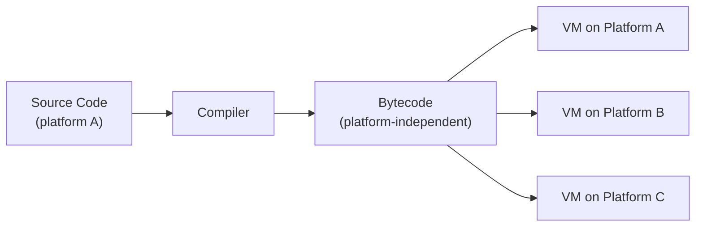
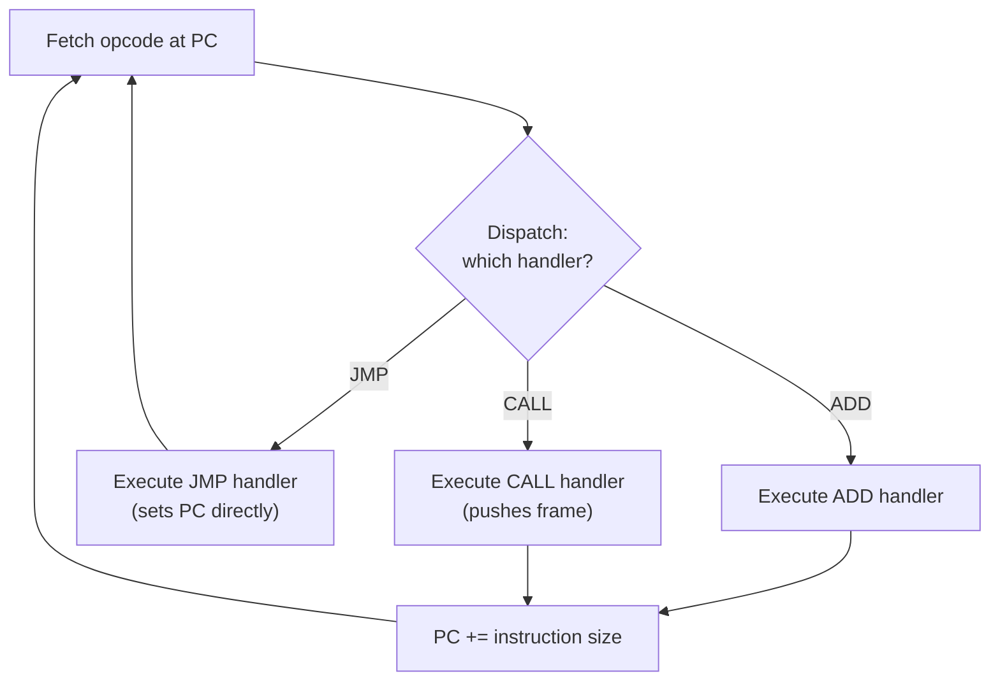

## Virtual Machines and Bytecode

### Overview

A virtual machine (VM), in the programming-languages sense, is a software-implemented execution environment that runs programs expressed in **bytecode** — a compact, machine-independent instruction format positioned between high-level source code and real hardware instructions. Bytecode-based VMs let a language be compiled once to a portable intermediate form and then executed anywhere a VM implementation exists, decoupling the language's compilation target from any specific physical processor. This design underlies most mainstream managed-language runtimes and is a distinct but closely related concern to JIT compilation, interpretation strategy, and intermediate representation design.

### Why Bytecode, Specifically

Bytecode occupies a deliberate middle point between two less satisfactory alternatives:

- **Distributing source code directly** requires a full compiler (or interpreter) on every deployment target, executes more slowly than any compiled form (parsing and semantic analysis must repeat, or a heavier tree-walking interpretation is needed), and exposes source freely.
- **Distributing native machine code directly** ties the artifact to one specific instruction set architecture and operating system ABI, sacrificing the portability that motivated using a high-level language in the first place.

Bytecode is compiled once (paying parsing, semantic analysis, and some optimization cost up front) into a compact, flat, already-decoded instruction stream that a comparatively simple, highly portable VM can execute — cheaper per-instruction than tree-walking, and portable in a way native code is not, since only the VM itself (not the bytecode) needs to be reimplemented per platform.



### Stack-Based vs. Register-Based Virtual Machines

The two dominant bytecode architectures differ in where operands live between instructions.

**Stack-Based VMs**: instructions implicitly operate on an **operand stack** — values are pushed onto the stack by earlier instructions and popped by later ones, with no explicit operand naming in most instructions.



```
PUSH a
PUSH b
ADD          ; pops b, a; pushes a+b
PUSH c
MUL          ; pops c, (a+b); pushes (a+b)*c
```

**Register-Based VMs**: instructions explicitly name a small number of virtual registers (not physical hardware registers, but VM-level slots — sometimes hundreds or thousands available, indexed like an array) as operands.



```
ADD  r3, r1, r2      ; r3 = r1 + r2
MUL  r4, r3, r5      ; r4 = r3 * r5
```

| Aspect | Stack-Based | Register-Based |
| --- | --- | --- |
| Instruction operands | Implicit (top of stack) | Explicit (named registers) |
| Bytecode size | Smaller (no operand encoding needed) | Larger (operands encoded per instruction) |
| Instructions per operation | More (separate push/pop steps) | Fewer (operands referenced directly) |
| Simplicity of code generation | Simpler (direct AST-to-stack-ops translation) | Somewhat more involved (register/slot assignment needed) |
| Dispatch overhead per unit of work | Higher (more instructions to dispatch for equivalent work) | Lower (fewer, denser instructions) |
| Well-known examples | JVM bytecode, CPython bytecode (historically stack-oriented), WebAssembly | Lua's VM, Dalvik (Android, pre-ART) |

[Inference] The performance comparison between stack-based and register-based bytecode designs generally favors register-based VMs for reducing total instruction/dispatch count at the cost of larger bytecode and a somewhat more complex code generator, but the actual magnitude of any performance difference depends heavily on the specific workload, VM implementation quality, and dispatch technique used, so this should be treated as a general architectural tendency rather than a precise, universally quantified advantage.

### Instruction Set Design for Bytecode

A bytecode instruction set typically balances several competing goals: a **small, orthogonal opcode set** (easing both interpreter implementation and code-generator implementation), **compactness** (smaller bytecode loads faster and fits better in instruction cache), and **ease of verification** (particularly important for VMs designed to run untrusted or type-unsafe-by-construction code, where the VM itself must confirm safety properties before execution).

Typical bytecode instruction categories include:

- **Stack/register manipulation**: push constant, load/store local variable, duplicate/pop.
- **Arithmetic and logical operations**: add, subtract, compare, boolean operators.
- **Control flow**: unconditional and conditional jumps, typically to bytecode-offset targets.
- **Object/method operations** (in object-oriented VMs): field access, virtual/dynamic method invocation, object allocation.
- **Type-specific variants**: many bytecode formats duplicate arithmetic instructions per primitive type (integer-add vs. float-add) rather than using a single generic instruction, trading instruction-set size for avoiding a runtime type-dispatch cost on every operation.

### The Bytecode Interpretation Loop

At the core of any non-JIT-compiling VM sits a **fetch-dispatch-execute loop**: repeatedly read the next opcode, determine which handler implements it, execute that handler's effect on the VM's state (stack/registers, program counter, heap), and advance to the next instruction (or jump, for control-flow instructions).



**Dispatch mechanisms**, in roughly increasing order of typical efficiency:

- **Switch-based dispatch**: a single large `switch`/`case` statement on the opcode, compiled by the host compiler into a jump table — simple to implement, but every instruction pays the cost of returning to the loop head and re-dispatching.
- **Direct/computed threaded dispatch**: each instruction handler, instead of returning control to a central loop, jumps directly to the next instruction's handler address (computed from the next opcode) — reducing per-instruction overhead by eliminating the round-trip through a central dispatch point, at the cost of requiring compiler support for computed jumps (a nonstandard but widely supported extension in some systems languages) or equivalent generated-code techniques.
- **Inline caching integration**: for object-oriented bytecode with dynamic dispatch instructions, embedding a monomorphic or polymorphic inline cache directly at the dispatch site (as introduced under JIT compilation) speeds up the common repeated-same-type case even within a purely interpreting VM, before any JIT tier is involved.

### The Activation Record / Call Frame in a VM

Method or function invocation within a bytecode VM requires a runtime data structure analogous to a native call stack's activation record: a **frame** holding local variables, the operand stack (for stack-based VMs) or a register window (for register-based VMs), a saved return address (the calling frame's program counter), and, in object-oriented VMs, a reference to the receiver object. VM implementations typically maintain an explicit **call stack of frames**, mirroring — but implemented entirely in software, independent of the host machine's native call stack — the activation-record discipline native code generation must also implement, described under code generation's calling-convention discussion.

### Verification and Safety

A distinguishing concern for many bytecode VMs — particularly those designed to execute code from untrusted or only partially trusted sources — is **bytecode verification**: a static analysis pass, run before execution begins, confirming that the bytecode obeys the VM's safety invariants (stack never underflows or has inconsistent height across control-flow merges, jump targets are valid instruction boundaries, type usage is consistent with each instruction's declared operand types) without needing to trust the compiler that produced the bytecode.

[Inference] The precise formal guarantees a given bytecode verifier provides, and how those guarantees compose with the VM's broader security model (sandboxing, capability restrictions, and similar), differ substantially by VM design and have been the subject of extensive academic and industrial security research; the exact verification algorithm and guarantee scope for any specific VM should be checked against that VM's own specification rather than assumed to generalize.

### Garbage Collection as a VM Responsibility

Most managed-code VMs bundle **automatic memory management** (garbage collection) as a core VM service, freeing the bytecode format itself from needing to encode explicit deallocation instructions, and freeing the language's compiler from needing to prove memory-safety properties the VM's runtime instead enforces dynamically. This is a design choice distinguishing managed VMs from lower-level VM-like systems (WebAssembly's core specification, for instance, does not itself mandate a garbage collector, leaving memory management to the compiled-to-Wasm language's own runtime).

### Bytecode Portability vs. Native Performance: The Recurring Tension

Bytecode's central value proposition — write once, run anywhere a compatible VM exists — is directly in tension with the fact that a VM interpreting (or even JIT-compiling) bytecode introduces overhead and complexity absent from a natively-compiled binary for one specific platform. This tension is exactly what motivates JIT compilation as bytecode's natural performance-recovery companion: bytecode provides the portable distribution format, and JIT compilation (performed by the VM, once per deployment target, at the user's actual runtime) recovers near-native performance for that specific target without sacrificing the source distribution's portability — the two techniques are complementary rather than competing, and this is precisely why most mainstream bytecode-based runtimes pair a bytecode format with a JIT compiler rather than relying on pure interpretation indefinitely.

### Comparative Table: Notable Bytecode/VM Designs

| VM / Bytecode Format | Stack or Register | Primary Language(s) | Notable Design Trait |
| --- | --- | --- | --- |
| JVM bytecode | Stack-based | Java, Kotlin, Scala, and other JVM languages | Strong bytecode verification; long-established tiered JIT (HotSpot) |
| CPython bytecode | Stack-based (with register-like local slots) | Python | Bytecode is an internal implementation detail rather than a stable portable format across versions |
| Lua VM | Register-based | Lua | Compact register-based design cited as an influence on later register-VM designs |
| WebAssembly (Wasm) | Stack-based | Compilation target for many languages (C/C++, Rust, and others) | Designed for near-native performance and strong sandboxing; no built-in GC in the core spec |
| .NET CIL (Common Intermediate Language) | Stack-based | C#, F#, and other .NET languages | Designed explicitly for multi-language interoperability on a shared runtime |

[Inference] Specific version-to-version differences in these bytecode formats (opcode additions, verification rule changes, and similar) are common as these platforms evolve; details beyond the general architectural characterization given here should be confirmed against each platform's current specification.

### Illustration: Stack-Based vs. Register-Based Execution of the Same Expression

Executing (a + b) * c on a stack machine versus a register machine (svg_diagram)

<svg xmlns="http://www.w3.org/2000/svg" viewBox="0 0 740 360">
<text x="370" y="26" text-anchor="middle" font-size="16" font-weight="bold" fill="#222">Executing (a + b) * c on a stack machine versus a register machine (svg_diagram)</text>

<text x="180" y="55" text-anchor="middle" font-size="13" font-weight="bold" fill="#446">Stack-Based (4 instructions)</text>

<rect x="40" y="70" width="280" height="140" rx="6" fill="#eef" stroke="#446" />

<text x="60" y="95" font-size="12" font-family="monospace">PUSH a</text>

<text x="60" y="118" font-size="12" font-family="monospace">PUSH b</text>

<text x="60" y="141" font-size="12" font-family="monospace">ADD ; stack: [a+b]</text>

<text x="60" y="164" font-size="12" font-family="monospace">PUSH c</text>

<text x="60" y="187" font-size="12" font-family="monospace">MUL ; stack: [(a+b)*c]</text>

<text x="560" y="55" text-anchor="middle" font-size="13" font-weight="bold" fill="#a46">Register-Based (2 instructions)</text>

<rect x="420" y="70" width="300" height="140" rx="6" fill="#fed" stroke="#a46" />

<text x="440" y="105" font-size="12" font-family="monospace">ADD r1, ra, rb ; r1 = a+b</text>

<text x="440" y="140" font-size="12" font-family="monospace">MUL r2, r1, rc ; r2 = (a+b)*c</text>

<text x="370" y="260" text-anchor="middle" font-size="12" fill="#555">Stack form: more instructions, smaller each, no operand encoding</text>

<text x="370" y="280" text-anchor="middle" font-size="12" fill="#555">Register form: fewer instructions, each larger (operands named explicitly)</text>

</svg>

### Key Points

- Bytecode is a compact, machine-independent instruction format that lets a language be compiled once and executed portably across any platform with a compatible VM, avoiding both the overhead of interpreting source directly and the portability loss of distributing native code.
- Stack-based VMs implicitly operate on an operand stack with smaller, simpler instructions; register-based VMs explicitly name virtual registers, generally needing fewer, denser instructions per unit of work.
- The fetch-dispatch-execute loop is the core of bytecode interpretation, with switch-based, threaded, and inline-caching-augmented dispatch representing increasingly optimized variants.
- Bytecode verification lets a VM safely execute untrusted code by statically confirming safety invariants before execution, independent of trusting the originating compiler.
- Garbage collection is typically bundled as a core VM service in managed runtimes, though lower-level VM targets like WebAssembly's core specification deliberately leave memory management to the compiled language's own runtime.
- Bytecode and JIT compilation are complementary rather than competing techniques: bytecode supplies the portable distribution format, and JIT compilation recovers near-native performance for the specific deployment target at runtime.

### Related Topics

- Just-In-Time Compilation
- Interpretation Versus Compilation Trade-offs
- Intermediate Code Generation
- Code Generation
- Bytecode Verification and VM Security Models
- Garbage Collection Algorithms and Memory Management
- WebAssembly Design and the Wasm Execution Model
- Calling Conventions and Activation Records