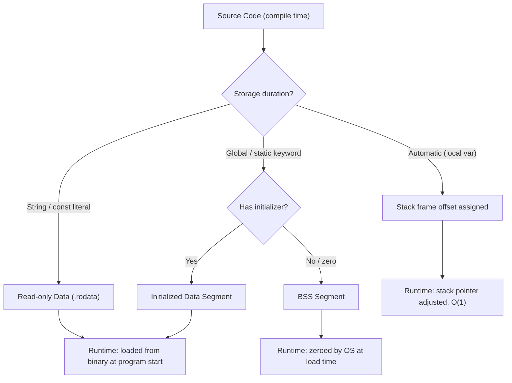

## Static Memory Management

### Definition and Core Concept

Static memory management refers to memory allocation decisions made at compile time rather than at runtime. The compiler determines the exact size, location, and lifetime of variables before the program ever executes, embedding these decisions directly into the compiled binary. This contrasts with dynamic memory management, where allocation and deallocation happen while the program is running, often via explicit calls (`malloc`/`free`) or automated garbage collection.

The term "static" here refers to the timing of the allocation decision, not necessarily the `static` keyword found in languages like C or Java (though the keyword is one common mechanism for producing statically allocated memory). Static memory management encompasses a broader category that includes global variables, statically declared local variables, string literals, and stack-based local variables, all of which have sizes and lifetimes knowable at compile time.

### Key Points

- All static memory decisions are resolved during compilation; no runtime allocator call is involved.
- The total size of statically allocated memory becomes fixed once the program is compiled, so it cannot grow or shrink while the program runs.
- Static memory typically maps to two regions of a program's memory layout: the **stack** (for local variables with automatic storage duration) and the **static/data segment** (for globals, static locals, and constants).
- Because the compiler knows sizes and lifetimes ahead of time, it can perform aggressive optimizations, including register allocation, inlining, and dead-store elimination.
- Static memory management eliminates an entire class of runtime bugs (use-after-free, double-free, memory leaks from unreleased heap blocks) because there is no heap involvement for statically allocated objects.

### Memory Regions Involved

**The Data Segment**

Global variables and variables declared with the `static` keyword (in C-family languages) live in the data segment, further split into two parts:

- **Initialized data segment**: Holds globals and statics that have an explicit initial value (e.g., `static int counter = 0;`). This region is stored in the binary itself.
- **BSS (Block Started by Symbol)**: Holds globals and statics that are zero-initialized or uninitialized by default (e.g., `static int counter;`). The binary only stores the size of this region, not actual zero bytes, which keeps executable file size smaller; the OS zeroes this memory at load time.

**The Stack**

Local variables with automatic storage duration are typically allocated on the stack. Each function call pushes a new **stack frame** containing its local variables, parameters, and return address. When the function returns, the entire frame is popped, and all its memory is reclaimed instantly — no per-variable deallocation logic is needed. Stack allocation and deallocation are $O(1)$ operations, just pointer arithmetic on the stack pointer.

**Read-Only Data / Text Segment**

String literals and other compile-time constants often live in a read-only portion of the data segment (sometimes called `.rodata`). Attempting to modify a string literal in C, for example, produces undefined behavior because that memory may be marked non-writable by the OS.

### How the Compiler Determines Layout

For a stack-allocated local variable, the compiler:

1. Computes the total size needed for all local variables in a function (their types and counts must be known at compile time).
2. Assigns each variable a fixed offset relative to the stack frame's base pointer (or frame pointer).
3. Emits a single instruction at function entry to adjust the stack pointer by the total frame size (e.g., `sub rsp, N` in x86-64 assembly), rather than allocating each variable individually.
4. Emits a corresponding instruction at function exit to restore the stack pointer.

For global and static variables, the compiler assigns each one a fixed address (or a fixed offset within the data/BSS segment), which the linker resolves into an actual memory address when the executable is built.



### Language Examples

**C**

```c
#include <stdio.h>

int global_counter;              // BSS: zero-initialized, static duration
int initialized_global = 42;     // Initialized data segment

void increment(void) {
    static int call_count = 0;   // Static local: retains value across calls, in data segment
    int local_temp = 10;         // Stack: automatic duration, destroyed on return
    call_count++;
    global_counter += local_temp;
    printf("call_count=%d\n", call_count);
}

int main(void) {
    increment();  // prints call_count=1
    increment();  // prints call_count=2
    return 0;
}
```

`local_temp` is created and destroyed with each call to `increment`. `call_count`, despite being declared inside the function, persists across calls because it has static storage duration — the compiler places it in the data segment, not the stack.

**Rust**

Rust's `static` items are conceptually similar to C's global statics but with stricter compile-time guarantees:

```rust
static GREETING: &str = "hello"; // Lives for the entire program ('static lifetime)

fn compute() -> i32 {
    let x = 5;   // Stack-allocated
    let y = 10;  // Stack-allocated
    x + y
}
```

Rust's borrow checker uses the concept of a `'static` lifetime to describe data that is valid for the entire duration of the program, which typically applies to data stored in the binary's static memory (string literals, `static` items). This is a compile-time-enforced guarantee, reinforcing that static memory management is deeply tied to a language's type and lifetime system, not just its runtime behavior.

**Ada**

Ada is notable for offering a **Pragma/annotation-driven static memory model** intended for safety-critical and embedded systems (e.g., avionics, per the Ravenscar profile). Developers can restrict a program to avoid heap allocation entirely, relying only on statically and stack-allocated objects, which makes worst-case memory usage fully analyzable before deployment. [Unverified: exact pragma names and enforcement mechanisms vary by Ada compiler and profile version, so specifics should be checked against the compiler's documentation.]

### Static vs. Dynamic Memory: Comparison

| Aspect | Static Memory Management | Dynamic Memory Management |
| --- | --- | --- |
| Allocation timing | Compile time | Runtime |
| Size flexibility | Fixed at compile time | Can grow/shrink at runtime |
| Speed | Very fast ($O(1)$ stack ops, no allocator call) | Slower (allocator search, bookkeeping) |
| Fragmentation risk | None | Possible (heap fragmentation) |
| Common bugs | Stack overflow (if sizes too large or recursion too deep) | Use-after-free, double-free, memory leaks |
| Typical region | Stack, data segment, BSS, .rodata | Heap |
| Predictability | Fully predictable memory footprint | Depends on runtime program behavior |

### Advantages

- **Performance**: No allocator overhead; allocation is a single pointer adjustment.
- **Predictability**: Total memory usage can often be computed before the program runs, which is critical for embedded and real-time systems with hard memory constraints.
- **Safety**: Eliminates heap-related bugs (leaks, dangling pointers from `free`) for the portion of memory that is statically managed.
- **Cache locality**: Stack memory, being contiguous and reused, tends to have favorable cache behavior compared to scattered heap allocations.

### Limitations

- **Inflexibility**: The size of any statically managed structure (e.g., an array) must be known at compile time; this rules out data structures that grow based on user input or runtime conditions unless a fixed upper bound is set in advance.
- **Stack size limits**: Because the stack has a fixed maximum size (often set by the OS or a linker flag), deeply recursive functions or large local arrays can cause a **stack overflow**.
- **Binary size**: Large statically initialized data structures increase the size of the compiled executable, since the initialized data segment is stored directly in the binary file.
- **No cross-invocation dynamic sharing**: Static memory is fixed per-process; it cannot be dynamically resized or shared in the flexible ways heap-allocated, reference-counted, or garbage-collected memory can be.

### Illustration: Process Memory Layout

<svg xmlns="http://www.w3.org/2000/svg" viewBox="0 0 640 420" font-family="sans-serif">
<text x="320" y="24" text-anchor="middle" font-size="16" font-weight="bold" fill="#1a1a1a">Process Memory Layout (svg_diagram)</text>
<rect x="120" y="40" width="400" height="50" fill="#f2d7d5" stroke="#943126" stroke-width="1.5" />
<text x="320" y="70" text-anchor="middle" font-size="13" fill="#1a1a1a">Stack (grows downward) — automatic/local variables</text>
<rect x="120" y="100" width="400" height="40" fill="#eaeded" stroke="#5d6d7e" stroke-width="1" />
<text x="320" y="125" text-anchor="middle" font-size="12" fill="#1a1a1a">Unused / free space</text>
<rect x="120" y="150" width="400" height="50" fill="#d4efdf" stroke="#1e8449" stroke-width="1.5" />
<text x="320" y="180" text-anchor="middle" font-size="13" fill="#1a1a1a">Heap (grows upward) — dynamic allocation</text>
<rect x="120" y="210" width="400" height="45" fill="#d6eaf8" stroke="#21618c" stroke-width="1.5" />
<text x="320" y="237" text-anchor="middle" font-size="13" fill="#1a1a1a">BSS Segment — uninitialized statics/globals</text>
<rect x="120" y="265" width="400" height="45" fill="#d6eaf8" stroke="#21618c" stroke-width="1.5" />
<text x="320" y="292" text-anchor="middle" font-size="13" fill="#1a1a1a">Initialized Data Segment — initialized statics/globals</text>
<rect x="120" y="320" width="400" height="45" fill="#fdebd0" stroke="#af601a" stroke-width="1.5" />
<text x="320" y="347" text-anchor="middle" font-size="13" fill="#1a1a1a">Read-Only Data (.rodata) — string literals, constants</text>
<rect x="120" y="375" width="400" height="30" fill="#e8daef" stroke="#6c3483" stroke-width="1.5" />
<text x="320" y="395" text-anchor="middle" font-size="12" fill="#1a1a1a">Text/Code Segment — compiled instructions</text>
<line x1="70" y1="40" x2="70" y2="90" stroke="#1a1a1a" stroke-width="1" />
<text x="40" y="70" text-anchor="middle" font-size="10" fill="#1a1a1a" transform="rotate(-90 40 70)">High addr</text>
<line x1="70" y1="375" x2="70" y2="405" stroke="#1a1a1a" stroke-width="1" />
<text x="40" y="395" text-anchor="middle" font-size="10" fill="#1a1a1a" transform="rotate(-90 40 395)">Low addr</text>

<text x="320" y="418" text-anchor="middle" font-size="11" fill="`#555555`">Static memory = Stack + BSS + Initialized Data + .rodata (Heap is dynamic, shown for contrast)</text>

</svg>

### Real-Time and Embedded Systems Relevance

Static memory management is the dominant model in safety-critical and hard real-time domains (avionics, automotive controllers, spacecraft software) precisely because it makes **worst-case memory usage** analyzable before deployment. Coding standards such as MISRA C and guidelines used in DO-178C-certified avionics software commonly restrict or prohibit dynamic heap allocation (`malloc`, `new`) after initialization, favoring statically sized buffers and stack-based data instead. [Unverified: specific rule numbers and their exact wording differ across MISRA C revisions and should be checked against the current standard text.] This trade-off sacrifices flexibility for determinism — a program that only uses static memory cannot run out of heap space or suffer heap fragmentation, but it also cannot dynamically size a buffer to fit runtime-varying input.

### Related Topics

- Dynamic memory management (heap allocation, `malloc`/`free`, `new`/`delete`)
- Stack frames and calling conventions
- Garbage collection strategies (mark-and-sweep, generational, reference counting)
- Stack overflow causes and prevention
- Memory safety in Rust (ownership, borrowing, lifetimes)
- Embedded systems memory constraints and MISRA C guidelines
- Linker scripts and memory segment configuration
- Memory-mapped I/O vs. general-purpose memory regions