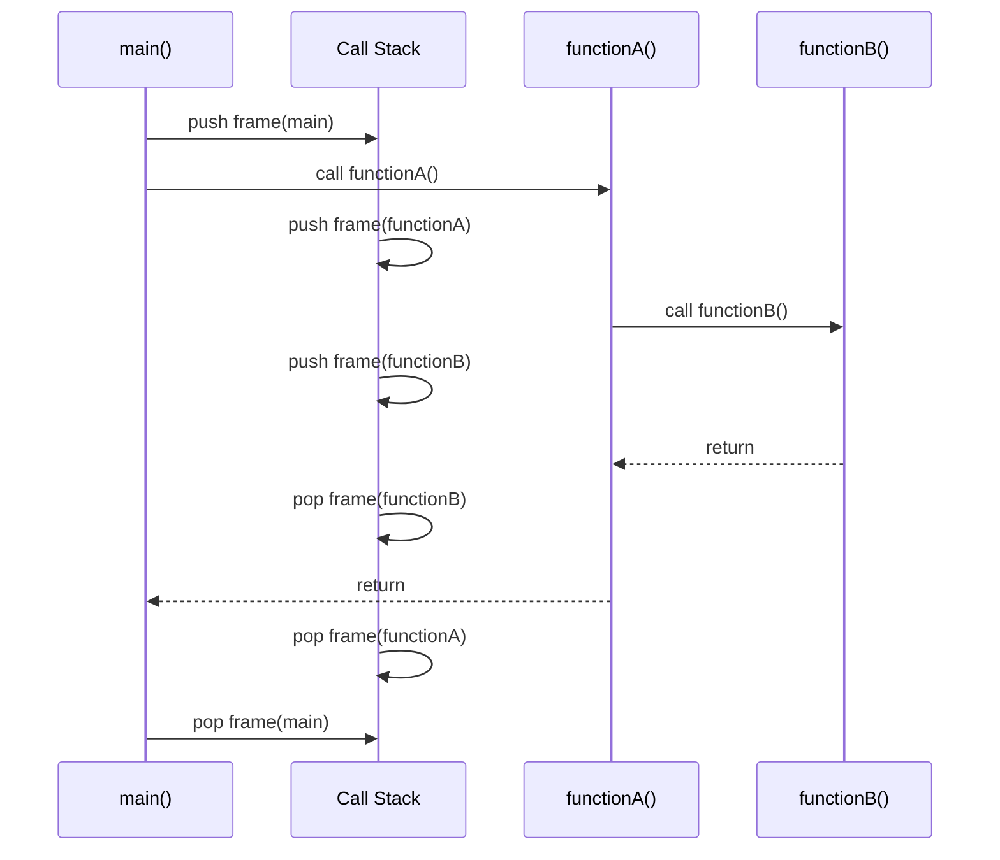
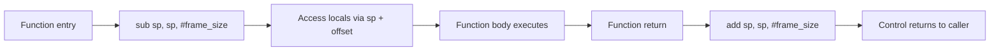

## Stack-Based Memory Management

### Definition and Core Concept

Stack-based memory management is the technique of allocating and deallocating memory in a strict **last-in, first-out (LIFO)** order, using a contiguous region of memory called the call stack. Every time a function is invoked, a block of memory called a **stack frame** (or activation record) is pushed onto the stack to hold that function's parameters, local variables, and bookkeeping information (such as the return address). When the function returns, its entire frame is popped off in one step, instantly reclaiming all the memory it used.

This LIFO discipline is what distinguishes stack allocation from heap allocation: the order of deallocation is always the exact reverse of the order of allocation, because function calls and returns naturally nest. A function called later always returns before the function that called it, which guarantees the stack's structure stays consistent without needing any tracking metadata per object.

### Key Points

- Stack allocation and deallocation are both $O(1)$ operations — a single instruction adjusting a **stack pointer** register.
- Memory is reclaimed automatically when a function returns; there is no explicit `free`-like call needed for individual stack variables.
- The stack grows and shrinks in a strictly nested (LIFO) pattern that mirrors the nesting of function calls.
- Stack size is finite and fixed (typically set by the OS, a linker option, or a thread creation parameter), so unbounded or excessive stack usage causes a **stack overflow**.
- Only objects whose size is known at compile time (or resolvable at function-entry time, as with variable-length arrays) can generally be placed on the stack.

### Anatomy of a Stack Frame

A typical stack frame, pushed when a function is called, contains:

1. **Return address** — where execution resumes in the caller after this function returns.
2. **Saved frame/base pointer** — the caller's frame pointer, saved so it can be restored on return.
3. **Function parameters** — arguments passed to the function (though calling conventions vary; some parameters may instead be passed in registers).
4. **Local variables** — all variables declared inside the function with automatic storage duration.
5. **Saved registers** — any callee-saved registers the function needs to preserve for the caller.



### How Push and Pop Work at the Machine Level

On most architectures, a dedicated register (commonly called `SP`, the stack pointer) tracks the current top of the stack. Allocating a stack frame is as simple as decrementing this pointer by the frame's total size (stacks typically grow downward, toward lower memory addresses); deallocating is incrementing it back.



Because this is just arithmetic on a single register, no allocator bookkeeping (free lists, size classes, fragmentation tracking) is involved — a key reason stack allocation vastly outperforms heap allocation in raw speed.

### Language Examples

**C**

```c
#include <stdio.h>

int add(int a, int b) {
    int result = a + b;   // 'result' lives on the stack
    return result;
}                          // frame for add() popped here

void process(void) {
    int values[5] = {1, 2, 3, 4, 5}; // fixed-size array, stack-allocated
    int sum = 0;
    for (int i = 0; i < 5; i++) {
        sum = add(sum, values[i]); // each call to add() pushes/pops its own frame
    }
    printf("sum=%d\n", sum);
}
```

Each call to `add` creates a fresh frame holding `a`, `b`, and `result`; that frame disappears the instant `add` returns, well before `process` itself returns.

**C — Danger of Returning Stack Addresses**

```c
int *dangerous(void) {
    int local_val = 42;
    return &local_val;   // BUG: address of stack memory that is about to be freed
}                          // local_val's frame is popped here; the returned pointer is now dangling
```

This is a classic stack-related bug: the pointer returned refers to memory that is invalidated the moment the function returns, since that stack slot may be overwritten by the very next function call.

**Rust**

Rust makes stack allocation the default for most values and uses its ownership system to statically prevent the dangling-pointer problem shown above:

```rust
fn compute() -> i32 {
    let a = 10; // stack
    let b = 20; // stack
    a + b       // value is copied out before the frame is popped
}

fn dangling() -> &i32 {   // this fails to compile
    let local_val = 42;
    &local_val             // error: `local_val` does not live long enough
}
```

The Rust borrow checker rejects `dangling` at compile time because it can prove `local_val`'s stack frame will be popped before the returned reference could be used, eliminating an entire class of stack-related memory bugs before the program ever runs.

**Java**

Java's stack holds primitive local variables and object references, but not object instances themselves (those go on the heap):

```java
void demo() {
    int x = 5;              // primitive int: stored directly on the stack
    String s = new String("hi"); // reference 's' is on the stack; the String object is on the heap
}
```

When `demo()` returns, `x` and the reference `s` are popped from the stack. The `String` object itself remains on the heap until the garbage collector determines it is unreachable.

### Variable-Length Arrays and `alloca`

Some languages/compilers support stack allocation for arrays whose size is determined at runtime but fixed for the duration of the function call — this still counts as stack-based management because the memory follows the same LIFO push/pop discipline, even though it is not known at compile time.

```c
#include <stdio.h>

void variable_stack_array(int n) {
    int arr[n];   // C99 VLA: size determined at runtime, still stack-allocated
    for (int i = 0; i < n; i++) arr[i] = i * i;
    printf("arr[%d]=%d\n", n - 1, arr[n - 1]);
}   // arr is popped here, regardless of what n was
```

The C standard library function `alloca()` provides similar behavior explicitly: it allocates memory directly on the current stack frame, and that memory is automatically freed when the calling function returns — never via an explicit `free()` call. [Inference: because `alloca` memory is tied to the stack frame's lifetime rather than tracked by an allocator, using it for allocations that must outlive the current function, or calling it inside a loop, is a common source of stack exhaustion bugs; exact behavior is implementation-defined and varies by platform/compiler.]

### Stack Overflow

Because the stack has a fixed maximum size, two common patterns exhaust it:

- **Unbounded or excessively deep recursion** — each recursive call pushes another frame; without a proper base case (or with one reached too late), frames accumulate until the stack's memory limit is exceeded.
- **Very large local variables** — declaring, for example, a multi-megabyte array as a local variable can exhaust the stack in a single function call, without any recursion at all.

```c
void infinite_recursion(int n) {
    int padding[1000];       // makes each frame larger, exhausts the stack faster
    padding[0] = n;
    infinite_recursion(n + 1); // no base case — guaranteed stack overflow
}
```

When the stack pointer moves past the region reserved for the stack, the OS typically raises a hardware fault (e.g., a segmentation fault or access violation), which the runtime reports as a stack overflow.

### Stack vs. Heap: Comparison

| Aspect | Stack | Heap |
| --- | --- | --- |
| Allocation order | Strict LIFO | Arbitrary order |
| Speed | $O(1)$, pointer adjustment | Slower, allocator search/bookkeeping |
| Lifetime | Bound to enclosing function call | Explicit or GC-managed, independent of call stack |
| Size limit | Small, fixed (KBs–low MBs typically) | Large, limited mainly by available system memory |
| Fragmentation | None | Possible |
| Typical contents | Local variables, parameters, return addresses | Objects with dynamic or unpredictable lifetime |
| Failure mode | Stack overflow | Out-of-memory, fragmentation, leaks |

### Illustration: Stack Growth During Nested Calls

<svg xmlns="http://www.w3.org/2000/svg" viewBox="0 0 600 380" font-family="sans-serif">
<text x="300" y="24" text-anchor="middle" font-size="16" font-weight="bold" fill="#1a1a1a">Stack Frame Growth (svg_diagram)</text>

<text x="60" y="55" font-size="12" fill="`#555555`">High address</text>

<text x="60" y="345" font-size="12" fill="`#555555`">Low address</text>

<line x1="140" y1="45" x2="140" y2="350" stroke="`#999999`" stroke-width="1" stroke-dasharray="4,3" />

<rect x="160" y="60" width="380" height="55" fill="#eaeded" stroke="#5d6d7e" stroke-width="1.5" />
<text x="350" y="92" text-anchor="middle" font-size="13" fill="#1a1a1a">Frame: main()</text>
<rect x="160" y="125" width="380" height="55" fill="#d6eaf8" stroke="#21618c" stroke-width="1.5" />
<text x="350" y="157" text-anchor="middle" font-size="13" fill="#1a1a1a">Frame: functionA()</text>
<rect x="160" y="190" width="380" height="55" fill="#d4efdf" stroke="#1e8449" stroke-width="1.5" />
<text x="350" y="222" text-anchor="middle" font-size="13" fill="#1a1a1a">Frame: functionB()</text>
<rect x="160" y="255" width="380" height="55" fill="#fdebd0" stroke="#af601a" stroke-width="1.5" stroke-dasharray="6,3" />
<text x="350" y="287" text-anchor="middle" font-size="13" fill="#1a1a1a">Next frame (pushed on next call)</text>
<line x1="530" y1="255" x2="530" y2="230" stroke="#1a1a1a" stroke-width="2" marker-end="url(#arrow)" />
<text x="545" y="240" font-size="11" fill="#1a1a1a">SP</text>

<text x="300" y="335" text-anchor="middle" font-size="11" fill="`#555555`">Stack pointer (SP) moves toward low addresses on push, back on pop</text>

</svg>

### Thread Stacks

In multithreaded programs, each thread receives its own independent stack (with a size that is often configurable at thread-creation time), since each thread has its own sequence of function calls that must be tracked separately. This is distinct from the heap, which is typically shared across all threads within a process — a key reason stack-local variables are inherently thread-safe without synchronization, while heap-allocated shared data generally requires explicit synchronization (locks, atomics) to avoid race conditions. [Inference: default thread stack sizes and configurability differ across operating systems and threading libraries, so exact defaults should be checked against the specific platform/runtime in use.]

### Related Topics

- Static memory management (globals, BSS, data segment)
- Dynamic memory management and heap allocation
- Recursion and tail-call optimization
- Calling conventions and ABI (Application Binary Interface) design
- Stack canaries and stack-smashing protection (security)
- Escape analysis and stack allocation in garbage-collected languages
- Rust ownership, borrowing, and lifetimes
- Thread creation and per-thread stack sizing