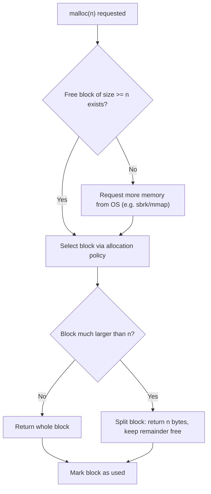
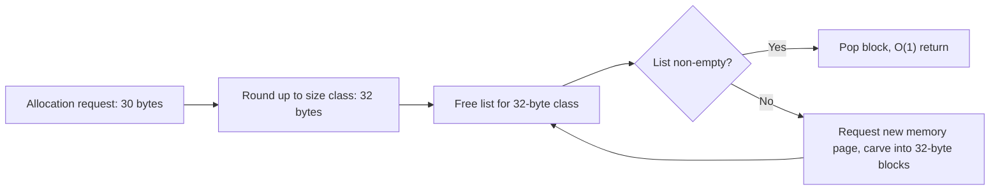
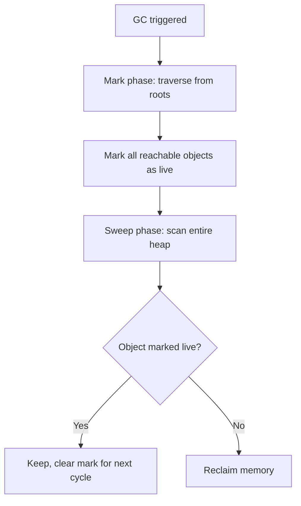
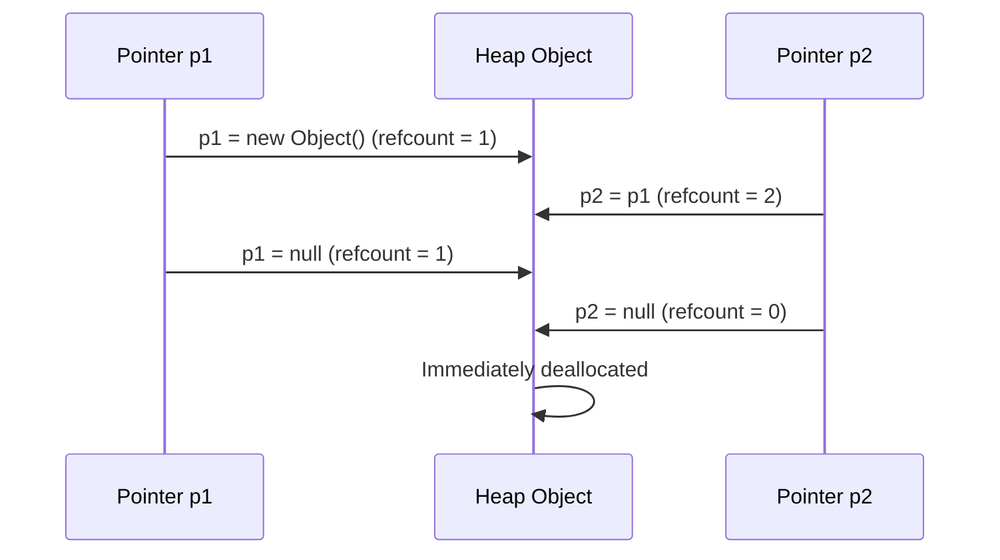

## Heap Management Strategies


### Definition and Core Concept

Heap management refers to the set of techniques a runtime, allocator, or language implementation uses to hand out, track, and reclaim memory from the **heap** — the region of memory used for allocations whose size and lifetime are not knowable at compile time. Unlike the stack's strict LIFO discipline, heap allocations and deallocations can happen in any order, which means the allocator must actively track which blocks are free, which are in use, and how to satisfy new requests efficiently while minimizing wasted space.

Because heap allocation patterns are essentially arbitrary, every heap management strategy is a trade-off among four competing goals: allocation/deallocation **speed**, **memory utilization** (minimizing waste), **fragmentation control**, and **implementation complexity** (including thread-safety overhead).

### Key Points

- The heap has no inherent structure; the allocator imposes structure on it via metadata (free lists, headers, bitmaps, etc.).
- Every heap management strategy must solve two core problems: **allocation** (finding/returning a suitable free block) and **deallocation** (returning a block to the pool of free memory, possibly merging it with neighbors).
- **Fragmentation** — memory that is technically free but unusable because it's split into many small, non-contiguous pieces — is the central challenge nearly every strategy tries to minimize.
- Strategies range from fully manual (C's `malloc`/`free`) to fully automatic (garbage-collected languages), with reference counting and hybrid models in between.
- No single strategy is universally best; language runtimes often combine multiple techniques (e.g., a fast small-object allocator layered over a general-purpose allocator, backed by a garbage collector).

### The Core Allocator Problem

At its simplest, a heap allocator maintains a data structure describing which regions of a large memory pool are free and which are in use. On `malloc(n)`, it must find a free region of at least `n` bytes, mark it as used, and return a pointer to it. On `free(ptr)`, it must mark that region as free again and ideally merge it with adjacent free regions (**coalescing**) to keep large contiguous blocks available for future large requests.



### Free-List Allocation Strategies

A common technique maintains an explicit linked list of free blocks. The **placement policy** — which free block to choose for a given request — significantly affects fragmentation and speed:

- **First-fit**: Scan the free list from the start and use the first block large enough. Fast, but can leave many small unusable fragments near the front of the list over time.
- **Best-fit**: Scan the entire free list and pick the smallest block that still satisfies the request, minimizing leftover waste per allocation. This tends to be slower (a full scan) and can still produce many tiny, hard-to-reuse fragments elsewhere.
- **Worst-fit**: Pick the largest available block, leaving the largest possible leftover fragment, on the theory that large leftovers stay more useful than tiny ones. [Inference: worst-fit is comparatively rare in production allocators, as empirical studies have generally favored first-fit/best-fit variants combined with segregation strategies; this reflects general practice rather than a universal rule.]
- **Next-fit**: Like first-fit, but resumes scanning from where the previous search left off, spreading allocations more evenly across the free list.

### Segregated Free Lists / Size Classes

A widely used strategy in production allocators (including implementations underlying `malloc` in glibc, and allocators in language runtimes) is to maintain **separate free lists for different size classes** (e.g., 16, 32, 48, 64 bytes, etc.). When a request comes in, the allocator rounds up to the nearest size class and pulls directly from that class's free list.



This approach makes allocation and deallocation for common small sizes extremely fast — often $O(1)$ — because there's no scanning involved; the trade-off is some **internal fragmentation** (wasted space inside a block that's larger than strictly needed) since requests get rounded up to the nearest class.

### Buddy System Allocation

The **buddy allocation** system divides memory into blocks that are always powers of two in size. A request is rounded up to the nearest power of two; if no block of that exact size is free, a larger block is recursively split in half ("buddies") until a block of the right size is produced. When a block is freed, the allocator checks whether its "buddy" (the other half of the split) is also free, and if so, merges them back into the larger block — this coalescing is fast because a block's buddy address can be computed with simple bit arithmetic (typically XORing an address bit).

- **Advantage**: Coalescing is efficient and largely eliminates external fragmentation between buddy pairs.
- **Disadvantage**: Rounding every request up to a power of two can cause significant internal fragmentation (e.g., a 65-byte request consuming a 128-byte block).

This strategy is notably used inside the Linux kernel's physical page allocator. [Unverified: exact configuration parameters and size-class boundaries are kernel-version-dependent and should be checked against current kernel source/documentation.]

### Garbage-Collected Heap Strategies

In managed languages, the heap is not manually freed by the programmer at all; instead, a **garbage collector (GC)** periodically identifies objects that are no longer reachable from the program's roots (stack variables, globals, CPU registers) and reclaims their memory automatically.

**Mark-and-Sweep**

1. **Mark phase**: Starting from root references, traverse all reachable objects and mark them as "live."
2. **Sweep phase**: Scan the entire heap; any object not marked is unreachable garbage and its memory is reclaimed.



A drawback of naive mark-and-sweep is that it does not compact memory, so free space can end up scattered, leading to external fragmentation similar to manual allocators.

**Generational Garbage Collection**

Based on the empirical observation that most objects "die young," generational collectors divide the heap into generations (commonly a **young/nursery generation** and one or more **old generations**). New objects are allocated in the young generation, which is collected frequently and cheaply (since it's small and most objects there are already garbage). Objects that survive several collections are **promoted** to an older generation, which is collected less often. This is the strategy used by the JVM's HotSpot garbage collector and .NET's CLR garbage collector, among others. [Unverified: exact generation counts, promotion thresholds, and default collector algorithms differ across JVM/CLR versions and configured GC modes, and should be checked against current documentation for the specific runtime version in use.]

**Reference Counting**

Each heap object carries a count of how many references point to it. Incrementing happens whenever a new reference is made; decrementing happens when a reference goes out of scope or is reassigned. When the count reaches zero, the object is immediately reclaimed.



Reference counting reclaims memory deterministically and immediately (unlike tracing collectors, which run periodically), which is valuable for predictable resource release (e.g., closing files). Its major weakness is that it cannot, on its own, reclaim **reference cycles** (e.g., object A references B, and B references A, but nothing external references either) — those objects' counts never reach zero. Python and Swift both use reference counting as a core strategy; Python supplements it with a separate cycle-detecting collector to catch reference cycles, while Swift generally requires the programmer to break cycles manually using `weak` or `unowned` references. [Unverified: implementation details of Python's cycle collector and Swift's ARC vary by version and should be checked against current language documentation.]

### Compaction and Copying Collectors

Some GC strategies actively move live objects together to eliminate fragmentation entirely:

- **Mark-Compact**: After marking live objects, the collector slides them together toward one end of the heap, then updates all references to point to the new locations. This eliminates fragmentation but requires an extra pass and reference-fixing step.
- **Copying (Semi-Space) Collection**: The heap is split into two halves ("from-space" and "to-space"). Live objects are copied from the active half to the other half during collection; anything not copied is implicitly garbage. After copying, the roles of the two halves swap. This is fast and inherently compacts memory, but at the cost of only being able to use half the total heap space at any given time.

### Manual Allocation: The Programmer's Responsibility

In languages without garbage collection (C, and C++ without smart pointers), the programmer is fully responsible for calling deallocation functions:

```c
#include <stdlib.h>

void manual_management_example(void) {
    int *arr = malloc(10 * sizeof(int));  // request heap memory
    if (arr == NULL) {
        return; // allocation failed
    }
    for (int i = 0; i < 10; i++) arr[i] = i;

    free(arr);      // return memory to the allocator
    // arr is now a dangling pointer; using it further is undefined behavior
}
```

This model gives maximum control and no GC pause overhead, but shifts the burden of correctness entirely onto the programmer, producing the classic manual-management bug categories:

- **Memory leak**: Forgetting to `free` memory that is no longer needed, causing usage to grow unbounded over the program's lifetime.
- **Dangling pointer / use-after-free**: Using a pointer after its memory has been freed.
- **Double free**: Calling `free` twice on the same pointer, which typically corrupts the allocator's internal metadata.

### Smart Pointers: A Hybrid Approach

C++ mitigates manual management risk with **smart pointers** that use reference counting or unique ownership, implemented via RAII (Resource Acquisition Is Initialization) — the object's destructor automatically frees the underlying memory when the smart pointer goes out of scope:

```cpp
#include <memory>

void smart_pointer_example() {
    std::unique_ptr<int[]> arr(new int[10]); // sole owner; freed automatically at scope exit
    std::shared_ptr<int> shared_val = std::make_shared<int>(42); // reference-counted

    for (int i = 0; i < 10; i++) arr[i] = i;
    // No explicit delete needed — destructors run automatically here
}
```

`unique_ptr` enforces single ownership at compile time (zero runtime overhead beyond a regular pointer), while `shared_ptr` uses an atomic reference count to allow multiple owners, incurring small runtime overhead for the count updates.

### Rust: Ownership-Based Heap Management Without a GC

Rust manages heap memory deterministically without a garbage collector by enforcing **ownership rules** at compile time: each heap-allocated value has exactly one owner, and when that owner goes out of scope, the compiler automatically inserts a call to deallocate the memory — this is checked and inserted entirely at compile time, with no runtime GC pass.

```rust
fn ownership_example() {
    let v = vec![1, 2, 3, 4, 5]; // heap-allocated Vec, owned by v
    let v2 = v;                   // ownership moves to v2; v is now invalid
    // println!("{:?}", v);      // compile error: v was moved
    println!("{:?}", v2);
}   // v2 goes out of scope here; Vec's heap buffer is deallocated automatically
```

This achieves deterministic, immediate deallocation (like manual management) while eliminating use-after-free and double-free bugs at compile time (like a tracing GC would eliminate them at runtime), at the cost of a steeper learning curve around the borrow checker.

### Comparison of Strategies

| Strategy | Deallocation Timing | Handles Cycles? | Pause Overhead | Typical Use Case |
| --- | --- | --- | --- | --- |
| Manual (`malloc`/`free`) | Explicit, immediate | N/A (programmer's responsibility) | None | C, low-level systems code |
| Smart pointers (RAII) | Deterministic, scope-based | `shared_ptr` alone: no | Minimal (refcount updates) | C++ |
| Reference counting | Deterministic, immediate | No (needs cycle detector) | Minimal, but per-operation cost | Python (core), Swift (ARC) |
| Mark-and-sweep GC | Periodic, non-deterministic | Yes | Pause during collection | Older/simple GC implementations |
| Generational GC | Periodic, non-deterministic | Yes | Reduced via generational tuning | JVM, .NET CLR |
| Ownership (borrow checker) | Deterministic, scope-based, compile-time enforced | Requires explicit handling (e.g., `Rc`/`Weak`) | None at runtime | Rust |

### Illustration: Heap Fragmentation and Coalescing

<svg xmlns="http://www.w3.org/2000/svg" viewBox="0 0 640 300" font-family="sans-serif">
<text x="320" y="24" text-anchor="middle" font-size="16" font-weight="bold" fill="#1a1a1a">Heap Fragmentation and Coalescing (svg_diagram)</text>

<text x="60" y="60" font-size="12" fill="`#1a1a1a`">Before free:</text>

<rect x="150" y="45" width="60" height="30" fill="`#d6eaf8`" stroke="`#21618c`" />

<text x="180" y="65" text-anchor="middle" font-size="10">A (used)</text>

<rect x="210" y="45" width="50" height="30" fill="`#f2d7d5`" stroke="`#943126`" />

<text x="235" y="65" text-anchor="middle" font-size="10">B (free)</text>

<rect x="260" y="45" width="60" height="30" fill="`#d6eaf8`" stroke="`#21618c`" />

<text x="290" y="65" text-anchor="middle" font-size="10">C (used)</text>

<rect x="320" y="45" width="50" height="30" fill="`#f2d7d5`" stroke="`#943126`" />

<text x="345" y="65" text-anchor="middle" font-size="10">D (free)</text>

<rect x="370" y="45" width="60" height="30" fill="`#d6eaf8`" stroke="`#21618c`" />

<text x="400" y="65" text-anchor="middle" font-size="10">E (used)</text>

<text x="60" y="140" font-size="12" fill="`#1a1a1a`">C is freed:</text>

<rect x="150" y="125" width="60" height="30" fill="`#d6eaf8`" stroke="`#21618c`" />

<text x="180" y="145" text-anchor="middle" font-size="10">A (used)</text>

<rect x="210" y="125" width="50" height="30" fill="`#f2d7d5`" stroke="`#943126`" />

<text x="235" y="145" text-anchor="middle" font-size="10">B (free)</text>

<rect x="260" y="125" width="60" height="30" fill="`#f2d7d5`" stroke="`#943126`" />

<text x="290" y="145" text-anchor="middle" font-size="10">C (free)</text>

<rect x="320" y="125" width="50" height="30" fill="`#f2d7d5`" stroke="`#943126`" />

<text x="345" y="145" text-anchor="middle" font-size="10">D (free)</text>

<rect x="370" y="125" width="60" height="30" fill="`#d6eaf8`" stroke="`#21618c`" />

<text x="400" y="145" text-anchor="middle" font-size="10">E (used)</text>

<text x="60" y="220" font-size="12" fill="`#1a1a1a`">Coalesced:</text>

<rect x="150" y="205" width="60" height="30" fill="`#d6eaf8`" stroke="`#21618c`" />

<text x="180" y="225" text-anchor="middle" font-size="10">A (used)</text>

<rect x="210" y="205" width="160" height="30" fill="`#d4efdf`" stroke="`#1e8449`" />

<text x="290" y="225" text-anchor="middle" font-size="10">B+C+D merged (free, 160 units)</text>

<rect x="370" y="205" width="60" height="30" fill="`#d6eaf8`" stroke="`#21618c`" />

<text x="400" y="225" text-anchor="middle" font-size="10">E (used)</text>

<text x="320" y="270" text-anchor="middle" font-size="11" fill="`#555555`">Coalescing adjacent free blocks reduces external fragmentation, enabling larger future allocations</text>

</svg>

### Choosing a Strategy: Practical Considerations

- **Real-time/embedded systems** generally avoid heap allocation after initialization entirely, or use custom pool/arena allocators with predictable, bounded worst-case timing, since both manual `malloc`/`free` and tracing GC introduce timing variability that is unacceptable for hard real-time guarantees.
- **High-throughput server applications** often favor generational GC (JVM, CLR, Go's collector) because most allocations are genuinely short-lived, matching the generational hypothesis well.
- **Systems programming** (OS kernels, browsers' performance-critical paths, game engines) frequently favors manual allocation or ownership-based models (Rust, C++ RAII) to avoid GC pause unpredictability while still controlling memory safety risk.
- **Scripting and rapid-development languages** (Python, Ruby, JavaScript) typically prioritize programmer ergonomics over raw allocation speed, favoring reference counting and/or tracing GC to remove manual memory management from the developer's concerns entirely.

### Related Topics

- Static memory management and stack-based memory management
- Garbage collection algorithms in depth (tri-color marking, concurrent/incremental GC)
- Memory pools and arena allocators
- Reference cycles and weak references
- Rust ownership, borrowing, and lifetimes
- Memory leaks: detection and prevention techniques
- False sharing and memory allocator thread-safety (per-thread arenas)
- Virtual memory and paging fundamentals