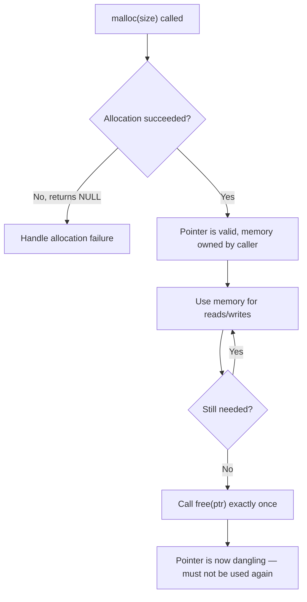
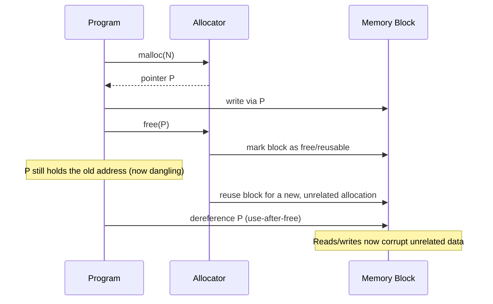
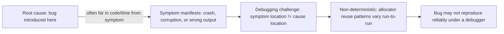

## Manual Memory Management and Its Risks

### Definition and Core Concept

Manual memory management is a model in which the programmer, not the language runtime, is fully responsible for explicitly requesting heap memory and explicitly releasing it when it is no longer needed. This is the model used by C (`malloc`/`free`), and available in C++ (`new`/`delete`), among other lower-level languages. There is no automatic tracking of whether memory is still in use — the correctness of the entire program's memory behavior depends on the programmer calling the right deallocation function, exactly once, at exactly the right time, for every allocation.

This stands in direct contrast to garbage-collected or ownership-based models, where the runtime or compiler determines when memory can be safely reclaimed. Manual management offers maximum control and predictable, zero-overhead deallocation timing, but that control comes with a well-documented, historically significant set of risks.

### Key Points

- Every `malloc`/`new` should be paired with exactly one corresponding `free`/`delete`; the responsibility for this pairing lies entirely with the programmer.
- The four canonical categories of manual memory management bugs are: **memory leaks**, **dangling pointers / use-after-free**, **double free**, and **buffer overflows** (a closely related memory-safety issue often discussed alongside these).
- These bugs are notoriously difficult to catch through normal testing because their symptoms (crashes, corruption, security exploits) often manifest far away in time and code location from the actual root cause.
- Manual memory management bugs have historically been among the most common sources of security vulnerabilities in systems software, motivating the widespread industry shift toward memory-safe languages (Rust) and mitigation tooling (sanitizers, smart pointers) in security-critical contexts.
- Mitigation strategies exist along a spectrum: disciplined manual patterns (RAII, ownership conventions), tooling (static analyzers, sanitizers), and language-level solutions (smart pointers, borrow checkers) that shift correctness enforcement to compile time.

### The Allocation/Deallocation Contract



The entire risk profile of manual memory management stems from how easy it is to violate the implicit contract shown above: using memory before checking allocation success, using it after step G, calling `free` more than once, or never reaching step G at all.

### Risk 1: Memory Leaks

A memory leak occurs when allocated memory becomes unreachable (no pointer in the program refers to it anymore) without ever having been freed. The memory is not corrupted or unsafe to use — it simply can never be reclaimed for the remainder of the program's execution, because nothing can locate it anymore to pass to `free`.

```c
#include <stdlib.h>

void leaky_function(void) {
    int *data = malloc(100 * sizeof(int));
    if (data == NULL) return;

    // ... use data ...

    // BUG: function returns without calling free(data)
    // 'data' pointer is destroyed (it was a stack local),
    // but the 400 bytes it pointed to are now unreachable forever
}
```

**Common leak-causing patterns:**

- Forgetting `free` entirely on a normal code path.
- An early `return` or exception/error path that skips a `free` call present later in the function.
- Overwriting the only pointer to a block before freeing it: `ptr = malloc(...); ptr = malloc(...);` silently leaks the first block.
- Leaking within long-running processes (servers, daemons) where small per-request leaks accumulate over time until the process exhausts available memory and crashes or is killed by the OS.

Memory leaks are generally not immediately fatal to correctness — the program keeps running correctly — but in long-running systems, they degrade performance over time and can eventually cause allocation failures or forced process termination.

### Risk 2: Dangling Pointers and Use-After-Free

A **dangling pointer** is a pointer that still holds the address of memory that has already been freed (or otherwise deallocated, such as a stack frame that has returned). **Use-after-free** is the act of dereferencing such a pointer — reading from or writing to memory the program no longer owns.

```c
#include <stdlib.h>
#include <stdio.h>

void use_after_free_example(void) {
    int *ptr = malloc(sizeof(int));
    *ptr = 42;
    free(ptr);          // memory returned to the allocator

    printf("%d\n", *ptr); // BUG: use-after-free — undefined behavior
    // The allocator may have already reused this memory for something else,
    // so this could print garbage, crash, or (in the worst case) silently "work"
}
```

Use-after-free is particularly dangerous from a security standpoint: if an attacker can influence what gets allocated into the freed memory before it is used again, they may be able to make the dangling pointer's dereference read or execute attacker-controlled data — a well-documented category of exploitable vulnerability in real-world software.



### Risk 3: Double Free

Calling `free` (or `delete`) more than once on the same pointer is undefined behavior. Most allocator implementations maintain metadata about free blocks (such as free-list pointers) stored near or within the block itself; freeing the same block twice typically corrupts this metadata, which can crash the program immediately or, worse, corrupt the allocator's internal state in a way that manifests as an unrelated failure much later.

```c
#include <stdlib.h>

void double_free_example(void) {
    int *ptr = malloc(sizeof(int));
    free(ptr);
    // ... some other code runs ...
    free(ptr); // BUG: double free — ptr was already released
}
```

**A related and common subcase**: freeing memory that two different pointers reference (aliasing), where the programmer loses track of which pointer "owns" the responsibility to free it, and both code paths call `free` on what is effectively the same block.

### Risk 4: Buffer Overflows (Related Memory-Safety Risk)

Although not strictly an allocation/deallocation timing bug, buffer overflows are closely associated with manual memory management because the programmer is also responsible for tracking the exact size of every allocated block — the language does not enforce bounds checking on raw pointers.

```c
#include <stdlib.h>
#include <string.h>

void buffer_overflow_example(void) {
    char *buffer = malloc(10); // 10 bytes allocated
    strcpy(buffer, "this string is much longer than ten bytes"); // BUG: heap overflow
    // Writes past the end of the allocated block, corrupting adjacent heap metadata
    // or adjacent allocated objects
    free(buffer);
}
```

A **heap overflow** like this can corrupt neighboring allocations or allocator metadata; a corresponding **stack overflow** (writing past the end of a stack-allocated buffer) can, in the worst case, overwrite a saved return address, which is the mechanism behind classic stack-smashing exploits.

### Why These Bugs Are Especially Hard to Catch



Several factors compound the difficulty of manual memory management bugs:

- **Undefined behavior** in languages like C means the compiler is not obligated to produce any particular observable result once a bug like use-after-free occurs — code might "appear to work" for months before failing under slightly different conditions (different allocator, different compiler optimization level, different memory layout).
- **Non-determinism**: whether a use-after-free "corrupts" something visible depends on whether that memory happens to be reused before the dangling access occurs, which can vary between runs, machines, or compiler versions.
- **Temporal and spatial distance**: the `free()` call that causes a later crash may be in a completely different function, file, or even library than the code that eventually dereferences the dangling pointer.

### Detection and Mitigation Tooling

Because these bugs are hard to find through code review or normal testing alone, a substantial body of tooling exists specifically to catch them:

- **AddressSanitizer (ASan)**: A compiler-instrumentation tool that inserts runtime checks around every memory access, detecting use-after-free, heap/stack buffer overflows, and double-free at the moment they occur (rather than waiting for a crash), by using "redzones" around allocations and poisoning freed memory. [Unverified: exact overhead percentages and detection coverage details vary by version and configuration and should be checked against current tool documentation.]
- **Valgrind (Memcheck)**: A dynamic binary instrumentation tool that can detect memory leaks, invalid reads/writes, and use of uninitialized memory by running the program in a simulated CPU environment.
- **Static analyzers** (e.g., Clang Static Analyzer, Coverity): Examine source code without executing it, tracing possible code paths to flag potential leaks, double frees, or null-pointer dereferences before the program ever runs.
- **Fuzzing**: Automated testing that feeds a program large volumes of malformed or randomized input specifically to trigger edge-case memory bugs (especially overflows) that structured test suites might miss.

### Mitigation Strategy: Disciplined Manual Patterns

Even within manual memory management, certain conventions substantially reduce risk:

- **Single ownership convention**: Establish, by convention or documentation, exactly one part of the code that "owns" each allocation and is responsible for freeing it.
- **Set pointers to NULL after freeing**: `free(ptr); ptr = NULL;` — a subsequent accidental dereference of `ptr` will crash immediately and predictably (a null-pointer dereference) rather than silently corrupting memory, making the bug far easier to locate.
- **Goto-based cleanup pattern in C**: Centralizing all cleanup at the end of a function via a single `goto cleanup;` label ensures every exit path frees the same set of resources, reducing the risk of an early-return leak.

```c
#include <stdlib.h>

int centralized_cleanup_example(void) {
    int *a = NULL, *b = NULL;
    int result = -1;

    a = malloc(sizeof(int));
    if (a == NULL) goto cleanup;

    b = malloc(sizeof(int));
    if (b == NULL) goto cleanup;

    // ... use a and b ...
    result = 0;

cleanup:
    free(a); // free(NULL) is well-defined as a no-op, so this is always safe
    free(b);
    return result;
}
```

### Mitigation Strategy: Language and Runtime Solutions

- **RAII / smart pointers (C++)**: Tie deallocation to object lifetime/scope so the compiler-generated destructor calls `free`/`delete` automatically, removing the need for manual pairing in most cases (see the heap management strategies discussion of `unique_ptr`/`shared_ptr`).
- **Ownership and borrow checking (Rust)**: Enforce, at compile time, that a value has exactly one owner and that references cannot outlive the data they point to — this eliminates use-after-free, double-free, and most leak patterns as compile errors rather than runtime bugs.
- **Garbage collection**: Removes manual deallocation from the programmer's responsibility entirely, trading the four risks above for GC pause-time overhead and reduced control over exact deallocation timing.

### Comparison of Bug Categories

| Bug Type | Cause | Typical Symptom | Security Relevance |
| --- | --- | --- | --- |
| Memory leak | Allocated memory never freed | Gradual memory growth, eventual allocation failure/crash | Low direct risk; can enable denial-of-service via resource exhaustion |
| Use-after-free | Pointer used after its memory is freed | Crash, silent corruption, or (worst case) exploitable behavior | High — a common category in real-world exploited vulnerabilities |
| Double free | `free` called twice on the same pointer | Allocator metadata corruption, crash | High — can corrupt allocator internals in exploitable ways |
| Buffer overflow | Write exceeds allocated block size | Corrupted adjacent data, crash | High — classic vector for control-flow hijacking exploits |

### Illustration: Bug Timeline Divergence

<svg xmlns="http://www.w3.org/2000/svg" viewBox="0 0 640 260" font-family="sans-serif">
<text x="320" y="24" text-anchor="middle" font-size="16" font-weight="bold" fill="#1a1a1a">Root Cause vs. Observed Symptom (svg_diagram)</text>
<line x1="60" y1="140" x2="580" y2="140" stroke="#999999" stroke-width="2" />
<polygon points="580,140 570,134 570,146" fill="#999999" />
<text x="320" y="160" text-anchor="middle" font-size="11" fill="#555555">Program execution time</text>
<circle cx="150" cy="140" r="8" fill="#943126" />
<text x="150" y="115" text-anchor="middle" font-size="11" fill="#1a1a1a">free(ptr) called</text>
<text x="150" y="100" text-anchor="middle" font-size="10" fill="#943126">(root cause)</text>
<circle cx="470" cy="140" r="8" fill="#af601a" />
<text x="470" y="180" text-anchor="middle" font-size="11" fill="#1a1a1a">Crash / corrupted output</text>
<text x="470" y="195" text-anchor="middle" font-size="10" fill="#af601a">(observed symptom)</text>
<path d="M150,132 Q310,60 470,132" stroke="#21618c" stroke-width="1.5" fill="none" stroke-dasharray="5,3" />
<text x="310" y="55" text-anchor="middle" font-size="11" fill="#21618c">Many unrelated function calls / significant time elapsed between them</text>
</svg>

### Related Topics

- Heap management strategies (allocators, garbage collection, reference counting)
- Static and stack-based memory management
- RAII and smart pointers in C++
- Rust ownership, borrowing, and lifetimes
- Memory safety tooling (AddressSanitizer, Valgrind, fuzzing)
- Common vulnerability classes (buffer overflow exploitation, use-after-free exploitation)
- Secure coding standards (e.g., CERT C, MISRA C)
- Undefined behavior in C and C++