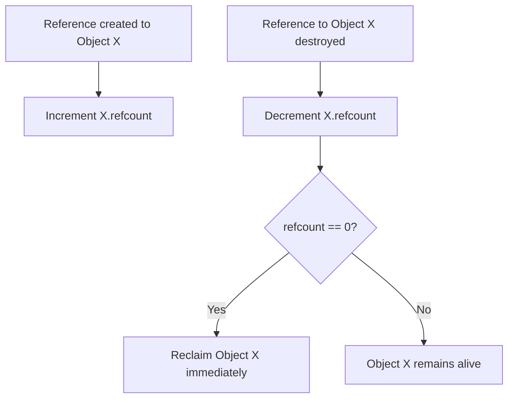
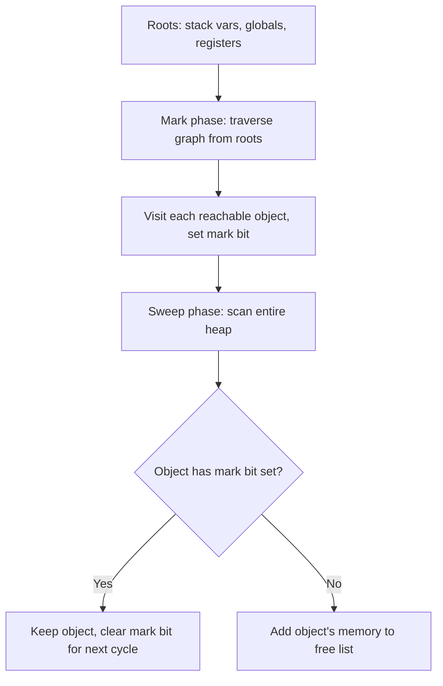
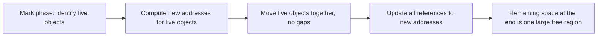
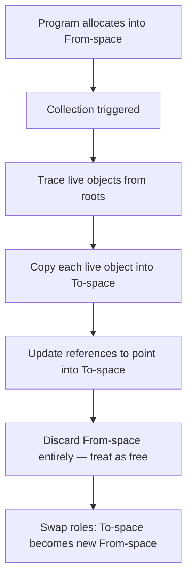
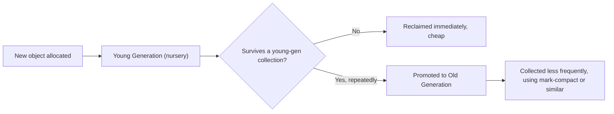
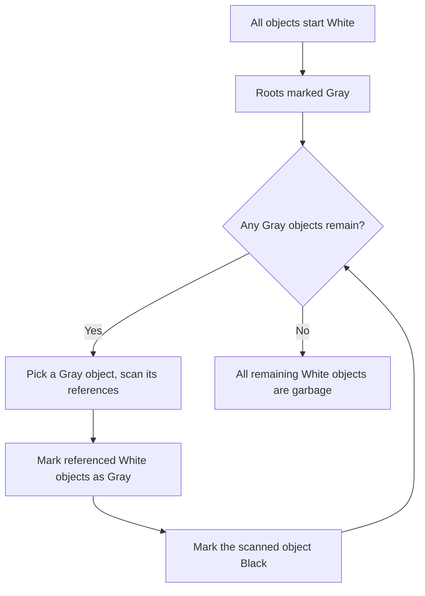

## Garbage Collection Algorithms

### Definition and Core Concept

Garbage collection (GC) is the automatic reclamation of heap memory occupied by objects that a program can no longer reach or use. Rather than requiring the programmer to explicitly call a deallocation function, a garbage collector periodically (or continuously) inspects the state of the program's memory, determines which objects are still **reachable** from a set of **roots** (stack variables, CPU registers, global variables, and other entry points into the object graph), and reclaims everything that is not. This section surveys the major algorithmic families used to solve that problem, building on the general garbage-collected strategies introduced earlier.

### Key Points

- All tracing garbage collectors share a common foundation: define a set of **roots**, traverse the graph of references reachable from those roots, and treat anything unreached as garbage.
- Garbage collection algorithms differ chiefly along four axes: whether they **move/compact** objects, whether they run **concurrently** with the program, whether they treat the heap **uniformly or by generation**, and how they handle **reference cycles**.
- **Reachability**, not reference count alone, is the formally correct definition of "alive" in most tracing collectors — an object with zero incoming references from reachable code is garbage, even if it still technically points to other objects.
- Every algorithm trades off some combination of **throughput** (total time spent collecting vs. running the program), **pause time** (how long the program is paused during collection), and **memory overhead** (extra space the algorithm needs to do its job).
- Modern production garbage collectors are almost always hybrids, combining generational partitioning, incremental or concurrent execution, and sometimes multiple underlying algorithms for different regions of the heap.

### Reference Counting

Reference counting tracks, for every heap object, a count of how many references currently point to it. The count is incremented on each new reference and decremented when a reference is destroyed or reassigned; when the count reaches zero, the object is immediately and deterministically reclaimed.

**Strengths**: Deallocation is immediate and deterministic (valuable for releasing scarce resources like file handles predictably), and the cost of collection is spread evenly across program execution rather than concentrated in pause events.

**Weaknesses**: It cannot reclaim **reference cycles** on its own — if object A references B and B references A, and nothing external references either, both counts stay above zero forever even though neither is reachable from any root. Reference counting also incurs a small but constant overhead on every single pointer assignment, and in naive implementations, incrementing/decrementing counts must be atomic in multithreaded contexts, which adds synchronization cost. Python and Swift both use reference counting as a primary mechanism, with Python supplementing it with a separate cycle-detecting collector. [Unverified: exact implementation details of cycle detection differ by language version and should be checked against current documentation.]

### Mark-and-Sweep

Mark-and-sweep is the foundational **tracing** algorithm — it determines liveness by actually walking the object graph from the roots, rather than counting references locally.

1. **Mark phase**: Starting from each root, recursively (or via an explicit worklist) visit every reachable object and mark it as live.
2. **Sweep phase**: Scan the entire heap linearly; any object without a live mark is unreachable garbage and is added back to the free list.

**Strengths**: Correctly handles reference cycles, since liveness is determined by actual reachability from roots, not local reference counts.

**Weaknesses**: The sweep phase must scan the entire heap regardless of how much garbage actually exists, and naive mark-and-sweep does not compact memory, so surviving objects can end up scattered across the heap, leading to external fragmentation similar to manual allocators. It also traditionally requires a **stop-the-world** pause — the program halts entirely while marking and sweeping occur, which can be problematic for latency-sensitive applications.

### Mark-Compact

Mark-compact extends mark-and-sweep with a third phase that eliminates fragmentation: after marking, live objects are physically moved ("slid") together toward one end of the heap, and every reference in the program that pointed to a moved object is updated to its new address.

**Strengths**: Produces a heap with zero external fragmentation and very fast future allocation (a simple "bump" pointer can allocate from the compacted free region, since it's guaranteed contiguous).

**Weaknesses**: The extra move-and-fix-up phase adds real cost per collection compared to plain mark-and-sweep, and updating every reference to a moved object is nontrivial to implement correctly and efficiently, particularly under concurrency.

### Copying (Semi-Space) Collection

Copying collectors divide the heap into two equal halves, conventionally called **from-space** and **to-space**. The program only ever allocates into from-space. When a collection is triggered, the collector traces live objects from the roots and copies each one it finds into to-space; anything left behind in from-space at the end is implicitly garbage. The roles of the two spaces then swap for the next cycle.

**Strengths**: Inherently compacting (copying naturally produces a contiguous layout with no fragmentation), and collection cost is proportional to the amount of **live** data, not total heap size — an important property when most objects are short-lived garbage, since sweeping past dead objects costs nothing.

**Weaknesses**: Only half of the allocated heap memory is ever usable by the program at one time, since the other half must remain reserved as the copy target — a significant memory overhead trade-off.

### Generational Garbage Collection

Generational collection is based on the empirically observed **generational hypothesis**: most objects die young, and objects that survive one collection are disproportionately likely to survive many more. The heap is partitioned into generations — typically a small **young/nursery generation** and one or more larger **old generations**.

Young-generation collections happen frequently but are cheap, since the region is small and most of what's in it is already garbage (a copying collector is often used here, since live data in the young generation is typically a small fraction of its total size). Old-generation collections happen much less often, since surviving objects there tend to stay alive for a long time.

A key implementation detail generational collectors must solve is the **inter-generational reference problem**: an old-generation object can hold a reference into the young generation (e.g., an old, long-lived container that gets a new short-lived object added to it), and a young-generation collection must still find and treat that as a root, without re-scanning the entire (large) old generation every time. This is typically solved with a **write barrier** — a small piece of code the runtime inserts on every pointer write that records old-to-young references in a separate structure (often called a "remembered set" or "card table") so the young-gen collector only needs to consult that small structure rather than the whole old generation.

This approach underlies the JVM's HotSpot collectors and .NET's CLR garbage collector. [Unverified: specific generation counts, promotion thresholds, and default algorithms per generation vary across JVM/CLR versions and configured GC modes; consult current runtime documentation for exact behavior.]

### Tri-Color Marking

Tri-color marking is not a standalone algorithm but a conceptual (and often literal, implementation-level) framework used to reason about and implement mark-phase correctness, especially for **incremental** and **concurrent** collectors where the program keeps running (and mutating references) while marking is in progress.

Every object is conceptually colored:

- **White**: Not yet visited — presumed garbage unless proven otherwise.
- **Gray**: Visited, but its outgoing references have not yet all been scanned.
- **Black**: Visited, and all of its outgoing references have already been scanned.

The critical correctness rule this framework exists to enforce is the **tri-color invariant**: a Black object must never point directly to a White object without a Gray object also pointing to that same White object somewhere in the graph. If the running program (the "mutator") is allowed to create a Black-to-White pointer while marking is still in progress — for example, by storing a reference to a not-yet-scanned White object into an already-scanned Black object, and removing the only other path to it — the collector could wrongly conclude that White object is garbage and reclaim still-reachable memory. Concurrent and incremental collectors prevent this using **write barriers**, which intercept pointer writes during marking and either re-mark the target Gray (a technique broadly associated with incremental update methods) or record the old, about-to-be-overwritten reference (an approach broadly associated with snapshot-at-the-beginning methods), depending on the specific barrier design. [Unverified: exact barrier implementations and which variant a given production collector uses depend on the specific collector and version; consult that collector's documentation for authoritative detail.]

### Incremental and Concurrent Collection

**Stop-the-world** collection — where the entire program pauses during collection — is simple to reason about but produces pause times that grow with heap/live-set size, which is unacceptable for latency-sensitive applications (interactive UIs, low-latency services).

- **Incremental GC** breaks the marking (and sometimes sweeping/compacting) work into small chunks, interleaving a bit of collection work with normal program execution rather than doing it all in one long pause. This bounds individual pause durations at the cost of some added bookkeeping overhead (write barriers, tri-color state tracking) and generally lower total throughput compared to a stop-the-world pass.
- **Concurrent GC** goes further, running collector work on separate threads genuinely simultaneously with the program's own execution, rather than merely interleaving on the same thread. This requires careful synchronization (write barriers, sometimes read barriers) to maintain correctness while the program is actively mutating the object graph the collector is scanning.

Production examples of low-pause concurrent/incremental collectors include the JVM's G1, ZGC, and Shenandoah collectors, which are specifically designed to keep individual pause times in the low milliseconds even for very large heaps. [Unverified: specific pause-time targets and supported heap sizes are version- and configuration-dependent; consult current JVM documentation for authoritative figures.]

### Comparison of Algorithms

| Algorithm | Handles Cycles | Compacts Memory | Typical Pause Behavior | Memory Overhead |
| --- | --- | --- | --- | --- |
| Reference counting | No (needs supplement) | N/A | None (spread over execution) | Per-object count storage |
| Mark-and-sweep | Yes | No | Stop-the-world, proportional to heap | Low |
| Mark-compact | Yes | Yes | Stop-the-world, proportional to live data + move cost | Low |
| Copying (semi-space) | Yes | Yes (inherent) | Stop-the-world, proportional to live data only | High (half heap reserved) |
| Generational | Yes | Depends on sub-algorithm used per generation | Short pauses for young gen, longer for old gen | Moderate (write barrier bookkeeping) |
| Incremental/Concurrent | Yes | Depends on underlying algorithm | Bounded, short pauses throughout | Higher (barriers, synchronization) |

### Illustration: Tri-Color Marking Progress

<svg xmlns="http://www.w3.org/2000/svg" viewBox="0 0 600 300" font-family="sans-serif">
<text x="300" y="24" text-anchor="middle" font-size="16" font-weight="bold" fill="#1a1a1a">Tri-Color Marking Snapshot (svg_diagram)</text>
<circle cx="100" cy="90" r="28" fill="#1a1a1a" />
<text x="100" y="95" text-anchor="middle" font-size="11" fill="white">Root</text>
<circle cx="230" cy="60" r="28" fill="#1a1a1a" />
<text x="230" y="65" text-anchor="middle" font-size="11" fill="white">Black</text>
<circle cx="230" cy="150" r="28" fill="#7f8c8d" />
<text x="230" y="155" text-anchor="middle" font-size="11" fill="white">Gray</text>
<circle cx="380" cy="60" r="28" fill="#ecf0f1" stroke="#1a1a1a" stroke-width="1.5" />
<text x="380" y="65" text-anchor="middle" font-size="11" fill="#1a1a1a">White</text>
<circle cx="380" cy="150" r="28" fill="#ecf0f1" stroke="#1a1a1a" stroke-width="1.5" />
<text x="380" y="155" text-anchor="middle" font-size="11" fill="#1a1a1a">White</text>
<circle cx="500" cy="150" r="28" fill="#ecf0f1" stroke="#af601a" stroke-width="2" />
<text x="500" y="155" text-anchor="middle" font-size="10" fill="#af601a">White (unreachable)</text>
<line x1="128" y1="90" x2="205" y2="65" stroke="#1a1a1a" stroke-width="1.5" />
<line x1="128" y1="90" x2="205" y2="140" stroke="#1a1a1a" stroke-width="1.5" />
<line x1="258" y1="150" x2="355" y2="150" stroke="#1a1a1a" stroke-width="1.5" />
<line x1="258" y1="60" x2="355" y2="60" stroke="#af601a" stroke-width="1.5" stroke-dasharray="4,3" />
<text x="315" y="45" text-anchor="middle" font-size="9" fill="#af601a">forbidden: Black to White</text>

<text x="300" y="220" text-anchor="middle" font-size="11" fill="`#555555`">Gray objects still need scanning; the rightmost White object has no path from any Gray/Black node and will be reclaimed</text>

</svg>

### Choosing Among Algorithms in Practice

- **Reference counting** is favored where deterministic, immediate reclamation matters (releasing OS resources like file handles predictably) and where the object graphs involved rarely form cycles, or where the language provides supplementary cycle collection.
- **Generational tracing collectors** dominate general-purpose managed runtimes (JVM, CLR, V8 for JavaScript) because the generational hypothesis holds well for typical application workloads, and modern implementations layer incremental/concurrent techniques on top to bound pause times.
- **Copying collectors** are often specifically used for the young generation within a generational scheme, since young-generation live sets are typically small, making the "only usable half the space" overhead affordable for that region while being reclaimed on every young collection.
- **Concurrent, low-pause collectors** (G1, ZGC, Shenandoah-style designs) are chosen when application responsiveness under large heaps is the primary constraint, accepting somewhat lower raw throughput and higher implementation complexity in exchange for consistently small pauses.

### Related Topics

- Heap management strategies (allocators, smart pointers, ownership models)
- Reference counting deep dive and cycle-detection algorithms
- Write barriers and read barriers in collector implementation
- Escape analysis and stack allocation optimization in managed languages
- Rust ownership and borrowing as a GC-free memory safety alternative
- JVM-specific collectors (G1, ZGC, Shenandoah, Parallel GC)
- Latency vs. throughput trade-offs in runtime system design
- Weak references and finalization semantics