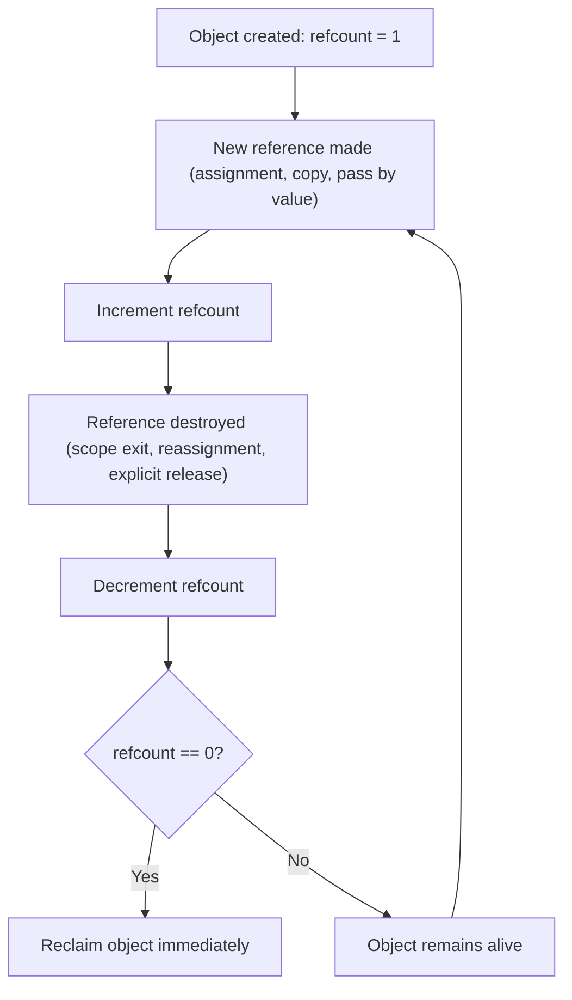
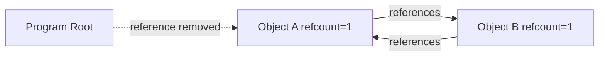
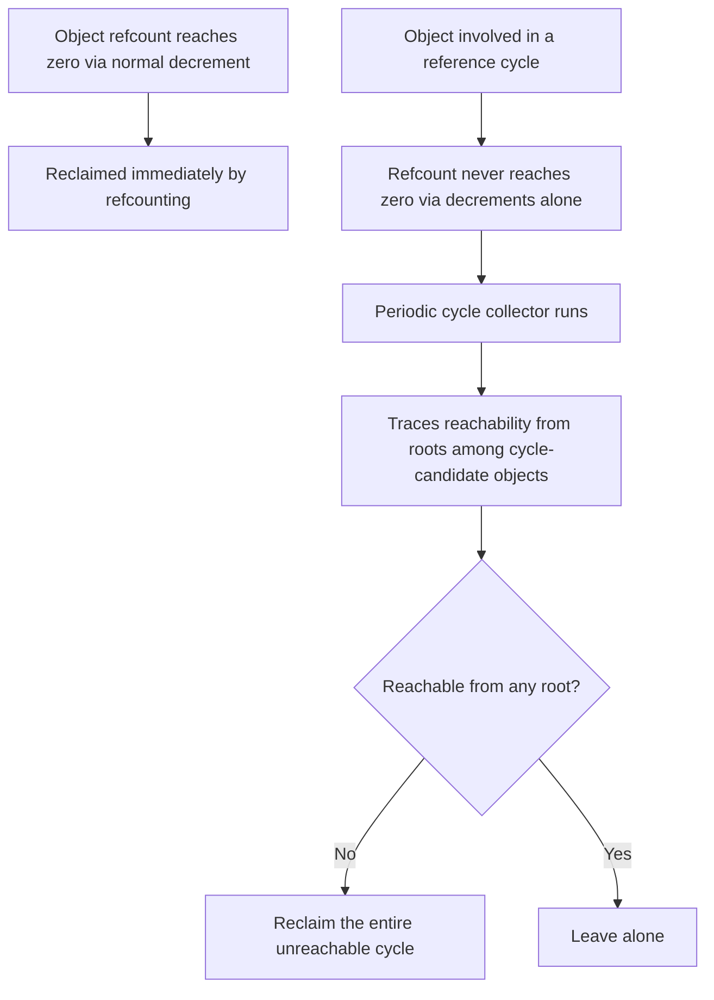

## Reference Counting

### Definition and Core Concept

Reference counting is a memory management technique in which every heap-allocated object carries a count of how many active references point to it. The count is incremented whenever a new reference to the object is created, and decremented whenever a reference is destroyed, goes out of scope, or is reassigned to point elsewhere. When the count reaches zero — meaning nothing in the program can reach the object anymore — it is immediately reclaimed. Unlike tracing garbage collectors, which periodically walk the entire object graph from roots, reference counting determines liveness through purely local bookkeeping attached to each object, with no global traversal required.

### Key Points

- Reclamation is **deterministic and immediate**: an object's memory is freed the instant its count hits zero, not at some later, unpredictable collection cycle.
- Reference counting is fundamentally **local** — each decrement/increment only inspects and updates the count on the object directly involved, never the whole heap.
- Its central, well-known weakness is the inability to reclaim **reference cycles** on its own, since cyclically-referencing objects can keep each other's counts above zero forever even when unreachable from any root.
- Reference count updates add a small constant-time cost to nearly every pointer assignment, copy, and scope exit throughout a program's execution, rather than concentrating cost into distinct collection pauses.
- In multithreaded contexts, reference count increments/decrements generally must be atomic operations to avoid race conditions, which introduces synchronization overhead not present in single-threaded reference counting.

### The Increment/Decrement Lifecycle



Every point where a reference is copied, stored into a new variable, passed into a function, or stored inside another data structure is a potential increment site; every point where a reference goes out of scope, is overwritten, or is explicitly cleared is a potential decrement site. Correctness depends on the language runtime (or, in manually-counted systems, the programmer) hitting every single one of these sites reliably.

### Worked Example: Manual Reference Counting in C

To make the mechanism concrete, here is a simplified reference-counted object implemented by hand in C — the kind of pattern real reference-counted runtimes automate:

```c
#include <stdlib.h>
#include <stdio.h>

typedef struct {
    int value;
    int refcount;
} RCObject;

RCObject *rc_create(int value) {
    RCObject *obj = malloc(sizeof(RCObject));
    obj->value = value;
    obj->refcount = 1;   // the creator holds the first reference
    return obj;
}

void rc_retain(RCObject *obj) {
    obj->refcount++;      // a new reference is being made
}

void rc_release(RCObject *obj) {
    obj->refcount--;
    if (obj->refcount == 0) {
        printf("Reclaiming object with value %d\n", obj->value);
        free(obj);         // reclaimed the instant the count hits zero
    }
}

void demo(void) {
    RCObject *a = rc_create(42);   // refcount = 1
    RCObject *b = a;
    rc_retain(b);                   // refcount = 2, since b now also references it

    rc_release(a);                  // refcount = 1, object still alive
    rc_release(b);                  // refcount = 0, object is reclaimed here
}
```

This pattern — `retain` on copy, `release` on discard — is exactly what languages with automatic reference counting generate for the programmer behind the scenes.

### Automatic Reference Counting in Practice

**Python**

CPython, the reference implementation of Python, uses reference counting as its primary memory management mechanism for ordinary objects. Every Python object has a hidden reference count field, visible via the standard library:

```python
import sys

a = [1, 2, 3]
print(sys.getrefcount(a))  # includes the temporary reference from getrefcount's own argument

b = a          # refcount increases: b now also references the same list
del b          # refcount decreases: only 'a' references it now
```

CPython supplements reference counting with a separate, periodically-run cycle-detecting collector specifically to catch reference cycles that counting alone cannot reclaim. [Unverified: the exact generational thresholds and triggering heuristics of CPython's cycle collector vary across Python versions and should be checked against current CPython documentation.]

**Swift**

Swift uses **Automatic Reference Counting (ARC)**, where the compiler inserts retain/release calls at compile time rather than tracking counts at runtime through a separate collector pass — there is no periodic collection cycle at all in the default class-object model:

```swift
class Node {
    var value: Int
    var next: Node?
    init(value: Int) { self.value = value }
}

var nodeA: Node? = Node(value: 1)
var nodeB = nodeA   // compiler inserts a retain here
nodeA = nil          // compiler inserts a release here; nodeB still holds a reference
```

Because Swift has no cycle-collecting supplement by default, cycles must be broken explicitly by the programmer using `weak` or `unowned` reference qualifiers on one side of the cycle-forming relationship.

**C++ (`std::shared_ptr`)**

C++'s `shared_ptr` is an explicit, library-level implementation of reference counting layered on top of manual memory management, using RAII so that increments/decrements happen automatically via constructors, copy operations, and destructors:

```cpp
#include <memory>
#include <iostream>

void shared_ptr_demo() {
    std::shared_ptr<int> a = std::make_shared<int>(42); // refcount = 1
    {
        std::shared_ptr<int> b = a;                       // refcount = 2 (copy constructor increments)
        std::cout << b.use_count() << "\n";                // prints 2
    }                                                        // b's destructor runs, refcount = 1
    std::cout << a.use_count() << "\n";                     // prints 1
}   // a's destructor runs here, refcount = 0, memory freed
```

`shared_ptr`'s reference count is typically maintained with atomic operations specifically so that it is safe to copy and destroy `shared_ptr` instances of the same underlying object across multiple threads concurrently.

### The Reference Cycle Problem

The defining weakness of reference counting is its inability to detect cycles using local information alone. Consider two objects that reference each other but are no longer reachable from any root:



Once the dotted reference from the root is removed, neither A nor B is reachable from anywhere the program can act — yet A's count is 1 (held by B) and B's count is 1 (held by A). Neither count will ever reach zero through the normal increment/decrement mechanism, so both objects leak for the remainder of the program's execution, even though they are unambiguously garbage by any reachability-based definition.

```python
class Node:
    def __init__(self):
        self.other = None

a = Node()
b = Node()
a.other = b   # a references b
b.other = a   # b references a, forming a cycle

del a
del b
# Neither object's local refcount reaches zero from these dels alone,
# because each still holds a reference to the other.
# CPython's separate cycle collector is what eventually reclaims this pair.
```

### Solutions to the Cycle Problem

**Weak References**

A weak reference is a reference that does not contribute to an object's reference count. It allows one object to point to another without keeping it alive on that basis alone — commonly used to break cycles by making one direction of a mutual reference "weak" instead of "strong."

```swift
class Person {
    var name: String
    weak var bestFriend: Person?   // does not increment bestFriend's refcount
    init(name: String) { self.name = name }
}

let alice = Person(name: "Alice")
let bob = Person(name: "Bob")
alice.bestFriend = bob
bob.bestFriend = alice
// Neither reference here keeps the other alive on its own,
// since 'weak' references are excluded from ARC's retain count
```

**Supplementary Cycle-Detecting Collectors**

Some reference-counted systems (notably CPython) run a separate, tracing-style collector periodically specifically to find and reclaim cycles that pure reference counting misses. This collector generally examines only a subset of objects capable of participating in cycles (in Python's case, container-like objects), computes reachability the way a tracing garbage collector would, and reclaims unreachable cyclic groups — meaning the language effectively runs two GC strategies simultaneously: fast, local reference counting for the common case, and slower, periodic tracing specifically for cycles.



### Performance Characteristics

**Advantages**

- **Deterministic destruction timing** is valuable whenever an object's destructor must run at a predictable moment — for example, closing a file handle or releasing a lock exactly when the last reference disappears, rather than at some arbitrary later point chosen by a tracing collector's schedule.
- **No stop-the-world pauses**: because reclamation happens incrementally as counts hit zero rather than in a distinct collection phase, reference counting avoids the large, unpredictable pause times that naive stop-the-world tracing collectors can introduce.
- **Locality**: the cost of freeing an object is paid immediately by the code that removed the last reference, rather than being deferred and batched into a later collection cycle that a tracing collector's "stop the world" step would need to walk the whole heap for.

**Disadvantages**

- **Per-operation overhead**: nearly every pointer copy, assignment, function parameter pass, and scope exit throughout the entire program incurs an increment or decrement, whereas a tracing collector's cost is concentrated into distinct, less frequent collection events.
- **Atomic operations in multithreaded code**: making increments/decrements thread-safe typically requires atomic CPU instructions, which are markedly more expensive than plain integer increments and can become a scalability bottleneck under heavy contention on frequently-shared objects.
- **Cascading deallocation**: releasing the last reference to a large data structure (e.g., the head of a long linked list) can trigger a cascade of decrements and deallocations across many objects in a single operation, producing a latency spike proportional to structure size — somewhat analogous to, though generally smaller in scope than, a tracing collector's pause.
- **Cycle blindness**, as discussed above, is the most cited structural limitation.

### Comparison with Tracing Garbage Collection

| Aspect | Reference Counting | Tracing GC (mark-sweep, generational, etc.) |
| --- | --- | --- |
| Reclamation timing | Immediate, deterministic | Periodic, non-deterministic |
| Handles cycles | No (needs supplement or manual weak refs) | Yes, inherently |
| Per-operation cost | Small cost on every pointer op | Near-zero cost outside collection events |
| Pause behavior | No large collection pauses; possible cascade spikes | Can have pauses, mitigated by incremental/concurrent designs |
| Multithreading cost | Atomic increments/decrements needed | Write barriers needed for concurrent variants |
| Memory overhead | One counter field per object | Varies (mark bits, extra heap space for copying, etc.) |

### Illustration: Reference Count Changes Over a Variable's Lifetime

<svg xmlns="http://www.w3.org/2000/svg" viewBox="0 0 640 300" font-family="sans-serif">
<text x="320" y="24" text-anchor="middle" font-size="16" font-weight="bold" fill="#1a1a1a">Reference Count Over Time (svg_diagram)</text>
<line x1="70" y1="250" x2="580" y2="250" stroke="#1a1a1a" stroke-width="1.5" />
<line x1="70" y1="250" x2="70" y2="50" stroke="#1a1a1a" stroke-width="1.5" />
<text x="40" y="55" font-size="11" fill="#1a1a1a">count</text>
<text x="580" y="270" font-size="11" fill="#1a1a1a">time</text>

<text x="30" y="220" font-size="10" fill="`#1a1a1a`">1</text>

<line x1="65" y1="215" x2="75" y2="215" stroke="`#1a1a1a`" />

<text x="30" y="180" font-size="10" fill="`#1a1a1a`">2</text>

<line x1="65" y1="175" x2="75" y2="175" stroke="`#1a1a1a`" />

<text x="30" y="140" font-size="10" fill="`#1a1a1a`">3</text>

<line x1="65" y1="135" x2="75" y2="135" stroke="`#1a1a1a`" />

<polyline points="100,215 180,215 180,175 300,175 300,135 380,135 380,175 460,175 460,215 540,215 540,250" fill="none" stroke="`#21618c`" stroke-width="2.5" />

<circle cx="100" cy="215" r="4" fill="#21618c" />
<text x="100" y="240" text-anchor="middle" font-size="9" fill="#1a1a1a">create (1)</text>
<circle cx="180" cy="175" r="4" fill="#21618c" />
<text x="180" y="200" text-anchor="middle" font-size="9" fill="#1a1a1a">copy (2)</text>
<circle cx="300" cy="135" r="4" fill="#21618c" />
<text x="300" y="120" text-anchor="middle" font-size="9" fill="#1a1a1a">stored in struct (3)</text>
<circle cx="380" cy="175" r="4" fill="#21618c" />
<text x="380" y="200" text-anchor="middle" font-size="9" fill="#1a1a1a">struct freed (2)</text>
<circle cx="460" cy="215" r="4" fill="#21618c" />
<text x="460" y="240" text-anchor="middle" font-size="9" fill="#1a1a1a">copy scope ends (1)</text>
<circle cx="540" cy="250" r="5" fill="#943126" />
<text x="540" y="272" text-anchor="middle" font-size="9" fill="#943126">last ref gone (0) — reclaimed</text>
</svg>

### When Reference Counting Is the Right Choice

- **Resource-sensitive systems** where deterministic release of non-memory resources (file descriptors, sockets, locks) matters more than avoiding per-operation overhead — a use case where tracing GC's non-deterministic timing is a genuine liability.
- **Scripting and application-level languages** (Python, PHP, Swift/Objective-C via ARC) where predictable object lifetimes and interoperability with manually-managed C libraries benefit from immediate, explicit reclamation semantics.
- **Systems with mostly acyclic or shallow object graphs**, where the cycle-handling weakness rarely manifests in practice or is easily managed with disciplined use of weak references.
- It is generally **less favored** in high-throughput, allocation-heavy workloads with deeply nested or highly mutable object graphs, where the constant per-operation increment/decrement overhead and atomic-operation cost under concurrency can outweigh its deterministic-timing benefits — contexts where generational tracing collectors tend to be preferred instead.

### Related Topics

- Garbage collection algorithms (mark-and-sweep, generational, tri-color marking)
- Heap management strategies overview
- Weak and unowned references, and cycle-breaking design patterns
- RAII and smart pointers in C++
- CPython's memory model and generational cycle collector
- Swift's Automatic Reference Counting (ARC) internals
- Atomic operations and lock-free programming
- Rust ownership as a compile-time alternative to runtime reference counting