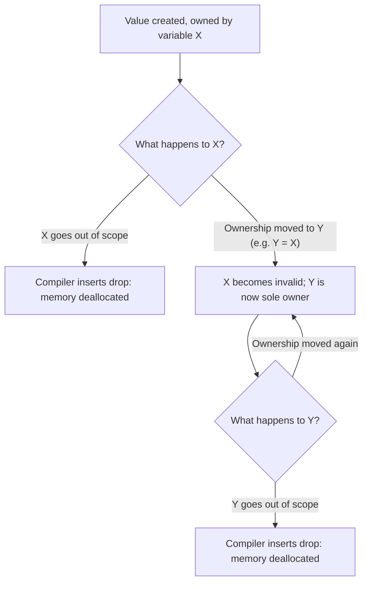
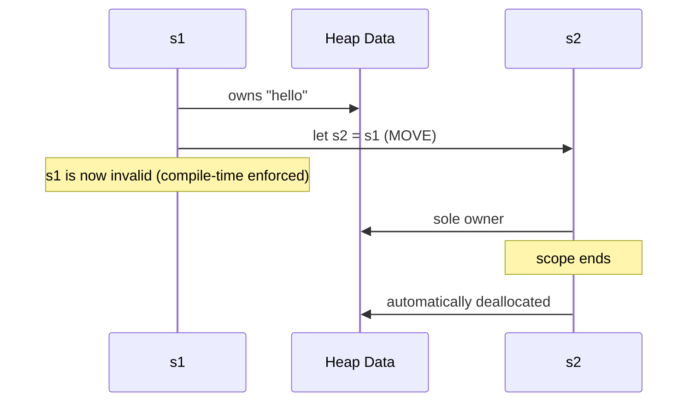
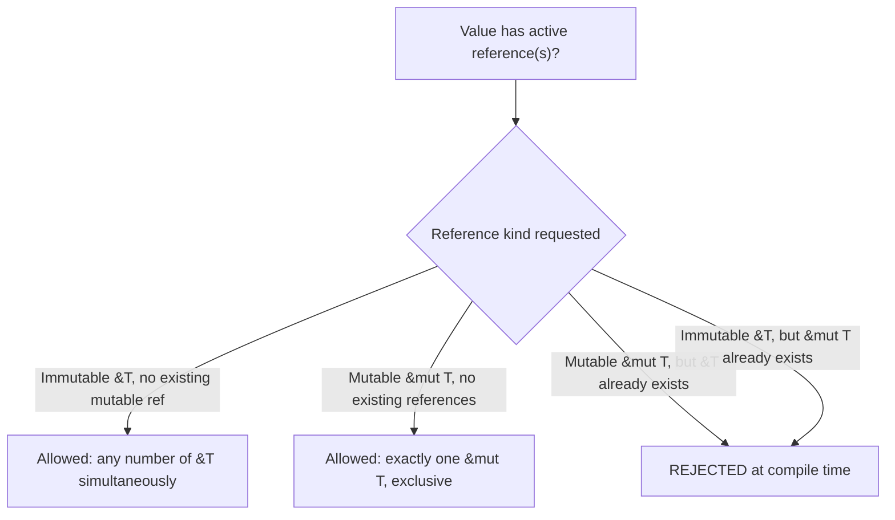

## Ownership and Borrowing Models

### Definition and Core Concept

Ownership and borrowing is a memory management approach in which the compiler enforces, at compile time, a set of rules about which part of a program is responsible for a given piece of memory and how that memory may be accessed, without requiring a runtime garbage collector or manual `free` calls. The central idea is that every value has exactly one **owner** at any point in the program; when the owner goes out of scope, the compiler automatically inserts code to deallocate the value. Other parts of the program may temporarily **borrow** access to a value — through references — under compiler-enforced restrictions that make certain classes of memory bugs (use-after-free, double-free, data races) impossible to compile in the first place, rather than merely unlikely at runtime.

Rust is the language most closely associated with popularizing this model at the systems-programming level, and it is used as the primary illustrative language throughout this section, though the underlying concepts (linear/affine types, region-based memory) predate Rust and appear in various forms in academic type theory and other languages.

### Key Points

- **Ownership** determines exactly one variable is responsible for freeing a given piece of heap-allocated data; when that variable's scope ends, deallocation happens automatically and deterministically.
- **Moving** a value transfers ownership to a new variable and invalidates the original variable at compile time — using the original after a move is a compile error, not a runtime bug.
- **Borrowing** allows temporary access to a value via a reference without transferring ownership, subject to strict compile-time rules about how many and what kind of references can exist simultaneously.
- The core enforcement mechanism is the **borrow checker**: a static analysis pass that rejects programs violating ownership/borrowing rules before they can even compile, rather than catching violations at runtime.
- This model achieves memory safety (no use-after-free, no double-free, no data races on shared mutable state) with **zero runtime overhead** for the ownership tracking itself — all the enforcement happens at compile time and produces no runtime checks.

### The Ownership Rule Set

Rust's ownership system is governed by three foundational rules:

1. Each value has exactly one owner (a variable) at any given time.
2. When the owner goes out of scope, the value is dropped (deallocated).
3. Ownership can be transferred (**moved**) to another variable, but a value can only have one owner at a time — after a move, the original variable is no longer valid.



### Moves: Ownership Transfer

Unlike languages where assignment implicitly copies or shares a reference, assigning a heap-owning value to a new variable in Rust **moves** ownership by default, invalidating the source variable:

```rust
fn ownership_move_demo() {
    let s1 = String::from("hello");  // s1 owns the heap-allocated string data
    let s2 = s1;                      // ownership MOVES to s2; s1 is now invalid

    // println!("{}", s1);            // COMPILE ERROR: value borrowed after move
    println!("{}", s2);               // valid: s2 is the sole owner
}   // s2 goes out of scope here; its heap data is automatically freed
```

This is fundamentally different from C++'s default copy semantics or a garbage-collected language's default reference-sharing semantics: there is only ever one owner, so there is never a question of which of multiple owners is responsible for freeing the memory, and there is no possibility of one owner freeing it while another still holds a now-dangling reference to it.



### Borrowing: Temporary, Non-Owning Access

Rather than moving ownership every time a function needs to use a value, Rust allows **borrowing** — passing a reference (`&T` for an immutable borrow, `&mut T` for a mutable borrow) that grants temporary access without transferring ownership:

```rust
fn calculate_length(s: &String) -> usize {  // borrows s, does not own it
    s.len()
}   // s goes out of scope here, but since it doesn't own the data, nothing is dropped

fn borrowing_demo() {
    let s1 = String::from("hello");
    let len = calculate_length(&s1);  // pass a reference; s1 remains valid and owned by borrowing_demo
    println!("The length of '{}' is {}.", s1, len);  // s1 is still usable here
}
```

### The Borrowing Rules

The borrow checker enforces two rules that, together, are what statically eliminate data races and many use-after-free scenarios:

1. At any given time, a value can have **either** one mutable reference (`&mut T`) **or** any number of immutable references (`&T`) — never both kinds simultaneously.
2. References must never outlive the data they point to (enforced via **lifetime** analysis).



```rust
fn borrow_rule_violation_demo() {
    let mut s = String::from("hello");

    let r1 = &s;     // immutable borrow #1 — OK
    let r2 = &s;     // immutable borrow #2 — OK, multiple immutable borrows allowed
    println!("{}, {}", r1, r2);

    let r3 = &mut s; // COMPILE ERROR if r1/r2 were still in use here:
                       // cannot borrow `s` as mutable because it is also borrowed as immutable
    println!("{}", r3);
}
```

This rule directly prevents the classic data-race pattern (one thread reading while another writes to the same memory) and a large class of iterator-invalidation bugs (mutating a collection while iterating over a reference into it), by making such code fail to compile rather than fail unpredictably at runtime.

### Lifetimes

A **lifetime** is the compiler's internal tracking of how long a reference is valid, used to guarantee a reference never outlives the data it points to (which would otherwise produce a dangling reference — the exact bug class stack-based memory management is vulnerable to without such checking):

```rust
fn dangling_reference_demo() -> &String {  // COMPILE ERROR: missing lifetime specifier
    let s = String::from("hello");
    &s   // s's memory is deallocated when this function returns
}        // the compiler proves the returned reference would immediately dangle, and refuses to compile
```

Most lifetimes are inferred automatically by the compiler without any annotation needed; explicit lifetime syntax (`'a`) becomes necessary only when the compiler cannot unambiguously determine how the lifetimes of multiple references relate to each other, such as when a function returns a reference derived from one of several input references:

```rust
fn longest<'a>(x: &'a str, y: &'a str) -> &'a str {
    if x.len() > y.len() { x } else { y }
}
// The annotation 'a tells the compiler: the returned reference
// will not outlive whichever of x or y has the SHORTER lifetime
```

The special `'static` lifetime denotes data valid for the entire duration of the program — typically data stored in the binary's static memory region (string literals, `static` items), as introduced in the discussion of static memory management.

### Shared Ownership: `Rc` and `Arc`

Strict single ownership is sometimes too restrictive — some data genuinely needs multiple owners (e.g., nodes in certain graph structures). Rust provides `Rc<T>` (Reference Counted) for this, which is essentially reference counting reintroduced as an explicit, opt-in escape hatch from strict single ownership:

```rust
use std::rc::Rc;

fn shared_ownership_demo() {
    let a = Rc::new(String::from("shared data"));  // refcount = 1
    let b = Rc::clone(&a);                            // refcount = 2, NOT a deep copy
    let c = Rc::clone(&a);                            // refcount = 3

    println!("refcount = {}", Rc::strong_count(&a));  // prints 3
}   // as a, b, c go out of scope in reverse order, refcount decrements;
    // data is freed when the count reaches 0
```

`Arc<T>` (Atomically Reference Counted) is the thread-safe equivalent, using atomic increment/decrement operations so it can be safely shared across threads — trading a small amount of performance for that safety, exactly the same trade-off discussed in the general reference-counting topic. Notably, `Rc`/`Arc` reintroduce the **reference cycle problem**: two `Rc`-owned objects referencing each other can leak, which Rust addresses the same way other reference-counted systems do — via an explicit `Weak<T>` reference type that does not contribute to the strong count.

### Comparison: Ownership Model vs. Other Strategies

| Aspect | Ownership/Borrowing (Rust) | Manual (`malloc`/`free`) | Garbage Collection | Reference Counting |
| --- | --- | --- | --- | --- |
| Deallocation timing | Deterministic, compile-time inserted | Deterministic, programmer-controlled | Non-deterministic, periodic | Deterministic, runtime count-based |
| Use-after-free | Prevented at compile time | Programmer's responsibility | Prevented by design (no manual free) | Possible if raw pointers bypass counting |
| Double free | Prevented at compile time | Programmer's responsibility | Not applicable | Not applicable (count-based) |
| Data races on shared mutable state | Prevented at compile time (borrow rules) | Programmer's responsibility | Programmer's responsibility (mutex/lock still needed) | Programmer's responsibility |
| Runtime overhead | None for ownership tracking itself | None | GC pauses, tracing cost | Per-operation count updates |
| Handles reference cycles | Only via explicit opt-in (`Rc`/`Weak`) | Programmer's responsibility | Yes, inherently | No (needs `Weak` or supplement) |
| Learning curve | Steep (borrow checker rules) | Moderate (but bug-prone) | Low (mostly transparent) | Low-to-moderate |

### Illustration: Borrow Checker Decision Flow

<svg xmlns="http://www.w3.org/2000/svg" viewBox="0 0 640 340" font-family="sans-serif">
<text x="320" y="24" text-anchor="middle" font-size="16" font-weight="bold" fill="#1a1a1a">Borrow Checker Decision Flow (svg_diagram)</text>
<rect x="240" y="45" width="160" height="40" rx="6" fill="#d6eaf8" stroke="#21618c" stroke-width="1.5" />
<text x="320" y="70" text-anchor="middle" font-size="12" fill="#1a1a1a">Reference requested</text>
<line x1="320" y1="85" x2="320" y2="115" stroke="#1a1a1a" stroke-width="1.5" />
<rect x="220" y="115" width="200" height="45" rx="6" fill="#eaeded" stroke="#5d6d7e" stroke-width="1.5" />
<text x="320" y="135" text-anchor="middle" font-size="11" fill="#1a1a1a">Any active mutable</text>
<text x="320" y="150" text-anchor="middle" font-size="11" fill="#1a1a1a">borrow exists?</text>
<line x1="220" y1="137" x2="100" y2="200" stroke="#1e8449" stroke-width="1.5" />
<text x="140" y="180" font-size="10" fill="#1e8449">No</text>
<rect x="20" y="200" width="180" height="45" rx="6" fill="#d4efdf" stroke="#1e8449" stroke-width="1.5" />
<text x="110" y="220" text-anchor="middle" font-size="11" fill="#1a1a1a">Immutable borrow</text>
<text x="110" y="235" text-anchor="middle" font-size="11" fill="#1a1a1a">allowed (compiles)</text>
<line x1="420" y1="137" x2="540" y2="200" stroke="#943126" stroke-width="1.5" />
<text x="500" y="180" font-size="10" fill="#943126">Yes</text>
<rect x="440" y="200" width="180" height="45" rx="6" fill="#f2d7d5" stroke="#943126" stroke-width="1.5" />
<text x="530" y="220" text-anchor="middle" font-size="11" fill="#1a1a1a">REJECTED:</text>
<text x="530" y="235" text-anchor="middle" font-size="11" fill="#1a1a1a">compile error</text>
<rect x="230" y="270" width="180" height="55" rx="6" fill="#fdebd0" stroke="#af601a" stroke-width="1.5" />
<text x="320" y="292" text-anchor="middle" font-size="11" fill="#1a1a1a">Mutable borrow requested:</text>
<text x="320" y="307" text-anchor="middle" font-size="11" fill="#1a1a1a">requires ZERO other active</text>
<text x="320" y="320" text-anchor="middle" font-size="11" fill="#1a1a1a">borrows of any kind</text>
</svg>

### Beyond Rust: Related Concepts in Other Languages

- **C++ move semantics** (`std::move`, rvalue references) introduce an opt-in notion of ownership transfer similar in spirit to Rust's moves, but without compiler-enforced invalidation of the moved-from variable — using a moved-from C++ object afterward is legal (though typically only safe to assign to or destroy) rather than a compile error, making it a weaker, convention-based version of the same idea.
- **Linear and affine type systems** in academic programming language theory are the formal foundation ownership/borrowing draws from: a **linear type** must be used exactly once, and an **affine type** must be used at most once — Rust's ownership model is generally understood as an affine type system in this sense, since a value can be dropped without use but never used after being moved. [Inference: this characterization reflects general type-theory literature associating Rust's model with affine typing; Rust's designers and documentation may frame the correspondence with varying degrees of formality.]
- **Region-based memory management**, explored in languages and research systems predating Rust, groups allocations into "regions" whose entire contents are freed together when the region ends — a coarser-grained ancestor concept to per-value lifetime tracking.
- **Swift's ownership modifiers** (`borrowing`, `consuming` parameter modifiers introduced in later Swift versions) reflect a convergence toward similar ownership-transfer concepts within a primarily ARC-based language. [Unverified: exact semantics and version availability of these modifiers should be checked against current Swift language documentation.]

### Trade-offs and Practical Considerations

- **Learning curve**: the borrow checker's rules, especially around lifetimes in complex data structures (self-referential structs, graphs with shared mutable nodes), are widely regarded as one of the steeper learning curves among mainstream systems languages, since idioms that are trivial in garbage-collected or manually-managed languages sometimes require substantial restructuring to satisfy the checker.
- **Zero runtime cost**: because all enforcement is static, compiled Rust binaries pay no runtime tax for the safety guarantees the ownership model provides — a key reason Rust is positioned as suitable for the same performance-critical, resource-constrained domains traditionally served only by C and C++.
- **Escape hatches**: Rust provides `unsafe` blocks that allow bypassing borrow-checker guarantees (raw pointer dereferencing, manual memory manipulation) when the programmer needs capabilities the checker cannot verify as safe — the safety guarantees of ownership/borrowing apply fully only to "safe" Rust code, with `unsafe` code shifting responsibility back to the programmer within that block.
- **Interoperability**: shared ownership (`Rc`/`Arc`) and interior mutability patterns (`RefCell`, `Mutex`) exist precisely to accommodate design patterns that don't fit cleanly into strict single-ownership/borrowing rules, at the cost of reintroducing some runtime checks or overhead (reference counts, runtime borrow tracking, lock overhead) for those specific cases.

### Related Topics

- Reference counting (the underlying mechanism behind `Rc`/`Arc`)
- Stack-based and heap-based memory management
- Garbage collection algorithms, as the alternative automatic-safety approach
- Linear and affine type systems in programming language theory
- C++ move semantics and RAII
- Concurrency and data-race prevention strategies
- Rust's `unsafe` keyword and its guarantees/responsibilities
- Interior mutability patterns (`RefCell`, `Mutex`, `Cell`)