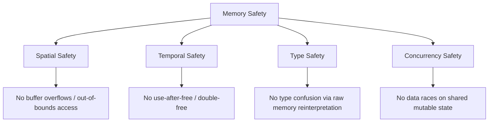
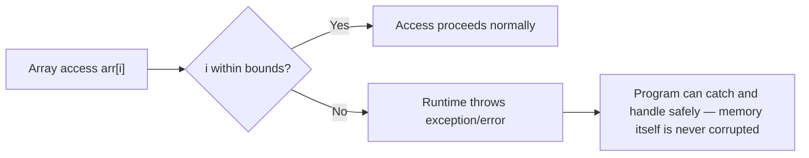
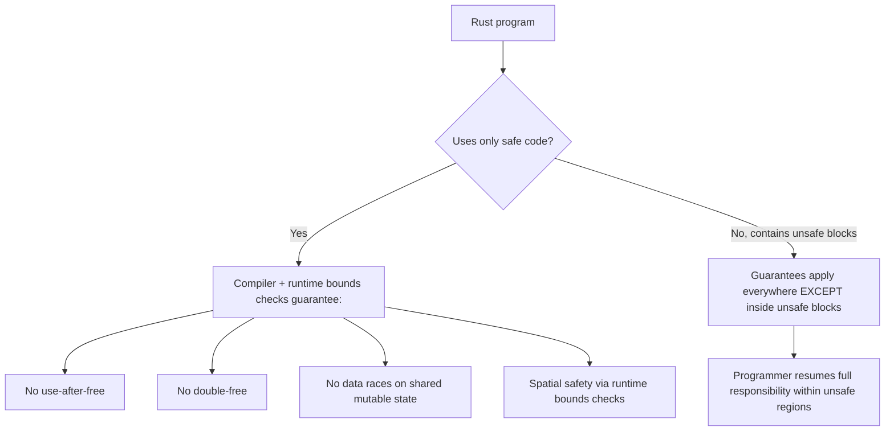

## Memory Safety Guarantees Across Language Families


### Definition and Core Concept

Memory safety is the property that a program cannot access memory in ways that violate the bounds, lifetime, or type of the data it was allocated for — no reading or writing past a buffer's end, no dereferencing a pointer to memory that has been freed, no interpreting one type's bit pattern as another's, and no unsynchronized concurrent access to shared mutable memory that produces undefined results. Different families of programming languages provide fundamentally different **guarantees** about memory safety, ranging from no guarantees at all (safety is entirely the programmer's responsibility) to strong guarantees enforced at compile time with no runtime cost. This topic synthesizes the safety implications of the static, stack-based, heap, manual, garbage-collected, reference-counted, and ownership-based models covered previously, comparing how each language family's chosen strategy translates into concrete safety guarantees — or the absence of them.

### Key Points

- Memory safety guarantees exist on a spectrum from **none** (raw C/assembly) through **runtime-enforced** (bounds-checked, garbage-collected languages) to **compile-time-enforced** (ownership/borrow-checked languages), each with different cost/control trade-offs.
- The specific vulnerability classes a language family eliminates depend directly on its memory management strategy: manual management is vulnerable to use-after-free and double-free; garbage collection eliminates those but not necessarily data races; ownership models can eliminate both categories at compile time.
- "Memory-safe" does not mean "bug-free" — memory safety guarantees specifically rule out undefined-behavior-class memory bugs, not logic errors, and most languages' safety guarantees only fully apply to code that avoids explicit unsafe escape hatches.
- Historically, memory-unsafe languages (C, C++) have accounted for a disproportionate share of exploited security vulnerabilities in widely deployed software, which is the primary practical motivation behind the industry-wide interest in memory-safe language adoption for new systems code. [Unverified: specific percentage figures cited in industry reports vary by source, methodology, and time period, and should be checked against the original report being referenced.]
- Every language family makes an explicit or implicit trade-off between the strength of its safety guarantees and the runtime/compile-time cost or expressiveness restrictions needed to provide them.

### The Vulnerability Classes at Stake

Before comparing language families, it is useful to define the specific bug classes memory safety guarantees address, most of which were covered individually in earlier topics:

- **Spatial safety**: whether an access stays within the bounds of the object it targets (buffer overflows are spatial safety violations).
- **Temporal safety**: whether an access happens only while the target object is still alive (use-after-free and double-free are temporal safety violations).
- **Type safety**: whether memory is only ever interpreted according to the type it was allocated as (type confusion bugs violate this).
- **Concurrency safety**: whether concurrent accesses to shared mutable memory are properly synchronized (data races violate this).



### Family 1: Unmanaged, No Runtime Enforcement (C, C++)

C and, to a large extent, C++ provide essentially no built-in memory safety guarantees. Arrays do not carry bounds information at runtime by default, pointers can be freely cast and arithmetic can be performed on them, and the language trusts the programmer completely to respect the allocation/deallocation contract described in the manual memory management topic.

```c
int arr[5];
arr[10] = 1;  // no bounds check — undefined behavior, may silently corrupt unrelated memory
```

**What is guaranteed**: essentially nothing beyond what the programmer personally verifies. All four vulnerability classes above are possible.

**What compensates**: disciplined coding patterns, static analyzers, sanitizers (AddressSanitizer, Valgrind), and — in modern C++ — RAII/smart pointers, which meaningfully reduce (but do not eliminate at the language level) temporal safety bugs, as covered in the heap management and manual memory management topics.

This absence of built-in guarantees is precisely why C and C++ remain closely associated, in security literature and industry migration discussions, with memory-safety-related vulnerabilities in large, long-lived codebases — not because the languages are poorly designed for their era's goals, but because their era's goals prioritized control and performance over safety enforcement.

### Family 2: Garbage-Collected, Runtime-Enforced (Java, Go, Python, JavaScript, C#)

Languages in this family eliminate manual deallocation entirely (removing use-after-free and double-free as language-level possibilities for ordinary object references) and typically pair this with **runtime bounds checking** on arrays/collections, which throws a catchable exception or error rather than silently corrupting memory on an out-of-bounds access.

```java
int[] arr = new int[5];
arr[10] = 1;  // throws ArrayIndexOutOfBoundsException at runtime — does NOT corrupt memory
```



**What is guaranteed**: spatial safety (via bounds checks) and temporal safety for ordinary references (the GC never frees an object still reachable from a live reference, and there is no manual `free` to misuse). Type safety is generally guaranteed for managed references, since the runtime tracks each object's actual type and rejects invalid casts.

**What is not guaranteed**: concurrency safety. Garbage collection prevents dangling-pointer-style temporal violations, but it does nothing to prevent two threads from racing on the same shared mutable object — this remains the programmer's responsibility via locks, atomics, or higher-level concurrency primitives, exactly as in unmanaged languages. Some languages in this family also expose explicit unsafe escape hatches (Java's deprecated/restricted `sun.misc.Unsafe` and newer Foreign Function & Memory API, C#'s `unsafe` keyword and pointer arithmetic) that reintroduce unmanaged-language risks within the marked regions. [Unverified: exact current API names, deprecation status, and restrictions vary by runtime version and should be checked against current language documentation.]

### Family 3: Reference-Counted, Mostly Automatic (Python, Swift, PHP)

This family, discussed in depth in the reference counting topic, provides guarantees similar to tracing garbage collection for ordinary object lifetimes (no manual free, so no use-after-free/double-free for normal references), but with the caveat that pure reference counting alone cannot reclaim cycles — a **resource leak** risk rather than a **memory safety** risk in the strict sense, since a leaked cyclic object does not cause corruption or invalid access, just delayed or absent reclamation.

**What is guaranteed**: the same temporal and type safety as tracing GC languages for ordinary references, plus (in languages like Swift with `weak`/`unowned`) programmer-controlled cycle-breaking. Concurrency safety is again not guaranteed by the memory model itself.

**A notable caveat**: Swift's `unowned` reference is an explicit assertion by the programmer that a referenced object will outlive the reference — if that assertion turns out to be false at runtime, the result is a **runtime crash** (a safe failure) rather than silent corruption, which is a materially different (and safer) failure mode than C's undefined behavior on an equivalent mistake, even though both stem from a programmer error.

### Family 4: Ownership/Borrowing, Compile-Time-Enforced (Rust)

As detailed in the ownership and borrowing topic, Rust's model enforces spatial, temporal, and — notably — concurrency safety for shared mutable state, all at compile time, within "safe" Rust code.

```rust
fn spatial_safety_demo() {
    let arr = [1, 2, 3, 4, 5];
    let idx = 10;
    let val = arr[idx]; // compiles, but PANICS at runtime with a bounds-check failure
                          // — a safe, controlled failure, not memory corruption
}
```



**What is guaranteed**: spatial safety (runtime bounds checks, same mechanism as garbage-collected languages, but paired with compile-time move/borrow tracking rather than a GC), temporal safety (compile-time, via ownership), and — uniquely among the families surveyed here — **concurrency safety for shared mutable state**, because the "one mutable reference OR many immutable references" rule directly prevents unsynchronized concurrent mutation from compiling, and Rust's `Send`/`Sync` marker traits extend similar compile-time checking to cross-thread data sharing.

**What is not guaranteed**: everything inside `unsafe` blocks, where the programmer explicitly opts out of compiler verification for operations the checker cannot itself prove safe (raw pointer dereferencing, calling into non-Rust code via FFI, certain low-level operations). Rust's safety guarantees are therefore best understood as guarantees about "safe Rust," with `unsafe` code carrying the same responsibility profile as C.

### Comparative Summary Table

| Language Family | Spatial Safety | Temporal Safety | Type Safety | Concurrency Safety | Enforcement Point | Escape Hatch |
| --- | --- | --- | --- | --- | --- | --- |
| C / C++ (unmanaged) | No | No | No (casts unchecked) | No | None (programmer discipline) | N/A — unsafe by default |
| Garbage-collected (Java, Go, C#, JS) | Yes (runtime check) | Yes (GC) | Yes (managed refs) | No | Runtime | Explicit unsafe APIs (varies by language) |
| Reference-counted (Python, Swift, PHP) | Yes (runtime check) | Yes, except cycles (leak risk, not corruption) | Yes (managed refs) | No | Runtime | Manual C extension interop |
| Ownership/borrowing (Rust, safe subset) | Yes (runtime check) | Yes (compile-time) | Yes | Yes (compile-time) | Compile time + minimal runtime checks | `unsafe` blocks |

### Illustration: Safety Guarantee Spectrum

<svg xmlns="http://www.w3.org/2000/svg" viewBox="0 0 640 260" font-family="sans-serif">
<text x="320" y="24" text-anchor="middle" font-size="16" font-weight="bold" fill="#1a1a1a">Memory Safety Guarantee Spectrum (svg_diagram)</text>
<line x1="60" y1="140" x2="580" y2="140" stroke="#1a1a1a" stroke-width="2" />
<polygon points="580,140 570,134 570,146" fill="#1a1a1a" />

<text x="60" y="165" text-anchor="middle" font-size="10" fill="`#555555`">Fewer guarantees</text>

<text x="580" y="165" text-anchor="middle" font-size="10" fill="`#555555`">More guarantees</text>

<circle cx="120" cy="140" r="10" fill="#943126" />
<text x="120" y="115" text-anchor="middle" font-size="11" fill="#1a1a1a">C / C++</text>
<text x="120" y="185" text-anchor="middle" font-size="10" fill="#555555">no built-in checks</text>
<circle cx="280" cy="140" r="10" fill="#af601a" />
<text x="280" y="115" text-anchor="middle" font-size="11" fill="#1a1a1a">Python / Swift</text>
<text x="280" y="185" text-anchor="middle" font-size="10" fill="#555555">refcounted, cycle risk</text>
<circle cx="420" cy="140" r="10" fill="#2471a3" />
<text x="420" y="115" text-anchor="middle" font-size="11" fill="#1a1a1a">Java / Go / C#</text>
<text x="420" y="185" text-anchor="middle" font-size="10" fill="#555555">GC, no concurrency safety</text>
<circle cx="540" cy="140" r="10" fill="#1e8449" />
<text x="540" y="115" text-anchor="middle" font-size="11" fill="#1a1a1a">Rust (safe subset)</text>
<text x="540" y="185" text-anchor="middle" font-size="10" fill="#555555">compile-time, incl. concurrency</text>

<text x="320" y="230" text-anchor="middle" font-size="11" fill="`#555555`">Position reflects breadth of guaranteed vulnerability classes, not overall language quality or suitability</text>

</svg>

### Cost of Guarantees: Runtime vs. Compile-Time Enforcement

The mechanism a language family uses to provide its guarantees has direct performance and ergonomics implications:

- **Runtime-enforced safety** (bounds checks, GC, reference counting) adds measurable per-operation cost — array accesses check bounds every time, GC pauses consume CPU time, reference count updates happen on nearly every pointer operation — but requires comparatively little from the programmer beyond normal usage; the safety is largely transparent.
- **Compile-time-enforced safety** (Rust's ownership/borrowing) shifts the cost from runtime execution to compile time and to programmer learning curve: the compiled binary pays no tax for temporal or concurrency safety, but the programmer must satisfy the borrow checker's rules, which can require restructuring code in ways that have no equivalent friction in garbage-collected languages.
- **No enforcement** (C/C++) has the lowest inherent runtime and compile-time cost from the language itself, but shifts the entire cost of achieving safety onto the programmer's discipline, code review process, and external tooling (sanitizers, fuzzers, static analyzers) — a cost that is real but external to the compiler/runtime and historically has not been paid completely, given the vulnerability track record referenced earlier.

### Practical Implications for Language Choice

- **New systems-level projects** with strong security requirements increasingly consider Rust specifically because it is one of the few options offering C/C++-competitive performance alongside compile-time memory and concurrency safety guarantees, avoiding the runtime cost of GC while still eliminating the vulnerability classes GC-based languages address only partially (concurrency) or C/C++ address not at all.
- **Application-level development** where iteration speed and ergonomics matter more than the last percentage of performance generally favors garbage-collected or reference-counted languages, accepting their runtime enforcement cost and lack of built-in concurrency safety (mitigated instead through language-level concurrency models like Go's goroutines-with-channels convention or explicit locking disciplines) in exchange for simpler mental models.
- **Existing large C/C++ codebases** face a harder trade-off: full rewrites in a memory-safe language are often impractical, so mitigation typically combines sanitizer-based testing, static analysis, fuzzing, and incremental adoption of safer subsets or interop with memory-safe languages at component boundaries, rather than an outright language switch. [Inference: this characterization reflects widely discussed industry migration patterns rather than a single documented standard practice, since actual approaches vary significantly by organization and codebase.]

### Related Topics

- Manual memory management and its risks
- Garbage collection algorithms
- Reference counting
- Ownership and borrowing models
- Concurrency models and data race prevention
- Static analysis and fuzzing for memory-safety verification
- Foreign Function Interfaces (FFI) and safety boundaries between languages
- Type systems: static vs. dynamic typing and their safety implications