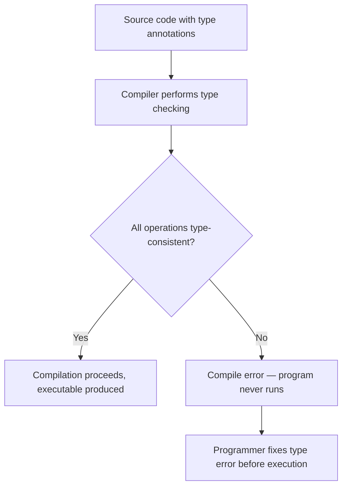
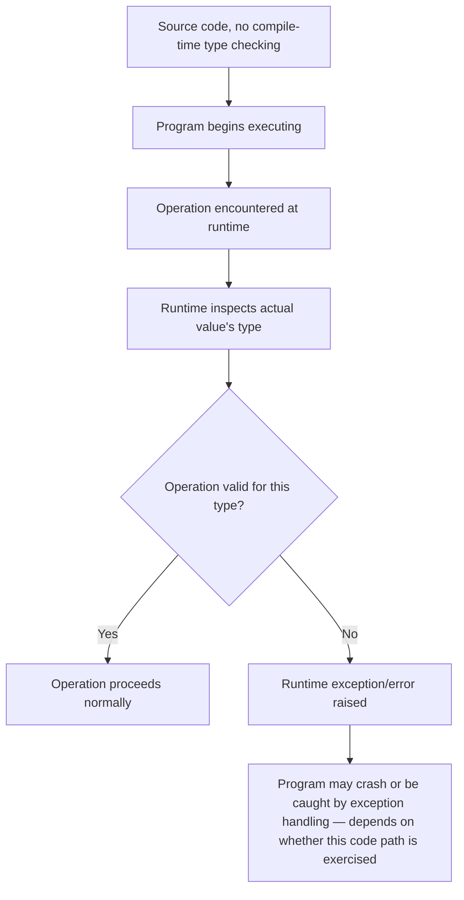
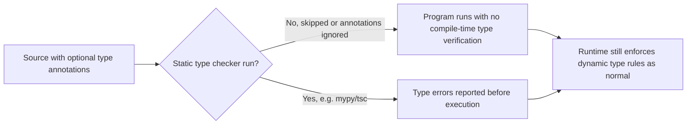

## Static Typing Versus Dynamic Typing Philosophies


### Definition and Core Concept

Type systems govern when and how a programming language verifies that operations are applied to values of appropriate types. **Static typing** checks type correctness at compile time, before the program ever runs, rejecting programs with type errors before execution begins. **Dynamic typing** defers this checking to runtime, verifying (or failing to verify) that an operation is valid for a value's actual type only at the moment the operation executes. This distinction is orthogonal to, but frequently conflated with, the strong/weak typing distinction (how strictly a language enforces type boundaries once checking happens) — a language can be statically and weakly typed (C, with its permissive implicit conversions) or dynamically and strongly typed (Python, which raises errors on invalid operations rather than silently coercing).

### Key Points

- The core distinction is **timing**: static typing verifies types before the program runs; dynamic typing verifies types as each operation executes.
- Static and dynamic typing are **independent** of strong versus weak typing — strength describes how permissive the language is about implicit conversions and unchecked operations, not when checking occurs.
- Statically typed languages generally catch a class of bugs (type mismatches, incompatible function calls) before the program ever runs; dynamically typed languages surface the equivalent bugs as runtime exceptions, potentially in production, if the offending code path is not exercised during testing.
- The trade-off is fundamentally between **compile-time safety and tooling support** (static typing) versus **flexibility and reduced upfront ceremony** (dynamic typing) — neither approach is strictly superior across all contexts.
- Modern language design increasingly blurs the boundary through **type inference** (reducing static typing's verbosity) and **gradual typing systems** (adding optional static checking to traditionally dynamic languages), reflecting a partial convergence between the philosophies.

### Static Typing: Mechanism and Guarantees

In a statically typed language, every variable, expression, and function signature has a type that is either explicitly declared or inferred by the compiler, and the compiler verifies that all operations are consistent with those types before producing an executable program.

```java
int x = 5;
String s = "hello";
int result = x + s;   // COMPILE ERROR: cannot add int and String
```



**Type inference** allows statically typed languages to reduce explicit annotation burden while retaining full compile-time checking — the compiler determines types from context rather than requiring the programmer to write them out:

```rust
let x = 5;              // inferred as i32
let s = "hello";         // inferred as &str
let result = x + s;      // COMPILE ERROR: still caught, despite no explicit type annotations
```

```haskell
-- Haskell: fully inferred, no annotations required, still statically checked
add x y = x + y
-- Compiler infers a general numeric type signature and enforces it at every call site
```

Languages spanning a range of annotation verbosity — from heavily explicit (Java, C, older C++) to almost entirely inferred (Haskell, OCaml, and largely Rust and modern TypeScript/Kotlin/Swift) — are all still considered statically typed, because the checking happens at compile time regardless of how much of the type information is written by the programmer versus inferred by the compiler.

### Dynamic Typing: Mechanism and Guarantees

In a dynamically typed language, variables do not have a fixed type — they simply hold a reference to a value, and that value carries its own type information, checked only when an operation is actually attempted on it.

```python
x = 5
s = "hello"
result = x + s   # No error until this line actually EXECUTES
                   # TypeError: unsupported operand type(s) for +: 'int' and 'str'
```



A critical consequence of this model is that a type error in a rarely-executed code path (an error-handling branch, an edge case, a feature behind a rarely-toggled flag) can remain completely undetected through normal development and even substantial testing, only to surface the first time that specific path executes in production — a risk profile fundamentally different from static typing, where the compiler examines every code path for type consistency regardless of whether it is ever executed at runtime.

### Philosophical Underpinnings

**The static typing philosophy** holds that types are a form of machine-checked documentation and specification: expressing intent explicitly (or via strong inference) allows the compiler to act as a tireless reviewer, catching an entire category of mistakes before a human ever needs to notice them, and enabling tooling (autocomplete, refactoring, "find all usages") that depends on knowing types without running the code. This philosophy tends to value **correctness guarantees established as early as possible** and treats the friction of writing/satisfying type signatures as a worthwhile investment that pays off in reduced runtime failures and improved long-term maintainability, particularly as codebases and teams grow.

**The dynamic typing philosophy** holds that flexibility and reduced ceremony accelerate development, especially in exploratory, small-scale, or rapidly-changing contexts, and that the discipline needed to avoid type errors can often be achieved through good testing practices, code review, and runtime introspection rather than requiring the compiler to prove it in advance. This philosophy tends to value **expressiveness and iteration speed**, treating the possibility of a runtime type error as an acceptable trade-off for the ability to write more generic, less ceremonial code — for instance, a single dynamically typed function that transparently works across many different types without any generic-type machinery.

```python
def print_twice(x):     # works for ANY type without any generic/template syntax
    print(x)
    print(x)

print_twice(5)
print_twice("hello")
print_twice([1, 2, 3])
```

```java
// Achieving the same flexibility statically requires explicit generics
<T> void printTwice(T x) {
    System.out.println(x);
    System.out.println(x);
}
```

### Duck Typing

A specific and commonly discussed dynamic typing idiom is **duck typing** — the principle that an object's suitability for an operation is determined by whether it supports the required methods/behavior, not by its declared type or explicit interface implementation ("if it walks like a duck and quacks like a duck, it's a duck"):

```python
class Duck:
    def make_sound(self):
        return "Quack"

class Dog:
    def make_sound(self):
        return "Woof"

def animal_sound(animal):
    return animal.make_sound()   # works for ANY object with a make_sound method,
                                    # regardless of class hierarchy or declared interface

print(animal_sound(Duck()))
print(animal_sound(Dog()))
```

Statically typed languages typically achieve comparable flexibility through explicit mechanisms — interfaces (Java, C#, Go), traits (Rust), or protocols (Swift) — which require the type to formally declare conformance, an approach that trades duck typing's implicit flexibility for compile-time verification that the required behavior is actually present.

### Gradual and Optional Typing: A Middle Ground

Recognizing the trade-offs on both sides, many ecosystems have introduced **gradual typing** — an opt-in static type-checking layer added on top of a fundamentally dynamic runtime, allowing incremental adoption rather than an all-or-nothing choice:

- **TypeScript** adds a static type system on top of JavaScript; type annotations are checked by the TypeScript compiler, but the emitted JavaScript that actually runs has no runtime type enforcement from TypeScript itself — types exist purely as a compile-time development aid, and can be selectively bypassed (e.g., with `any`).
- **Python type hints** (via the `typing` module and PEP 484) allow optional static annotations checked by external tools (mypy, Pyright), while the Python runtime itself continues to enforce nothing based on these hints at execution time.

```typescript
function add(x: number, y: number): number {
    return x + y;
}
add(5, "hello");   // TypeScript compiler flags this as an error
                     // but plain JavaScript at runtime would not
```

```python
def add(x: int, y: int) -> int:
    return x + y

add(5, "hello")   # Type checkers (mypy) flag this,
                    # but the Python interpreter itself will still attempt it and raise a TypeError at runtime
```



Gradual typing systems generally do not provide the same guarantee strength as languages with type checking built into the compiler/runtime itself, since annotations can be incomplete, use escape-hatch types (`any` in TypeScript, unannotated code in Python), or simply not be checked if the external tool is not run as part of the build process — the guarantee is only as strong as the discipline of actually running and heeding the checker.

### Comparison Table

| Aspect | Static Typing | Dynamic Typing |
| --- | --- | --- |
| When type errors surface | Compile time | Runtime, only if that code path executes |
| Upfront ceremony | Higher (declarations or inference-friendly structure) | Lower |
| Tooling support (autocomplete, refactoring) | Generally stronger, since types are known without execution | Generally weaker, though improved by runtime type hints and introspection |
| Generic/polymorphic code | Requires explicit mechanisms (generics, interfaces, traits) | Often naturally polymorphic (duck typing) |
| Refactoring safety | Compiler flags most type-related breakage immediately | Relies on test coverage to catch breakage |
| Iteration speed for small/exploratory code | Can feel slower due to upfront type structure | Often faster, less ceremony |
| Long-term large-codebase maintainability | Generally favored, given compiler-enforced contracts | Requires strong testing/discipline to substitute for compiler checks |
| Example languages | Java, C, C++, Rust, Go, Haskell, C#, Kotlin, Swift | Python, JavaScript, Ruby, PHP, Lua |
| Gradual/hybrid examples | TypeScript (adds static layer to JS), mypy-checked Python | Same — represents the middle ground itself |

### Illustration: When Type Errors Are Caught

<svg xmlns="http://www.w3.org/2000/svg" viewBox="0 0 640 300" font-family="sans-serif">
<text x="320" y="24" text-anchor="middle" font-size="16" font-weight="bold" fill="#1a1a1a">When Type Errors Surface (svg_diagram)</text>

<text x="160" y="55" text-anchor="middle" font-size="13" font-weight="bold" fill="`#1a1a1a`">Static Typing</text>

<rect x="60" y="70" width="200" height="40" fill="`#d6eaf8`" stroke="`#21618c`" stroke-width="1.5" />

<text x="160" y="94" text-anchor="middle" font-size="11" fill="`#1a1a1a`">Write code</text>

<rect x="60" y="120" width="200" height="40" fill="`#f2d7d5`" stroke="`#943126`" stroke-width="1.5" />

<text x="160" y="144" text-anchor="middle" font-size="11" fill="`#1a1a1a`">Compile: ALL paths checked</text>

<rect x="60" y="170" width="200" height="40" fill="`#d4efdf`" stroke="`#1e8449`" stroke-width="1.5" />

<text x="160" y="194" text-anchor="middle" font-size="11" fill="`#1a1a1a`">Run (only if compile succeeded)</text>

<text x="480" y="55" text-anchor="middle" font-size="13" font-weight="bold" fill="`#1a1a1a`">Dynamic Typing</text>

<rect x="380" y="70" width="200" height="40" fill="`#d6eaf8`" stroke="`#21618c`" stroke-width="1.5" />

<text x="480" y="94" text-anchor="middle" font-size="11" fill="`#1a1a1a`">Write code</text>

<rect x="380" y="120" width="200" height="40" fill="`#d4efdf`" stroke="`#1e8449`" stroke-width="1.5" />

<text x="480" y="144" text-anchor="middle" font-size="11" fill="`#1a1a1a`">Run immediately, no type check pass</text>

<rect x="380" y="170" width="200" height="40" fill="`#fdebd0`" stroke="`#af601a`" stroke-width="1.5" />

<text x="480" y="194" text-anchor="middle" font-size="10" fill="`#1a1a1a`">Type errors surface only on</text>

<text x="480" y="207" text-anchor="middle" font-size="10" fill="`#1a1a1a`">paths actually executed</text>

<text x="320" y="250" text-anchor="middle" font-size="11" fill="`#555555`">Static: every path examined before any execution. Dynamic: only executed paths are checked, and only when reached.</text>

</svg>

### Practical Trade-offs by Context

- **Large, long-lived, multi-team codebases** tend to favor static typing because compiler-enforced contracts between components reduce the risk that a change in one part of the system silently breaks another, and refactoring tools relying on static type information scale better as codebase size grows.
- **Small scripts, exploratory data analysis, and rapid prototyping** often favor dynamic typing because the reduced ceremony allows faster iteration when the shape of the problem is still being discovered, and the cost of an occasional runtime type error is low relative to the productivity gained.
- **Performance-critical systems software** generally favors static typing not only for its safety benefits but because static type information allows the compiler to generate more efficient machine code — knowing a value's exact type and size at compile time enables optimizations (avoiding runtime type dispatch, allowing better register allocation) that are difficult or impossible when types are only known at runtime.
- **API and library boundaries** — even in fundamentally dynamic ecosystems — increasingly adopt gradual typing (TypeScript for JavaScript libraries, type-hinted Python packages) specifically because clearly documented, checkable type contracts at a boundary provide much of static typing's safety benefit exactly where it matters most: where code from different authors or teams interacts.

### Related Topics

- Type inference algorithms (Hindley-Milner and variants)
- Strong versus weak typing (distinct from static/dynamic)
- Gradual typing systems (TypeScript, Python type hints, Sorbet)
- Generic programming and parametric polymorphism
- Duck typing and structural typing versus nominal typing
- Compile-time metaprogramming and its relationship to static type systems
- Memory safety guarantees across language families
- Interface and trait-based polymorphism