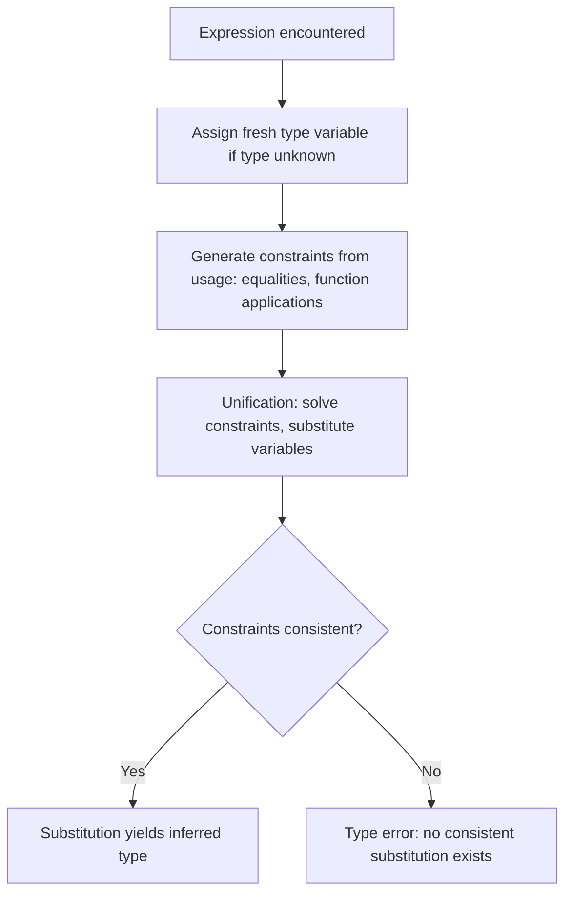
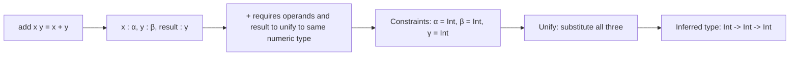
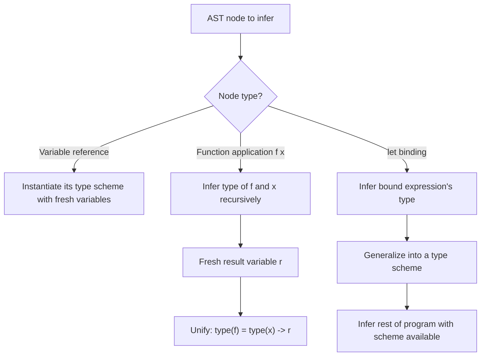
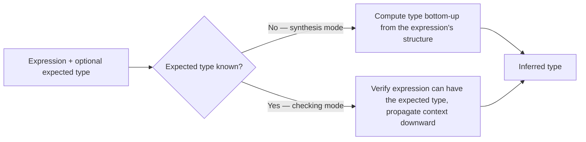

## Type Inference Algorithms

### Definition and Core Concept

Type inference is the process by which a compiler automatically determines the types of expressions and variables without requiring the programmer to write explicit type annotations everywhere. Rather than a single technique, "type inference" refers to a family of algorithms that analyze how values flow through a program — through assignments, function calls, and operations — and deduce the most general type consistent with that usage. The most influential and widely studied of these is the **Hindley-Milner** algorithm (and its common implementation, **Algorithm W**), which underlies type inference in ML, Haskell, OCaml, F#, and heavily influences the inference systems in Rust, Swift, Kotlin, and TypeScript, even though each of these languages extends or modifies the core algorithm to accommodate features Hindley-Milner alone does not support.

### Key Points

- Type inference lets statically typed languages retain full compile-time type checking (as discussed in the static vs. dynamic typing topic) while reducing or eliminating the need for explicit type annotations.
- The **Hindley-Milner (HM)** algorithm can infer the most general (**principal**) type for any expression in its supported language subset, without any type annotations at all, and does so in close to linear time in practice.
- The core mechanism combines two ideas: generating **type variables** as placeholders for unknown types, and **unification**, a process that solves equations between types to determine what each variable must be.
- Real-world languages extend Hindley-Milner to support features it does not natively handle well — subtyping, operator overloading, higher-rank polymorphism — which is why languages like Rust, Swift, and TypeScript use HM-inspired but modified inference systems rather than the textbook algorithm unmodified.
- Type inference is not unlimited: every algorithm has expressiveness limits, and real programs occasionally require explicit annotations at points the algorithm cannot resolve unambiguously — these boundary cases reveal where a given inference algorithm's guarantees end.

### The Building Blocks: Type Variables and Unification

**Type variables** are placeholders (often written `α`, `β`, or `t0`, `t1` in algorithm descriptions) representing a type not yet known. As the algorithm examines the program, it generates fresh type variables for expressions whose type isn't immediately obvious from a literal or annotation.

**Unification** is the process of solving constraints of the form "type A must equal type B," progressively substituting type variables with concrete types (or with other type variables) until either a consistent solution is found or a contradiction proves the program is not well-typed.



### Worked Example: Inferring a Simple Function

Consider the following function, written with no type annotations at all, in an ML-family-style pseudocode:



```
let add x y = x + y
```

The algorithm proceeds roughly as follows:

1. Assign fresh type variables: `x : α`, `y : β`, and the function itself has type `α → β → γ` (a function taking an `α` and a `β`, returning a `γ`).
2. Examine the body `x + y`. The `+` operator requires both operands to be the same numeric type — this generates the constraints `α = Int` and `β = Int` (in a simple, non-overloaded arithmetic model) and `γ = Int` (the result of adding two `Int`s is an `Int`).
3. Unify: substitute `α := Int`, `β := Int`, `γ := Int` throughout.
4. The inferred type of `add` is `Int → Int → Int`.



### Polymorphism and Generalization

A key strength of Hindley-Milner is inferring **polymorphic** types — types general enough to work across many concrete types — for functions that never constrain their arguments to a specific type:



```
let identity x = x
```

Here, nothing in the body constrains `x`'s type at all. Instead of forcing a specific type, the algorithm performs **generalization**: it recognizes that the type variable `α` in `identity : α → α` is unconstrained by anything in the function's own definition, and so generalizes it into a **type scheme** — `∀α. α → α` ("for all types α, a function from α to α") — allowing `identity` to be used at many different concrete types across different call sites without redefinition.



```
identity 5        -- instantiates α := Int, returns Int
identity "hello"   -- instantiates α := String, returns String
identity [1,2,3]   -- instantiates α := List Int, returns List Int
```

This is the mechanism underlying what is often called **parametric polymorphism** (generics, in mainstream language terminology) — a single, un-annotated function definition automatically works correctly and safely across an unbounded set of concrete types, with the compiler verifying each specific instantiation independently.

```rust
fn identity<T>(x: T) -> T {
    x
}
// Rust requires the <T> annotation explicitly (unlike pure Hindley-Milner inference of the type scheme itself),
// but once declared generic, the compiler still infers T at each call site
let a = identity(5);        // T inferred as i32
let b = identity("hello");  // T inferred as &str
```

### Algorithm W: The Canonical Implementation

**Algorithm W**, introduced by Robin Milner and later refined, is the standard procedural formulation of Hindley-Milner inference. It processes an expression's abstract syntax tree recursively, and at each node:

1. If the node is a variable reference to something with a known **type scheme** (like `identity` above), it **instantiates** that scheme with fresh type variables, producing a fresh, specific type for this particular use.
2. If the node is a function application (`f x`), it recursively infers types for `f` and `x`, generates a fresh type variable for the application's result, and unifies `f`'s type with `(type of x) → (fresh result variable)`.
3. If the node is a `let` binding, it infers the bound expression's type first, generalizes it into a type scheme (as with `identity` above), and then infers the rest of the program with that scheme available for instantiation at each use.



A defining theoretical property of Algorithm W is that it computes the **principal type** — the single most general type from which every other valid typing of the expression can be derived by substitution. This means the algorithm never needs to "guess" among multiple equally valid inferred types; if a well-typed principal type exists, Algorithm W finds it deterministically.

### The Occurs Check

A critical correctness step within unification is the **occurs check**: before substituting a type variable `α` with some type `T`, the algorithm must verify that `α` does not itself appear somewhere inside `T`. Without this check, the algorithm could construct an infinite, self-referential type.



```
-- Attempting to unify α with (α -> Int) without an occurs check
-- would imply α = α -> Int = (α -> Int) -> Int = ((α -> Int) -> Int) -> Int = ...
-- an infinitely nested type, which is not a valid finite type
```

Omitting the occurs check for performance reasons (some practical implementations do, under specific controlled circumstances) can silently accept programs that should be rejected, or cause the algorithm to loop or crash when it encounters a genuinely self-referential type constraint. [Unverified: which production compilers omit the occurs check under which specific circumstances, and their exact justifications, vary by implementation and should be checked against that compiler's own documentation.]

### Limitations of Classical Hindley-Milner

Textbook Hindley-Milner, while powerful, does not natively support several features common in real-world languages:

- **Subtyping**: HM assumes types are either identical or fundamentally incompatible; it has no native notion of "this type can be used wherever that broader type is expected" (as with class inheritance hierarchies), which object-oriented languages need.
- **Ad-hoc polymorphism / overloading**: A single operator or function name behaving differently depending on argument type (like `+` working on both integers and floats, or user-defined operator overloading) is not directly expressible in classical HM, which assumes each name has exactly one (possibly polymorphic) type scheme.
- **Higher-rank polymorphism**: HM's `let`-generalization only generalizes at `let`/function-definition boundaries; passing a genuinely polymorphic function as an argument to another function (rather than binding it with `let` first) requires "higher-rank" types that classical HM's inference algorithm cannot infer without explicit annotation.
- **Mutable references**: Naively combining HM-style generalization with mutable state can produce unsound programs (a well-known historical pitfall sometimes discussed as the "let-polymorphism and refs" problem); practical implementations (OCaml, for instance) apply specific restrictions — commonly a form of the **value restriction** — to preserve soundness. [Unverified: the exact restriction mechanism and its precise formal conditions differ across language implementations and should be checked against that language's own type-system documentation.]

### How Real Languages Extend Hindley-Milner

**Haskell's type classes** solve the ad-hoc polymorphism gap by attaching **constraints** to type variables rather than abandoning inference — a function can be inferred to have a type like `(Num a) => a -> a -> a` ("for any type `a` that implements the `Num` interface"), preserving full inference while still supporting operator overloading in a principled, checkable way.

```haskell
add x y = x + y
-- Inferred type: (Num a) => a -> a -> a
-- Works for Int, Float, or any user type implementing the Num type class,
-- while still being fully inferred with zero annotations
```

**Rust's inference** operates locally within function bodies (inferring the types of local variables and expressions from context) but deliberately requires explicit type signatures on function boundaries (parameters and return types) rather than inferring them globally across the whole program the way classical HM would. [Inference: this design choice is widely understood as prioritizing predictable compile times, clearer error messages, and stable API contracts over the more powerful but more implementation-complex whole-program inference classical HM performs, though the exact rationale is a design trade-off rather than a strict technical necessity.]

```rust
fn process() {
    let x = 5;              // inferred locally: i32
    let y = vec![1, 2, 3];   // inferred locally: Vec<i32>
    let z = y.iter().sum::<i32>(); // inferred, with an explicit turbofish where ambiguity exists
}

fn add(x: i32, y: i32) -> i32 {  // function signature: NOT inferred, must be explicit
    x + y
}
```

**TypeScript's inference**, layered onto JavaScript's dynamic runtime as a gradual typing system (as discussed in the static/dynamic typing topic), infers types from initializers, return statements, and control flow, and additionally performs structural (rather than purely nominal) matching, contextual typing based on how a value is used, and increasingly sophisticated narrowing within conditional branches — extensions well beyond what classical Hindley-Milner addresses, since TypeScript must also model JavaScript's existing dynamic semantics faithfully.

```typescript
function add(x: number, y: number) {
    return x + y;   // return type inferred as 'number' from the body, no explicit annotation needed
}

let value = Math.random() > 0.5 ? "text" : 42;
// inferred as: string | number (a union type) — a feature outside classical HM's model entirely
```

### Bidirectional Type Checking: A Complementary Approach

Many modern type systems (particularly those needing to support subtyping and higher-rank polymorphism cleanly) use **bidirectional type checking** instead of, or blended with, HM-style unification. Bidirectional checking splits the problem into two distinct modes: **synthesis** (given an expression, compute its type from the bottom up) and **checking** (given an expression and an expected type, verify the expression can have that type, propagating type information top-down). This combination handles cases classical unification-based HM inference struggles with — notably, checking a lambda expression against an already-known expected function type is often more straightforward under bidirectional checking than under pure unification, since the expected type can guide inference of the lambda's parameter types directly rather than requiring the algorithm to invent fresh type variables and unify them after the fact.



### Comparison of Approaches

| Aspect | Classical Hindley-Milner (Algorithm W) | Bidirectional Type Checking | Local/Gradual Inference (Rust, TypeScript style) |
| --- | --- | --- | --- |
| Scope of inference | Whole-program / whole-expression | Per-expression, guided by context | Local (within function bodies), explicit at boundaries |
| Requires annotations | None, in the classical form | Sometimes, at synthesis/checking boundaries | Yes, at function signatures / ambiguous points |
| Handles subtyping natively | No | Yes, more naturally | Varies — often layered on top |
| Handles higher-rank polymorphism | No, without extension | Yes, more naturally | Varies by language |
| Principal types guaranteed | Yes, in the supported subset | Not always, depending on system design | Not always guaranteed globally |
| Typical languages | ML, Haskell (core), OCaml, F# | Many modern research and production languages, often blended with HM | Rust, TypeScript, Swift, Kotlin |

### Illustration: Type Variable Resolution Through Unification

<svg xmlns="http://www.w3.org/2000/svg" viewBox="0 0 640 300" font-family="sans-serif">
<text x="320" y="24" text-anchor="middle" font-size="16" font-weight="bold" fill="#1a1a1a">Unification Resolving Type Variables (svg_diagram)</text>
<rect x="40" y="55" width="130" height="40" rx="6" fill="#eaeded" stroke="#5d6d7e" stroke-width="1.5" />
<text x="105" y="79" text-anchor="middle" font-size="11" fill="#1a1a1a">x : α (unknown)</text>
<rect x="40" y="115" width="130" height="40" rx="6" fill="#eaeded" stroke="#5d6d7e" stroke-width="1.5" />
<text x="105" y="139" text-anchor="middle" font-size="11" fill="#1a1a1a">y : β (unknown)</text>
<rect x="250" y="85" width="160" height="40" rx="6" fill="#d6eaf8" stroke="#21618c" stroke-width="1.5" />
<text x="330" y="109" text-anchor="middle" font-size="11" fill="#1a1a1a">x + y requires α = β = Int</text>
<line x1="170" y1="75" x2="250" y2="100" stroke="#1a1a1a" stroke-width="1.5" />
<line x1="170" y1="135" x2="250" y2="110" stroke="#1a1a1a" stroke-width="1.5" />
<line x1="330" y1="125" x2="330" y2="170" stroke="#1a1a1a" stroke-width="1.5" />
<rect x="250" y="170" width="160" height="40" rx="6" fill="#d4efdf" stroke="#1e8449" stroke-width="1.5" />
<text x="330" y="194" text-anchor="middle" font-size="11" fill="#1a1a1a">Substitute: α := Int, β := Int</text>
<line x1="330" y1="210" x2="330" y2="240" stroke="#1a1a1a" stroke-width="1.5" />
<rect x="230" y="240" width="200" height="40" rx="6" fill="#fdebd0" stroke="#af601a" stroke-width="1.5" />
<text x="330" y="264" text-anchor="middle" font-size="11" fill="#1a1a1a">Result: add : Int -&gt; Int -&gt; Int</text>
</svg>

### Practical Significance

Type inference matters beyond mere convenience: it directly shapes what a statically typed language can offer without imposing the annotation burden associated with older, less inference-capable statically typed languages (early Java and C, where nearly every variable required an explicit type). Effective inference is a major reason languages like Rust, Kotlin, Swift, and modern C++ (with `auto`) can offer static typing's safety and tooling benefits (discussed in the static vs. dynamic typing comparison) while approaching the reduced ceremony historically associated with dynamically typed languages — narrowing, though not eliminating, one of the traditional trade-offs between the two typing philosophies.

### Related Topics

- Static typing versus dynamic typing philosophies
- Parametric polymorphism and generics implementation
- Subtyping and variance (covariance, contravariance)
- Higher-kinded types and higher-rank polymorphism
- Type classes and trait-based ad-hoc polymorphism
- Gradual typing systems (TypeScript, Python type hints)
- Compiler design: lexing, parsing, and semantic analysis phases
- Curry-Howard correspondence and formal type theory foundations