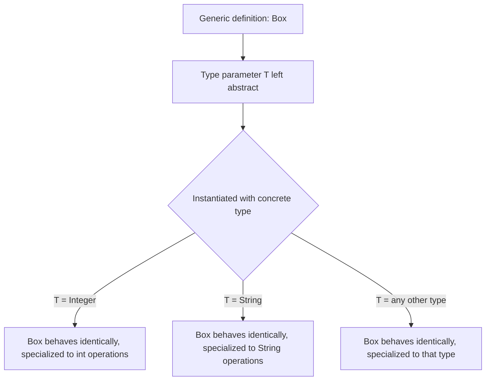
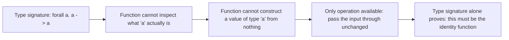
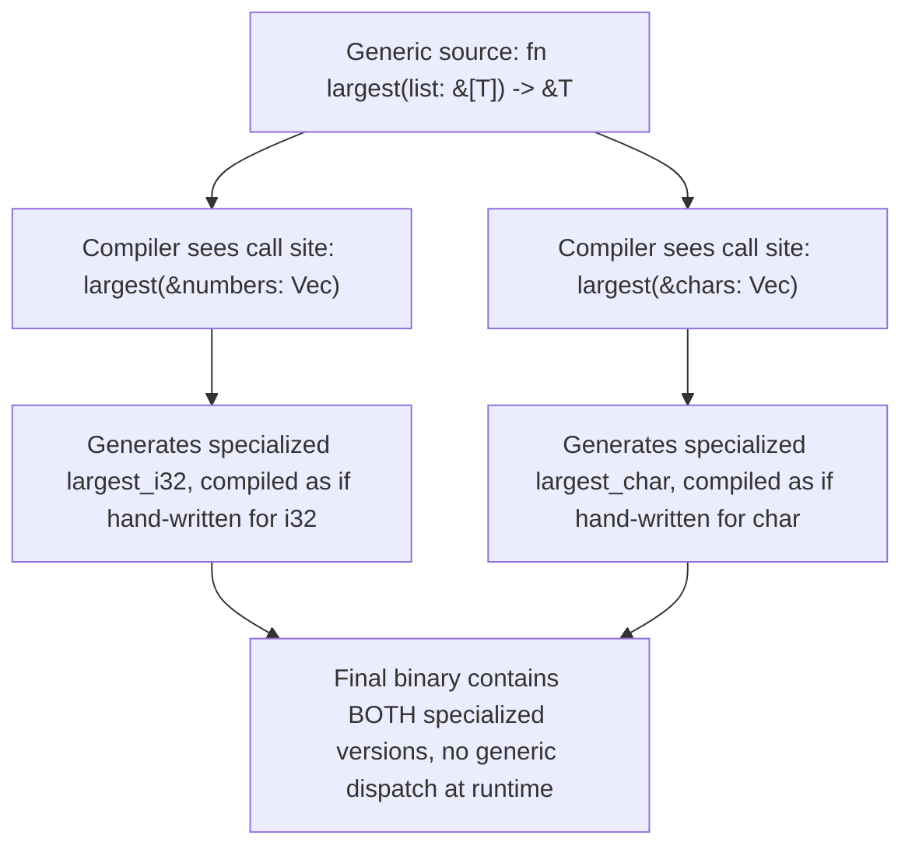
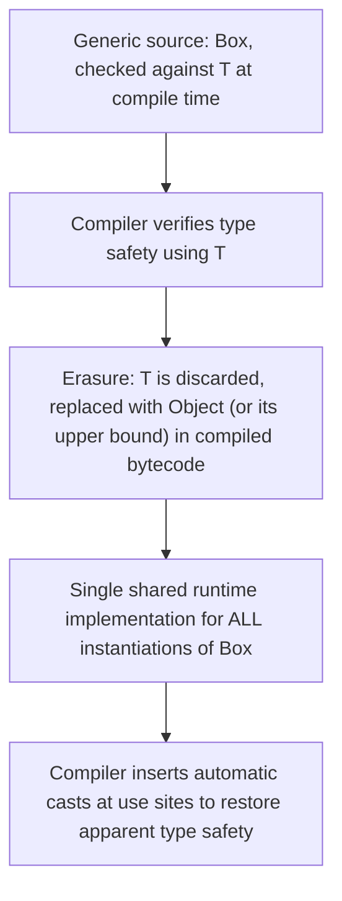

## Parametric Polymorphism

### Definition and Core Concept

Parametric polymorphism is a form of type-system design in which a single function, data structure, or piece of code is written to work uniformly across any type, with that type left as a **parameter** to be filled in later — either by the compiler through inference or explicitly by the caller. The defining property is **uniformity**: a parametrically polymorphic function must behave identically regardless of which concrete type it is instantiated with, because it cannot inspect or branch on the type parameter's identity at all — it can only manipulate values of that type through whatever operations were explicitly given to it. This is what distinguishes parametric polymorphism from **ad-hoc polymorphism** (function overloading, where different code runs for different types) and from **subtype polymorphism** (where a function works across a type hierarchy via shared behavior, as with virtual method dispatch).

In mainstream language terminology, parametric polymorphism is most commonly encountered under the name **generics**. The two terms describe the same underlying concept: "parametric polymorphism" is the type-theoretic framing (emphasizing that the type is a parameter to the code), while "generics" is the practical, language-feature framing most programmers encounter directly.

### Key Points

- A parametrically polymorphic function is written once and works correctly for **every** type it can be applied to, rather than requiring a separate implementation per type.
- The core guarantee is **uniformity of behavior**: because the function cannot inspect the concrete type at runtime (in most implementations), its behavior cannot vary based on which type was substituted in — a property with real correctness implications, discussed below as parametricity.
- Parametric polymorphism is one of three major polymorphism categories, alongside **ad-hoc polymorphism** (overloading, type classes) and **subtype polymorphism** (inheritance-based dispatch); many languages combine more than one form.
- Languages implement parametric polymorphism through different underlying mechanisms — **type erasure** (Java, and originally a design choice with real consequences), **monomorphization** (Rust, C++ templates), and **uniform representation** (Haskell, OCaml) — each with distinct performance and capability trade-offs.
- Constraining a type parameter (Java's bounded generics, Rust's trait bounds, Haskell's type class constraints) lets a function require specific operations be available on the type parameter without abandoning the core benefit of writing the logic once.

### A Motivating Example: The Problem Without Parametric Polymorphism

Without parametric polymorphism, achieving type-safe container types or generic algorithms requires either duplicating code per type, or discarding type safety by working with a fully untyped representation:

```java
// Without generics: separate class needed for every element type
class IntBox {
    private int value;
    public int get() { return value; }
    public void set(int v) { value = v; }
}

class StringBox {
    private String value;   // identical logic, duplicated entirely for a different type
    public String get() { return value; }
    public void set(String v) { value = v; }
}
```

Parametric polymorphism solves this by letting the type itself be a parameter:

```java
class Box<T> {
    private T value;
    public T get() { return value; }
    public void set(T v) { value = v; }
}

Box<Integer> intBox = new Box<>();
Box<String> stringBox = new Box<>();
```

`Box<T>` is written exactly once; the compiler generates (or, depending on implementation strategy, simulates) type-specific behavior for each instantiation while the source code itself contains no duplication.



### Parametricity: The Formal Guarantee

The theoretical property underlying parametric polymorphism's usefulness is called **parametricity**, informally captured by the slogan "**theorems for free**" (from Philip Wadler's influential paper of the same name). Because a genuinely parametric function cannot inspect the identity of its type parameter, its possible behaviors are dramatically constrained by its type signature alone — often to the point that the type signature essentially determines the implementation.

Consider a function with the type signature `identity : ∀α. α → α` (a function from any type to that same type). Because the function has no way to inspect what `α` actually is, and must return a value of type `α`, the **only** value it could possibly return (short of causing an error or non-termination) is the input itself:

```haskell
identity :: a -> a
identity x = x   -- this is essentially the ONLY possible well-typed implementation
```

This is a striking contrast to a dynamically typed or type-erased equivalent, where nothing in the signature alone prevents the function from doing something unrelated to its input — the type signature of a parametrically polymorphic function carries genuine, checkable information about its possible behavior, not just documentation.



A slightly richer example: a function of type `∀α. [α] → [α]` (a function from a list of any type to a list of the same type) cannot invent new elements of type `α` out of nothing, and cannot inspect what the elements actually are — so parametricity guarantees it can only reorder, drop, or duplicate existing elements from the input list (reversing, taking a prefix, filtering by position, etc.), never fabricate new ones or make decisions based on element content.

### Implementation Strategy 1: Monomorphization

**Monomorphization** generates a fully separate, specialized copy of the generic code for each concrete type it is instantiated with, at compile time — turning generic source code into multiple non-generic compiled versions before the program ever runs. This is the strategy used by Rust's generics and C++ templates.

```rust
fn largest<T: PartialOrd>(list: &[T]) -> &T {
    let mut largest = &list[0];
    for item in list {
        if item > largest {
            largest = item;
        }
    }
    largest
}

let numbers = vec![34, 50, 25, 100, 65];
let chars = vec!['y', 'm', 'a', 'q'];

largest(&numbers);  // compiler generates a specialized largest_i32 internally
largest(&chars);     // compiler generates a separate specialized largest_char internally
```



**Advantage**: Zero runtime overhead — each specialized version is compiled with full knowledge of the concrete type, enabling the same optimizations (inlining, avoiding indirection, exact memory layout) as if the programmer had hand-written a separate version for each type.

**Disadvantage**: **Code bloat** — the compiled binary contains a full copy of the generic code for every distinct type it was ever instantiated with, which can meaningfully increase binary size and compile time for heavily generic code used across many types.

### Implementation Strategy 2: Type Erasure

**Type erasure** compiles generic code into a single, shared implementation that operates on values through a uniform representation, discarding (erasing) the specific type parameter information after compile-time checking is complete — this is the strategy Java uses for its generics.

```java
class Box<T> {
    private T value;
    public T get() { return value; }
}

// At compile time: Box<Integer> and Box<String> are checked as distinct, safe types
// At runtime (after erasure): both compile down to essentially the same bytecode,
// operating on Object internally, with the compiler inserting invisible casts back to T at use sites
```



**Advantage**: A single compiled implementation is shared across all instantiations, avoiding the code bloat monomorphization can produce, and preserving backward compatibility with pre-generics code operating on the erased, untyped form.

**Disadvantage**: Type parameter information is genuinely unavailable at runtime — a Java program cannot ask "is `T` currently `Integer`?" inside a generic method, cannot create a `new T[]` array directly, and reflection over generic type parameters is limited, all direct consequences of the information being discarded after compilation.

### Implementation Strategy 3: Uniform Representation

Languages in the ML/Haskell family typically use **uniform representation** (sometimes described as boxed, pointer-based representation) — every value of a polymorphic type is represented the same way at runtime (commonly, as a pointer to a heap-allocated, tagged value), regardless of its concrete type, so a single compiled function body can operate on values of any type without needing separate specialized versions or erasure tricks. [Inference: exact representation strategies vary meaningfully across specific compiler implementations and their optimization levels (e.g., some Haskell compilers apply specialization optimizations resembling monomorphization for performance-critical code), so this describes the traditional baseline model rather than every production implementation's exact runtime behavior.]

### Bounded Parametric Polymorphism: Adding Constraints

Pure, unconstrained parametric polymorphism (`∀α. α → α`) is powerful but limited — a function that can do nothing but rearrange values of an unknown type cannot, for instance, compare them, print them, or perform arithmetic on them, since none of those operations are guaranteed to exist for an arbitrary type. **Bounded** (or **constrained**) parametric polymorphism addresses this by requiring the type parameter to satisfy some interface, trait, or type class, gaining access to specific operations while still working across every type that satisfies the constraint.

```rust
fn largest<T: PartialOrd>(list: &[T]) -> &T {
    // T: PartialOrd means "T must support comparison operators"
    // still works for ANY type satisfying that bound — still parametric,
    // just constrained rather than fully unconstrained
    ...
}
```

```haskell
-- Type class constraint: 'a' must implement Ord (ordering comparisons)
maximum :: Ord a => [a] -> a
```

```typescript
function largest<T extends { valueOf(): number }>(items: T[]): T {
    // T is constrained to anything with a valueOf() returning a number
    ...
}
```

This is precisely the mechanism that resolves the limitation of classical Hindley-Milner around ad-hoc polymorphism discussed in the type inference topic — Haskell's type classes, in particular, are simultaneously an ad-hoc polymorphism mechanism (different implementations per type) and a way of constraining otherwise-parametric code, showing how the polymorphism categories combine rather than existing in strict isolation.

### Parametric Polymorphism vs. Other Polymorphism Forms

| Aspect | Parametric Polymorphism | Ad-hoc Polymorphism | Subtype Polymorphism |
| --- | --- | --- | --- |
| Mechanism | Type left as a parameter, single uniform implementation | Different implementation selected per type (overloading, type classes) | Shared interface, different implementation via inheritance/dispatch |
| Behavior across types | Identical by construction (parametricity) | Can differ arbitrarily per type | Can differ per subtype, but must honor the shared contract |
| Typical syntax | Generics (`<T>`, `∀α`) | Overloaded function names, type classes | Interfaces, abstract classes, virtual methods |
| Runtime dispatch needed? | No (monomorphization) or uniform (erasure/uniform rep.) | Sometimes (resolved at compile time for overloading; type classes may use runtime dictionaries) | Yes, typically via virtual method tables |
| Example | `identity<T>(x: T): T` | `+` operating differently on `Int` vs `Float` | `Animal.makeSound()` dispatching to `Dog` or `Cat`'s override |

### Illustration: Three Polymorphism Categories

<svg xmlns="http://www.w3.org/2000/svg" viewBox="0 0 640 320" font-family="sans-serif">
<text x="320" y="24" text-anchor="middle" font-size="16" font-weight="bold" fill="#1a1a1a">Polymorphism Categories Compared (svg_diagram)</text>
<rect x="30" y="55" width="180" height="220" rx="8" fill="#d6eaf8" stroke="#21618c" stroke-width="1.5" />
<text x="120" y="80" text-anchor="middle" font-size="12" font-weight="bold" fill="#1a1a1a">Parametric</text>
<text x="120" y="105" text-anchor="middle" font-size="10" fill="#1a1a1a">One implementation</text>
<text x="120" y="120" text-anchor="middle" font-size="10" fill="#1a1a1a">works for all types</text>
<text x="120" y="145" text-anchor="middle" font-size="10" fill="#1a1a1a">identity&lt;T&gt;(x: T)</text>
<text x="120" y="175" text-anchor="middle" font-size="10" fill="#1a1a1a">Behavior fixed by</text>
<text x="120" y="190" text-anchor="middle" font-size="10" fill="#1a1a1a">type signature alone</text>
<rect x="230" y="55" width="180" height="220" rx="8" fill="#fdebd0" stroke="#af601a" stroke-width="1.5" />
<text x="320" y="80" text-anchor="middle" font-size="12" font-weight="bold" fill="#1a1a1a">Ad-hoc</text>
<text x="320" y="105" text-anchor="middle" font-size="10" fill="#1a1a1a">Different implementation</text>
<text x="320" y="120" text-anchor="middle" font-size="10" fill="#1a1a1a">chosen per type</text>
<text x="320" y="145" text-anchor="middle" font-size="10" fill="#1a1a1a">add(int,int) vs</text>
<text x="320" y="160" text-anchor="middle" font-size="10" fill="#1a1a1a">add(float,float)</text>
<text x="320" y="185" text-anchor="middle" font-size="10" fill="#1a1a1a">Overloading, type classes</text>
<rect x="430" y="55" width="180" height="220" rx="8" fill="#d4efdf" stroke="#1e8449" stroke-width="1.5" />
<text x="520" y="80" text-anchor="middle" font-size="12" font-weight="bold" fill="#1a1a1a">Subtype</text>
<text x="520" y="105" text-anchor="middle" font-size="10" fill="#1a1a1a">Shared interface,</text>
<text x="520" y="120" text-anchor="middle" font-size="10" fill="#1a1a1a">dispatched implementation</text>
<text x="520" y="145" text-anchor="middle" font-size="10" fill="#1a1a1a">Animal.makeSound()</text>
<text x="520" y="160" text-anchor="middle" font-size="10" fill="#1a1a1a">-&gt; Dog or Cat override</text>
<text x="520" y="185" text-anchor="middle" font-size="10" fill="#1a1a1a">Inheritance, virtual dispatch</text>

<text x="320" y="305" text-anchor="middle" font-size="11" fill="`#555555`">Real languages typically combine more than one category (e.g. Java generics + overloading + inheritance)</text>

</svg>

### Practical Combinations in Real Languages

Most mainstream languages blend more than one polymorphism category rather than adopting a single pure form:

- **Java** combines subtype polymorphism (inheritance, interfaces) with type-erased parametric polymorphism (generics) and limited ad-hoc polymorphism (method overloading resolved at compile time).
- **Rust** combines monomorphized parametric polymorphism (generics) with trait-bounded constraints (simultaneously enabling a form of ad-hoc polymorphism through trait method resolution) and avoids traditional subtype/inheritance-based polymorphism in favor of trait objects for dynamic dispatch when needed.
- **Haskell** combines parametric polymorphism (as the default for most functions) with type classes (its primary ad-hoc polymorphism mechanism) tightly enough that the two are often discussed together as **constrained parametric polymorphism** rather than as fully separate features.
- **C++ templates** are parametrically polymorphic in spirit but permit **template specialization** — providing a different implementation for specific concrete types — which technically allows behavior to vary by type in ways pure parametricity forbids, making C++ generics a hybrid that leans parametric by default but permits ad-hoc-style overrides.

### Related Topics

- Type inference algorithms (Hindley-Milner, Algorithm W)
- Ad-hoc polymorphism: overloading and type classes
- Subtype polymorphism and virtual dispatch
- Static versus dynamic typing philosophies
- Higher-kinded types and higher-rank polymorphism
- Monomorphization versus type erasure trade-offs
- Rust trait objects and dynamic dispatch
- Variance: covariance and contravariance in generic types