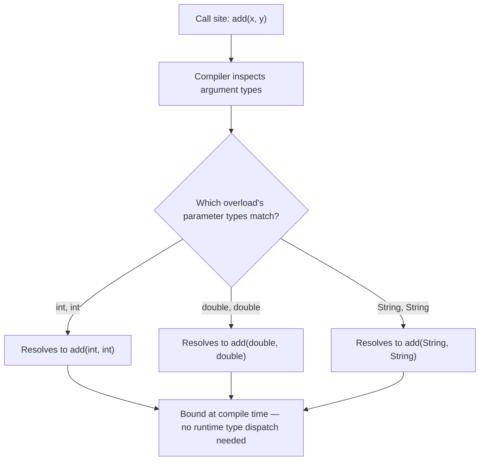
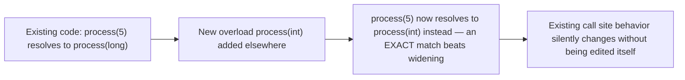
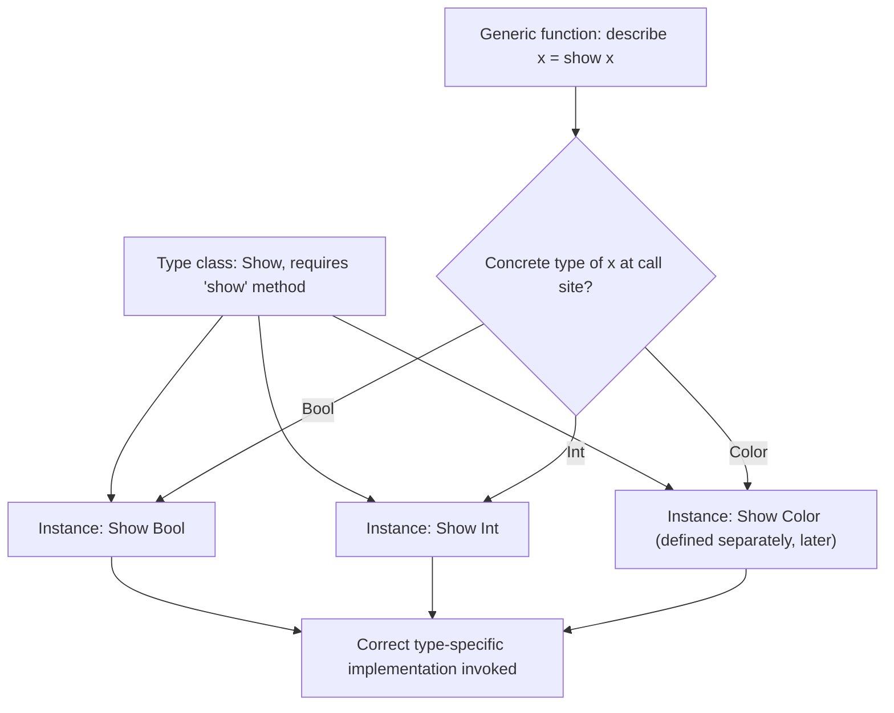

## Ad Hoc Polymorphism and Overloading

### Definition and Core Concept

Ad hoc polymorphism is a form of polymorphism in which a single name — a function, operator, or method — refers to **multiple, potentially unrelated implementations**, with the appropriate implementation selected based on the types of the arguments involved. Unlike parametric polymorphism, where one implementation genuinely works uniformly across all types by construction, ad hoc polymorphism embraces the opposite principle: behavior is explicitly permitted, even expected, to differ from type to type, because each type gets its own tailored implementation. The term "ad hoc" (from the Latin "for this") reflects that the polymorphism is achieved case-by-case, per type, rather than through a single general mechanism — the compiler or runtime resolves "which implementation to run" as a distinct decision at each call site or type combination, rather than every instantiation sharing identical logic.

### Key Points

- Ad hoc polymorphism deliberately allows behavior to vary by type — this is its core distinguishing feature relative to parametric polymorphism, which forbids exactly that.
- The two dominant concrete mechanisms are **function/operator overloading** (multiple named implementations distinguished by parameter types, typically resolved at compile time) and **type classes / interfaces with dispatch** (a more systematic, extensible mechanism for associating type-specific implementations with a shared abstract operation name).
- **Overload resolution** — the compiler's process of deciding which overloaded implementation applies to a given call — follows specific, language-defined rules and can produce ambiguity errors when multiple overloads are equally applicable.
- Operator overloading is a special case of ad hoc polymorphism where the "function name" is a symbol (`+`, `==`, `[]`) rather than an identifier, letting user-defined types participate in built-in-looking syntax.
- Haskell-style **type classes** generalize ad hoc polymorphism into a principled, extensible system that also interacts productively with parametric polymorphism (as constrained generics), rather than treating overloading purely as a compile-time naming convenience.

### Function Overloading

**Function overloading** allows multiple functions to share the same name as long as they differ in their parameter types (or count), with the compiler selecting the correct one to call based on the argument types supplied at each call site.

```java
class Calculator {
    int add(int a, int b) {
        return a + b;
    }

    double add(double a, double b) {
        return a + b;
    }

    String add(String a, String b) {
        return a + b;   // string concatenation — entirely different logic, same name
    }
}

Calculator calc = new Calculator();
calc.add(2, 3);          // resolves to int add(int, int) at compile time
calc.add(2.5, 3.1);      // resolves to double add(double, double)
calc.add("foo", "bar");  // resolves to String add(String, String)
```

Each overload here does something genuinely different — integer addition, floating-point addition, and string concatenation — which is precisely the flexibility parametric polymorphism, by its uniformity guarantee, could never provide under a single implementation.



### Overload Resolution Rules

When multiple overloads could plausibly apply to a call (due to implicit conversions, subtyping, or default parameters), the compiler must apply a defined **resolution algorithm** to pick exactly one candidate — or report an error if the choice is ambiguous.

```java
void process(int x) { System.out.println("int version"); }
void process(long x) { System.out.println("long version"); }
void process(double x) { System.out.println("double version"); }

process(5);      // exact match: int version
process(5L);     // exact match: long version
process(5.0);    // exact match: double version
process((short) 5); // no exact match for short; widens to int (closest safe conversion): int version
```

Typical resolution rules, in roughly descending priority across many languages, favor: an exact type match first, then the smallest/narrowest implicit widening conversion needed, then user-defined conversions if the language supports them, with an outright **ambiguity error** raised if two or more candidates are equally valid after applying these rules and none is strictly more specific than the other.

```cpp
void f(int x) {}
void f(float x) {}

f(5.0);  // COMPILE ERROR in some contexts: 5.0 is a double,
          // and converting to either int or float loses information ambiguously —
          // the compiler cannot determine which conversion is "more correct"
```

[Unverified: exact overload resolution rules, precedence orderings, and specific ambiguity conditions differ meaningfully across languages (Java, C++, C#, and others each define their own precise algorithm), so the general priority ordering described above should be checked against the specific language's formal specification for authoritative detail.]

### Operator Overloading

Operator overloading extends the same ad hoc polymorphism principle to operators (`+`, `-`, `==`, `[]`, and others), letting user-defined types participate in the language's built-in-looking operator syntax rather than requiring explicitly named method calls for every operation.

```cpp
class Vector2D {
public:
    double x, y;
    Vector2D(double x, double y) : x(x), y(y) {}

    Vector2D operator+(const Vector2D& other) const {
        return Vector2D(x + other.x, y + other.y);
    }
};

Vector2D a(1.0, 2.0);
Vector2D b(3.0, 4.0);
Vector2D c = a + b;   // calls the user-defined operator+, NOT built-in numeric addition
```

```python
class Vector2D:
    def __init__(self, x, y):
        self.x = x
        self.y = y

    def __add__(self, other):   # Python's dunder-method convention for operator overloading
        return Vector2D(self.x + other.x, self.y + other.y)

a = Vector2D(1, 2)
b = Vector2D(3, 4)
c = a + b   # dispatches to __add__
```

This is a direct instance of the same "same symbol, different implementation per type" principle as ordinary function overloading — `+` genuinely means something different (integer addition, floating-point addition, vector addition, string concatenation, depending on the language) for each type it is defined on, with no single uniform implementation underlying all of them.

### The Downside: Overload Ambiguity and Readability Trade-offs

Because ad hoc polymorphism deliberately permits behavior to vary by type, it introduces risks that parametric polymorphism's uniformity guarantee structurally avoids:

- **Surprising behavior**: because different overloads can implement genuinely unrelated logic, a reader cannot determine what a call actually does purely from its name — they must also know the argument types, unlike a parametrically polymorphic function whose behavior is largely determined by its signature alone (per the parametricity discussion in the parametric polymorphism topic).
- **Ambiguity errors**: as shown above, overload resolution can fail to produce a unique answer, forcing the programmer to add explicit casts or restructure the call.
- **Maintenance risk**: adding a new overload to an existing set can silently change which overload some existing call resolves to, if the new overload happens to be a better match under the resolution rules than the one previously selected — a subtle source of behavior change from code that looks unrelated to the call site itself.



### Type Classes: A More Principled Ad Hoc Polymorphism

Haskell's **type classes** (and closely related mechanisms — Rust's traits, Swift's protocols with default implementations) generalize ad hoc polymorphism into something more systematic than ordinary overloading: rather than the compiler picking among a fixed, closed set of overloads by inspecting argument types directly, a type class defines an abstract interface of operations, and any type can **become an instance** of that class by providing implementations for those operations — even types defined much later, in different modules, by different authors, than the type class itself.

```haskell
class Show a where
    show :: a -> String

instance Show Bool where
    show True  = "True"
    show False = "False"

instance Show Int where
    show n = -- integer-to-string logic

-- A user-defined type, in an entirely separate module, can also become an instance:
data Color = Red | Green | Blue

instance Show Color where
    show Red   = "Red"
    show Green = "Green"
    show Blue  = "Blue"
```

Crucially, a function that requires its argument to support `show` can be written **once**, generically, and works for `Bool`, `Int`, `Color`, or any future type that provides a `Show` instance — combining ad hoc polymorphism's per-type implementation flexibility with parametric polymorphism's write-once genericity:

```haskell
describe :: Show a => a -> String
describe x = "The value is: " ++ show x
-- 'describe' is written once, generically, yet dispatches to a DIFFERENT show implementation
-- depending on which concrete type 'a' is instantiated with at each call site
```

This is the resolution to the exact limitation of classical Hindley-Milner inference noted in the type inference topic: type classes let the compiler still fully infer types while also selecting the correct type-specific implementation, via a constraint (`Show a =>`) attached to an otherwise-parametric type signature.



### Interfaces and Traits as Ad Hoc Polymorphism

Rust's traits and similar interface-based mechanisms in other languages serve much the same role as Haskell's type classes — defining a shared operation name whose implementation is provided per-type:

```rust
trait Describable {
    fn describe(&self) -> String;
}

impl Describable for bool {
    fn describe(&self) -> String {
        if *self { "true".to_string() } else { "false".to_string() }
    }
}

struct Color { name: String }

impl Describable for Color {
    fn describe(&self) -> String {
        format!("Color: {}", self.name)
    }
}

fn print_description<T: Describable>(item: &T) {
    println!("{}", item.describe());   // dispatches to the correct impl based on T
}
```

The `print_description` function here is simultaneously an example of **bounded parametric polymorphism** (it is generic over `T`, written once) constrained by a **trait bound** that provides ad hoc, per-type behavior via `describe` — directly illustrating how the two polymorphism categories combine in practice, as previewed in the parametric polymorphism topic's discussion of bounded generics.

### Static Versus Dynamic Resolution of Ad Hoc Polymorphism

A distinction worth separating from the overloading mechanism itself is **when** the correct implementation is selected:

- **Compile-time (static) resolution**: ordinary function/operator overloading in most statically typed languages is resolved entirely at compile time — the compiler determines the exact function to call based on the static types of the arguments, and the compiled code contains a direct call to that specific implementation, with no runtime decision-making involved.
- **Type class dictionary passing**: Haskell's type class resolution is also determined at compile time, but implemented (in many compiler implementations) by passing an implicit "dictionary" of the relevant type's method implementations as a hidden argument, allowing the same compiled generic function body to be reused across different type instantiations while still calling the correct per-type implementation. [Unverified: "dictionary passing" is a widely used conceptual and implementation model for type classes, but exact compilation strategies and optimizations vary by compiler and should be checked against that specific compiler's documentation.]
- **Runtime resolution via subtype polymorphism** (a distinct polymorphism category, not itself ad hoc polymorphism) selects the implementation based on an object's actual runtime type through virtual dispatch — worth distinguishing carefully from ad hoc polymorphism's typically compile-time-resolved overloading, even though both ultimately achieve "different code runs depending on type."

### Comparison Table

| Aspect | Function/Operator Overloading | Type Classes / Traits |
| --- | --- | --- |
| Extensibility | Closed set, fixed at the point of definition (typically within one module/class) | Open — new instances/impls can be added later, elsewhere, by different authors |
| Resolution timing | Compile time, based on static argument types | Compile time (typically), often via dictionary-passing or monomorphization |
| Combines with generics | Not directly — overloads are separate, non-generic definitions | Directly — constraints on otherwise-generic type parameters |
| Ambiguity risk | Yes, resolvable by the compiler's resolution rules or a hard error | Generally lower, since instance selection is guided by explicit constraints rather than argument-type guessing across a flat overload set |
| Typical syntax | Same function/operator name, multiple signatures | Interface/trait/class declaration + per-type instance/impl blocks |

### Illustration: Ad Hoc vs. Parametric Behavior Divergence

<svg viewBox="0 0 640 280" xmlns="http://www.w3.org/2000/svg" font-family="sans-serif">
<text x="320" y="24" text-anchor="middle" font-size="16" font-weight="bold" fill="#1a1a1a">Behavior Under Each Polymorphism Style (svg_diagram)</text>

<text x="160" y="55" text-anchor="middle" font-size="12" font-weight="bold" fill="`#1a1a1a`">Parametric: identity<T></text>

<rect x="60" y="70" width="90" height="40" fill="`#d6eaf8`" stroke="`#21618c`" stroke-width="1.5"/>

<text x="105" y="94" text-anchor="middle" font-size="10">Int input</text>

<rect x="170" y="70" width="90" height="40" fill="`#d6eaf8`" stroke="`#21618c`" stroke-width="1.5"/>

<text x="215" y="94" text-anchor="middle" font-size="10">String input</text>

<line x1="105" y1="110" x2="105" y2="140" stroke="`#1a1a1a`" stroke-width="1.5"/>

<line x1="215" y1="110" x2="215" y2="140" stroke="`#1a1a1a`" stroke-width="1.5"/>

<rect x="60" y="140" width="90" height="35" fill="`#d4efdf`" stroke="`#1e8449`" stroke-width="1.5"/>

<text x="105" y="162" text-anchor="middle" font-size="9">SAME logic:</text>

<rect x="170" y="140" width="90" height="35" fill="`#d4efdf`" stroke="`#1e8449`" stroke-width="1.5"/>

<text x="215" y="162" text-anchor="middle" font-size="9">SAME logic:</text>

<text x="160" y="195" text-anchor="middle" font-size="10" fill="`#555555`">return input unchanged, identically, both times</text>

<text x="480" y="55" text-anchor="middle" font-size="12" font-weight="bold" fill="`#1a1a1a`">Ad hoc: add(x, y)</text>

<rect x="390" y="70" width="90" height="40" fill="`#d6eaf8`" stroke="`#21618c`" stroke-width="1.5"/>

<text x="435" y="94" text-anchor="middle" font-size="10">Int inputs</text>

<rect x="500" y="70" width="90" height="40" fill="`#d6eaf8`" stroke="`#21618c`" stroke-width="1.5"/>

<text x="545" y="94" text-anchor="middle" font-size="10">String inputs</text>

<line x1="435" y1="110" x2="435" y2="140" stroke="`#1a1a1a`" stroke-width="1.5"/>

<line x1="545" y1="110" x2="545" y2="140" stroke="`#1a1a1a`" stroke-width="1.5"/>

<rect x="390" y="140" width="90" height="35" fill="`#fdebd0`" stroke="`#af601a`" stroke-width="1.5"/>

<text x="435" y="162" text-anchor="middle" font-size="9">Numeric addition</text>

<rect x="500" y="140" width="90" height="35" fill="`#fdebd0`" stroke="`#af601a`" stroke-width="1.5"/>

<text x="545" y="162" text-anchor="middle" font-size="9">Concatenation</text>

<text x="490" y="195" text-anchor="middle" font-size="10" fill="`#555555`">DIFFERENT logic per type, by design</text>

</svg>

### Practical Guidance and Common Pitfalls

- **Prefer type classes/traits over unrelated overloads when extensibility matters**: if new types need to participate in an operation after the fact (including types defined in other modules or by other developers), a type class/trait/interface mechanism is generally more scalable than adding overloads, since overload sets are typically closed to the defining scope.
- **Keep overloaded implementations behaviorally consistent**: well-designed overload sets (like the `add` example) preserve a consistent conceptual meaning across types (all forms of "combining two things of the same kind"), rather than reusing a name for genuinely unrelated operations, which undermines the readability benefit overloading is meant to provide.
- **Be aware of implicit conversion interactions**: languages with permissive implicit type conversions (as discussed in the strong/weak typing distinction) can produce overload resolution outcomes that are technically well-defined but genuinely surprising to a reader who does not have the exact resolution rules memorized — a common source of subtle bugs when overload sets and implicit conversions interact.

### Related Topics

- Parametric polymorphism and generics
- Subtype polymorphism and virtual dispatch
- Type inference algorithms and type class constraint resolution
- Static versus dynamic typing philosophies
- Strong versus weak typing and implicit conversions
- Operator overloading design patterns across languages
- Rust traits and trait objects
- Haskell type classes and dictionary-passing implementation