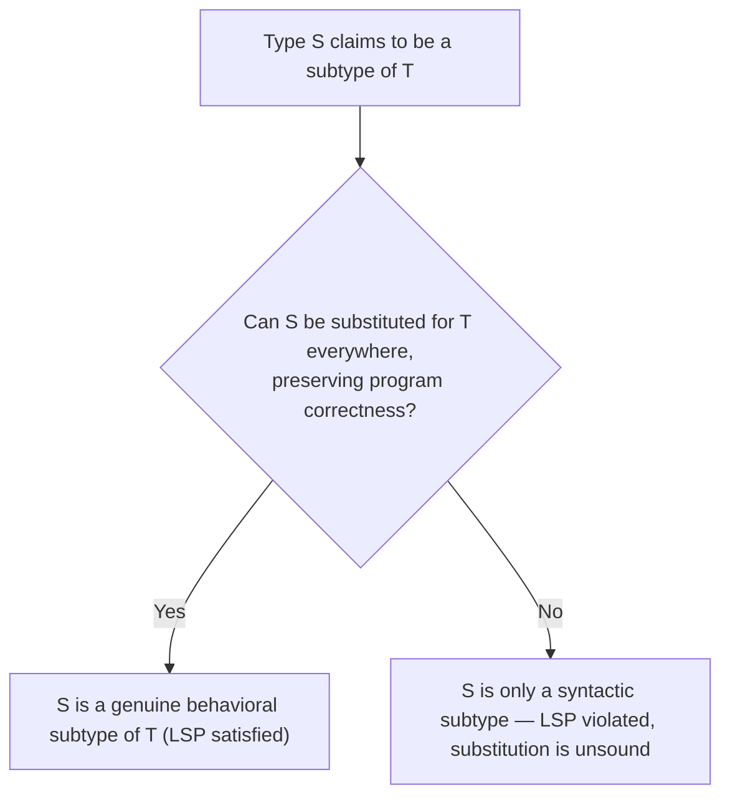
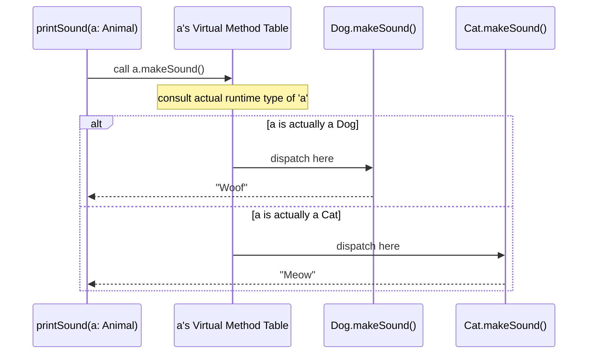
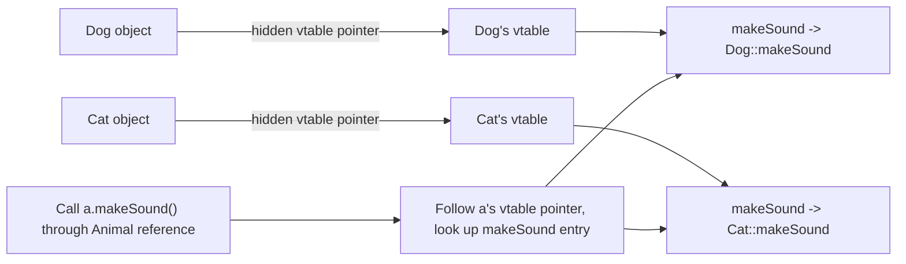
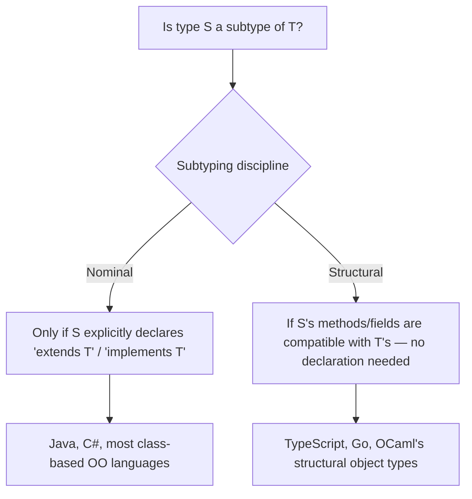
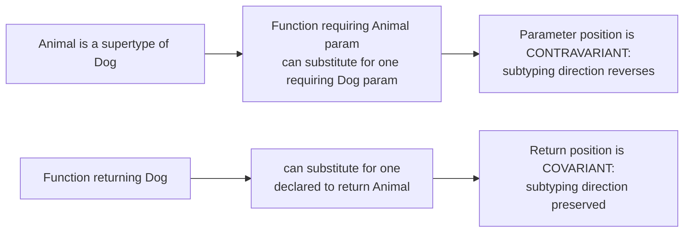

## Subtype Polymorphism

### Definition and Core Concept

Subtype polymorphism is a form of polymorphism in which a value of a more specific type (a **subtype**) can be used anywhere a value of a more general type (a **supertype**) is expected, and calling a shared operation on that value invokes an implementation specific to its actual runtime type — even though the calling code only knows about the general, supertype interface. The defining mechanism is **dispatch**: when code calls a method through a supertype reference, the decision of exactly which implementation runs is deferred until the concrete type is known, most commonly at runtime through **virtual dispatch**. This is what distinguishes subtype polymorphism from parametric polymorphism (uniform behavior across types, resolved by substitution) and from ad hoc polymorphism (implementation chosen by the compiler at the call site based on static argument types) — here, the calling code is written against an abstraction it does not fully know the concrete identity of, and the correct behavior emerges from the object's own type at the moment the call actually happens.

### Key Points

- Subtype polymorphism rests on the **Liskov Substitution Principle**: if `S` is a subtype of `T`, then objects of type `T` in a program can be replaced with objects of type `S` without altering the correctness of that program — the subtype must honor the supertype's contract, not just its method names.
- The primary implementation mechanism is **virtual dispatch** (also called dynamic dispatch): a call through a supertype reference is resolved to a specific implementation by consulting the object's actual runtime type, typically via a **virtual method table (vtable)**.
- Subtyping can arise through **class inheritance** (a subclass extending a base class) or through **structural/interface conformance** (a type satisfying an interface's method signatures without any inheritance relationship at all), and languages differ significantly in which of these they support and prioritize.
- **Covariance and contravariance** govern whether and how subtyping relationships extend to compound types (arrays, function parameters, generic containers) built from subtypes and supertypes, and getting this wrong is a well-documented source of unsound or surprising behavior.
- Subtype polymorphism does not, by itself, guarantee memory or concurrency safety the way the ownership model discussed earlier does — as noted in the memory safety topic, it is orthogonal to those concerns.

### The Liskov Substitution Principle

Barbara Liskov's substitution principle is the formal criterion for when a subtyping relationship is behaviorally sound, not merely syntactically valid. It requires that a subtype's methods honor the supertype's contract: preconditions cannot be strengthened (the subtype cannot demand more from callers than the supertype promised), postconditions cannot be weakened (the subtype must still deliver at least what the supertype guaranteed), and invariants of the supertype must be preserved.



A frequently cited illustration of an LSP violation is the classic **Square-Rectangle problem**: if `Square` inherits from `Rectangle` and overrides `setWidth`/`setHeight` to keep both dimensions equal (to maintain the "square" invariant), code that relies on `Rectangle`'s contract — that setting width alone leaves height unchanged — breaks when handed a `Square`, even though `Square` is syntactically a valid subclass:

```java
class Rectangle {
    protected int width, height;
    void setWidth(int w) { width = w; }
    void setHeight(int h) { height = h; }
    int area() { return width * height; }
}

class Square extends Rectangle {
    @Override
    void setWidth(int w) { width = w; height = w; }   // forces height to match — breaks Rectangle's contract
    @Override
    void setHeight(int h) { width = h; height = h; }
}

void resize(Rectangle r) {
    r.setWidth(5);
    r.setHeight(10);
    assert r.area() == 50;  // holds for Rectangle, FAILS for Square (area would be 100)
}
```

This demonstrates that subtyping is fundamentally a **behavioral** contract, not just a syntactic one — a type can technically compile as a subtype (matching method signatures) while still violating LSP and producing unsound substitution in practice.

### Virtual Dispatch: The Core Mechanism

**Virtual dispatch** (dynamic dispatch) is the runtime mechanism that resolves a method call made through a supertype reference to the correct, type-specific implementation, based on the object's actual runtime type rather than the reference's declared (static) type.

```java
abstract class Animal {
    abstract String makeSound();
}

class Dog extends Animal {
    String makeSound() { return "Woof"; }
}

class Cat extends Animal {
    String makeSound() { return "Meow"; }
}

void printSound(Animal a) {
    System.out.println(a.makeSound());  // WHICH implementation runs is decided at runtime
}

printSound(new Dog());  // prints "Woof"
printSound(new Cat());  // prints "Meow"
// 'a' is statically typed as Animal in both calls — the actual code path
// is determined by each object's real, runtime type, not by the reference's declared type
```



Most object-oriented language implementations realize this via a **virtual method table (vtable)**: each class with virtual/overridable methods gets a table of function pointers, one per virtual method, populated with that class's specific implementations (or inherited ones, where not overridden). Every object of that class carries a hidden pointer to its class's vtable; a virtual call becomes, at the machine level, an indirect call through that table rather than a direct call to a statically-known function address — the extra indirection is the concrete runtime cost subtype polymorphism pays for its flexibility, in contrast to the zero-cost static resolution of ad hoc polymorphism's overloading.



### Nominal Versus Structural Subtyping

Languages differ on **what makes a type a subtype of another**:

- **Nominal subtyping**: a type is a subtype of another only if it explicitly declares that relationship — via `extends`, `implements`, or an equivalent — regardless of whether its method signatures happen to match. Two types with identical methods but no declared relationship are **not** subtypes of each other under nominal subtyping. Java, C#, and most mainstream class-based OO languages use nominal subtyping.

```java
interface Flyable { void fly(); }

class Bird implements Flyable {   // explicit declaration required
    public void fly() { System.out.println("flap flap"); }
}
```

- **Structural subtyping**: a type is a subtype of another purely based on having a compatible set of methods/fields — no explicit declaration of the relationship is required at all. This is the static-typing analog of the duck typing idiom discussed in the dynamic typing topic, but checked entirely at compile time. TypeScript and Go both use structural subtyping (Go via its interface satisfaction model).

```typescript
interface Flyable { fly(): void; }

class Bird {   // no "implements Flyable" declaration anywhere
    fly() { console.log("flap flap"); }
}

function letItFly(f: Flyable) { f.fly(); }
letItFly(new Bird());  // valid: Bird structurally satisfies Flyable, no explicit relationship declared
```

```go
type Flyable interface {
    Fly()
}

type Bird struct{}
func (b Bird) Fly() { fmt.Println("flap flap") }  // Bird automatically satisfies Flyable — no explicit declaration
```



### Covariance and Contravariance

When subtyping relationships extend to **compound** types — arrays, generic containers, function types — the direction in which the subtyping relationship is preserved, reversed, or dropped entirely becomes significant, and getting it wrong is a genuine source of unsoundness.

**Covariance**: a compound type is covariant in a component if the subtyping relationship of the component carries over in the same direction to the compound type. If `Dog` is a subtype of `Animal`, an array type is covariant if `Dog[]` is treated as a subtype of `Animal[]`.

```java
Dog[] dogs = new Dog[3];
Animal[] animals = dogs;      // Java arrays are covariant — this compiles
animals[0] = new Cat();       // COMPILES, but throws ArrayStoreException AT RUNTIME
                                // because 'animals' actually points to a Dog[] underneath
```

This is a well-documented example of Java's array covariance being **unsound at compile time**, patched only by a runtime check — the compiler accepts code that can fail, deferring the actual safety violation to execution, which is a materially weaker guarantee than the compile-time-only failures the memory safety topic associated with genuinely safe language designs.

**Contravariance**: a compound type is contravariant in a component if the subtyping relationship **reverses** direction for that component in the compound type. This arises naturally for function parameter types: if a function type `F1` requires a more general (supertype) parameter than `F2` requires, `F1` can safely be used wherever `F2` is expected, because `F1` can handle anything `F2`'s narrower callers would pass it — the parameter position's subtyping direction is the reverse of the function types' own subtyping direction.



```csharp
// C# delegate variance annotations make this explicit
delegate TResult Func<in TArg, out TResult>(TArg arg);
// 'in' marks TArg contravariant (parameter position)
// 'out' marks TResult covariant (return position)
```

Rust's generic type parameters and lifetimes also carry variance, determined automatically by the compiler based on how the parameter is used within the type, rather than requiring explicit annotation in most everyday code. [Unverified: exact variance inference rules and their interaction with more advanced Rust type features are detailed in language-specific reference material and should be checked there for authoritative, up-to-date behavior.]

### Interface-Based Subtyping Versus Class Inheritance

Many modern languages deliberately favor **interface-based** subtype polymorphism over deep class inheritance hierarchies, reflecting a widely discussed design lesson from decades of object-oriented practice: deep inheritance chains tend to create fragile coupling between base and derived classes (the "fragile base class problem," where a seemingly safe change to a base class breaks subclasses relying on its exact prior behavior), whereas composing behavior through narrow, focused interfaces tends to keep subtyping relationships easier to reason about and less prone to LSP violations.

```go
// Go deliberately omits class inheritance entirely, relying purely on interface satisfaction
type Reader interface {
    Read(p []byte) (n int, err error)
}

type Writer interface {
    Write(p []byte) (n int, err error)
}

type ReadWriter interface {
    Reader
    Writer
}
// Any type satisfying both method sets automatically satisfies ReadWriter,
// with no explicit inheritance declaration and no shared base class at all
```

```rust
// Rust similarly has no class inheritance; trait objects provide subtype-polymorphism-like
// dynamic dispatch through explicit trait bounds instead
trait Shape {
    fn area(&self) -> f64;
}

struct Circle { radius: f64 }
impl Shape for Circle {
    fn area(&self) -> f64 { std::f64::consts::PI * self.radius * self.radius }
}

fn print_area(shape: &dyn Shape) {   // &dyn Shape: a trait object, dispatched dynamically at runtime
    println!("{}", shape.area());
}
```

### Comparison with Other Polymorphism Categories

| Aspect | Subtype Polymorphism | Parametric Polymorphism | Ad Hoc Polymorphism |
| --- | --- | --- | --- |
| Resolution timing | Typically runtime (virtual dispatch) | Compile time (substitution/monomorphization) or uniform representation | Typically compile time (overload resolution) |
| Behavior across types | Can differ per subtype, but must honor the shared contract (LSP) | Must be identical across all types (parametricity) | Can differ arbitrarily per type, by design |
| Core mechanism | Vtables / dynamic dispatch, interface conformance | Type variables, generics, monomorphization/erasure | Multiple named implementations, resolved by static type matching |
| Runtime cost | Indirection through vtable lookup | None (monomorphization) or uniform (erasure) | None — resolved entirely at compile time |
| Typical syntax | Inheritance (`extends`), interfaces, trait objects | Generics (`<T>`) | Overloaded function/operator names |

### Illustration: Vtable-Based Dispatch Structure

<svg xmlns="http://www.w3.org/2000/svg" viewBox="0 0 640 300" font-family="sans-serif">
<text x="320" y="24" text-anchor="middle" font-size="16" font-weight="bold" fill="#1a1a1a">Virtual Method Table Structure (svg_diagram)</text>
<rect x="40" y="60" width="140" height="70" rx="6" fill="#d6eaf8" stroke="#21618c" stroke-width="1.5" />
<text x="110" y="85" text-anchor="middle" font-size="11" fill="#1a1a1a">Dog instance</text>
<text x="110" y="105" text-anchor="middle" font-size="9" fill="#1a1a1a">[vtable ptr | fields...]</text>
<rect x="40" y="180" width="140" height="70" rx="6" fill="#d4efdf" stroke="#1e8449" stroke-width="1.5" />
<text x="110" y="205" text-anchor="middle" font-size="11" fill="#1a1a1a">Cat instance</text>
<text x="110" y="225" text-anchor="middle" font-size="9" fill="#1a1a1a">[vtable ptr | fields...]</text>
<line x1="180" y1="90" x2="260" y2="90" stroke="#21618c" stroke-width="1.5" />
<rect x="260" y="60" width="160" height="60" rx="6" fill="#eaeded" stroke="#5d6d7e" stroke-width="1.5" />
<text x="340" y="82" text-anchor="middle" font-size="10" fill="#1a1a1a">Dog's vtable</text>
<text x="340" y="100" text-anchor="middle" font-size="9" fill="#1a1a1a">makeSound -&gt; Dog::makeSound</text>
<line x1="180" y1="210" x2="260" y2="200" stroke="#1e8449" stroke-width="1.5" />
<rect x="260" y="170" width="160" height="60" rx="6" fill="#eaeded" stroke="#5d6d7e" stroke-width="1.5" />
<text x="340" y="192" text-anchor="middle" font-size="10" fill="#1a1a1a">Cat's vtable</text>
<text x="340" y="210" text-anchor="middle" font-size="9" fill="#1a1a1a">makeSound -&gt; Cat::makeSound</text>
<line x1="420" y1="90" x2="490" y2="90" stroke="#af601a" stroke-width="1.5" />
<rect x="490" y="60" width="120" height="40" rx="6" fill="#fdebd0" stroke="#af601a" stroke-width="1.5" />
<text x="550" y="84" text-anchor="middle" font-size="10" fill="#1a1a1a">Dog::makeSound()</text>
<line x1="420" y1="200" x2="490" y2="200" stroke="#af601a" stroke-width="1.5" />
<rect x="490" y="180" width="120" height="40" rx="6" fill="#fdebd0" stroke="#af601a" stroke-width="1.5" />
<text x="550" y="204" text-anchor="middle" font-size="10" fill="#1a1a1a">Cat::makeSound()</text>

<text x="320" y="280" text-anchor="middle" font-size="11" fill="`#555555`">Each instance's hidden vtable pointer routes an identical call site to a distinct, type-specific function</text>

</svg>

### Practical Considerations and Trade-offs

- **Performance**: virtual dispatch's indirect call through a vtable is measurably more expensive than a direct, statically-resolved call, and additionally tends to defeat certain compiler optimizations (particularly inlining) that rely on knowing the exact function being called ahead of time — a genuine cost subtype polymorphism pays that parametric polymorphism (via monomorphization) and ad hoc polymorphism (fully static resolution) generally avoid.
- **Design guidance favoring composition and narrow interfaces**: the fragile-base-class and LSP-violation risks associated with deep inheritance hierarchies have led much modern language and API design (Go's interface-only model, Rust's trait-object model, and general "favor composition over inheritance" guidance in OO literature) toward preferring shallow, interface-based subtyping over multi-level class inheritance chains. [Inference: this reflects a broadly documented shift in mainstream software design guidance over recent decades rather than a single universally agreed formal rule, and specific recommendations vary by community and codebase context.]
- **Interaction with memory and type safety**: subtype polymorphism's runtime dispatch is compatible with, but orthogonal to, the memory safety guarantees discussed earlier — a language can offer strong compile-time memory safety (Rust) while still providing subtype-polymorphism-like dynamic dispatch through trait objects, showing that the polymorphism category and the memory-safety guarantee level are independent design axes.

### Related Topics

- Parametric polymorphism and generics
- Ad hoc polymorphism and overloading
- Type inference algorithms
- Interfaces, traits, and structural versus nominal typing
- Memory safety guarantees across language families
- Composition versus inheritance design patterns
- Static versus dynamic typing philosophies
- Variance in generic type systems (deeper treatment of covariance/contravariance)