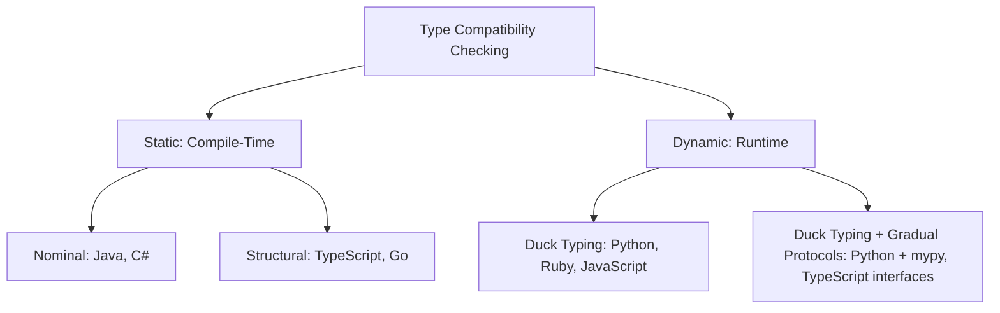

## Duck Typing

### Core Definition

Duck typing is a style of dynamic typing in which the suitability of an object for a given operation is determined by the presence of the methods and properties it currently supports, rather than by the object's declared type or explicit interface inheritance. The name derives from the informal heuristic: "If it walks like a duck and quacks like a duck, then it must be a duck." A function that calls `.quack()` on its argument will happily accept any object that implements `.quack()`, regardless of whether that object's class is named `Duck`, `Goose`, or `Robot`.

This contrasts with **nominal typing**, where compatibility is determined by explicit type names and declared inheritance/interface relationships (as in Java or C#), and with **structural typing**, which checks type compatibility by comparing the shape of members at compile time without requiring runtime dispatch. Duck typing is a runtime, implicit form of structural compatibility checking — the check happens lazily, at the point of use, rather than ahead of time.

### Mechanism

In a duck-typed language, method or attribute resolution happens at the point of invocation. When code executes `obj.method()`, the runtime looks up `method` on `obj`'s type (or its prototype/class hierarchy) at that moment. If the lookup succeeds, execution proceeds. If it fails, an error is raised (commonly `AttributeError` in Python, `NoMethodError` in Ruby, or `TypeError` in JavaScript). No prior declaration that `obj` "is a" particular interface is consulted.

This means type compatibility is never verified as a whole, upfront contract. It is verified incrementally, one member access at a time, only for the members actually exercised during a particular execution path. A duck-typed object can therefore fail to satisfy an implicit interface on a code path that hasn't run yet — untested branches carry latent type risk.

**Key Points**

- Compatibility is behavioral, not nominal: what matters is what an object *can do*, not what it *is declared to be*.
- Checks are deferred to runtime and are partial — only invoked members are checked, not the full interface.
- No explicit interface or protocol declaration is required by the language to permit the call.
- Errors from a type mismatch surface as ordinary runtime exceptions, typically `AttributeError`, `TypeError`, or their equivalents, at the call site of the missing member.

### Example

```python
class Duck:
    def quack(self):
        return "Quack!"

class Person:
    def quack(self):
        return "I'm imitating a duck!"

class Dog:
    def bark(self):
        return "Woof!"

def make_it_quack(thing):
    return thing.quack()

for creature in [Duck(), Person(), Dog()]:
    try:
        print(make_it_quack(creature))
    except AttributeError as e:
        print(f"Not duck-like: {e}")
```

**Output**



```
Quack!
I'm imitating a duck!
Not duck-like: 'Dog' object has no attribute 'quack'
```

`make_it_quack` never checks `isinstance(thing, Duck)`. It simply calls `.quack()` and trusts that the call will succeed. `Person` satisfies the implicit contract despite sharing no inheritance relationship with `Duck`. `Dog` fails only when the missing method is actually invoked, not before.

### Duck Typing vs. Related Type Disciplines

| Discipline | Compatibility Basis | Checked When | Example Language |
| --- | --- | --- | --- |
| Nominal typing | Declared type name / explicit interface implementation | Compile time | Java, C# |
| Structural typing | Shape/signature of members | Compile time | TypeScript, Go (interfaces) |
| Duck typing | Presence of members actually used | Runtime, per-call | Python, Ruby, JavaScript |

Go's interfaces are frequently confused with duck typing because a type satisfies an interface implicitly, without an `implements` keyword. However, Go's interface satisfaction is checked by the compiler against the full method set before the program runs — this is structural typing, not duck typing, since the guarantee is static and total rather than dynamic and partial. `[Inference]` The "structural typing" label is standard terminology in language-design literature for Go's mechanism; whether a given author instead classifies Go informally as "duck typing" depends on their working definition.

### Formal Framing

Duck typing can be understood as a special case of structural typing where the structural check is performed lazily and partially by the runtime dispatch mechanism instead of by a static type checker. If $T$ is the set of members an object $o$ must support along a given execution path $p$, duck typing only verifies:

$$\text{valid}(o, p) \iff \forall m \in \text{members\_invoked}(p) : m \in \text{members}(o)$$

rather than the stronger, statically-checkable structural condition:

$$\text{valid}(o, T) \iff T \subseteq \text{members}(o)$$

where $T$ is the complete required interface, not just the subset exercised by one particular run. This distinction — checking only invoked members along one path, versus checking a complete required set ahead of time — is the formal reason duck typing offers weaker safety guarantees than structural or nominal static typing.

### Protocols: Formalizing Duck Typing

Python's `typing.Protocol` (via `PEP 544`) and similar constructs in other languages let developers describe the *shape* an object is expected to have, then have a static checker verify structural conformance ahead of time — effectively converting duck-typed code into statically checked structural typing, without requiring explicit inheritance.

```python
from typing import Protocol

class Quacker(Protocol):
    def quack(self) -> str: ...

def make_it_quack(thing: Quacker) -> str:
    return thing.quack()
```

Any class implementing a compatible `quack()` method satisfies `Quacker` for static type checkers such as `mypy`, with zero coupling to `Quacker` via inheritance. This preserves duck typing's flexibility at runtime while regaining some of static typing's early-error-detection benefits — errors surface at type-check time rather than mid-execution.

### Advantages

- **Flexibility and decoupling**: code depends on behavior, not on a rigid class hierarchy, so unrelated types can interoperate as long as they expose the right methods.
- **Reduced boilerplate**: no interface declarations, no `implements` clauses, no abstract base classes required purely to satisfy the type system.
- **Natural fit for polymorphism**: functions written once operate over any object exposing the expected protocol, including objects from unrelated libraries.
- **Encourages composition over inheritance**: since behavior compatibility doesn't require a shared ancestor, objects can be assembled rather than forced into taxonomies.

### Disadvantages

- **Deferred error detection**: a missing method surfaces only when that code path executes, which can mean the failure appears in production rather than at compile or type-check time.
- **Weaker self-documentation**: without an explicit interface, a reader must infer the expected contract from usage rather than a declared signature.
- **Partial validation risk**: an object can pass duck-typing checks for the paths exercised by tests while still lacking members required by untested paths — this is a common source of latent bugs in dynamically typed codebases.
- **Tooling limitations**: IDE autocompletion and static analysis are inherently weaker without declared types, though gradual typing tools (Protocols, TypeScript structural interfaces, Sorbet for Ruby) mitigate this. `[Inference]` The degree of mitigation depends on adoption discipline within a given codebase, since gradual-typing tools are opt-in rather than enforced by the language runtime.

### Language Landscape

===MERMAID_DIAGRAM===

graph TD

A[Type Compatibility Checking] --> B[Static: Compile-Time]

A --> C[Dynamic: Runtime]

B --> D[Nominal: Java, C#]

B --> E[Structural: TypeScript, Go]

C --> F[Duck Typing: Python, Ruby, JavaScript]

C --> G[Duck Typing + Gradual Protocols: Python + mypy, TypeScript interfaces]



- **Python**: canonical duck typing, augmented by `Protocol` for optional static checking (`PEP 544`).
- **Ruby**: pervasive duck typing; idiomatic style favors `respond_to?` checks over `is_a?`/`kind_of?` checks.
- **JavaScript**: untyped at the language level, so all object interoperation is effectively duck typed; TypeScript layers structural static typing on top without changing JavaScript's runtime behavior.
- **Go**: interfaces are structurally, not nominally, satisfied — but checked statically, so it is structural typing, not duck typing, despite surface-level similarity (no `implements` keyword).

### Idiomatic Safeguards

Because duck typing defers errors, idiomatic code in duck-typed languages often adopts these patterns to manage risk:

- **EAFP (Easier to Ask Forgiveness than Permission)**: attempt the operation inside a `try`/`except` block rather than checking capability beforehand — the dominant Python idiom.
- **`hasattr`/`respond_to?` guards**: explicitly check for member presence before invocation, used when a fallback behavior is needed rather than an exception.
- **Protocols/structural interfaces**: shift part of the check to static analysis time, as shown above.
- **Comprehensive test coverage**: since duck typing offers no static guarantee across all code paths, test suites are the primary mechanism ensuring an object satisfies an implicit contract across every path that will execute in production.

### Related Topics

- Structural typing vs. nominal typing in statically typed languages
- Python's `typing.Protocol` and `PEP 544` in depth
- EAFP vs. LBYL (Look Before You Leap) coding idioms
- Gradual typing systems (mypy, TypeScript, Sorbet)
- Interface satisfaction in Go
- Polymorphism: parametric, ad hoc, and subtype polymorphism compared