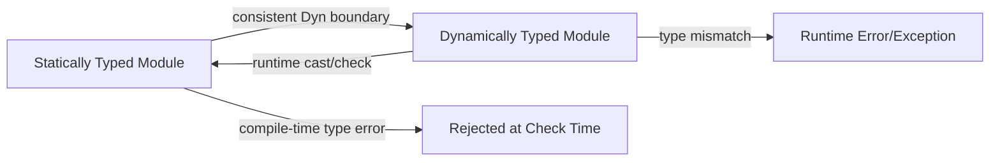

## Gradual Typing Systems

### Core Definition

Gradual typing is a type-system design that allows static and dynamic typing to coexist within the same program, letting a developer annotate some parts of a codebase with explicit types while leaving other parts unannotated and dynamically checked. The system treats unannotated code as having an implicit special type — often called the **dynamic type**, written $\text{Dyn}$ or `Any` — which is statically compatible with every other type. This permits incremental migration: a codebase can start fully dynamic and progressively gain static type coverage, module by module, without a disruptive full rewrite.

The term was formalized by Jeremy Siek and Walid Taha in the mid-2000s, building on earlier work on "soft typing," and has since been adopted, in varying forms, by TypeScript (over JavaScript), mypy and Pyright (over Python), Sorbet (over Ruby), Hack (over PHP), and Flow (over JavaScript).

### Motivation

Fully static languages catch type errors before execution but impose upfront annotation cost and can be inflexible for exploratory or rapidly changing code. Fully dynamic languages offer flexibility and low ceremony but defer all type errors to runtime, as seen in duck typing. Gradual typing is a compromise position: it lets a team choose, per module or per boundary, how much static guarantee they want, trading a spectrum instead of forcing an all-or-nothing choice.

**Key Points**

- Static and dynamic code can call each other within the same program.
- The dynamic type $\text{Dyn}$ acts as a universal compatibility escape hatch in the static type checker.
- Type errors in dynamically typed regions are still only caught at runtime; only annotated regions get compile-time (or check-time) guarantees.
- Migration is incremental — annotation coverage can grow over time without requiring a full rewrite.

### Mechanism: The Dynamic Type and Consistency

In a gradually typed system, the type checker doesn't use ordinary subtyping alone to decide whether an expression of one type may be used where another is expected. It uses a relation typically called **consistency**, often written $T_1 \sim T_2$, which behaves like equality/subtyping between two fully static types but treats $\text{Dyn}$ as consistent with everything:

$$\text{Dyn} \sim T \quad \text{for all } T$$


$$T \sim T \quad \text{(reflexivity)}$$

Consistency is generally not transitive: `int ~ Dyn` and `Dyn ~ string` both hold, but `int ~ string` does not. This intentionally weaker relation is what allows gradual boundaries to typecheck without permitting arbitrary type confusion between two fully static, unrelated types.

At the point where a value of type $\text{Dyn}$ is used in a context expecting a concrete static type, most gradual type systems insert a **runtime cast** (sometimes literally, sometimes implicitly through the host language's existing dynamic dispatch). If the runtime value doesn't actually match the expected type, a cast failure or type error is raised at that boundary rather than at compile time.

### Example — TypeScript

```typescript
// fully typed function
function double(x: number): number {
  return x * 2;
}

// untyped/dynamic value, implicitly 'any'
let input;
input = "5";

// TypeScript permits this at the static boundary because 'any' is consistent with everything
console.log(double(input));
```

**Output**



```
NaN
```

`[Inference]` `NaN` results here because `"5" * 2` type-coerces via JavaScript's runtime arithmetic rather than raising an exception; the exact runtime behavior at a gradual-typing boundary is determined by the underlying dynamic language's own semantics, not by the gradual type system itself. TypeScript's static checker permits the call, because `input` is inferred as `any`, and `any` is consistent with `number` — but no runtime check enforces that consistency, so the type error only becomes observable as an unexpected value, not as a thrown exception.

### Example — Python with mypy

```python
def greet(name: str) -> str:
    return "Hello, " + name

def untyped_caller(value):  # no annotation -> implicitly Any
    return greet(value)

untyped_caller(42)  # mypy: no static error, since 'value' is Any
```

Running `mypy` on this file reports no errors, because `value` has no annotation and is therefore treated as `Any`, which is consistent with `str`. Executing the code, however, raises a `TypeError` at runtime inside `greet`, since Python concatenation (`+`) does not implicitly coerce `int` to `str`. This illustrates the central trade-off of gradual typing: the static checker's silence at an `Any` boundary is not a guarantee of runtime safety.

### Soundness: Sound vs. Unsound Gradual Typing

A critical distinction in gradual type system design is whether the system is **sound** — meaning a value's runtime type always matches what the static checker inferred, everywhere, including at Any-boundaries.

- **Unsound gradual typing** (TypeScript, mypy, Pyright, Flow): the static checker's guarantees can be violated at runtime through dynamic boundaries, unsafe casts, or `any`/`Dyn`-typed data. This is a deliberate design trade-off favoring compatibility with a large existing dynamic ecosystem and low annotation friction.
- **Sound gradual typing** (Typed Racket, Reticulated Python `[research prototype]`, Grace): the system inserts runtime contracts/casts at every static-dynamic boundary so that a value typed `T` statically is *guaranteed* to actually have shape `T` at runtime, or a contract-violation error is raised precisely at the boundary crossing — not silently later.

**Key Points**

- Soundness in this context specifically means: the static type checker's claims are never violated by observed runtime values.
- Unsound systems are far more common in industrial practice because they retrofit existing dynamic languages without requiring the host runtime to enforce checks.
- Sound systems have measurable runtime performance overhead due to the inserted checks/contracts at every boundary. `[Inference]` The magnitude of that overhead is implementation- and workload-dependent, and published figures vary by benchmark.

### Gradual Typing vs. Related Disciplines

| Discipline | Type Coverage | Errors Caught | Migration Path |
| --- | --- | --- | --- |
| Static typing | Whole program | Compile time | N/A — typed from the start |
| Dynamic/duck typing | None (implicit) | Runtime only | N/A — untyped throughout |
| Gradual typing | Partial, chosen by developer | Compile time for annotated code; runtime for `Dyn`/`Any` regions | Incremental, module by module |
| Optional typing (loose usage) | Often used interchangeably with gradual typing, though some authors reserve it for systems with weaker/no soundness guarantees at all | Varies | Incremental |

`[Inference]` The distinction between "gradual typing" and "optional typing" as terms is not universally standardized across the literature; some authors (including Siek and Taha) use them to mean subtly different things, while much industry writing treats them as synonyms.

### Boundary Behavior

===MERMAID_DIAGRAM===

graph LR

A[Statically Typed Module] -- consistent Dyn boundary --> B[Dynamically Typed Module]

B -- runtime cast/check --> A

A -- compile-time type error --> C[Rejected at Check Time]

B -- type mismatch --> D[Runtime Error/Exception]



### Advantages

- **Incremental adoption**: large existing dynamic codebases can gain static guarantees module by module rather than requiring a full rewrite.
- **Flexible annotation granularity**: developers annotate hot paths, public APIs, or bug-prone modules first, deferring less critical code.
- **Preserves dynamic-language ergonomics**: metaprogramming, monkey-patching, and other dynamic idioms remain usable in unannotated regions.
- **Improved tooling in annotated regions**: autocompletion, refactoring safety, and static analysis improve wherever annotations exist, even partially.

### Disadvantages

- **Unsound by default in most industrial implementations**: type annotations can be silently violated across `Any`/`Dyn` boundaries, giving a false sense of safety if developers assume type-checker output implies runtime correctness.
- **Boundary friction**: passing values between typed and untyped code frequently requires explicit casts, type guards, or `# type: ignore`/`@ts-ignore` suppressions, which can accumulate as technical debt.
- **Incomplete coverage risk**: partially annotated codebases can leave critical paths unchecked indefinitely if migration stalls, providing an illusion of comprehensive typing.
- **Performance cost in sound implementations**: runtime contract checks at every static-dynamic boundary add overhead absent in either purely static or purely dynamic execution.
- **Annotation burden at boundaries**: generic or highly polymorphic dynamic code can be difficult to annotate precisely, sometimes forcing overly permissive types (`Any`) that undermine the value of the exercise.

### Language Landscape

- **TypeScript**: unsound gradual typing over JavaScript; `any` is the dynamic type; `unknown` offers a safer alternative requiring explicit narrowing before use.
- **Python**: `typing` module plus external checkers (mypy, Pyright, Pyre) implement unsound gradual typing; annotations are optional and unenforced by the CPython runtime itself.
- **Ruby**: Sorbet adds gradual static typing via `sig` blocks and RBI files, checked by a separate type checker rather than the Ruby VM.
- **PHP**: Hack (from Meta) implements gradual typing with a dedicated type checker (`hh_client`).
- **Racket**: Typed Racket is a prominent example of a **sound** gradual type system with enforced contracts at boundaries.
- **Dart**: transitioned from a historically unsound optional type system toward sound null safety and stricter static checking in later versions. `[Unverified]` Exact soundness guarantees differ across Dart's evolution and are best confirmed against current language-version documentation rather than assumed from older behavior.

### Idiomatic Practices

- **Progressive strictness flags**: tools like mypy (`--strict`) and TypeScript (`strict: true`) let teams ratchet up enforcement incrementally rather than requiring full strictness from day one.
- **Boundary annotation first**: annotating public function signatures and module boundaries before internal implementation details yields the highest safety-per-annotation-effort ratio.
- **Avoiding `Any` accumulation**: treating `Any`/`any` as a deliberate, reviewed escape hatch rather than a default fallback preserves the value of the static regions.
- **CI-enforced type coverage**: some teams track and enforce a minimum percentage of annotated code to prevent migration stalling.

### Related Topics

- Duck typing and dynamic dispatch
- Structural typing vs. nominal typing
- Sound vs. unsound type systems
- Contracts and runtime verification
- TypeScript's `unknown` vs `any`
- Python's `typing.Protocol` and structural typing via gradual typing tools