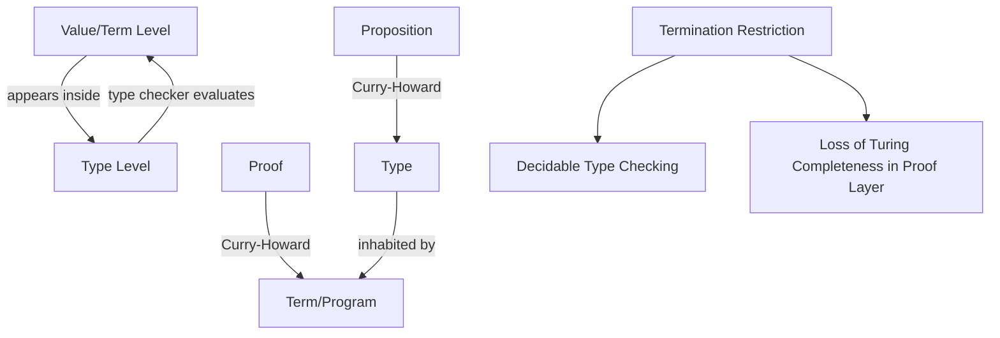

## Dependent Types


### Core Definition

A dependent type is a type whose definition depends on a *value*, rather than only on other types. In conventional type systems, types and values occupy strictly separate levels: `Vector<int>` depends on the type `int`, but never on a runtime value like `5`. In a dependently typed system, a type such as `Vector(n)` — "a vector of length $n$" — can depend on a specific integer value $n$, and that value can itself come from a variable, a computation, or a function argument. This collapses part of the traditional separation between the type level and the term (value) level: types can be computed, and terms can appear inside type expressions.

Formally, dependent types are most often introduced via **dependent function types** (also called Pi types, $\Pi$) and **dependent pair types** (Sigma types, $\Sigma$):

$$\Pi (x : A) . B(x)$$

reads as "a function that, given a value $x$ of type $A$, returns a value of type $B(x)$" — where $B$'s *type* depends on the specific $x$ received, not just on $A$.

### Motivation

Ordinary static type systems can express "this is a list of integers" but cannot express "this is a list of exactly 5 integers" or "this function only accepts a non-empty list" as a type-level guarantee — those become runtime checks, if checked at all. Dependent types let such properties be encoded directly in the type signature, so that a violation is a compile-time type error rather than a runtime exception, and, in systems with a proof checker, a program that type-checks can carry a machine-verified proof of a property alongside its implementation.

**Key Points**

- Types can be parameterized by ordinary values, not just by other types.
- The type checker must, in general, evaluate (or partially evaluate) terms to determine type equality — type checking and program evaluation become intertwined.
- Full dependent type systems are frequently powerful enough to double as proof assistants, via the **Curry-Howard correspondence**, where types correspond to logical propositions and terms correspond to proofs.
- Because type checking may require arbitrary computation, dependent type checking is undecidable in the fully general case; practical systems restrict the language of types to preserve decidability or termination guarantees. `[Inference]` The specific restriction strategy (e.g., requiring all functions to provably terminate, as in Agda/Coq's core calculus) varies by implementation and is a deliberate design trade-off rather than a single universal solution.

### Example — Length-Indexed Vectors (Idris-style)

```idris
data Vect : Nat -> Type -> Type where
  Nil  : Vect Z a
  (::) : a -> Vect n a -> Vect (S n) a

-- The type signature GUARANTEES the output length equals the sum of input lengths.
append : Vect n a -> Vect m a -> Vect (n + m) a
append Nil       ys = ys
append (x :: xs) ys = x :: append xs ys
```

Here, `Vect n a` is a vector of exactly `n` elements of type `a`, where `n` is a value of type `Nat` (natural number) that appears inside the type itself. The type signature of `append` is not merely documentation — the compiler checks that the implementation actually produces a vector whose length is provably `n + m`. Attempting to write an `append` implementation that returns a vector of the wrong length fails to type-check.

**Output**



```
(type-checks successfully — no separate runtime output;
 the guarantee is enforced entirely at compile time)
```

### Example — Runtime Bounds Safety

```idris
index : Fin n -> Vect n a -> a
index FZ     (x :: xs) = x
index (FS k) (x :: xs) = index k xs
```

`Fin n` is the type of natural numbers strictly less than `n` — a dependent type representing "a valid index into a vector of length `n`." Because `index` requires a `Fin n` for a `Vect n a`, an out-of-bounds index is a **compile-time type error**, not a runtime exception. `[Inference]` This eliminates an entire class of bugs (array-out-of-bounds) at the type level in code paths where index provenance is tracked through the type system, though this benefit only applies where the dependent indices are actually threaded through — dynamically computed indices not captured by `Fin n` still require a runtime or proof-carrying justification.

### Curry-Howard Correspondence

Dependent type theory is closely linked to constructive logic through the **Curry-Howard correspondence** (also called "propositions as types"): a proposition is represented as a type, and a proof of that proposition is a term (program) of that type. Under this correspondence:

| Logic | Type Theory |
| --- | --- |
| Proposition | Type |
| Proof | Term/program (inhabitant of the type) |
| Implication $P \Rightarrow Q$ | Function type $P \to Q$ |
| Conjunction $P \wedge Q$ | Product/pair type $P \times Q$ |
| Universal quantifier $\forall x. P(x)$ | Dependent function type $\Pi (x : A) . P(x)$ |
| Existential quantifier $\exists x. P(x)$ | Dependent pair type $\Sigma (x : A) . P(x)$ |

Under this reading, writing a program that type-checks against a proposition-as-type is equivalent to constructing a formal proof of that proposition. This is the theoretical foundation underlying proof assistants such as Coq, Agda, and Lean, where dependent types are used not primarily for conventional software engineering but for formalized mathematics and machine-checked proofs.

### Termination and Decidability

Because a dependent type can contain arbitrary terms, checking whether two types are equal can, in principle, require running arbitrary code to normalize those terms — which is undecidable for a Turing-complete language (the halting problem applies). Practical dependently typed languages resolve this in one of two broad ways:

- **Restrict the term language to be total** (all functions provably terminate), as in Agda and Idris's core, using structural recursion checkers or explicit termination proofs — sacrificing Turing completeness for decidable type checking.
- **Separate an untyped or partial "runtime" language from the typed "compile-time"/proof language**, allowing general-purpose Turing-complete computation at runtime while keeping the dependently-typed proof layer restricted, as in some hybrid designs. `[Speculation]` The precise boundary and terminology for this separation differ enough across systems (e.g., Idris's distinction between type-checking-time evaluation and general runtime execution) that a single unified description risks oversimplifying implementation-specific choices.

### Dependent Types vs. Related Disciplines

| Discipline | Types Depend On | Typical Use Case |
| --- | --- | --- |
| Generic/parametric types | Other types | Reusable containers (`List<T>`) |
| Refinement types | Predicates over values, checked via an SMT solver, layered on an otherwise ordinary type system | Lightweight value constraints without full dependent typing |
| Dependent types | Arbitrary values, evaluated by the type checker itself | Compile-time-verified invariants, formal proofs |

**Refinement types** (e.g., Liquid Haskell, F*) are sometimes conflated with dependent types because both constrain types using value-level predicates, but refinement types typically layer a restricted predicate logic (often decided via an SMT solver) on top of a conventional type system, rather than allowing the full generality of dependent type theory.

### System Architecture

===MERMAID_DIAGRAM===

graph TD

A[Value/Term Level] -- appears inside --> B[Type Level]

B -- type checker evaluates --> A

C[Proposition] -- Curry-Howard --> D[Type]

E[Proof] -- Curry-Howard --> F[Term/Program]

D -- inhabited by --> F

G[Termination Restriction] --> H[Decidable Type Checking]

G --> I[Loss of Turing Completeness in Proof Layer]



### Advantages

- **Compile-time verification of value-level invariants**: array bounds, non-null guarantees, protocol state machines, and numerical constraints can be enforced by the type checker rather than tested at runtime.
- **Machine-checked proofs**: via Curry-Howard, a type-checked program can constitute a formally verified proof of a mathematical or logical claim.
- **Elimination of entire bug classes**: properties like "this list is always sorted" or "this index is always in bounds" become structurally impossible to violate in well-typed code, for the paths where the invariant is actually encoded.
- **Types as precise, executable documentation**: a dependent type signature communicates guarantees far more specific than a conventional type signature.

### Disadvantages

- **Steep learning curve**: reasoning about types that themselves require evaluation is significantly more demanding than conventional static typing, and often assumes familiarity with constructive logic.
- **Annotation and proof burden**: fully leveraging dependent types often requires writing auxiliary proofs or lemmas to satisfy the type checker, which can dominate development effort relative to the "business logic."
- **Undecidable or slow type checking in the general case**: even where decidable, type checking can be computationally expensive since it may involve normalizing complex terms.
- **Limited mainstream tooling and ecosystem**: languages with full dependent types (Idris, Agda, Coq, Lean) have smaller ecosystems, less mature tooling, and steeper hiring/training costs than mainstream statically typed languages. `[Inference]` The relative maturity gap is likely to narrow or shift over time as tooling develops, so any specific comparison should be checked against current documentation rather than assumed fixed.
- **Interaction with Turing completeness**: languages that preserve full dependent typing with decidable checking typically restrict general-purpose recursion, which can complicate expressing certain algorithms that rely on non-obviously-terminating recursion.

### Language Landscape

- **Idris**: general-purpose dependently typed language explicitly designed for practical software engineering, not solely proof work.
- **Agda**: dependently typed functional language used heavily for formalized mathematics and as a research vehicle for type theory.
- **Coq**: proof assistant built on the Calculus of Inductive Constructions; dependent types underpin its proof language (Gallina).
- **Lean**: proof assistant and dependently typed language increasingly used both for mathematics formalization (e.g., `mathlib`) and general-purpose verified programming.
- **F***: verification-oriented language combining dependent types with refinement types and effect tracking, used in verified systems/cryptography projects. `[Unverified]` Claims about specific production deployments of F* should be checked against current project documentation rather than assumed from general reputation.
- **Mainstream languages with partial/limited dependent-type features**: Haskell (via extensions like `DataKinds`, `GADTs`, `TypeFamilies`) and Scala (via path-dependent types) offer restricted forms of dependent-type-like expressiveness without full dependent type theory.

### Related Topics

- Curry-Howard correspondence in depth
- Refinement types and SMT-based verification
- Proof assistants: Coq, Agda, Lean compared
- Structural typing vs. nominal typing
- Termination checking and totality
- Generalized Algebraic Data Types (GADTs)