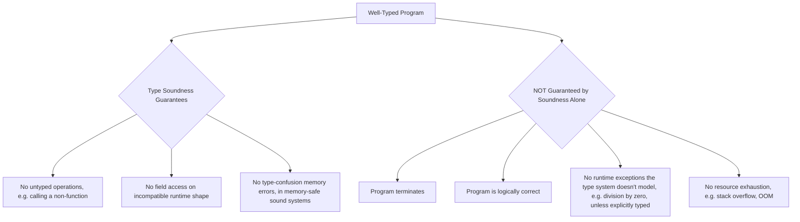

## Type Soundness and Safety Proofs


### Core Definition

Type soundness is the property of a type system guaranteeing that a well-typed program cannot exhibit certain classes of runtime errors — informally captured by Robin Milner's slogan **"well-typed programs don't go wrong."** A type system is sound if every program the type checker accepts is guaranteed, by that acceptance alone, not to encounter the specific category of failures the type system is designed to rule out (e.g., applying a function to arguments of the wrong type, accessing a field that doesn't exist on a value's actual runtime type).

Soundness is a property of the *type system's design*, proven mathematically relative to a formal semantics of the language — it is not something a test suite can establish, since a test suite only samples finitely many executions while soundness is a claim about *all* well-typed programs.

### The Progress and Preservation Framework

The standard technique for proving type soundness, due to Andrew Wright and Matthias Felleisen (1994), decomposes the soundness proof into two independent lemmas, each proven by structural induction over the language's typing and evaluation rules:

- **Progress**: A well-typed term is never "stuck" — it is either a value already, or it can take at least one more evaluation step.

$$\text{if } \varnothing \vdash e : T \text{ then } e \text{ is a value, or } \exists e' . \, e \to e'$$

- **Preservation** (also called **subject reduction**): If a well-typed term takes an evaluation step, the result is still well-typed, at the same type.

$$\text{if } \varnothing \vdash e : T \text{ and } e \to e' \text{ then } \varnothing \vdash e' : T$$

Together, these two lemmas give an inductive argument that a well-typed term never gets stuck at any point in its evaluation: Progress guarantees the first step is safe, Preservation guarantees the resulting term is still well-typed and therefore Progress applies again, and so on indefinitely (or until reaching a value). This is why the two lemmas are proven separately but stated together — neither alone implies soundness.

**Key Points**

- "Stuck" means the term is not a value and no evaluation rule applies to it — this is the formal definition of "going wrong."
- The proof is by induction on the *typing derivation* (for Preservation) and on the *typing derivation of the stuck-or-not claim* (for Progress), not by testing concrete programs.
- Soundness is always relative to a specific formal operational semantics for the language — a proof about an idealized calculus does not automatically transfer to every detail of a real-world implementation.
- Soundness does not mean the program is *correct* or *terminates* — only that it does not get stuck in the specific ways the type system rules out.

### Worked Example — A Minimal Typed Calculus

Consider a small language with booleans, integers, and conditionals, typed with a context $\Gamma$:



```
Types    T ::= Bool | Int
Terms    e ::= true | false | n | if e1 then e2 else e3 | e1 + e2

Typing rules:
Γ ⊢ true : Bool        Γ ⊢ false : Bool        Γ ⊢ n : Int

Γ ⊢ e1 : Bool   Γ ⊢ e2 : T   Γ ⊢ e3 : T
─────────────────────────────────────────
        Γ ⊢ if e1 then e2 else e3 : T

Γ ⊢ e1 : Int   Γ ⊢ e2 : Int
────────────────────────────
     Γ ⊢ e1 + e2 : Int
```

A term like `if true then 3 else 4` is well-typed at `Int`. **Progress** for the `if` case says: since `e1` (here `true`) is well-typed at `Bool`, either it's already a value (it is — `true` is a value) or it can step; because it's a value, the evaluation rule `if true then e2 else e3 → e2` applies, so the whole term is not stuck. **Preservation** says: after that step, the result `3` is still well-typed at `Int` — the same type the whole `if` expression had before stepping.

**Output**



```
if true then 3 else 4  →  3      (Progress: a step was possible)
3 : Int                          (Preservation: type Int preserved)
```

Now consider the ill-typed term `if 5 then true else false`. The typing rule for `if` requires `e1 : Bool`, but `5 : Int`, so this term is **not well-typed** — it is rejected by the type checker before evaluation ever begins. Soundness says nothing about it, because soundness is a conditional statement ("*if* well-typed, *then* doesn't get stuck") — it makes no promise whatsoever about ill-typed terms, which the type checker's job is to reject upstream.

### Why Both Lemmas Are Needed

A type system can satisfy Preservation while still being unsound if it lacks Progress: consider a hypothetical rule set where, once a term steps, it stays well-typed forever, but there exists some well-typed non-value term matching no evaluation rule at all — in that case, evaluation simply halts at a stuck, non-error state, which Preservation alone does not detect. Conversely, a system can satisfy Progress while lacking Preservation if evaluation steps can produce a term that no longer type-checks — Progress said the *next* step was safe, but says nothing about whether the term after *that* is safe, so the guarantee collapses after one step. `[Inference]` This mutual insufficiency is a standard didactic point in soundness proofs (e.g., in Pierce's *Types and Programming Languages*), though the specific pathological rule sets used to illustrate each failure mode vary by textbook and are typically constructed rather than drawn from a real language.

**Key Points**

- Progress alone: guarantees the *first* step is safe but says nothing about subsequent steps remaining well-typed.
- Preservation alone: guarantees well-typedness is maintained *if* a step occurs, but does not rule out getting permanently stuck.
- Only the conjunction of both, applied inductively across the entire evaluation sequence, yields the full soundness guarantee.

### Scope: What Soundness Does and Does Not Guarantee

===MERMAID_DIAGRAM===

graph TD

A[Well-Typed Program] --> B{Type Soundness Guarantees}

B --> C[No untyped operations, e.g. calling a non-function]

B --> D[No field access on incompatible runtime shape]

B --> E[No type-confusion memory errors, in memory-safe sound systems]

A --> F{NOT Guaranteed by Soundness Alone}

F --> G[Program terminates]

F --> H[Program is logically correct]

F --> I[No runtime exceptions the type system doesn't model, e.g. division by zero, unless explicitly typed]

F --> J[No resource exhaustion, e.g. stack overflow, OOM]



A common misconception is that "sound type system" means "no runtime errors of any kind." Soundness only covers the specific hazards the type system's rules are designed to rule out. A soundly-typed language can still raise a division-by-zero exception, run out of memory, or fail to terminate — none of these are type errors under a typical type system's definition, so soundness makes no claim about them unless the type system is specifically extended to track them (e.g., via dependent types encoding non-zero divisors, or effect systems tracking termination/resource use).

### Known Unsoundness in Mainstream Languages

Several widely used statically typed languages contain deliberate or accidental **unsoundness holes** — constructs the type checker accepts that can, in fact, go wrong at runtime:

- **Java/Kotlin array covariance**: `Object[] arr = new String[3]; arr[0] = 42;` type-checks (arrays are covariant) but throws `ArrayStoreException` at runtime — a well-known, deliberate unsoundness accepted for practical flexibility.
- **TypeScript**: explicitly unsound by design (see gradual typing) — `any`, unsafe type assertions (`as`), and structural covariance in function parameter types (bivariance in some contexts) can all be exploited to produce runtime type errors the checker did not flag.
- **C# covariant arrays and generic variance edge cases**: similar covariance-driven unsoundness to Java's array case. `[Inference]` The precise set of unsoundness holes and their status (fixed, deprecated, or still present) shifts across language versions, so specific claims should be checked against current language specifications rather than treated as permanently fixed facts.
- **Casts/reflection/unsafe blocks**: most mainstream languages (Java, C#, Rust's `unsafe`, etc.) provide an explicit escape hatch where the programmer, not the type checker, asserts a type relationship — soundness proofs for the "safe" subset of these languages typically exclude such escape hatches entirely.

Rust's ordinary safe subset is frequently cited as aiming for (and largely achieving) memory-safety soundness without a garbage collector, via its ownership and borrowing type discipline, though this guarantee is explicitly scoped to code outside `unsafe` blocks. `[Unverified]` Whether Rust's safe subset has been *formally, mechanically proven* sound in its entirety (as opposed to being informally argued and extensively tested) is an active and evolving area of programming-language research (e.g., the RustBelt project); the state of that formal verification effort should be checked against current publications rather than assumed settled.

### Mechanized Soundness Proofs

Because progress-and-preservation proofs are long, repetitive structural inductions, a substantial body of programming-languages research uses **proof assistants** (Coq, Agda, Isabelle/HOL, Lean) to *mechanically* verify soundness proofs for real or realistic language semantics, rather than relying solely on hand-written, hand-checked paper proofs. Notable examples include:

- **CompCert**: a formally verified C compiler with a machine-checked proof, in Coq, that compilation preserves program semantics.
- **RustBelt**: a research project constructing formal, machine-checked soundness proofs for a model of Rust's type system, including `unsafe` code patterns used inside safe abstractions.

`[Inference]` Mechanized proofs are generally considered a stronger form of evidence than hand-written paper proofs, since a proof assistant checks every inductive step mechanically rather than relying on human review to catch omitted cases — though this claim should be understood as a methodological consensus in PL research rather than a claim this material verifies independently.

### Relationship to Other Type-System Properties

| Property | What It Guarantees | Related To Soundness? |
| --- | --- | --- |
| Type soundness | Well-typed programs don't get stuck in the modeled error classes | Core property discussed here |
| Decidability of type checking | The type checker always terminates with an accept/reject answer | Independent — a system can be sound but undecidable (or vice versa) |
| Completeness (of a type checker) | Every "actually safe" program is accepted, not just every provably-typeable one | Distinct — a sound-but-incomplete checker rejects some safe programs (false positives); no mainstream general-purpose type system is both sound and complete for all safe programs |
| Strong normalization | Every well-typed program terminates | Distinct additional property, common in proof-assistant core calculi, generally absent from Turing-complete general-purpose languages |

### Advantages of Provable Soundness

- **Formal guarantee, not empirical confidence**: a soundness proof covers *every* well-typed program, including ones never tested, unlike a test suite which only samples specific executions.
- **Foundation for compiler optimization correctness**: many optimizing transformations rely on the type system's soundness guarantees to justify eliminating runtime checks the proof shows are unnecessary.
- **Basis for security properties**: soundness proofs underlie stronger claims like memory safety, information-flow non-interference, and capability-safety in security-critical language designs.
- **Enables safe FFI and interop reasoning**: knowing precisely which guarantees hold (and where the boundary of soundness lies, e.g., at `unsafe` blocks) lets developers reason about the safety of the system as a whole.

### Disadvantages and Practical Tensions

- **Full soundness proofs are labor-intensive**: for a full-scale industrial language (as opposed to an idealized calculus), a complete, faithful soundness proof is a substantial undertaking, and for most mainstream languages does not fully exist. `[Inference]` The gap between what is formally proven and what is informally believed sound is common across industrial languages, since formal verification effort tends to be prioritized for specific safety-critical subsets rather than entire language specifications.
- **Real languages often trade soundness for expressiveness or ergonomics**: covariant arrays and gradual typing's `any` are examples where language designers knowingly accepted unsoundness for practical benefit.
- **Soundness is scoped, not absolute**: it is easy to overstate what a "sound" label covers — a language can be "sound" with respect to type errors while still permitting other classes of runtime failure entirely.
- **Idealized calculi vs. real implementations**: a soundness proof for a paper's minimal calculus does not automatically certify the full feature set, standard library, and compiler of the real-world language it models — the gap between model and implementation is a persistent source of practical risk. `[Inference]` The size of this gap varies significantly by language and by how much of the real implementation's semantics the formal model actually captures.

### Related Topics

- Progress and Preservation proof techniques in detail
- Memory safety and its relationship to type soundness
- Gradual typing and soundness trade-offs
- Mechanized proof assistants: Coq, Agda, Isabelle/HOL
- Rust's ownership/borrowing soundness and the RustBelt project
- Type system completeness and the soundness/completeness trade-off