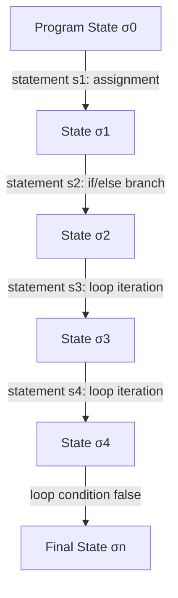

## Imperative Paradigm Characteristics

### Core Definition

The imperative programming paradigm expresses computation as a sequence of explicit statements that change a program's **state** — the collection of variable bindings and mutable data structures in memory at a given point in execution. A program is, at its core, a series of commands telling the machine *how* to arrive at a result, step by step, rather than a description of *what* the result is (the latter being characteristic of declarative paradigms). The term derives from grammatical mood: imperative statements are commands — "assign this," "loop while this," "jump to that label" — directed at the machine.

Imperative programming maps closely onto the underlying **von Neumann architecture** of most physical computers: a mutable memory store, a program counter that advances through instructions sequentially (with explicit control-flow jumps), and instructions that read and write that store. This close correspondence is a major reason imperative style has remained dominant since the earliest general-purpose programming languages.

### Defining Characteristics

**Key Points**

- **Explicit state and mutation**: variables represent memory locations whose contents can be reassigned; `x = x + 1` is a meaningful, common operation — the same name `x` denotes different values at different points in time.
- **Sequential execution with explicit control flow**: statements execute in a specified order, altered explicitly via constructs like `if`, `while`, `for`, `goto`, or function calls — the order of statements is itself part of the program's meaning.
- **Commands over expressions**: the fundamental unit is the **statement**, executed for its *effect* on state, as distinct from an **expression**, evaluated for its *value*. Many imperative languages have both, but statements are structurally primary.
- **Program state as an evolving snapshot**: correctness reasoning in imperative style typically requires tracking what values are held by which variables *at each point in the program*, not merely what a function computes from its inputs.

### Example — State Evolution Through Assignment

```python
total = 0
for i in range(1, 6):
    total = total + i
print(total)
```

**Output**



```
15
```

Each iteration of the loop performs an **assignment**: reads the current value of `total`, computes a new value, and overwrites the variable binding. The variable `total` does not represent a single, fixed value across the program's lifetime — it represents a memory location whose contents evolve. Reasoning about this program's correctness requires tracking the *sequence* of values `total` takes on: $0, 1, 3, 6, 10, 15$ — a fundamentally different mode of reasoning than evaluating a mathematical expression, where a symbol denotes one fixed value throughout.

### State Transformation Model

Formally, an imperative program can be modeled as a sequence of state transitions. If $\sigma$ represents a program state (a mapping from variable names to values) and each statement $s_i$ is a function transforming one state into the next:

$$\sigma_0 \xrightarrow{s_1} \sigma_1 \xrightarrow{s_2} \sigma_2 \xrightarrow{s_3} \cdots \xrightarrow{s_n} \sigma_n$$

The program's meaning is the final state $\sigma_n$ (or the sequence of states, if intermediate effects like I/O matter), reached by threading a mutable state through each statement in sequence. This is the semantic foundation underlying **Hoare logic**, the formal system most closely associated with reasoning about imperative program correctness via preconditions and postconditions: $\{P\} \, s \, \{Q\}$, read as "if precondition $P$ holds before executing statement $s$, postcondition $Q$ holds after."

### Control Flow Constructs

Imperative languages provide explicit constructs for directing the order of execution, since order is semantically meaningful:

- **Sequencing**: statements execute top-to-bottom by default (`;` or newline-separated blocks).
- **Selection**: `if`/`else`, `switch`/`case` — conditionally executing one branch of statements.
- **Iteration**: `while`, `for`, `do-while` — repeating a block of statements, typically driven by mutable loop-control variables.
- **Unconditional jumps**: `goto`, and its structured descendants `break`, `continue`, `return` — transferring control outside the normal sequential/nested flow.
- **Procedure/subroutine calls**: bundling a sequence of statements under a name, invoked to produce side effects, a return value, or both.

===MERMAID_DIAGRAM===

graph TD

A[Program State σ0] -- statement s1: assignment --> B[State σ1]

B -- statement s2: if/else branch --> C[State σ2]

C -- statement s3: loop iteration --> D[State σ3]

D -- statement s4: loop iteration --> E[State σ4]

E -- loop condition false --> F[Final State σn]



### Side Effects

A **side effect** is any observable change a statement makes beyond producing a return value — mutating a variable, writing to a file, printing to output, modifying a data structure another part of the program can observe. Imperative programming treats side effects as a normal, expected mechanism for accomplishing work, not an exception to be isolated. This is a defining point of contrast with pure functional programming, where side effects are either disallowed or explicitly tracked and constrained (e.g., via monads).

```c
int counter = 0;

void increment() {
    counter++;  // side effect: mutates state outside the function's own scope
}

int main() {
    increment();
    increment();
    printf("%d\n", counter);  // side effect: I/O
    return 0;
}
```

**Output**



```
2
```

`increment()` returns no value at all (`void`) — its entire purpose is the side effect of mutating `counter`. This is idiomatic imperative style: functions/procedures are frequently invoked *for their effect*, not for a returned value, which is a coherent and common pattern under this paradigm even though it would be meaningless under a purely functional model where every function must map inputs to outputs with no observable effect beyond that.

### Imperative vs. Related Paradigms

| Paradigm | Primary Unit | State Model | Order of Statements |
| --- | --- | --- | --- |
| Imperative | Statement (executed for effect) | Explicit, mutable, evolves over time | Semantically significant |
| Declarative (general) | Expression/description (evaluated for value or meaning) | Typically absent or minimized | Often insignificant or unspecified |
| Functional | Expression (evaluated for value) | Immutable by default (pure variants) | Often insignificant except where data dependencies force order |
| Object-oriented (as commonly practiced) | Method call (message to an object) | Mutable, but encapsulated within objects | Semantically significant, similar to imperative |

`[Inference]` Object-oriented programming is frequently described as "imperative programming organized around objects" rather than a fully separate paradigm at the state-and-control-flow level, since most mainstream OOP languages (Java, C#, Python's class model, C++) are built on an underlying imperative statement/mutation model — this characterization is common in PL pedagogy but not the only lens some authors use to describe OOP's distinguishing features (e.g., encapsulation and message-passing are sometimes treated as the primary distinguishing characteristics instead).

### Subparadigms Within Imperative Programming

- **Procedural programming**: imperative code organized into named procedures/functions/subroutines, emphasizing decomposition of a program into reusable, sequentially-invoked units (C, Pascal, early BASIC).
- **Structured programming**: an imperative discipline restricting control flow to sequencing, selection, and iteration, explicitly avoiding unrestricted `goto`, following Dijkstra's influential 1968 argument ("Go To Statement Considered Harmful") that unstructured jumps make programs harder to reason about and verify.
- **Object-oriented programming**: imperative statements and mutable state organized around objects, which encapsulate state and provide methods (procedures) that mutate it, typically restricting direct external access to that state.

### Advantages

- **Direct correspondence to machine execution model**: imperative code maps naturally onto how physical hardware actually executes instructions, which historically made it straightforward to compile efficiently.
- **Intuitive operational reasoning for many programmers**: "do this, then do that, then do the other thing" mirrors how humans commonly describe procedures and instructions in ordinary language.
- **Fine-grained control over performance-sensitive details**: explicit control over memory mutation, loop structure, and evaluation order allows tuning that can be harder to express or guarantee in more abstracted paradigms.
- **Mature, widespread tooling and ecosystem**: the dominance of imperative and imperative-derived (OOP) languages historically has produced extensive debugging, profiling, and tooling support built around stepping through sequential state changes.

### Disadvantages

- **State-tracking burden for correctness reasoning**: because meaning depends on the evolving state at each point in the program, reasoning about correctness — especially for concurrent or long programs — requires tracking many possible intermediate states.
- **Harder equational reasoning**: unlike a pure expression, `total = total + i` cannot be freely substituted or reordered without changing meaning, which complicates certain compiler optimizations and formal verification relative to referentially transparent code.
- **Concurrency hazards**: shared, mutable state accessed by multiple threads of control is a primary source of race conditions, requiring explicit synchronization mechanisms (locks, atomics) not needed in paradigms that avoid shared mutable state by default.
- **Side effects complicate testing and composition**: functions whose behavior depends on hidden mutable state, or that produce effects beyond their return value, are harder to test in isolation and compose predictably than pure functions.

### Language Landscape

- **C**: canonical procedural imperative language, minimal abstraction over the machine model, explicit manual memory management.
- **Pascal**: early structured-programming-focused imperative language, influential in programming pedagogy.
- **Java, C#, Python, C++**: predominantly imperative/procedural at the statement level, with object-oriented organization layered on top; all support mutable state and sequential control flow as the default mode.
- **Fortran**: one of the earliest widely used imperative languages, still prominent in numerical/scientific computing.
- **Assembly languages**: the most direct expression of the imperative model, operating essentially one machine instruction (state mutation) at a time with explicit jumps.

### Related Topics

- Structured programming and the elimination of `goto`
- Hoare logic and imperative program verification
- Object-oriented programming as imperative state organization
- Side effects and referential transparency
- Functional programming as a contrasting paradigm
- Concurrency hazards from shared mutable state