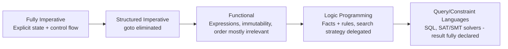

## Declarative Paradigm Characteristics

### Core Definition

The declarative programming paradigm expresses computation by describing **what** result is desired rather than **how**, step by step, to compute it. A declarative program is fundamentally a specification — a set of facts, constraints, relationships, or transformations — from which an underlying execution engine (an interpreter, query planner, solver, or evaluator) determines the actual sequence of operations needed to produce a result. The control flow that an imperative program would spell out explicitly is instead the *implementation's* responsibility, hidden behind the declarative description.

This is best understood as a spectrum rather than a strict binary: "declarative" is a relative property describing how much operational detail a language or construct requires the programmer to specify versus leaves to the underlying system. SQL, regular expressions, and pure functional programming all sit at different points along this spectrum, but all share the property that *order of evaluation and low-level control flow are not the primary carriers of meaning* in the way they are in imperative code.

### Defining Characteristics

**Key Points**

- **Specification over sequencing**: the program describes relationships or desired properties of the output, not an ordered list of state-mutating commands.
- **Minimized or absent explicit mutable state**: many declarative styles (especially pure functional and logic programming) avoid or restrict destructive assignment, favoring binding a name to a value once.
- **Execution strategy delegated to the runtime/engine**: the "how" — join order in a SQL query, search order in Prolog, evaluation order in a lazy functional language — is chosen by an underlying system, which is free to reorder, parallelize, or optimize as long as the declared result is preserved.
- **Referential transparency (in the functional declarative subset)**: an expression can be replaced by its value without changing the program's meaning, since expressions denote fixed values rather than statements that mutate an evolving state.

### Example — SQL: Describing a Result, Not a Procedure

```sql
SELECT department, AVG(salary) AS avg_salary
FROM employees
WHERE hire_date >= '2020-01-01'
GROUP BY department
HAVING AVG(salary) > 60000
ORDER BY avg_salary DESC;
```

This query never specifies a loop, an index, a join algorithm, or an access path. It declares: "the rows I want are grouped by department, restricted to recent hires, filtered by average salary, and sorted." The database's **query planner** decides whether to use an index scan or full table scan, which join algorithm to apply, and in what physical order operations actually execute — and it is free to choose a *different* physical execution plan on a different day (e.g., after statistics change) while the query's declared meaning, and its result, remain identical.

**Output** `[Inference]` The exact output rows depend entirely on the contents of the `employees` table, which is not specified here — the query's *meaning* is fixed, but its result is data-dependent, unlike a fully worked numeric example.



```
department   | avg_salary
-------------+-----------
Engineering  | 95000.00
Sales        | 72500.00
```

### Example — Functional: Expression Denotes a Value, Not a State Change

```haskell
total :: [Int] -> Int
total xs = sum xs

result = total [1, 2, 3, 4, 5]
```

**Output**



```
15
```

Unlike the imperative loop-and-accumulator version of the same computation, `sum xs` is not a sequence of mutations to a variable — it is a single expression that denotes the value $15$ wherever it appears. `total [1,2,3,4,5]` can be replaced by `15` anywhere in the program without changing the program's meaning; this substitutability is **referential transparency**, and it is characteristic of the pure-functional corner of the declarative spectrum. The underlying implementation may still, internally, use iteration or recursion to compute the sum — but that operational detail is not part of what the *programmer* specified or needs to reason about.

### The Declarative Spectrum

Declarative-ness is not all-or-nothing; different declarative styles delegate different amounts of operational control to the underlying engine:

===MERMAID_DIAGRAM===

graph LR

A[Fully Imperative

Explicit state + control flow] --> B[Structured Imperative

goto eliminated]

B --> C[Functional

Expressions, immutability, order mostly irrelevant]

C --> D[Logic Programming

Facts + rules, search strategy delegated]

D --> E[Query/Constraint Languages

SQL, SAT/SMT solvers — result fully declared]



`[Inference]` This ordering reflects a common pedagogical framing of "how much operational detail is delegated," but the exact placement of a given language or feature is somewhat a matter of framing rather than a strict formal metric — for instance, whether a lazily-evaluated functional language is "more declarative" than an eagerly-evaluated one is a debatable point rather than a settled ranking.

### Logic Programming — Declaring Facts and Rules

Logic programming (canonically, Prolog) expresses a program as a set of **facts** and **inference rules**, and computation proceeds by posing a **query** that the underlying resolution engine attempts to satisfy via automated search (typically SLD resolution with backtracking) — the programmer specifies *what relationships hold*, not the search procedure used to find an answer.

```prolog
parent(tom, bob).
parent(bob, ann).

grandparent(X, Z) :- parent(X, Y), parent(Y, Z).

?- grandparent(tom, ann).
```

**Output**



```
true.
```

The rule `grandparent(X, Z) :- parent(X, Y), parent(Y, Z)` reads declaratively: "X is a grandparent of Z if there exists some Y such that X is a parent of Y and Y is a parent of Z." Nothing in this rule specifies *how* to search the fact database to find such a Y — that backtracking search strategy belongs entirely to Prolog's execution engine, not to the program text.

### Declarative vs. Imperative — Direct Contrast

| Property | Imperative | Declarative |
| --- | --- | --- |
| Primary unit | Statement, executed for effect | Expression/fact/constraint, evaluated or matched for meaning |
| State | Explicit, mutable, evolves over time | Minimized, often immutable bindings |
| Control flow | Explicit (`if`, `while`, `goto`) — part of program meaning | Delegated to the runtime/engine — not specified by the programmer |
| Order of statements | Semantically significant | Often insignificant, or governed by data/logical dependencies rather than textual position |
| Correctness reasoning | Track evolving state at each program point | Reason about the declared relationship/specification directly |

### Declarative Subparadigms

- **Functional programming**: computation as evaluation of side-effect-free expressions built from function application; immutability and referential transparency are central (Haskell, and the pure-functional-style subset of Scala, Elixir, Clojure).
- **Logic programming**: computation as automated inference over facts and rules via a search/unification engine (Prolog, Datalog, Answer Set Programming).
- **Query languages**: computation as retrieval/transformation specified over structured data, with execution planning delegated to the engine (SQL, SPARQL, XQuery, GraphQL's resolution model).
- **Constraint programming**: computation as specification of constraints over variables, solved by a constraint solver that finds satisfying assignments (constraint logic programming, SAT/SMT solver interfaces, some CSS layout models `[Inference]` — treating CSS as declarative-by-constraint is a common but informal characterization rather than a term-of-art from constraint-programming literature specifically).
- **Markup and configuration description**: HTML, and declarative UI frameworks describing *what* the interface should look like given a state, rather than the imperative sequence of DOM mutations needed to get there (React's declarative rendering model is a widely cited example of this idea applied outside "pure" declarative languages). `[Inference]` Whether HTML itself constitutes a "programming paradigm" example, versus simply a declarative data-description format, is a matter of definitional scope some sources treat differently.

### Advantages

- **Reduced state-tracking burden**: because meaning does not depend on an evolving mutable state at each program point, reasoning about correctness is often more local — a given expression means the same thing wherever it appears.
- **Enables safe automatic optimization**: because the "how" is left to the engine, that engine is free to reorder, parallelize, cache, or otherwise optimize execution without the programmer needing to update the program text, as long as the declared result is preserved.
- **Concurrency and parallelism friendliness**: absence or minimization of shared mutable state removes a primary source of race conditions, making certain declarative styles (particularly pure functional) naturally amenable to safe parallel execution.
- **Higher-level, often more concise specification**: a SQL query or a Prolog rule can express, in a few lines, a relationship that would require substantially more imperative bookkeeping code to compute explicitly.

### Disadvantages

- **Performance opacity**: because the execution strategy is delegated, understanding *why* a particular query or program is slow can require understanding the underlying engine's decision-making (query planner heuristics, backtracking search order), which is a layer of indirection absent in imperative code where performance characteristics are more directly visible in the code itself.
- **Debugging can be less intuitive for state-oriented thinking**: tracing "what value did this have at this point" is less natural when the paradigm deliberately avoids exposing an evolving mutable state to reason about.
- **Engine/optimizer dependency**: the practical performance and even, in edge cases, the termination behavior of a declarative program can depend on details of the specific runtime/engine implementation, rather than being fully determined by the program text alone. `[Inference]` The severity of this dependency varies substantially by paradigm and implementation — for example, Prolog's search order is more implementation-visible than a typical SQL optimizer's plan selection, so this is not a uniform property across all declarative styles.
- **Impedance mismatch with stateful real-world interfaces**: I/O, user interaction, and other inherently effectful/sequential operations require declarative languages to introduce specific mechanisms (monads in Haskell, delegated imperative shells around a declarative core) to reconcile the paradigm with tasks that are, at bottom, unavoidably sequential and state-changing.

### Language Landscape

- **Haskell**: purely functional, lazy by default, strong emphasis on referential transparency; effects are explicitly typed and sequenced via monads.
- **SQL**: canonical declarative query language; execution plan chosen entirely by the database engine's query optimizer.
- **Prolog**: canonical logic-programming language; execution is automated resolution/backtracking search over declared facts and rules.
- **Datalog**: a restricted, more tractable subset of logic programming, widely used in program-analysis tools and some database systems for its stronger termination and complexity guarantees relative to full Prolog.
- **Regular expressions**: a narrow but ubiquitous declarative sublanguage — the pattern declares what strings match, while the matching algorithm (backtracking, DFA/NFA construction) is the engine's responsibility.
- **React (JSX/component model)**: an example of declarative UI description embedded within an otherwise imperative host language (JavaScript) — components declare what the UI should look like as a function of state, while React's reconciliation algorithm determines the actual imperative DOM operations needed.

### Related Topics

- Functional programming and referential transparency
- Logic programming and SLD resolution
- Query optimization and execution planning
- Constraint satisfaction and solver-based programming
- Monads and effect sequencing in pure functional languages
- Imperative paradigm characteristics (contrasting paradigm)