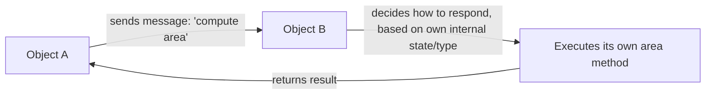

## Object-Oriented Paradigm Characteristics


### Core Definition

The object-oriented programming (OOP) paradigm organizes computation around **objects** — bundles that combine state (data/fields) and behavior (methods operating on that data) into a single unit — and expresses computation primarily as objects sending messages to one another (in Alan Kay's original formulation) or, in more common contemporary practice, as method invocations on objects. Rather than a program being a sequence of statements manipulating loosely related data structures (the procedural imperative model), an OOP program is a network of interacting, encapsulated units, each responsible for its own internal state.

Alan Kay, who coined the term "object-oriented programming" in the context of Smalltalk, later emphasized that the essential idea he intended was **message-passing** between independent, encapsulated entities, not the class-and-inheritance mechanics that came to dominate mainstream OOP languages such as Java and C++. `[Inference]` This distinction is well-documented in Kay's own retrospective writing and is frequently cited in PL discussions to note that "OOP" as practiced in mainstream industry diverges somewhat from Kay's original conception — though the degree to which this divergence matters is itself a point of ongoing discussion among practitioners and language designers rather than a settled consensus.

### Defining Characteristics

**Key Points**

- **Encapsulation**: an object bundles its internal state with the operations (methods) that act on it, typically restricting direct external access to that state via access modifiers (`private`, `protected`) or language convention.
- **Abstraction**: an object exposes a public interface (its methods and, sometimes, properties) while hiding implementation details of how that interface is realized internally.
- **Inheritance**: a class can derive from another class, acquiring (and optionally overriding) its fields and methods, establishing an "is-a" relationship and enabling code reuse across a class hierarchy.
- **Polymorphism**: code written against a general interface or supertype can operate on objects of multiple concrete subtypes, with the actual method invoked determined by the object's runtime type (**dynamic dispatch** / **subtype polymorphism**).

These four characteristics are the most commonly cited "pillars" of OOP in mainstream pedagogy, though, as with any paradigm characterization, different sources weight them differently, and some (message-passing purists, in Kay's tradition) would foreground communication between objects over the class/inheritance machinery specifically. `[Inference]` The "four pillars" framing itself is a common teaching device rather than a formally standardized definition of OOP — some treatments add or substitute other properties (e.g., dynamic binding, extensibility) depending on the source.

### Example — Encapsulation and Abstraction

```python
class BankAccount:
    def __init__(self, balance):
        self._balance = balance  # convention: "protected" by leading underscore

    def deposit(self, amount):
        if amount <= 0:
            raise ValueError("Deposit must be positive")
        self._balance += amount

    def withdraw(self, amount):
        if amount > self._balance:
            raise ValueError("Insufficient funds")
        self._balance -= amount

    def get_balance(self):
        return self._balance

account = BankAccount(100)
account.deposit(50)
account.withdraw(30)
print(account.get_balance())
```

**Output**



```
120
```

External code never directly manipulates `_balance`. It interacts exclusively through `deposit`, `withdraw`, and `get_balance` — the object's public interface. This is **encapsulation**: the invariant "balance can never be driven negative by a withdrawal exceeding it" is enforced entirely inside the object, at a single point of control, rather than relying on every piece of external code that touches the balance to independently remember and re-implement that rule.

### Example — Inheritance and Polymorphism

```python
class Shape:
    def area(self):
        raise NotImplementedError

class Circle(Shape):
    def __init__(self, radius):
        self.radius = radius
    def area(self):
        return 3.14159 * self.radius ** 2

class Rectangle(Shape):
    def __init__(self, width, height):
        self.width = width
        self.height = height
    def area(self):
        return self.width * self.height

shapes = [Circle(3), Rectangle(4, 5)]
for shape in shapes:
    print(shape.area())
```

**Output**



```
28.27431
20
```

The loop calls `shape.area()` identically for every element, without checking `isinstance(shape, Circle)` anywhere. `Circle` and `Rectangle` both **inherit** from `Shape` and each **override** `area()` with its own implementation; the correct method body is selected at runtime based on the object's actual class — this is **dynamic dispatch**, the mechanism underlying subtype polymorphism. The calling code is written once, against the `Shape` interface, and works uniformly across every current and future subclass that implements `area()`.

### Message Passing vs. Method Invocation

===MERMAID_DIAGRAM===

graph LR

A[Object A] -- sends message: 'compute area' --> B[Object B]

B -- decides how to respond, based on own internal state/type --> C[Executes its own area method]

C -- returns result --> A



In Kay's original framing, `shape.area()` is understood as object `shape` being *sent the message* `area`, and it is entirely up to `shape` — based on its own internal type and state — to decide how to respond. This framing emphasizes loose coupling and encapsulated autonomy over the caller dictating implementation. In most mainstream statically-typed OOP languages, this is realized concretely as a **virtual method table (vtable)** lookup or equivalent dynamic dispatch mechanism, resolved at runtime based on the object's concrete type.

### Subtype Polymorphism and the Liskov Substitution Principle

Subtype polymorphism relies on an implicit contract: if `Circle` is a subtype of `Shape`, then a `Circle` should be usable anywhere a `Shape` is expected, without breaking the caller's expectations. This is formalized by the **Liskov Substitution Principle** (Barbara Liskov, 1987): if $S$ is a subtype of $T$, then objects of type $T$ in a program may be replaced with objects of type $S$ without altering any of the desirable properties of that program.

$$\forall x : S,\ \phi(x) \text{ holds for } T \implies \phi(x) \text{ holds for } S$$

Violating this principle — e.g., a `Square` subclass of `Rectangle` that overrides `setWidth` to also change height, breaking a caller's assumption that width and height vary independently — produces subtype relationships that type-check but behave incorrectly, a commonly cited illustration of why subtyping is a semantic contract, not merely a syntactic one. `[Inference]` The Square/Rectangle example is a widely used illustrative case in OOP design literature specifically to demonstrate LSP violations, rather than an empirical claim about any particular codebase.

### Composition vs. Inheritance

A long-running design tension within OOP practice is **inheritance** (an "is-a" relationship, acquiring behavior from a superclass) versus **composition** (a "has-a" relationship, building behavior by holding references to other objects and delegating to them). The principle **"favor composition over inheritance"** is widely cited in OOP design literature (notably in *Design Patterns* by Gamma, Helm, Johnson, and Vlissides, 1994) as a reaction against deep, brittle inheritance hierarchies that couple subclasses tightly to superclass implementation details — a problem often called the **fragile base class problem**.

| Approach | Relationship | Coupling | Flexibility |
| --- | --- | --- | --- |
| Inheritance | "is-a" | Tight — subclass depends on superclass internals | Fixed at compile time (in most static OOP languages) |
| Composition | "has-a" / "uses-a" | Looser — depends only on the composed object's interface | Can often be reconfigured at runtime by swapping the composed object |

### OOP vs. Related Paradigms

| Property | Object-Oriented | Procedural (Imperative) | Functional |
| --- | --- | --- | --- |
| Primary unit | Object (state + behavior bundled) | Procedure operating on separate data | Pure expression/function |
| State location | Encapsulated within objects | Global or passed explicitly between procedures | Minimized; immutable bindings preferred |
| Dispatch | Often dynamic, based on runtime type | Static — the called procedure is fixed at the call site | Static, or via pattern matching/type classes |
| Code reuse mechanism | Inheritance, composition, interfaces | Function composition, shared procedures | Function composition, higher-order functions |

`[Inference]` OOP is frequently characterized as "imperative programming with state organized around objects rather than left unstructured," since the underlying statement/mutation model in most mainstream OOP languages is imperative — this is a common pedagogical framing rather than the only lens some sources use (encapsulation and message-passing are sometimes emphasized instead as the defining distinction).

### Class-Based vs. Prototype-Based OOP

Not all object-oriented languages use classes as the mechanism for creating objects and sharing behavior:

- **Class-based OOP** (Java, C++, C#, Python, Ruby): objects are instances of classes, which serve as templates/blueprints; inheritance operates between classes.
- **Prototype-based OOP** (JavaScript, Self, Lua's metatable-based OOP): objects inherit directly from other objects (their "prototype"), with no separate class construct required — new objects are typically created by cloning or delegating to an existing object.

```javascript
const animal = {
  speak() { return `${this.name} makes a sound.`; }
};

const dog = Object.create(animal);
dog.name = "Rex";
console.log(dog.speak());
```

**Output**



```
Rex makes a sound.
```

`dog` has no class at all — it directly delegates to `animal` as its prototype. JavaScript's `class` syntax (introduced in ES2015) is widely understood to be syntactic sugar over this same underlying prototype-chain mechanism, rather than a fundamentally different dispatch model. `[Inference]` Whether to characterize ES2015 `class` as "pure syntactic sugar" versus a construct with subtle additional semantics (e.g., around `super` binding or class fields) is a detail that has evolved across JavaScript specification versions and should be checked against current spec documentation for precision.

### Advantages

- **Encapsulation reduces coupling to internal representation**: external code depends on an object's public interface, not its internal fields, allowing internal implementation to change without breaking callers.
- **Polymorphism enables extensible, uniform interfaces**: new subclasses/implementations can be added without modifying code that already operates against the shared interface (related to the **open/closed principle**).
- **Natural modeling for certain problem domains**: systems with clear real-world entities and interactions (GUI widgets, simulation agents, domain models with clear nouns and behaviors) often map intuitively onto objects.
- **Code reuse via inheritance and composition**: shared behavior across related types can be factored into a common ancestor or composed component rather than duplicated.

### Disadvantages

- **Deep inheritance hierarchies can become fragile**: changes to a superclass can have unintended, hard-to-trace effects on distant subclasses (the fragile base class problem), motivating the "favor composition" guidance.
- **Encapsulated mutable state complicates concurrent reasoning**: objects mutating their own internal state are still subject to the same shared-mutable-state hazards as imperative programming generally when accessed by multiple threads.
- **Overuse can produce excessive ceremony**: modeling simple data transformations as elaborate object hierarchies (sometimes called over-engineering or the "everything is an object" anti-pattern) can add indirection without corresponding benefit.
- **Dynamic dispatch has a (typically small) runtime cost**: virtual method resolution generally involves an indirect lookup rather than a direct call, though `[Inference]` the practical performance impact is highly dependent on the specific compiler, runtime, and whether devirtualization optimizations apply, so magnitude claims should not be treated as universal.
- **LSP violations are easy to introduce inadvertently**: subtyping in most mainstream OOP languages is checked structurally/nominally by the compiler, not semantically, so a subclass can type-check while still violating the substitutability contract callers rely on.

### Language Landscape

- **Smalltalk**: the originating language of the "object-oriented" term, built entirely around message-passing between objects — including control-flow constructs like conditionals, which are themselves messages sent to boolean objects rather than built-in syntax.
- **Java**: mainstream class-based OOP with single inheritance of classes and multiple inheritance of interfaces; strongly emphasizes encapsulation via access modifiers.
- **C++**: class-based OOP supporting multiple inheritance directly, alongside procedural and (via templates) generic programming.
- **Python**: class-based OOP with dynamic typing, duck-typed polymorphism, and encapsulation enforced primarily by convention (leading underscores) rather than strict access control.
- **JavaScript**: prototype-based OOP under the hood, with `class` syntax as a layer over the prototype chain.
- **Ruby**: class-based OOP with a strong message-passing heritage from Smalltalk, including `method_missing` for intercepting undefined message sends.

### Related Topics

- Encapsulation and access control mechanisms across languages
- Liskov Substitution Principle and subtyping contracts
- Composition over inheritance and the fragile base class problem
- Prototype-based inheritance (JavaScript, Self)
- Dynamic dispatch and virtual method tables
- Design patterns (Gang of Four) as OOP idioms