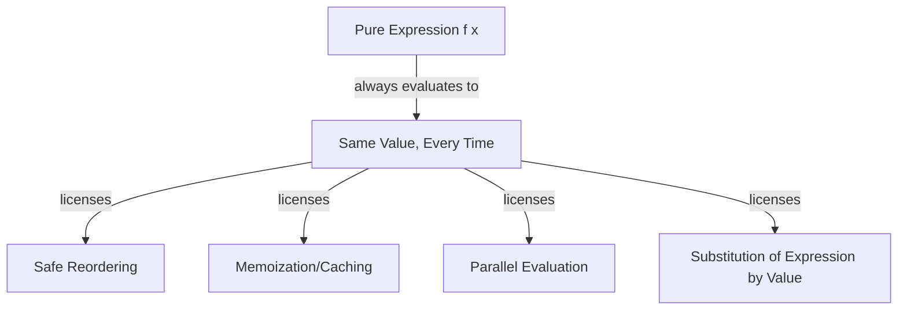

## Functional Paradigm Characteristics

### Core Definition

The functional programming paradigm treats computation as the evaluation of mathematical **functions**, and structures programs primarily through composing expressions that map inputs to outputs, rather than through statements that mutate a persistent state. In its purest form, a functional program has no assignment to mutable variables, no destructive updates, and no side effects observable outside a function's own return value — every function is, in the mathematical sense, a total mapping from arguments to a result, and calling it twice with the same arguments always yields the same result.

This model traces to **lambda calculus**, Alonzo Church's formal system for expressing computation entirely through function definition and application, developed in the 1930s as one of several equivalent foundations for computability alongside Turing machines. Lisp (1958) was the first major language to bring function-centric, expression-oriented computation into practical programming, and its descendants (Scheme, Clojure, Common Lisp) remain influential in the functional lineage alongside the ML family (SML, OCaml, F#, Haskell).

### Defining Characteristics

**Key Points**

- **First-class and higher-order functions**: functions are values — they can be assigned to variables, passed as arguments, returned from other functions, and stored in data structures, on equal footing with any other value type.
- **Immutability**: data, once created, is not modified in place; "changing" a value means producing a new value, typically leaving the original unchanged and often still accessible elsewhere.
- **Referential transparency**: an expression can always be replaced by its evaluated value without altering the program's behavior — this holds specifically because functions have no side effects and always return the same output for the same input.
- **Declarative, expression-oriented style**: a functional program is built from expressions that denote values, composed together, rather than statements sequenced for effect — this places functional programming within the broader declarative paradigm family.
- **Recursion over iteration**: since destructive loop-counter mutation is disallowed or discouraged, repetition is expressed via recursive function calls rather than `for`/`while` loops with mutable counters.

### Example — Pure Functions and Immutability

```haskell
addTax :: Double -> Double
addTax price = price * 1.08

prices = [10.0, 20.0, 30.0]
withTax = map addTax prices
```

**Output**



```
withTax  = [10.8, 21.6, 32.4]
prices   = [10.0, 20.0, 30.0]   -- unchanged
```

`map addTax prices` produces an entirely new list; the original `prices` list is never mutated and remains available afterward. `addTax` is a **pure function**: given `10.0`, it always returns `10.8`, with no dependency on or modification of anything outside its own arguments. This is a direct consequence of immutability and referential transparency working together — there is no hidden state `addTax` could read from or write to even if it wanted to.

### First-Class and Higher-Order Functions

A **higher-order function** either takes another function as an argument, returns a function as its result, or both. This is the primary mechanism functional programming uses to express general-purpose control-flow and data-transformation patterns that imperative languages express via explicit loops.

```javascript
const numbers = [1, 2, 3, 4, 5, 6];

const doubled = numbers.map(x => x * 2);
const evens   = numbers.filter(x => x % 2 === 0);
const sum     = numbers.reduce((acc, x) => acc + x, 0);

console.log(doubled, evens, sum);
```

**Output**



```
[ 2, 4, 6, 8, 10, 12 ] [ 2, 4, 6 ] 21
```

`map`, `filter`, and `reduce` are themselves ordinary functions that accept another function as an argument (a **callback**) and apply it according to a fixed traversal pattern. This factors "how to walk through a list" (the higher-order function's job) apart from "what to do with each element" (the passed-in function's job) — the same three combinators recur across almost all functional-style data processing, replacing hand-written imperative loops with a small, composable vocabulary.

### Referential Transparency and Equational Reasoning

Because a pure expression always evaluates to the same value, functional programs support **equational reasoning**: substituting an expression with its value, or vice versa, never changes program meaning. Formally, if $f$ is pure:

$$f(x) = f(x) \quad \text{always, regardless of when or how many times it is evaluated}$$

This licenses transformations a compiler (or a programmer, reasoning by hand) can freely apply — reordering independent computations, caching (**memoizing**) results, eliminating redundant calls, or evaluating in parallel — without risk of changing the program's observable behavior, because there is no hidden state whose mutation order could matter. This is a sharp contrast with imperative code, where `total = total + i` cannot be freely reordered or eliminated without changing what later reads of `total` observe.

===MERMAID_DIAGRAM===

graph TD

A[Pure Expression f x] -- always evaluates to --> B[Same Value, Every Time]

B -- licenses --> C[Safe Reordering]

B -- licenses --> D[Memoization/Caching]

B -- licenses --> E[Parallel Evaluation]

B -- licenses --> F[Substitution of Expression by Value]



### Recursion as the Primary Repetition Mechanism

Without mutable loop counters, functional style expresses repetition through recursive function calls, typically structured so that each call handles one element and delegates the rest to a recursive call on a smaller input:

```haskell
sumList :: [Int] -> Int
sumList []     = 0
sumList (x:xs) = x + sumList xs
```

Many functional languages and compilers recognize **tail recursion** — where the recursive call is the very last operation performed, with no pending work after it returns — and transform it into an iterative loop at the machine-code level (**tail call optimization**), avoiding the stack growth that naive recursion would otherwise incur. `[Inference]` Whether tail call optimization is guaranteed by a language's specification (as in Scheme) versus merely a common compiler optimization applied opportunistically (as in many other functional-capable languages) differs by implementation and should be confirmed against the specific language's documentation rather than assumed uniformly.

### Purity Spectrum: Pure vs. Impure Functional Languages

Not all "functional" languages enforce purity as strictly:

| Language | Purity Discipline | Mutation |
| --- | --- | --- |
| Haskell | Purely functional; side effects tracked explicitly via the type system (monads, notably `IO`) | Disallowed outside explicitly typed effectful contexts |
| Clojure | Functional-first, immutable-by-default persistent data structures | Allowed via explicit, clearly marked constructs (atoms, refs) |
| Scheme / Racket | Functional style strongly encouraged | Mutation available (`set!`) and used pragmatically |
| F#, OCaml | Functional-first (ML family) with imperative escape hatches | Mutable references and loops available and commonly used |
| JavaScript, Python | Multi-paradigm; functional style is a matter of convention, not enforcement | Freely mutable by default |

Haskell's approach — using its type system to track and sequence side effects via the `IO` monad — allows the language to remain purely functional at the type level while still supporting real-world effectful programs: a value of type `IO Int` is not itself an integer, but a *description* of an effectful computation that, when executed by the runtime, produces one. `[Inference]` This type-level separation between "pure computation" and "description of an effect to be performed" is Haskell's specific mechanism; other pure or near-pure functional languages that support effects use related but not identical mechanisms (algebraic effect systems, uniqueness types), so the monadic-IO approach should not be treated as the only way to reconcile purity with effects.

### Functional vs. Related Paradigms

| Property | Functional | Imperative | Object-Oriented |
| --- | --- | --- | --- |
| Primary unit | Pure expression/function | Statement (executed for effect) | Method call on an object |
| State | Immutable by default (pure variants) | Explicit, mutable, evolves over time | Mutable, encapsulated within objects |
| Repetition | Recursion, higher-order combinators (`map`/`filter`/`reduce`) | Loops (`for`/`while`) with mutable counters | Loops, often combined with iterator objects/methods |
| Reasoning model | Equational — substitute expression for value | Operational — track evolving state at each point | Track each object's own encapsulated state over time |

### Advantages

- **Reduced state-related bugs**: with no shared mutable state to accidentally alias or race on, an entire class of concurrency and aliasing bugs common in imperative/OOP code is structurally avoided in the pure subset.
- **Natural parallelism**: because pure functions have no dependency on execution order or shared state, independent computations can often be parallelized automatically or with minimal coordination.
- **Easier testing and composition**: pure functions are trivially testable in isolation (same input always gives same output, no setup/teardown of hidden state required) and compose predictably.
- **Strong support for equational/formal reasoning**: referential transparency enables both informal reasoning by substitution and, in languages with strong type systems, more rigorous formal verification.

### Disadvantages

- **Performance overhead from immutability**: creating new data structures instead of mutating in place can incur allocation and copying costs, though **persistent data structures** (used in Clojure, Scala, and elsewhere) mitigate much of this via structural sharing. `[Inference]` The actual performance gap versus mutation-based equivalents is workload- and implementation-dependent, and has narrowed substantially with modern persistent-data-structure designs, so blanket claims about functional code being slower should be checked against the specific runtime and workload rather than assumed generally.
- **Learning curve for imperative-trained programmers**: recursion-first thinking, avoiding assignment, and reasoning about types like monads represent a substantial conceptual shift from mutation-and-loop-based imperative habits.
- **I/O and genuinely stateful tasks require reconciliation mechanisms**: real-world programs must eventually perform side effects (reading input, writing output, mutating a database) — pure functional languages need dedicated mechanisms (monads, effect systems) to accommodate this without abandoning purity, adding conceptual overhead relative to just writing a statement.
- **Stack depth concerns with recursion**: in the absence of guaranteed tail call optimization, deep non-tail recursion can exhaust the call stack in ways an equivalent imperative loop would not.

### Language Landscape

- **Haskell**: purely functional, lazy evaluation by default, strong static type system, effects tracked via monads.
- **Lisp / Scheme / Racket**: among the earliest functional languages; homoiconic (code represented as the language's own data structures), strong macro systems, mutation available but functional style idiomatic.
- **Clojure**: functional-first Lisp on the JVM, immutable persistent data structures by default, explicit concurrency primitives (atoms, refs, agents) for controlled mutation.
- **ML family (SML, OCaml, F#)**: functional-first with strong static type inference, algebraic data types, and pragmatic imperative features available alongside the functional core.
- **Erlang/Elixir**: functional, immutable-by-default, built around lightweight processes and message-passing concurrency rather than shared mutable state — a design point closely tied to functional purity's concurrency benefits.
- **JavaScript, Python, Scala**: multi-paradigm languages supporting functional-style programming (first-class functions, `map`/`filter`/`reduce`, optional immutability conventions) without enforcing purity at the language level.

### Related Topics

- Lambda calculus as the formal foundation of functional computation
- Monads and effect tracking in typed functional languages
- Persistent (immutable) data structures and structural sharing
- Tail call optimization and recursion strategies
- Declarative paradigm characteristics (broader paradigm family)
- Pattern matching and algebraic data types