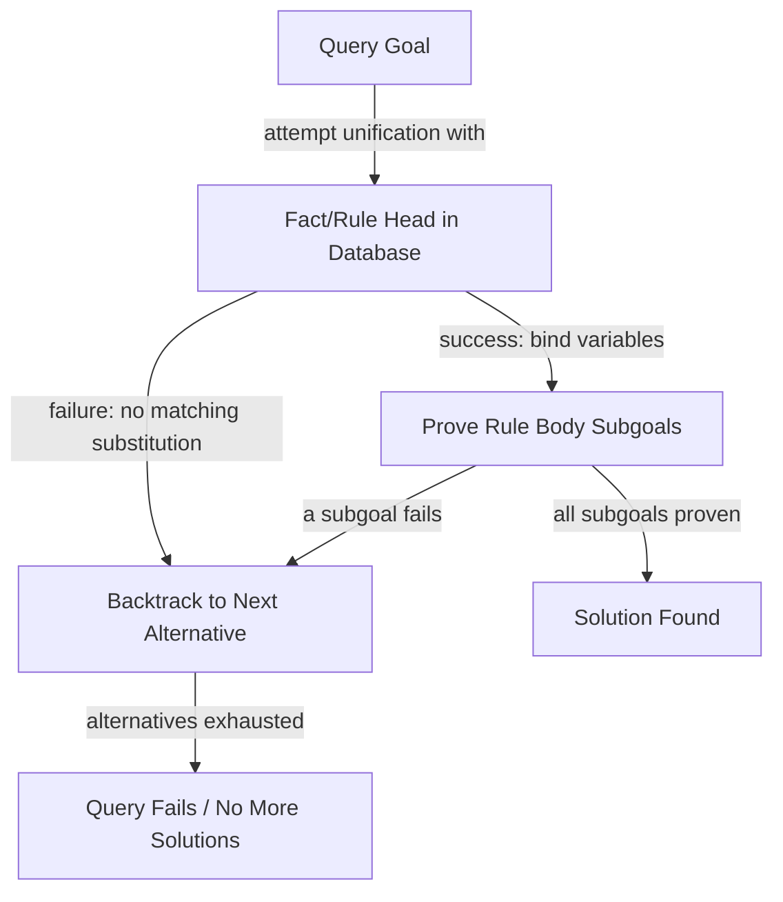

## Logic Paradigm Characteristics

### Core Definition

The logic programming paradigm expresses computation as automated inference over a database of **facts** and **rules**, using formal logic — specifically, a decidable, computationally tractable fragment of first-order predicate logic — as both the program's syntax and its semantics. Rather than specifying a sequence of state transformations (imperative) or a composition of pure functions (functional), a logic program declares *what is true*, and computation proceeds by posing a **query** (a goal) that the underlying inference engine attempts to prove or refute against the declared facts and rules, using an automated theorem-proving strategy.

The canonical logic programming language is **Prolog** (from *Programmation en Logique*), developed by Alain Colmerauer and Robert Kowalski in the early 1970s, building on earlier work in automated theorem proving and resolution logic. Prolog's execution model — **SLD resolution** with **unification** and **backtracking** — remains the foundational mechanism most subsequent logic languages either adopt directly or adapt.

### Defining Characteristics

**Key Points**

- **Declarative specification of relationships**: a program is a set of logical assertions (facts) and implications (rules), not an ordered sequence of commands — the program describes *what relationships hold*, and the search strategy for finding an answer belongs to the engine, not the program text.
- **Unification as the core computational mechanism**: matching a query against facts/rules by finding a substitution of variables that makes two logical terms syntactically identical — this single mechanism performs the combined work that parameter passing, pattern matching, and equality testing perform separately in other paradigms.
- **Automated search with backtracking**: when a rule's subgoals fail to be satisfied by the engine's current choice, the system automatically backtracks to try alternative facts/rules, exploring the search space without the programmer writing explicit search code.
- **Non-deterministic, multi-answer queries**: a single query can have zero, one, or many solutions; the engine can be asked to find the first solution, or backtrack to enumerate all solutions, rather than a function committing to exactly one return value.

### Example — Facts, Rules, and Query Resolution

```prolog
% Facts
parent(tom, liz).
parent(tom, bob).
parent(bob, ann).
parent(bob, pat).

% Rule
grandparent(X, Z) :- parent(X, Y), parent(Y, Z).

?- grandparent(tom, ann).
```

**Output**



```
true.
```

The query `grandparent(tom, ann)` is resolved by the engine attempting to prove the rule's body: it must find some `Y` such that `parent(tom, Y)` and `parent(Y, ann)` both hold. It unifies `Y` with `liz` first (via `parent(tom, liz)`), then checks `parent(liz, ann)` — which fails, since no such fact exists — so the engine **backtracks**, unifies `Y` with `bob` instead (via `parent(tom, bob)`), and checks `parent(bob, ann)` — which succeeds. None of this search sequence was written by the programmer; it emerges entirely from the automated resolution strategy applied to the declared facts and rule.

### Example — Multi-Answer Queries

```prolog
?- grandparent(tom, X).
```

**Output**



```
X = ann ;
X = pat.
```

Unlike a function call, which returns exactly one value, a logic query can have multiple satisfying substitutions. The engine returns the first (`X = ann`), and, when explicitly asked to backtrack (conventionally via `;` in interactive Prolog sessions), searches for and returns the next (`X = pat`), continuing until the search space is exhausted and no further solutions remain. This many-answers-by-default behavior is a defining departure from both imperative procedures and pure functions, both of which are conventionally single-valued per invocation.

### Unification

**Unification** is the process of finding a substitution for the variables in two logical terms that makes the terms identical. It generalizes both pattern matching (as in functional languages) and simple equality testing, and it is symmetric and bidirectional — unlike a function call, where arguments flow one way (caller to callee) and a single value flows back, unification can simultaneously bind variables on *both* sides of an equation.

$$\text{unify}(f(X, b), f(a, Y)) = \{X \mapsto a,\ Y \mapsto b\}$$

Given the terms `f(X, b)` and `f(a, Y)`, unification finds the substitution $\{X \mapsto a, Y \mapsto b\}$ that makes both terms syntactically identical: `f(a, b)`. If no such substitution exists (e.g., unifying `f(a)` with `g(a)`, which have different functors), unification fails, and the engine backtracks to try an alternative.

===MERMAID_DIAGRAM===

graph TD

A[Query Goal] -- attempt unification with --> B[Fact/Rule Head in Database]

B -- success: bind variables --> C[Prove Rule Body Subgoals]

B -- failure: no matching substitution --> D[Backtrack to Next Alternative]

C -- all subgoals proven --> E[Solution Found]

C -- a subgoal fails --> D

D -- alternatives exhausted --> F[Query Fails / No More Solutions]



### SLD Resolution

The formal inference procedure underlying Prolog's execution is **SLD resolution** (Selective Linear Definite clause resolution), a restricted, algorithmically tractable case of general first-order resolution, applicable specifically to **Horn clauses** — logical formulas with at most one positive literal, of the form:

$$H \leftarrow B_1, B_2, \ldots, B_n$$

read as "H is true if $B_1$ and $B_2$ and ... and $B_n$ are all true." A fact is a Horn clause with no body (`H` is unconditionally true); a rule is a Horn clause with a non-empty body. Restricting logic programs to Horn clauses is what makes SLD resolution decidable-in-practice and efficiently implementable, at the cost of expressiveness relative to full first-order logic — not every first-order logical statement can be expressed as a Horn clause. `[Inference]` The specific trade-off between Horn-clause tractability and full first-order expressiveness is a standard point in logic-programming theory, though the precise boundary of what is and isn't Horn-clause-expressible is a technical detail best verified against a formal logic-programming reference for any specific formula in question.

### The Closed-World Assumption and Negation as Failure

Prolog and most conventional logic-programming systems operate under the **closed-world assumption (CWA)**: anything that cannot be proven true, given the current facts and rules, is treated as false. This underlies Prolog's default negation mechanism, **negation as failure (NAF)**: `\+ Goal` succeeds if and only if `Goal` cannot be proven.

```prolog
bird(tweety).
bird(penguin).
flies(X) :- bird(X), \+ cannot_fly(X).
cannot_fly(penguin).

?- flies(tweety).
```

**Output**



```
true.
```

`flies(tweety)` succeeds because `cannot_fly(tweety)` cannot be proven from the database (it's simply absent), so `\+ cannot_fly(tweety)` succeeds under the closed-world assumption. This is logically distinct from *classical* negation ("provably false") — NAF concludes falsity from an *absence of proof*, which means adding new facts later can retroactively invalidate previously "successful" negations, a property called **non-monotonicity**. `[Inference]` This non-monotonic behavior is a well-established, deliberate design property of NAF-based systems in logic programming theory, though its practical implications for a specific program depend on whether and how the fact database changes during execution — a detail that varies by application.

### Logic vs. Related Declarative Subparadigms

| Property | Logic Programming | Functional Programming | Query Languages (SQL) |
| --- | --- | --- | --- |
| Core mechanism | Unification + resolution search | Function application/evaluation | Relational algebra, engine-chosen execution plan |
| Values per query | Zero, one, or many (via backtracking) | Exactly one (a function returns a single value) | Zero or more rows (a result set) |
| Bidirectionality | Yes — unification can bind variables on either side | No — arguments flow in, one result flows out | Partial — some query forms are more flexible than direct function calls, but generally not fully bidirectional |
| Underlying formalism | First-order logic (Horn clause subset) | Lambda calculus | Relational algebra / tuple relational calculus |

### Datalog: A Restricted, More Tractable Dialect

**Datalog** is a subset of logic programming that further restricts Prolog by disallowing complex terms as arguments (no nested function symbols) and typically disallowing or heavily restricting general recursion patterns that could cause non-termination. This restriction trades some of Prolog's expressiveness for **guaranteed termination** and more predictable computational complexity, making Datalog well-suited to database query evaluation and static program analysis, where predictable termination is essential. `[Inference]` Datalog's specific complexity-class guarantees (commonly cited as within PTIME for the core language) depend on which extensions (negation, aggregation) a particular Datalog dialect includes, so precise complexity claims should be checked against the specific dialect's formal specification rather than assumed uniformly across all Datalog variants.

### Advantages

- **Declarative expression of complex relationships**: recursive relationships (like `grandparent` built from `parent`) are expressed as direct logical statements, without the programmer writing explicit traversal or search code.
- **Built-in non-deterministic search**: problems naturally involving search-and-backtrack — constraint satisfaction, parsing, combinatorial puzzles — map directly onto the language's native execution model rather than requiring hand-rolled search algorithms.
- **Bidirectional relations via unification**: because unification doesn't distinguish "input" from "output" arguments the way ordinary function calls do, some predicates can be queried in multiple directions (e.g., a Prolog `append/3` predicate can be used to concatenate lists *or* to split a list into all possible prefix/suffix pairs, from the identical predicate definition).
- **Strong fit for symbolic AI and knowledge representation**: expert systems, natural language parsing, and rule-based reasoning historically found logic programming a natural fit for encoding domain knowledge as facts and inference rules.

### Disadvantages

- **Performance can be difficult to predict and control**: the automated search strategy, while convenient, can explore large or even infinite search spaces if rules are not carefully structured, and understanding *why* a query is slow requires understanding the resolution/backtracking strategy, similar in spirit to the performance-opacity concern general to declarative paradigms.
- **Non-monotonic negation is a frequent source of subtle bugs**: negation-as-failure's dependence on the closed-world assumption means a program's behavior can change in non-obvious ways when new facts are added, since "not proven true" is not the same as "proven false."
- **Limited mainstream adoption and tooling**: outside specific niches (constraint solving, some symbolic AI applications, static analysis via Datalog), logic programming languages have a much smaller ecosystem and developer base than mainstream imperative, OOP, or even functional languages. `[Inference]` The scope of "niche" here is a general characterization rather than a precise, current market-share figure, which would need to be checked against up-to-date industry data.
- **Impedance mismatch with stateful, effectful tasks**: like other strongly declarative paradigms, expressing inherently sequential, side-effecting operations (I/O, mutation) requires extensions or impure escape hatches (Prolog provides `assert`/`retract` for database mutation, which breaks the purely declarative reading of the program when used).

### Language Landscape

- **Prolog**: the canonical, general-purpose logic programming language; SLD resolution with unification and backtracking; widely used in teaching, symbolic AI, and natural language processing research.
- **Datalog**: restricted, terminating subset of logic programming, prominent in database query evaluation, static analysis tools (e.g., points-to analysis), and some knowledge-graph query systems.
- **Answer Set Programming (ASP)**: a logic-programming-adjacent paradigm oriented around finding *stable models* (answer sets) satisfying a program's constraints, well-suited to combinatorial search and optimization problems; solvers include clingo. `[Inference]` Whether ASP is classified as a subfield of logic programming or an adjacent/successor paradigm varies by source, since it departs from Prolog's SLD-resolution execution model despite sharing Horn-clause-like syntax.
- **Mercury**: a logic/functional hybrid language adding static typing and mode/determinism declarations on top of a Prolog-like logic core, aimed at improving performance predictability and compile-time error detection relative to standard Prolog. `[Unverified]` Specific claims about Mercury's current adoption, performance benchmarks, or active development status should be checked against current project sources rather than assumed from general reputation.
- **Constraint Logic Programming (CLP)**: extends logic programming by replacing or augmenting unification with constraint solving over specific domains (e.g., `CLP(FD)` for finite domains), used for scheduling, planning, and combinatorial optimization problems.

### Related Topics

- Unification algorithms and Horn clause resolution
- Datalog and static program analysis applications
- Constraint Logic Programming and constraint satisfaction
- Closed-world assumption and non-monotonic reasoning
- Answer Set Programming and stable model semantics
- Declarative paradigm characteristics (broader paradigm family)