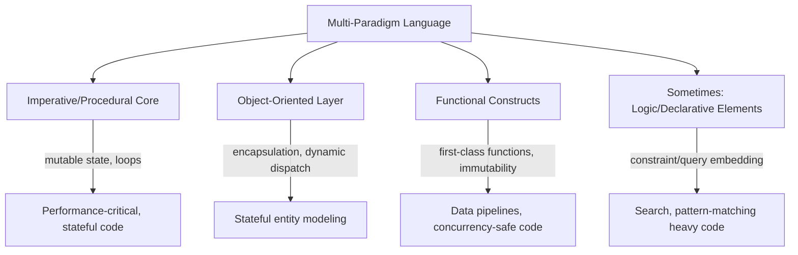

## Multi-Paradigm Language Design


### Core Definition

Multi-paradigm language design is the practice of constructing a programming language that deliberately supports more than one programming paradigm — imperative, object-oriented, functional, logic, or others — as first-class, interoperable capabilities within a single language, rather than committing exclusively to one paradigm's model of computation and state. Rather than treating paradigms as mutually exclusive design philosophies each requiring a separate language, multi-paradigm design treats them as a toolbox of complementary techniques a programmer can draw from within one codebase, one module, or even one function, depending on which model best fits the problem at hand.

This is distinct from a language merely *permitting* patterns associated with another paradigm through workarounds (e.g., simulating objects via closures in a purely functional language, or writing recursive, side-effect-free functions in an imperative language). True multi-paradigm design implies the language provides **dedicated, idiomatic syntax and semantics** for multiple paradigms — not merely the theoretical possibility of emulating them.

### Motivation

No single paradigm is uniformly best suited to every problem domain: functional style excels at data transformation pipelines and concurrent-safe code; object-oriented style excels at modeling stateful entities with encapsulated behavior; imperative style maps directly onto performance-critical, hardware-adjacent code; logic/declarative style excels at search and constraint problems. A language locked into a single paradigm forces programmers to either contort naturally-declarative problems into imperative form (or vice versa) or to reach for a second language and pay an interoperability cost. Multi-paradigm languages aim to let the paradigm choice track the *problem's* natural shape rather than the *language's* fixed commitment.

**Key Points**

- **Paradigm as a tool, not an ideology**: multi-paradigm design treats functional, OOP, imperative, and other styles as interchangeable techniques selected per problem, not as competing worldviews requiring exclusive commitment.
- **First-class support, not mere possibility**: a language counts as genuinely multi-paradigm when it provides dedicated syntax/semantics for each supported paradigm, not just Turing-complete flexibility to simulate one paradigm's patterns within another.
- **Interoperability across paradigm boundaries within one program**: functional-style immutable data structures, object-oriented classes, and imperative loops can typically be mixed freely within the same codebase, even the same function, in a well-designed multi-paradigm language.
- **Design tension between coherence and flexibility**: supporting multiple paradigms well requires reconciling potentially conflicting design commitments (e.g., default mutability for OOP ergonomics vs. default immutability for functional safety), which is a central challenge of multi-paradigm language design.

### Example — Scala: OOP and Functional Interoperating Directly

```scala
// Object-oriented: encapsulated, mutable state
class Counter(private var count: Int = 0) {
  def increment(): Unit = count += 1
  def value: Int = count
}

// Functional: pure, immutable transformation
val numbers = List(1, 2, 3, 4, 5)
val doubled = numbers.map(_ * 2).filter(_ > 4)

println(doubled)
```

**Output**



```
List(6, 8, 10)
```

`Counter` uses conventional OOP encapsulation with private mutable state, while `doubled` is computed via a purely functional pipeline of immutable transformations (`map`, `filter`) — both idioms coexist in the same file, using native language syntax for each, with no simulation or workaround required for either. A Scala programmer chooses per-problem: stateful, identity-bearing entities lean OOP; data transformation pipelines lean functional.

### Example — Python: Imperative, OOP, and Functional Elements Together

```python
from functools import reduce

class Inventory:
    def __init__(self):
        self.items = []

    def add(self, item, price):
        self.items.append((item, price))  # imperative mutation

inv = Inventory()
inv.add("Widget", 9.99)
inv.add("Gadget", 19.99)

total = reduce(lambda acc, pair: acc + pair[1], inv.items, 0)  # functional-style fold
print(round(total, 2))
```

**Output**



```
29.98
```

`Inventory.add` mutates a list imperatively inside an object-oriented class; the total is then computed via `reduce`, a higher-order function borrowed directly from the functional tradition. Python does not require choosing one paradigm for the whole program — imperative mutation, OOP encapsulation, and functional combinators are all idiomatic, native constructs available to be mixed per-line as the problem demands.

### Paradigm Combination Landscape

===MERMAID_DIAGRAM===

graph TD

A[Multi-Paradigm Language] --> B[Imperative/Procedural Core]

A --> C[Object-Oriented Layer]

A --> D[Functional Constructs]

A --> E[Sometimes: Logic/Declarative Elements]

B -- mutable state, loops --> F[Performance-critical, stateful code]

C -- encapsulation, dynamic dispatch --> G[Stateful entity modeling]

D -- first-class functions, immutability --> H[Data pipelines, concurrency-safe code]

E -- constraint/query embedding --> I[Search, pattern-matching heavy code]



### Design Strategies for Reconciling Paradigms

Multi-paradigm languages employ several recurring strategies to let paradigms coexist without undermining each other's guarantees:

- **Opt-in immutability**: providing both mutable and immutable data structures/bindings, letting the programmer choose per-variable which discipline applies (e.g., Scala's `val` vs `var`; Rust's default-immutable bindings with explicit `mut`; Kotlin's `val`/`var`).
- **Effect/purity tracking at the type level**: rather than banning side effects outright, some languages (Haskell being the strict extreme, but the general technique appears more broadly) use the type system to make effectful code visibly distinct from pure code, so the two can coexist with the boundary explicit rather than hidden.
- **First-class functions layered onto an OOP/imperative core**: adding closures, lambda syntax, and higher-order function support to a language whose core execution model remains imperative/OOP (Java's lambdas and Streams API, added in Java 8, are a frequently cited example of retrofitting functional idioms onto a mature OOP language). `[Inference]` The degree to which retrofitted functional features achieve full parity with a functional-first language's ergonomics and guarantees (e.g., true immutability enforcement, exhaustive pattern matching) varies significantly by language and specific feature, so such comparisons should be evaluated case by case rather than assumed equivalent.
- **Unified value model across paradigms**: treating functions, objects, and primitive data uniformly enough (e.g., "everything is an object" in Ruby, including functions-as-objects via blocks/procs/lambdas) that paradigm-crossing code doesn't require awkward type conversions at the boundary.

### Case Study — The ML Family's Functional-Imperative Hybrid Design

The ML language family (Standard ML, OCaml, F#) is frequently cited as a deliberately-designed functional-imperative hybrid from its inception, rather than a functional language with imperative features retrofitted later:

```ocaml
let counter = ref 0

let increment () =
  counter := !counter + 1

let () =
  increment ();
  increment ();
  Printf.printf "%d\n" !counter
```

**Output**



```
2
```

OCaml's `ref` type provides an explicit, clearly-marked mutable reference cell layered on top of an otherwise expression-oriented, functional-by-default language — mutation is available but syntactically distinguished (`ref`, `:=`, `!`) from ordinary immutable let-bindings, so a reader can identify stateful code at a glance rather than needing to infer mutability from context, as in a language where all bindings are mutable by default. `[Inference]` This design choice — making mutability opt-in and visually distinct rather than either fully disallowed or the unmarked default — is commonly cited in PL literature as a deliberate mechanism for letting functional and imperative code coexist without one silently undermining the guarantees of the other, though the specific syntactic marker used differs across languages in the family.

### Single-Paradigm vs. Multi-Paradigm Trade-offs

| Property | Single-Paradigm | Multi-Paradigm |
| --- | --- | --- |
| Conceptual coherence | Strong — one mental model applies throughout | Weaker — programmer must track which paradigm applies where |
| Guarantees (e.g., purity, immutability) | Can be enforced language-wide (e.g., Haskell's purity) | Typically opt-in/local rather than global, since competing paradigms may require competing defaults |
| Flexibility to match problem shape | Limited — off-paradigm problems require workarounds | High — paradigm choice can track the natural shape of each subproblem |
| Learning curve | Narrower — one model to internalize | Broader — multiple models, plus judgment about when to apply each |
| Team consistency risk | Lower — fewer stylistic degrees of freedom | Higher — different developers/modules may default to different paradigms, complicating a unified house style |

### Advantages

- **Problem-shape-matching flexibility**: different subproblems within a single system (stateful UI components, data transformation pipelines, search/validation logic) can each use the paradigm best suited to them, without cross-language interop overhead.
- **Incremental adoption of new idioms**: a mature imperative/OOP codebase can incorporate functional-style immutable data handling or higher-order functions incrementally, without a full paradigm rewrite, as retrofitted functional features (lambdas, streams) become available.
- **Broader talent and library ecosystem reach**: multi-paradigm languages can draw contributors and libraries from communities with different paradigm preferences, rather than filtering entirely to programmers already committed to one paradigm's ecosystem.
- **Reduced need for polyglot systems**: a single multi-paradigm language can sometimes cover use cases that would otherwise require combining two separate single-paradigm languages, reducing interop and deployment complexity.

### Disadvantages

- **Weakened language-wide guarantees**: because paradigms with conflicting defaults (mutable vs. immutable, effectful vs. pure) must coexist, a multi-paradigm language typically cannot offer the same strength of global guarantee a committed single-paradigm language can (e.g., Haskell's language-wide purity guarantee has no direct multi-paradigm equivalent, since opt-in mutability necessarily means the guarantee is local, not global).
- **Inconsistent codebase style across teams/modules**: without strong convention enforcement, different parts of a multi-paradigm codebase may default to different paradigms, complicating onboarding and code review, and increasing the cognitive cost of context-switching between files.
- **Larger surface area to learn**: a genuinely multi-paradigm language has more idiomatic constructs, standard-library conventions, and "when to use which" judgment calls for a newcomer to absorb than a single-paradigm language with one consistent model throughout.
- **Potential for paradigm-mismatch bugs at boundaries**: mixing a mutable OOP object with functional-style code that assumes immutability (or vice versa) can introduce subtle bugs precisely at the seams where paradigms meet, if the boundary isn't handled carefully.

### Language Landscape

- **Scala**: designed explicitly to unify object-oriented and functional programming on the JVM, with first-class support for both encapsulated mutable classes and immutable functional data structures/combinators.
- **Python**: pragmatically multi-paradigm — imperative core, native OOP (classes, inheritance), and substantial functional-style support (`lambda`, `map`/`filter`/`reduce`, comprehensions) coexisting by convention rather than strict design separation.
- **OCaml, F#, Standard ML**: functional-imperative hybrids by original design, with explicit, syntactically-marked mutability layered onto a functional-by-default core, plus (in OCaml and F#) object-oriented features as well.
- **Ruby**: primarily object-oriented with a strong Smalltalk/message-passing heritage, but with substantial functional-style support (blocks, procs, lambdas as first-class values) idiomatically integrated throughout the standard library.
- **JavaScript**: prototype-based OOP, first-class functions supporting a strong functional style, and an imperative core — three paradigms coexisting natively since the language's original design, later joined by class syntax as sugar over the prototype model.
- **Rust**: primarily imperative/systems-oriented with an ownership-based memory model, but incorporating substantial functional idioms (closures, iterators, pattern matching, algebraic data types via enums) as first-class, idiomatic constructs rather than retrofitted additions.

### Related Topics

- Imperative paradigm characteristics
- Object-oriented paradigm characteristics
- Functional paradigm characteristics
- Language design trade-offs and feature interaction
- Effect systems and purity tracking in hybrid languages
- Retrofitting paradigm features onto mature languages (case studies)