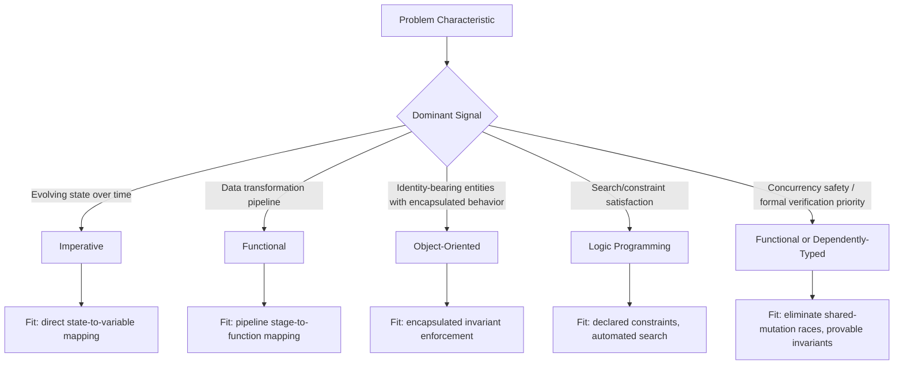

## Choosing Paradigms for Problem Domains

### Core Definition

Choosing a paradigm for a problem domain is the design decision of matching a computation's dominant characteristics — whether it centers on evolving state, data transformation, entity modeling, or search and constraint satisfaction — to the paradigm whose primitives most directly express that characteristic. This is a practical engineering judgment rather than a fixed formula: the same problem is very often expressible in any paradigm, since all mainstream general-purpose paradigms are Turing-complete, but expressibility is not the same as *fit*. A paradigm fits a problem well when the language's native constructs let the solution be written close to how the problem is naturally described, minimizing the translation distance between problem and code.

**Key Points**

- **Fit, not exclusivity**: paradigm choice is about which model minimizes friction for a *given* subproblem, not a permanent commitment that must apply uniformly across an entire system.
- **Turing-completeness means every paradigm can express every computable problem** — the question is never "can this paradigm solve it" but "does this paradigm's native vocabulary match the problem's natural shape."
- **Multi-paradigm languages let this choice be made per-module or per-function** rather than forcing a single upfront commitment for an entire system, as discussed in multi-paradigm language design.
- **Problem characteristics that most strongly signal paradigm fit**: presence and centrality of mutable state, whether the core operation is data transformation versus entity behavior, whether search/backtracking is inherent to the problem, and how important concurrency-safety or formal verifiability is to the domain.

### Signal: State Centrality and Mutation Frequency

If a problem's core nature is a sequence of state changes over time — a simulation stepping forward, a game loop, hardware-adjacent control logic, an in-place algorithm — imperative style's explicit statements and mutable variables map directly onto the problem's own structure, minimizing translation distance between problem and code.

```c
// Simulating a bouncing ball's position over discrete time steps —
// state genuinely evolves step by step; this is imperative's natural fit.
float position = 0.0, velocity = 5.0;
const float gravity = -9.8, dt = 0.1;

for (int step = 0; step < 20; step++) {
    velocity += gravity * dt;
    position += velocity * dt;
    if (position < 0) { position = 0; velocity = -velocity * 0.8; }  // bounce
}
```

Rewriting this as a chain of pure functions is possible (e.g., an immutable list of successive states produced by `scanl`/`reduce`), but the imperative version's `position` and `velocity` variables track exactly the physical quantities the problem describes, evolving exactly as the simulation itself evolves — the code's structure mirrors the problem's structure with minimal indirection.

### Signal: Transformation Pipelines Over Data

If a problem's core nature is a series of transformations applied to a collection or stream of data — filtering, mapping, aggregating, reshaping — functional style's composable higher-order functions (`map`/`filter`/`reduce`) tend to express the pipeline more directly than an equivalent hand-written loop with an accumulator variable, because the pipeline stages map one-to-one onto function composition rather than being interleaved into a single stateful loop body.

```javascript
const orders = [
  { item: "Widget", qty: 3, price: 9.99 },
  { item: "Gadget", qty: 1, price: 19.99 },
  { item: "Widget", qty: 2, price: 9.99 },
];

const totalRevenue = orders
  .filter(o => o.qty > 0)
  .map(o => o.qty * o.price)
  .reduce((sum, lineTotal) => sum + lineTotal, 0);

console.log(totalRevenue.toFixed(2));
```

**Output**



```
79.90
```

Each pipeline stage — filter, then map, then reduce — corresponds to one named transformation step in the problem description ("keep valid orders, compute line totals, sum them"), rather than being fused into a single imperative loop body where all three concerns are interleaved in one accumulator-mutating block. `[Inference]` Whether the functional pipeline or the equivalent imperative loop is more *readable* in a specific case is somewhat a matter of team convention and problem scale rather than a strictly settled comparison — for very large datasets, imperative loop fusion may also carry performance advantages that depend on the specific runtime's optimizer, so this is a fit judgment rather than a universal ranking.

### Signal: Stateful Entities With Encapsulated Behavior

If a problem's core nature involves identity-bearing entities that each own internal state and expose behavior operating on that state — UI widgets, simulation agents, domain objects with lifecycle and invariants to protect — object-oriented style's encapsulation directly models "this state belongs to this entity, and only this entity's methods may change it," which is harder to express as cleanly in a pure data-transformation model.

```python
class Thermostat:
    def __init__(self, target_temp):
        self._target = target_temp
        self._current = 68.0
        self._heating = False

    def read_sensor(self, temp):
        self._current = temp
        self._heating = self._current < self._target

    def status(self):
        return f"{self._current}°F, heating={'on' if self._heating else 'off'}"

t = Thermostat(target_temp=72)
t.read_sensor(65.0)
print(t.status())
```

**Output**



```
65.0°F, heating=on
```

The thermostat's invariant — "heating is on exactly when current temperature is below target" — is enforced at a single point (`read_sensor`), inside the entity that owns the relevant state, rather than being a rule external code must remember to reapply correctly every time it touches temperature data, which is the encapsulation benefit OOP is specifically designed to provide for this class of problem.

### Signal: Search, Backtracking, and Constraint Satisfaction

If a problem's core nature is finding an assignment or path that satisfies a set of declared constraints or relationships — scheduling, puzzle-solving, parsing, rule-based inference, dependency resolution — logic programming's automated unification and backtracking search directly matches the problem's shape, since the programmer need only *declare* the constraints, not hand-write the search algorithm that satisfies them.

```prolog
% Simplified scheduling: two meetings must not overlap for a shared room
room(a). room(b).
meeting(standup, 9).
meeting(review, 9).

valid(M1, M2, R1, R2) :-
    meeting(M1, T1), meeting(M2, T2),
    room(R1), room(R2),
    (T1 \= T2 ; R1 \= R2).

?- valid(standup, review, R1, R2).
```

**Output**



```
R1 = a, R2 = a ;
R1 = a, R2 = b ;
R1 = b, R2 = a ;
R1 = b, R2 = b.
```

`[Inference]` This output enumerates every room-pairing that satisfies the constraint given the example facts, since the meetings share a time slot (`T1 = T2 = 9`) and the rule requires either different times *or* different rooms — the specific set of satisfying assignments shown here is a direct consequence of this example's particular facts, not a general property of the rule. Encoding this same constraint-satisfaction search imperatively would require the programmer to write explicit nested loops and manual backtracking logic — logic programming's engine performs that search automatically from the declared constraint alone.

### Signal: Concurrency Safety and Formal Verifiability

If a problem domain places a premium on eliminating race conditions by construction, or on machine-checkable correctness proofs, functional programming's immutability-by-default (removing shared mutable state, a primary source of race conditions) or dependent types' compile-time-verified invariants tend to be selected specifically for these safety properties, even at the cost of a steeper learning curve or more verbose code, because the domain's cost of a subtle concurrency or correctness bug is unusually high (financial systems, safety-critical embedded systems, cryptographic protocol implementations).

===MERMAID_DIAGRAM===

graph TD

A[Problem Characteristic] --> B{Dominant Signal}

B -- Evolving state over time --> C[Imperative]

B -- Data transformation pipeline --> D[Functional]

B -- Identity-bearing entities with encapsulated behavior --> E[Object-Oriented]

B -- Search/constraint satisfaction --> F[Logic Programming]

B -- Concurrency safety / formal verification priority --> G[Functional or Dependently-Typed]

C --> H[Fit: direct state-to-variable mapping]

D --> I[Fit: pipeline stage-to-function mapping]

E --> J[Fit: encapsulated invariant enforcement]

F --> K[Fit: declared constraints, automated search]

G --> L[Fit: eliminate shared-mutation races, provable invariants]



### Domain-to-Paradigm Heuristic Table

| Domain Example | Dominant Characteristic | Typically Well-Fitting Paradigm | Why |
| --- | --- | --- | --- |
| Device drivers, embedded control loops | Direct hardware state mutation, timing-sensitive sequencing | Imperative | Matches the von Neumann execution model and explicit sequencing hardware requires |
| ETL / data pipelines, analytics | Chained transformations over datasets | Functional | Pipeline stages map onto function composition; parallelizable due to purity |
| GUI component libraries, simulation agents | Stateful entities with lifecycle and encapsulated invariants | Object-Oriented | Encapsulation localizes invariant enforcement to the entity that owns the state |
| Static analysis, dependency resolution, scheduling | Constraint satisfaction, search over possibilities | Logic Programming | Declared constraints plus automated backtracking search |
| Concurrent/distributed systems | High cost of race conditions from shared mutable state | Functional (or actor-model message-passing) | Immutability removes the shared-mutation source of races by construction |
| Safety-critical/cryptographic protocol code | High cost of a single incorrect invariant | Dependently-typed or formally verified subset | Compile-time-checked invariants catch violations before deployment |
| Business rule engines, expert systems | Domain knowledge naturally expressed as rules | Logic / Declarative | Rules map directly onto facts and inference, minimizing translation from domain expert's language |

### The Limits of the Heuristic

These signals are heuristics for *fit*, not hard boundary lines — real systems routinely mix domains within a single application (a GUI's rendering logic might be OOP while its data-fetching pipeline is functional and its scheduling logic is constraint-based), which is precisely the situation multi-paradigm languages are designed to accommodate without requiring separate languages per subdomain. `[Inference]` The specific granularity at which paradigm-switching becomes worthwhile (per-function, per-module, per-service) is a judgment call that depends on team convention, codebase size, and interop cost between paradigm boundaries — it is not governed by a formal rule this material can state generally, and is better decided case by case against the actual system's constraints.

A further caveat: paradigm fit is only one input among several practical constraints on language and style choice — existing team expertise, hiring pool, library ecosystem maturity, and interoperability with an existing codebase frequently outweigh pure "theoretical fit" in real engineering decisions, particularly for problems that don't lean overwhelmingly toward one signal. `[Inference]` The relative weight these practical constraints should carry against theoretical paradigm fit is inherently context- and organization-specific, so this material presents fit signals as one factor to weigh rather than a decision procedure that overrides such constraints.

### Advantages of Deliberate Paradigm Matching

- **Reduced translation distance between problem and code**: code structured close to the problem's own natural shape tends to be easier to read, review, and modify correctly, since less mental translation is required between the domain description and the implementation.
- **Leverages paradigm-specific guarantees where they matter most**: applying immutability specifically where concurrency safety is valuable, or encapsulation specifically where invariant protection is valuable, captures the paradigm's benefit precisely where the domain needs it, rather than paying its costs uniformly everywhere.
- **Avoids paradigm-forcing anti-patterns**: prevents contorted code that simulates one paradigm's idioms inside a language/style poorly suited to it (e.g., deeply nested manual backtracking code standing in for what a logic language would express as a one-line rule).

### Disadvantages and Risks of Over-Applying the Heuristic

- **Risk of premature or dogmatic paradigm commitment**: treating these heuristics as rigid rules rather than fit signals can lead to forcing a paradigm onto a problem that doesn't cleanly match any single signal, producing awkward code regardless of which paradigm is chosen.
- **Team and ecosystem costs of paradigm-switching**: even within a multi-paradigm language, switching idioms per-module has a real cost in consistency and onboarding, which must be weighed against the theoretical fit benefit, as discussed in multi-paradigm language design.
- **Signals can conflict within a single subproblem**: a problem can simultaneously exhibit strong state-centrality *and* strong concurrency-safety requirements, pointing toward imperative and functional respectively — resolving such conflicts requires engineering judgment the heuristic table alone cannot supply.

### Related Topics

- Multi-paradigm language design
- Imperative paradigm characteristics
- Functional paradigm characteristics
- Object-oriented paradigm characteristics
- Logic paradigm characteristics
- Concurrency models and shared mutable state hazards