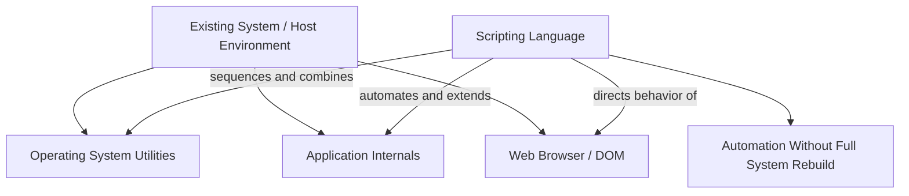

## Origins and Purpose of Scripting Languages

### Core Definition

A scripting language is a programming language designed primarily to automate, glue together, or extend the behavior of an existing system — an operating system shell, an application, a web browser, or another program — rather than to build large standalone systems entirely from scratch. The term originates from the theatrical/broadcast sense of a "script": a sequence of directions given to existing actors or existing machinery, rather than the construction of the actors or machinery themselves. Early scripting languages emerged specifically to let users direct the *already-existing* capabilities of an operating system or application, without requiring the heavier compilation, build, and deployment machinery associated with systems programming languages of the same era.

This purpose-driven origin — automation and glue, rather than ground-up system construction — is the throughline connecting historically and technically disparate languages (shell scripts, Perl, JavaScript, Python, Lua) under the shared "scripting language" label, even though the term's boundaries have blurred considerably as scripting languages matured into general-purpose languages capable of building large standalone applications.

### Historical Origins

**Key Points**

- **Unix shell scripting (late 1960s–1970s)**: the earliest widely-used scripting languages were Unix shells (`sh`, later `csh`, `bash`), designed to let users sequence and combine existing command-line utilities into automated workflows, embodying the Unix philosophy of small, composable tools glued together by shell scripts.
- **Job Control Languages predate Unix shells**: mainframe systems used JCL (Job Control Language) to automate batch job sequencing before interactive Unix shells existed — an even earlier instance of "directing existing system capabilities" as the core purpose. `[Inference]` The precise lineage and degree of direct influence between JCL and Unix shell design is a matter some historical accounts describe differently, as both arose from the shared underlying need to automate operations on existing systems rather than from a documented, singular line of technical descent.
- **Application-embedded scripting (1980s–1990s)**: languages like Tcl (1988, designed explicitly as an embeddable command language for other applications) and later Visual Basic for Applications (VBA, embedded in Microsoft Office) extended the "automate an existing system" purpose from the operating system level down to individual applications.
- **Web scripting (mid-1990s)**: JavaScript (1995) was created specifically to script behavior within an existing system — the web browser and the documents it rendered — extending the "glue/automate an existing host" purpose into the emerging web platform.
- **General-purpose scripting languages (1990s)**: Perl (1987), Python (1991), and Ruby (1995) began as, and in Perl's case were explicitly named for, practical automation and text-processing tools, before growing into general-purpose languages used well beyond their original glue-code purpose.

### The "Glue Language" Purpose

===MERMAID_DIAGRAM===

graph TD

A[Existing System / Host Environment] --> B[Operating System Utilities]

A --> C[Application Internals]

A --> D[Web Browser / DOM]

E[Scripting Language] -- sequences and combines --> B

E -- automates and extends --> C

E -- directs behavior of --> D

E --> F[Automation Without Full System Rebuild]



The defining purpose of a scripting language, in its original conception, is to act as **glue**: connecting pre-existing components, utilities, or system capabilities without requiring the programmer to reimplement or recompile those components. A shell script doesn't reimplement `grep`, `sort`, or `wc` — it sequences and connects them. A browser's JavaScript doesn't reimplement HTML rendering or network requests — it directs and reacts to the browser's own built-in capabilities. This glue-oriented purpose shaped several recurring technical characteristics scripting languages tend to share.

### Example — Unix Shell as Glue Between Existing Utilities

```bash
#!/bin/bash
# Count unique visitor IPs from a web server log, sorted by frequency
grep "GET /home" access.log | awk '{print $1}' | sort | uniq -c | sort -rn | head -5
```

This script performs no HTTP parsing, no sorting algorithm implementation, and no counting logic of its own — every actual unit of work (`grep`, `awk`, `sort`, `uniq`) is delegated to existing, independently-developed utilities the shell merely sequences and pipes together. This is the glue-language purpose in its most direct form: the value the script adds is orchestration, not computation performed from scratch.

### Example — JavaScript as Glue Between Browser Capabilities

```javascript
document.getElementById("submit-btn").addEventListener("click", () => {
  const value = document.getElementById("input").value;
  fetch("/api/save", {
    method: "POST",
    body: JSON.stringify({ value }),
  }).then(response => console.log(response.status));
});
```

**Output** `[Inference]` The actual logged status code depends on the server's response, which is not specified in this isolated example — the code's structure, not a fixed numeric output, is what demonstrates the glue pattern here.



```
200
```

None of DOM element lookup, event dispatch, or network transport is implemented by this script — all of it is provided by the browser as the existing host system. The script's role is entirely to *direct* those pre-existing capabilities: react to an event the browser already knows how to detect, read a value the browser already knows how to store, and initiate a request the browser already knows how to send. This is the same underlying glue purpose as the shell example, applied to a different host environment.

### Recurring Technical Characteristics Traceable to This Origin

Because scripting languages emerged to direct an *already-running* host system rather than to construct standalone systems from first principles, several recurring design characteristics trace directly back to that purpose:

- **Interpretation over ahead-of-time compilation**: automating an interactive session or reacting to host events favors immediate execution without a separate compile step — historically, this made scripting languages faster to iterate with for glue tasks, though `[Inference]` the strict interpretation/compilation divide has blurred considerably with the rise of JIT-compiled scripting language runtimes, so this characteristic is better understood as a historical tendency than a current defining boundary.
- **Dynamic typing**: quick, small automation scripts historically favored minimal upfront ceremony (no type declarations) over the compile-time safety benefits more valuable in large, standalone systems — a trade-off that made sense when scripts were short and glue-purpose-focused, even as scripting languages later grew to support much larger programs.
- **High-level string and text manipulation facilities**: since gluing together command-line tools and processing their text-based output/input was a dominant early use case (especially for Unix shells and Perl), scripting languages historically prioritized ergonomic string handling (regular expressions, string interpolation) more heavily than early systems languages did.
- **Minimal boilerplate for common host-interaction tasks**: reading environment variables, spawning subprocesses, manipulating files, and parsing command-line arguments are typically first-class, low-ceremony operations in scripting languages, reflecting their original purpose of directing an existing system's facilities rather than building new abstractions from scratch.
- **Embeddability**: languages explicitly designed to be embedded inside a host application (Tcl, Lua, VBA) prioritize a small runtime footprint and a clean host-language embedding API, since the language's entire purpose is to be called *from* and to *call back into* the surrounding host system.

### Scripting Languages vs. Systems Programming Languages — Purpose-Driven Contrast

| Property | Scripting Language (original purpose) | Systems Programming Language |
| --- | --- | --- |
| Primary goal | Automate/extend/glue an existing host system | Construct a standalone system from first principles |
| Typical execution model (historically) | Interpreted or JIT-compiled | Ahead-of-time compiled to native code |
| Typing discipline (historically) | Dynamic, low ceremony | Static, often with manual memory/type management |
| Relationship to a host environment | Deeply embedded in, and dependent on, a host (shell, browser, application) | Typically self-contained; may itself provide a runtime/host for other software |
| Historical performance priority | Iteration speed and automation convenience over raw execution speed | Raw execution speed and resource control as primary goals |

`[Inference]` This table describes the *original*, purpose-driven distinction as scripting languages historically diverged from systems languages; the practical gap has narrowed substantially as scripting language implementations matured (JIT compilation, optional static typing via gradual typing systems, large standalone application development in Python/JavaScript/Ruby), so the table should be read as historical motivation rather than a claim about where any specific modern language sits today.

### The Blurring of the Original Distinction

Scripting languages that began as glue/automation tools have, in many cases, grown into general-purpose languages used to build large, standalone systems with no "host" being automated at all — Node.js applications built in JavaScript, large-scale backend services written in Python or Ruby, and desktop applications built with Electron are examples where the "glue language" origin no longer describes the language's dominant contemporary use. `[Inference]` Whether the term "scripting language" still meaningfully applies to a language once it is used predominantly for large standalone system construction, rather than host automation, is a matter of ongoing informal debate in programming-language discourse rather than a settled terminological convention — some practitioners retain the label purely for historical/etymological reasons, while others reserve it more narrowly for languages still primarily used in an automation/glue role.

### Advantages Traceable to the Scripting Origin

- **Low barrier to automating repetitive tasks**: the original glue-language design goal directly produced ergonomics well suited to quick, small automation tasks — a property retained even as some scripting languages grew far beyond that original scope.
- **Strong text-processing and host-interaction ergonomics**: facilities for string manipulation, subprocess management, and environment interaction — prioritized from the languages' earliest automation-focused use cases — remain a practical strength inherited from that origin.
- **Fast iteration cycles**: the historical emphasis on interpretation over compilation, driven by the need for immediate, interactive automation, produced fast edit-run cycles that remain valuable for prototyping and scripting tasks specifically.
- **Embeddability enabling extensible host applications**: languages designed from the start to be embedded (Tcl, Lua) let host applications expose scriptable extension points to their own users, a direct consequence of the original "direct an existing system" design goal.

### Disadvantages Traceable to the Scripting Origin

- **Dynamic typing's trade-offs inherited into larger programs**: as scripting languages grew from small glue scripts into large standalone applications, the dynamic typing that suited short automation tasks well became a source of the same runtime-error-deferral costs discussed under duck typing, in codebases now far larger than the "quick automation script" the design choice originally optimized for.
- **Historical performance gap versus systems languages**: interpretation-first execution models historically carried a raw performance cost relative to ahead-of-time compiled systems languages, though `[Inference]` modern JIT compilation techniques have substantially narrowed this gap for many scripting language implementations, so the magnitude of any current performance difference depends heavily on the specific implementation and workload being compared.
- **Host dependency limiting portability for host-embedded scripting languages**: a scripting language whose entire design centers on directing a specific host (browser-specific JavaScript APIs, application-specific macro languages) can face portability challenges when code needs to run outside that original host context.
- **Terminological ambiguity as the category has blurred**: because "scripting language" originally described a purpose rather than a fixed technical feature set, and many scripting languages have since outgrown that original purpose, the term itself has become less precise as a technical classifier than it was at its origin.

### Language Landscape

- **Unix shells (`sh`, `bash`, `zsh`)**: the archetypal glue language — sequencing and piping together independently-developed command-line utilities.
- **Perl**: designed explicitly for practical text processing and system administration automation; its name (Practical Extraction and Report Language) directly reflects its original glue/automation purpose.
- **Python**: began with automation and scripting use cases prominent in its early adoption, later grew into a dominant general-purpose language across web development, data science, and large-scale systems, while retaining strong scripting ergonomics.
- **JavaScript**: created specifically to script behavior within the browser host environment; later extended via Node.js to server-side and general-purpose use well beyond its original browser-scripting purpose.
- **Tcl**: designed explicitly as a small, embeddable command language for other applications to incorporate as their own extension/scripting layer.
- **Lua**: designed for lightweight embedding within host applications (notably games), prioritizing a small runtime footprint and a clean C embedding API consistent with the "direct an existing host" purpose.
- **Ruby**: general-purpose scripting-heritage language with strong text-processing and automation ergonomics inherited from its Perl-influenced design, later prominent in web application development (Ruby on Rails) well beyond pure automation use.

### Related Topics

- Interpreted versus compiled execution models
- Dynamic typing and duck typing
- Embeddable language runtimes and host-application scripting APIs
- Gradual typing systems (as scripting languages added optional static typing)
- Node.js and server-side JavaScript's departure from browser-only scripting
- Text processing and regular expressions as a scripting-language design priority