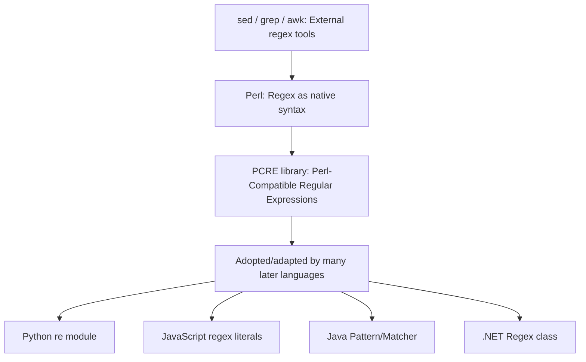

## Perl and Text Processing Heritage

### Core Definition

Perl (first released 1987, by Larry Wall) was designed explicitly around a purpose baked into its original backronym — **Practical Extraction and Report Language** — reflecting a core design goal of scanning arbitrary text, extracting relevant information from it, and generating reports from that extraction. This purpose grew directly from Wall's own systems administration background: Perl was created to fill a practical gap between the limited pattern-matching and text-processing capabilities of Unix shell utilities like `awk` and `sed`, and the far heavier, general-purpose programming capability of a systems language like C, which was overkill for typical text-wrangling automation tasks. Perl's text-processing heritage is not incidental to the language's design — it is the design's originating purpose, and it shaped the language's syntax and built-in facilities more deeply than almost any other single influence.

### Historical Lineage: Filling the Gap Between `awk`/`sed` and C

**Key Points**

- **`sed` and `awk` provided pattern-driven text processing** but were each narrowly specialized — `sed` for stream editing via substitution commands, `awk` for line-oriented field extraction and simple report generation — and neither was a general-purpose programming language capable of more complex logic, data structures, or control flow.
- **C provided full general-purpose programming power** but required manual memory management, explicit compilation, and comparatively verbose string-handling code for what were, in system administration practice, routine text-manipulation tasks.
- **Perl was designed to occupy the space between these two extremes**: full general-purpose programming capability (variables, control flow, subroutines, data structures), combined with `awk`/`sed`-level built-in convenience for pattern matching, text extraction, and line-oriented processing, without requiring a separate compilation step.
- **Regular expressions were elevated to a core, first-class language feature** in Perl, rather than being available only through a separate utility (as with `sed`/`awk`/`grep`) — this integration is widely regarded as one of Perl's most influential and widely imitated design decisions.

### Example — Perl's Native Regex Integration

```perl
my @log_lines = (
    "2026-08-28 ERROR: disk full",
    "2026-08-28 INFO: backup complete",
    "2026-08-28 ERROR: connection timeout",
);

foreach my $line (@log_lines) {
    if ($line =~ /ERROR: (.+)/) {
        print "Found error: $1\n";
    }
}
```

**Output**



```
Found error: disk full
Found error: connection timeout
```

The regex match `=~ /ERROR: (.+)/` is native syntax, not a call to an external library function or utility — Perl's `=~` binding operator, its built-in regex engine, and automatic population of the special capture-group variable `$1` are all core language features rather than bolted-on additions. This tight, syntactic-level integration of pattern matching is precisely what let Perl subsume `awk`/`sed`-style text processing inside a fully general-purpose language, rather than requiring the programmer to shell out to a separate tool for the pattern-matching portion of a task.

### Example — Line-Oriented Field Processing (awk-Influenced Idiom)

```perl
while (<>) {
    my @fields = split /\s+/;
    print "$fields[0]: $fields[2]\n" if @fields >= 3;
}
```

This idiom — implicitly reading input line by line via `<>`, splitting each line into fields via `split`, and processing those fields — directly mirrors `awk`'s core line-and-field processing model, but embedded inside a language that also supports arbitrary control flow, subroutines, complex data structures (hashes, nested arrays/references), and everything else a general-purpose language provides. This is the concrete technical realization of Perl's founding purpose: `awk`-level text-processing convenience, without `awk`'s ceiling on general-purpose programming capability.

### Regular Expressions as a Design Influence Beyond Perl

===MERMAID_DIAGRAM===

graph TD

A[sed / grep / awk: External regex tools] --> B[Perl: Regex as native syntax]

B --> C[PCRE library: Perl-Compatible Regular Expressions]

C --> D[Adopted/adapted by many later languages]

D --> E[Python re module]

D --> F[JavaScript regex literals]

D --> G[Java Pattern/Matcher]

D --> H[.NET Regex class]



Perl's specific regular expression syntax and semantics were influential enough that **PCRE (Perl-Compatible Regular Expressions)**, a widely used C library, was created specifically to let other tools and languages support Perl's particular regex dialect rather than a more limited POSIX-standard alternative. `[Inference]` The degree to which any specific later language's regex engine should be described as directly derived from PCRE versus independently converging on similar Perl-influenced syntax varies by language and by specific regex feature, so precise lineage claims for a particular language's regex implementation should be checked against that language's own documentation rather than assumed uniformly.

### Text-Processing-Driven Language Features

Perl's text-processing heritage produced several recurring language design choices, many of which proved influential well beyond Perl itself:

- **String interpolation inside double-quoted strings**: embedding variable values directly inside string literals (`"Found error: $1\n"`) without explicit concatenation, reducing ceremony for the string-construction-heavy work of generating reports from extracted text.
- **Implicit variables for common operations**: special variables like `$_` (the default/topic variable, implicitly used by many built-in functions and loop constructs when no explicit variable is given) and `@ARGV`/`%ENV` (command-line arguments and environment variables as pre-populated built-in data structures) reduce boilerplate for the host-interaction and text-scanning tasks Perl was designed around.
- **List and array context sensitivity**: many Perl operators and functions behave differently depending on whether they are evaluated in "list context" or "scalar context" — a design choice that, among other things, streamlines common text-processing patterns like splitting a line into a list of fields versus counting how many fields resulted.
- **Built-in report-generation formatting**: Perl's `format`/`write` mechanism (largely superseded in modern practice by more general templating approaches) was a direct, built-in language feature specifically for generating column-aligned text reports — reflecting the "Report Language" half of Perl's original backronym.
- **First-class, low-ceremony support for associative arrays (hashes)**: convenient key-value data structures, used pervasively for tasks like counting word frequencies or aggregating extracted data by category, without requiring a separate library import or verbose declaration syntax.

### Example — Idiomatic Text Aggregation with Hashes

```perl
my %word_count;
my $text = "the quick brown fox the lazy dog the fox";

foreach my $word (split /\s+/, $text) {
    $word_count{$word}++;
}

foreach my $word (sort keys %word_count) {
    print "$word: $word_count{$word}\n";
}
```

**Output**



```
brown: 1
dog: 1
fox: 2
lazy: 1
quick: 1
the: 3
```

This word-frequency-counting idiom — split text into tokens, tally occurrences in a hash, then report the results — is a direct, minimal expression of Perl's combined "extraction" and "report" purpose: pattern-based extraction (`split`), aggregation via a built-in associative data structure (`%word_count`), and formatted reporting (the final `foreach`/`print` loop), accomplished with almost no ceremony beyond the logic itself.

### Perl's Influence on Later Scripting Languages

Perl's specific technical contributions to the scripting-language lineage extend well beyond its own continued use:

| Later Language | Perl-Influenced Element |
| --- | --- |
| PHP | Originally influenced by Perl's CGI-scripting-era text/web-processing conventions; early PHP syntax and `$variable` sigil convention echo Perl directly |
| Python | `re` module's regex syntax is heavily Perl-influenced (though Python's overall design philosophy explicitly diverged from Perl's "there's more than one way to do it" ethos toward more prescriptive style) |
| Ruby | Regex-as-first-class-citizen design, and several string-processing idioms, show clear Perl lineage, alongside Smalltalk-derived OOP |
| JavaScript, Java, .NET languages, Go | Regex literal syntax and semantics across these languages are widely traceable, directly or indirectly, to Perl/PCRE conventions rather than to the earlier POSIX regex standard alone |

`[Inference]` "Influence" in a language design lineage is rarely a single, cleanly attributable causal line — most of these later languages had multiple contributing influences beyond Perl specifically, and the relative weight of Perl's contribution versus other contemporaneous influences (POSIX regex standards, other Unix tooling) is a matter of historical interpretation rather than a settled, quantifiable fact; this table reflects commonly cited design lineage rather than an authoritative causal ranking.

### Advantages Traceable to This Heritage

- **Unmatched ergonomics for ad hoc text-processing and reporting tasks**: the tight integration of regex, string interpolation, implicit variables, and associative arrays produces notably terse, direct code for exactly the class of tasks Perl was designed around.
- **Rapid one-off scripting for system administration**: Perl's original niche — quick, powerful text-wrangling scripts for sysadmin automation — remains a genuine strength directly inherited from its founding purpose, particularly for tasks involving log parsing, report generation, and file/text manipulation.
- **Historically influential regex standardization**: PCRE's widespread adoption as a de facto standard for regex syntax across many later languages traces directly to Perl's early, thorough regex integration.
- **CPAN's depth in text-processing modules**: the Comprehensive Perl Archive Network built up an especially deep ecosystem of text-parsing, format-conversion, and report-generation modules, reflecting sustained community investment in exactly the domain Perl was designed for. `[Inference]` The comparative depth of CPAN's text-processing coverage relative to other languages' package ecosystems today is a claim that should be checked against current package registry data rather than assumed from Perl's historical reputation alone, since other ecosystems have grown substantially since Perl's peak popularity.

### Disadvantages Traceable to This Heritage

- **Terseness can trade off against readability at scale**: several of the same features that make one-off text-processing scripts terse (implicit `$_`, context-sensitive behavior, dense regex-heavy idioms) are frequently cited as making larger Perl codebases harder to read and maintain than equivalent code in languages that favor more explicit, less context-dependent syntax.
- **"There's more than one way to do it" versus consistency**: Perl's own stated design philosophy of favoring multiple valid ways to express the same operation—a deliberate contrast to more prescriptive language philosophies—can produce less consistent code style across a codebase or team compared to languages with a more singular idiomatic convention.
- **Declining relative popularity for general-purpose and web development use**: while Perl's text-processing niche strengths persist, its broader use for web development and general application programming has been substantially displaced by other languages (notably Python and Ruby) since Perl's 1990s peak. `[Unverified]` Specific current adoption or popularity figures for Perl should be checked against up-to-date language-usage survey data rather than assumed from historical reputation, since such rankings shift over time and across measurement methodologies.
- **Implicit variables and context-sensitivity raise the learning curve**: features like `$_` and list-versus-scalar context, while powerful for experienced Perl programmers, are frequently cited as a steeper-than-average learning curve for newcomers relative to languages with more explicit, context-independent semantics.

### Related Topics

- Origins and purpose of scripting languages
- Regular expressions and pattern-matching engine design
- PCRE and cross-language regex standardization
- Unix philosophy: small, composable tools (`sed`, `awk`, `grep`)
- Perl's influence on PHP's early design
- Text processing and report generation as a scripting-language design priority