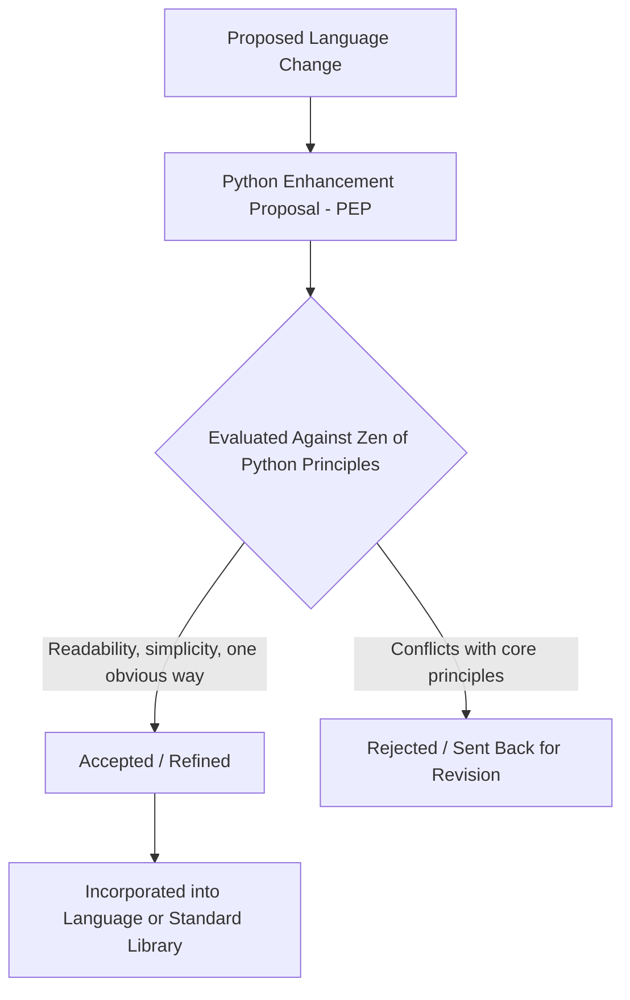

## Python Design Philosophy and Ecosystem

### Core Definition

Python (first released 1991, by Guido van Rossum) was designed around an explicit, codified philosophy prioritizing **readability, simplicity, and a single obvious way to accomplish a given task**, in direct contrast to design philosophies — Perl's "there's more than one way to do it" foremost among them — that instead prioritize expressive flexibility and terseness. This philosophy is not merely informal community culture; it is formally documented in **PEP 20, "The Zen of Python"** (Tim Peters, 1999), a short collection of aphorisms accessible in any Python interpreter via `import this`, which functions as an explicit, semi-official design constitution that shapes both the language's own evolution and the broader community's coding conventions.

### The Zen of Python as Codified Design Philosophy

**Key Points**

- **"There should be one — and preferably only one — obvious way to do it"** is the aphorism most directly counterposed against Perl's design philosophy, and it has concretely shaped Python's standard library and language evolution — favoring a single canonical idiom over multiple equally-valid alternatives for common tasks.
- **"Readability counts"** and **"Explicit is better than implicit"** together motivate Python's avoidance of the kind of implicit variables (like Perl's `$_`) and dense context-sensitivity that Perl's terseness relies on, favoring code that states its intent directly even at some cost to brevity.
- **"Beautiful is better than ugly," "Simple is better than complex," "Complex is better than complicated"** establish an explicit aesthetic and complexity-management hierarchy that PEP submissions and core language design discussions continue to reference directly when evaluating proposed features.
- **Significant whitespace (mandatory indentation-based block structure)** is Python's most visible syntactic embodiment of the readability-first philosophy — indentation is not merely a style convention enforced by linting, but the language's actual block-delimiting syntax, making inconsistent indentation a syntax error rather than a style nit.

### Example — "One Obvious Way" in Practice

```python
numbers = [1, 2, 3, 4, 5]

# The idiomatic, "one obvious way" approach:
squares = [n ** 2 for n in numbers]

print(squares)
```

**Output**



```
[1, 4, 9, 16, 25]
```

The list comprehension `[n ** 2 for n in numbers]` is the idiomatic Python construction for this task — while `map(lambda n: n ** 2, numbers)` is also valid Python and produces an equivalent result, the language's style guide and community convention (**PEP 8**, the official style guide) and common practice consistently favor comprehensions for this pattern, reflecting the "one obvious way" principle operating as a real convergence force on community style, not merely a slogan. `[Inference]` The degree to which "one obvious way" is fully achieved in practice, versus remaining an aspirational principle Python approximates rather than perfectly realizes, is itself a point occasionally debated within the Python community, since the language does in fact offer more than one valid way to accomplish many tasks (as this very example shows) — the aphorism functions more as a guiding design pressure than an absolute rule.

### Significant Whitespace as Enforced Readability

```python
def classify(n):
    if n > 0:
        return "positive"
    elif n < 0:
        return "negative"
    else:
        return "zero"

print(classify(-5))
```

**Output**



```
negative
```

Indentation here is not optional formatting — it is the mechanism by which the interpreter itself determines which statements belong to the `if`, `elif`, and `else` blocks. This is a direct, structural encoding of "readability counts" into the language's own grammar: a Python program's visual structure and its actual logical structure cannot diverge the way they can in brace-delimited languages, where inconsistent indentation is legal (if confusing) because the braces, not the whitespace, define block boundaries.

### PEP Process: Philosophy as Governance Mechanism

===MERMAID_DIAGRAM===

graph TD

A[Proposed Language Change] --> B[Python Enhancement Proposal - PEP]

B --> C{Evaluated Against Zen of Python Principles}

C -- Readability, simplicity, one obvious way --> D[Accepted / Refined]

C -- Conflicts with core principles --> E[Rejected / Sent Back for Revision]

D --> F[Incorporated into Language or Standard Library]



The **PEP (Python Enhancement Proposal)** process is Python's formal mechanism for proposing, debating, and deciding language and standard-library changes, and PEP discussions routinely invoke Zen-of-Python principles directly as evaluative criteria — a proposed feature perceived as adding an alternate, non-obvious way to do something already well-supported, or as reducing readability for a marginal gain, faces a materially harder path to acceptance than a change perceived as improving readability or reducing ambiguity. This makes the design philosophy an operative governance input, not merely a retrospective description of the language's character.

### "Batteries Included": Standard Library Philosophy

A closely related, explicitly named design principle is **"batteries included"**, describing Python's historical commitment to a broad, capable standard library covering common programming needs (file I/O, networking, text processing, data serialization, testing, and more) without requiring external package installation for a wide range of everyday tasks. This reflects the same underlying readability/simplicity philosophy applied at the ecosystem level: a programmer solving a common problem should have one well-supported, standard, "obvious" library to reach for, rather than needing to evaluate and choose among many competing third-party options for basic functionality.

```python
import json
import datetime
import urllib.request

data = {"event": "launch", "time": datetime.datetime.now().isoformat()}
payload = json.dumps(data)
print(payload)
```

**Output** `[Inference]` The exact timestamp value depends on when the code executes, so only its structural form is shown here rather than a fixed value.



```
{"event": "launch", "time": "2026-08-28T10:15:32.481207"}
```

JSON serialization, timestamp generation, and (via `urllib.request`, not used further here) HTTP requests are all available directly from the standard library, with no external package installation required — a direct, practical expression of "batteries included" operating as more than a slogan.

### The PyPI and Third-Party Ecosystem

Beyond the standard library, Python's ecosystem is anchored by the **Python Package Index (PyPI)**, the central repository for third-party packages installed via `pip`. While "batteries included" describes the standard library's own scope, the broader Python ecosystem's growth — particularly in scientific computing, data science, and machine learning (NumPy, pandas, scikit-learn, PyTorch, TensorFlow) — has been driven substantially by this third-party package ecosystem rather than the standard library alone. `[Inference]` The relative balance between "what the standard library should cover" versus "what should be left to the third-party ecosystem" has been a recurring, explicit design tension within Python's own governance discussions over time, rather than a settled, static boundary — some standard library modules have been deprecated or spun out to PyPI-hosted packages specifically because community consensus shifted on where that boundary should sit.

### Philosophy-Driven Contrast with Perl

| Design Dimension | Perl | Python |
| --- | --- | --- |
| Guiding aphorism | "There's more than one way to do it" (TMTOWTDI) | "There should be one — and preferably only one — obvious way to do it" |
| Block delimitation | Braces `{ }`; whitespace stylistically irrelevant to parsing | Significant whitespace; indentation is syntactically meaningful |
| Implicit variables | Extensive (`$_`, context-sensitive behavior) | Minimized; "explicit is better than implicit" is a named principle |
| Governance mechanism for evolution | Historically more informally driven by core developer/community consensus | Formal PEP process, with Zen-of-Python principles as recurring evaluative criteria |
| Standard library philosophy | Strong CPAN-centric third-party ecosystem, particularly for text processing | Explicit "batteries included" standard library plus a large PyPI ecosystem |

This contrast is a useful illustration precisely because both languages share scripting-language origins and strong text-processing capability, yet diverged sharply on the readability-versus-expressiveness axis — demonstrating that shared historical purpose (as discussed in the origins of scripting languages) does not determine a language's governing design philosophy.

### Advantages Traceable to This Philosophy

- **Lower cognitive overhead when reading unfamiliar code**: the "one obvious way" principle, combined with enforced indentation, means Python code from different authors tends to converge on more structurally similar solutions to the same problem than languages with a more permissive "many valid ways" ethos, easing onboarding and code review.
- **Standard library as a reliable default**: "batteries included" reduces the decision burden of evaluating competing third-party options for common, everyday tasks, and provides a stable, officially-maintained baseline other packages can be layered onto.
- **Formal governance process improves design deliberation**: the PEP process's explicit evaluative criteria create a documented, consultable rationale for language design decisions, rather than decisions being made informally without a durable record of the reasoning.
- **Strong ecosystem convergence effects**: because the philosophy actively discourages redundant alternative idioms, popular third-party libraries have historically tended to converge on compatible conventions (e.g., broad adoption of NumPy-array-like interfaces across the scientific computing ecosystem), easing interoperability across the third-party package landscape. `[Inference]` This convergence effect is a commonly cited benefit in discussions of Python's data-science ecosystem specifically, though the precise causal weight of "one obvious way" philosophy versus other factors (deliberate interoperability standards efforts, network effects of early dominant libraries) in producing that convergence is difficult to cleanly separate and attribute.

### Disadvantages and Tensions

- **"One obvious way" is an aspiration, imperfectly realized**: as the list-comprehension-versus-`map` example shows, Python does in fact offer multiple valid approaches to many tasks — critics note the principle functions more as a design-pressure ideal than an absolute, fully-achieved property of the language as it exists today.
- **Significant whitespace as a point of contention**: while indentation-as-syntax enforces a form of readability, some developers and teams find mandatory whitespace-based block delimitation restrictive compared to brace-delimited alternatives, particularly around code that is programmatically generated or manipulated (whitespace errors can silently change program logic in ways a misplaced brace typically would not).
- **Ecosystem growth occasionally outpacing "batteries included" scope decisions**: because the standard library versus third-party boundary has shifted over time, some historically-included standard library modules have been deprecated in favor of third-party alternatives, which can require codebases to adapt as the "obvious" choice for a given task changes across Python versions. `[Unverified]` Specific instances and version-by-version details of standard library deprecations should be checked against current Python release documentation rather than assumed from general awareness of the trend.
- **Governance process can slow controversial changes**: the same formal PEP deliberation that improves design rationale documentation can also make certain contentious changes (for example, historically debated proposals affecting core syntax) slower to resolve than in languages with less formalized change processes. `[Inference]` Whether this trade-off nets positive or negative for language evolution speed is a matter of differing perspective among language design practitioners rather than a settled technical conclusion.

### Related Topics

- Origins and purpose of scripting languages
- Perl and text processing heritage (contrasting design philosophy)
- Duck typing (Python's core typing discipline)
- Gradual typing systems (Python's later optional static typing additions)
- PEP process and language governance models
- Standard library versus third-party package ecosystem trade-offs