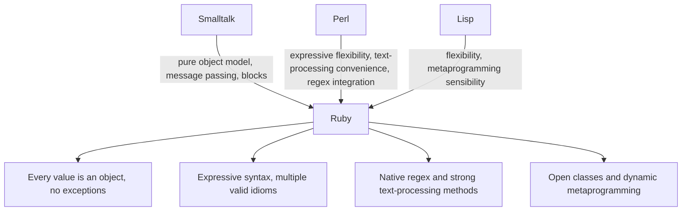

## Ruby and Expressive Object Orientation

### Core Definition

Ruby (first released 1995, by Yukihiro "Matz" Matsumoto) was designed around an explicit, stated goal of programmer happiness and expressive elegance, applying an uncompromisingly consistent object-oriented model in which **every value is genuinely an object**, including integers, booleans, `nil`, and even classes themselves — with no primitive types exempted from the object model, unlike many other object-oriented languages that retain a separate category of non-object primitives for performance or historical reasons. Matz has explicitly described designing Ruby to optimize for developer happiness and enjoyment rather than machine efficiency as the primary goal, drawing deliberately on Smalltalk's pure message-passing object model, Perl's practical text-processing convenience, and Lisp's flexibility, while rejecting Python's more restrictive "one obvious way" philosophy in favor of Perl-like expressive flexibility applied within a fully consistent OOP framework.

### "Everything Is an Object" Without Exception

**Key Points**

- **No primitive/object distinction**: unlike Java (where `int`, `boolean`, and similar types are primitives distinct from objects like `Integer`) or even Python (where some special-cased behaviors exist for certain built-in types), Ruby treats every value — including numbers, `true`/`false`, and `nil` — as a genuine object with its own methods, callable directly on literals.
- **Classes are themselves objects**: a Ruby class is an instance of the class `Class`, which is itself an object — this reflexive consistency (objects all the way down, including the mechanism that creates objects) is a direct legacy of Ruby's Smalltalk influence.
- **Control structures are method calls or blocks, not special syntax carve-outs**: constructs like iteration are frequently expressed as methods (`each`, `times`, `map`) invoked on objects and passed blocks, rather than as syntactically distinct looping keywords operating outside the object model — echoing Smalltalk's design where even conditionals are conceptually messages sent to boolean objects.
- **Open classes**: Ruby permits reopening and modifying any existing class, including built-in core classes, at runtime — a direct consequence of treating classes as ordinary, mutable objects rather than fixed, closed language constructs.

### Example — Method Calls Directly on "Primitive" Values

```ruby
puts 5.class          # => Integer
puts 5.even?           # => false
puts (-3).abs          # => 3
puts nil.class          # => NilClass
puts nil.to_s           # => "" (empty string)

3.times { |i| puts "Iteration #{i}" }
```

**Output**



```
Integer
false
3
NilClass

Iteration 0
Iteration 1
Iteration 2
```

`5.even?`, `nil.to_s`, and `3.times { ... }` are all ordinary method calls on ordinary objects — there is no special-cased "this is a primitive, so it works differently" rule anywhere in this code. `3.times` illustrates the block-based iteration idiom directly: `times` is a method defined on `Integer` that repeatedly invokes the block (the `{ |i| ... }` portion) passed to it, which is how Ruby expresses a repetition construct other languages would implement via a dedicated `for`/`while` keyword operating outside the object system.

### Blocks, Procs, and Lambdas: First-Class Behavior as Objects

Ruby's block syntax — a chunk of code passed to a method, delimited by `{ }` or `do...end` — is the language's primary mechanism for higher-order, customizable iteration and control flow, and it can additionally be captured as an explicit first-class object (`Proc` or `Lambda`) for storage, passing, and reuse beyond a single method call.

```ruby
def repeat_task(n)
  n.times { |i| yield i }
end

repeat_task(3) { |i| puts "Task run #{i}" }

# Captured as an explicit first-class object:
squarer = ->(x) { x * x }
puts squarer.call(6)
```

**Output**



```
Task run 0
Task run 1
Task run 2
36
```

`yield` inside `repeat_task` invokes whatever block was passed to the method call — this pattern (a method accepting an implicit block via `yield`) is Ruby's idiomatic way of letting a method's caller customize its behavior without an explicit callback-function parameter. `squarer`, defined via the `->` lambda literal, demonstrates the same underlying block-of-code-as-object concept made fully explicit and reusable: it can be stored, passed around, and invoked repeatedly like any other object, directly reflecting the "everything is an object, including behavior itself" design consistency.

### Smalltalk, Perl, and Lisp Influences Combined

===MERMAID_DIAGRAM===

graph TD

A[Smalltalk] -- pure object model, message passing, blocks --> D[Ruby]

B[Perl] -- expressive flexibility, text-processing convenience, regex integration --> D

C[Lisp] -- flexibility, metaprogramming sensibility --> D

D --> E[Every value is an object, no exceptions]

D --> F[Expressive syntax, multiple valid idioms]

D --> G[Native regex and strong text-processing methods]

D --> H[Open classes and dynamic metaprogramming]



Ruby's regex integration and general text-processing convenience are directly Perl-influenced — Ruby supports native regex literals (`/pattern/`) and string-processing methods comparable in convenience to Perl's, reflecting shared scripting-language-heritage goals discussed under Perl and text processing heritage — while its consistent object model and block-passing idiom trace to Smalltalk, and its metaprogramming flexibility (dynamically defining and redefining methods and classes at runtime) echoes Lisp's tradition of treating code and program structure as manipulable data. `[Inference]` The relative weighting of these three influences on any specific Ruby language feature is Matz's own frequently-cited account of Ruby's design lineage, but as with most language-influence claims, the precise causal contribution of each source language to a specific syntactic or semantic choice is difficult to establish with full rigor and should be treated as documented design intent rather than an exhaustively verified causal history.

### Open Classes and Metaprogramming

```ruby
class Integer
  def double
    self * 2
  end
end

puts 7.double
```

**Output**



```
14
```

This reopens the built-in `Integer` class — which every Ruby integer is already an instance of — and adds an entirely new method to it, available immediately on every integer in the program, including integer literals that existed before this code ran. This is only possible because classes are themselves ordinary, mutable objects in Ruby's fully consistent object model; a language with primitives exempted from the object system, or with sealed/closed built-in classes, cannot support this pattern. Open classes underlie some of Ruby's most distinctive ecosystem patterns, notably **Ruby on Rails' extensive use of monkey-patching** core classes to add framework-specific convenience methods directly onto built-in types.

### Expressive Syntax: Multiple Idioms, Deliberately

Where Python's design philosophy explicitly favors "one obvious way," Ruby deliberately provides multiple syntactic forms for semantically similar operations, treating this flexibility as a feature aligned with programmer expressiveness and happiness rather than a source of inconsistency to be minimized:

```ruby
# Three valid, idiomatic ways to express similar conditional logic:
puts "positive" if 5 > 0

if 5 > 0
  puts "positive"
end

puts(5 > 0 ? "positive" : "non-positive")
```

**Output**



```
positive
positive
positive
```

All three forms are considered idiomatic Ruby depending on context and stylistic preference — the trailing `if` modifier is favored for short, single-line conditions; the block `if`/`end` form for longer bodies; the ternary for inline expression contexts. This directly echoes Perl's "there's more than one way to do it" ethos (discussed under Perl and text processing heritage) applied within Ruby's fully consistent object-oriented framework, in explicit contrast to Python's contemporaneous, differently-motivated design choice.

### Ruby vs. Python — A Direct Philosophical Contrast

| Design Dimension | Ruby | Python |
| --- | --- | --- |
| Guiding philosophy | Programmer happiness and expressive flexibility | Readability and "one obvious way" |
| Primitive/object distinction | None — every value, including integers and `nil`, is a genuine object | Largely unified, though with some built-in-type special-casing at the implementation level |
| Idiom multiplicity | Multiple valid syntactic forms for similar operations, embraced deliberately | Deliberately minimized in favor of a single canonical idiom |
| Class mutability | Open classes — any class, including built-ins, can be reopened and modified | Monkey-patching is possible but culturally discouraged and less idiomatically central |
| Primary design lineage | Smalltalk (object model) + Perl (expressiveness) + Lisp (flexibility) | Distinct lineage emphasizing ABC language influences and explicit readability goals |

### Advantages Traceable to This Design

- **Uniform, predictable object model with no special-case exceptions**: because every value is genuinely an object, methods and behaviors compose consistently across the entire language, without the "this works differently for primitives" caveats present in languages with a primitive/object split.
- **High expressiveness for domain-specific idiom design**: open classes and consistent method-call syntax on every value make it straightforward to build internal domain-specific-language-like APIs (a technique Ruby on Rails relies on extensively), since framework code can extend even core types to read naturally within the framework's own vocabulary.
- **Block-based iteration reduces explicit loop-control boilerplate**: passing behavior directly as a block to methods like `each`, `times`, or `map` (paralleling functional-style higher-order functions) shifts iteration control into reusable library methods rather than requiring hand-written loop bookkeeping at each call site.
- **Strong alignment between language design and developer ergonomics as an explicit, stated priority**: Matz's own frequently-cited design goal of prioritizing programmer happiness gives the language's many convenience features a coherent, stated rationale rather than being an incidental byproduct.

### Disadvantages and Tensions

- **Open classes carry real monkey-patching risk**: the same mechanism that enables expressive framework design also allows any code, including third-party gems, to silently redefine behavior on core built-in types, which can produce hard-to-trace bugs when multiple libraries modify the same class in conflicting ways.
- **Idiom multiplicity can reduce codebase consistency**: as with Perl, deliberately supporting multiple valid syntactic forms for similar operations can lead to more stylistic variance across a team or codebase than a language with a more singular idiomatic convention, echoing the same trade-off discussed for Perl's TMTOWTDI philosophy.
- **"Everything is an object" carries a historical performance cost relative to primitive-based models**: `[Inference]` treating every value, including small integers, as a full object has historically implied more overhead than primitive-typed equivalents in some other languages, though the practical magnitude of this cost depends heavily on the specific Ruby implementation (MRI/CRuby, JRuby, TruffleRuby) and its optimization techniques (e.g., small-integer object representation tricks), so blanket performance claims should be checked against the specific implementation and workload in question rather than assumed uniformly.
- **Metaprogramming flexibility can complicate static analysis and tooling**: because methods and classes can be defined or altered dynamically at runtime (open classes, `method_missing`, and similar features), IDE autocompletion, static type checking (via tools like Sorbet, discussed under gradual typing systems), and general code navigability can be harder to fully support than in languages with a more fixed, statically-analyzable class structure.

### Related Topics

- Object-oriented paradigm characteristics (Smalltalk lineage, message passing)
- Perl and text processing heritage (shared expressive-flexibility philosophy)
- Python design philosophy and ecosystem (contrasting "one obvious way" approach)
- Gradual typing systems (Sorbet's addition of static typing to Ruby)
- Metaprogramming and dynamic class modification
- Ruby on Rails and domain-specific-language-style framework design