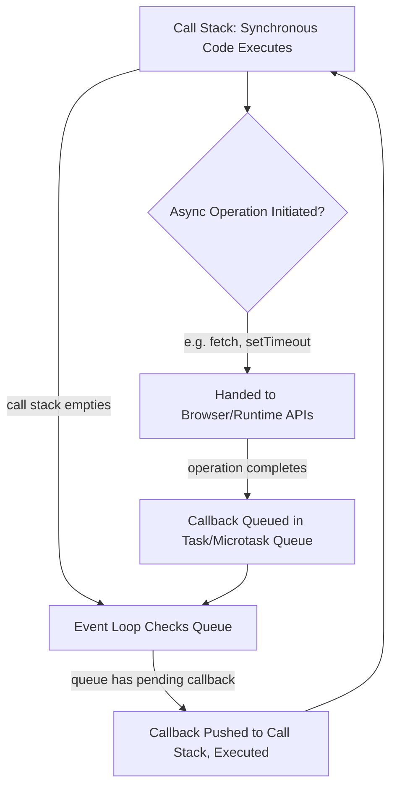

## JavaScript and the Browser Environment

### Core Definition

JavaScript was created in 1995 by Brendan Eich at Netscape, under extraordinary time pressure — famously designed and implemented in approximately ten days — for a single, narrowly scoped purpose: to let web page authors script simple, reactive behavior directly inside the browser, gluing together the browser's own document-rendering and networking capabilities, as discussed generally under origins and purpose of scripting languages. This origin as a browser-embedded scripting language, rather than a general-purpose language designed independently of any host environment, produced a distinctive constellation of design decisions — the prototype-based object model, the single-threaded event-loop concurrency model, and pervasive implicit type coercion — that trace directly back to JavaScript's specific host (the browser's Document Object Model) and its specific time constraint (a language usable by relative non-specialists writing small page-behavior scripts, designed and shipped in days).

### Design Origin: Constraints of the Host and the Timeline

**Key Points**

- **The ten-day implementation timeline** meant JavaScript's original design borrowed heavily and quickly from existing influences — Scheme's first-class functions and closures, Self's prototype-based object model, and a deliberately Java-like surface syntax (imposed by Netscape's business requirement that the new language visually resemble the already-popular Java, despite being semantically unrelated to it).
- **The browser's single-threaded UI model** directly shaped JavaScript's concurrency approach: since a script blocking the single UI thread would freeze the entire page, JavaScript adopted an **event-loop-based, non-blocking asynchronous model** rather than a general-purpose multi-threading model, a design choice discussed further below.
- **The DOM (Document Object Model) as JavaScript's original and defining host API**: JavaScript's core early purpose was to read and manipulate the browser's in-memory representation of the web page's HTML structure — the DOM — which shaped the language's emphasis on dynamic, mutable object manipulation and event-driven reactive programming from its earliest design.
- **Prototype-based inheritance**, rather than a class-based object model, was chosen partly following Self's design and partly as a simpler, more directly implementable object model for the time-constrained original implementation, as discussed under object-oriented paradigm characteristics.

### Example — DOM Manipulation as the Original Core Purpose

```javascript
document.querySelectorAll(".price").forEach(el => {
  const value = parseFloat(el.textContent);
  el.textContent = `$${(value * 1.08).toFixed(2)}`;
});
```

This code reads directly from, and writes directly back into, the browser's live document structure — there is no separate compilation step, no standalone execution context outside the page, and no computation happening independent of the DOM the browser has already constructed from the page's HTML. This tight coupling between the language and its host document model is the direct legacy of JavaScript's original, narrow purpose: making the already-rendered page reactive and dynamic, not building standalone applications.

### The Event Loop and Asynchronous Execution Model

Because a script that blocked the browser's single UI thread would freeze the entire page's rendering and user interaction, JavaScript's concurrency model was built around a **non-blocking, single-threaded event loop**: long-running or I/O-bound operations (network requests, timers, user input) are registered with callbacks, and the JavaScript engine continues executing other code while those operations proceed in the background, invoking the registered callback only once the operation completes and the call stack is clear.

===MERMAID_DIAGRAM===

graph TD

A[Call Stack: Synchronous Code Executes] --> B{Async Operation Initiated?}

B -- e.g. fetch, setTimeout --> C[Handed to Browser/Runtime APIs]

C -- operation completes --> D[Callback Queued in Task/Microtask Queue]

A -- call stack empties --> E[Event Loop Checks Queue]

D --> E

E -- queue has pending callback --> F[Callback Pushed to Call Stack, Executed]

F --> A



### Example — Non-Blocking Execution Order

```javascript
console.log("1: start");

setTimeout(() => console.log("3: timeout callback"), 0);

Promise.resolve().then(() => console.log("2: promise callback"));

console.log("1: end");
```

**Output**



```
1: start
1: end
2: promise callback
3: timeout callback
```

Even though `setTimeout` is called with a `0`ms delay, it still executes *after* the synchronous code (`console.log("1: start")` and `console.log("1: end")`) and after the resolved Promise's callback — because synchronous code runs to completion first, then the **microtask queue** (Promises) is drained, and only then does the **macrotask/timer queue** get its turn. `[Inference]` This microtask-before-macrotask ordering is a well-established, specified part of the JavaScript event loop model as implemented across major browser engines, though the exact queue names and staging details have historically differed somewhat in specification language across the ECMAScript spec, the HTML spec's timer/task definitions, and specific engine implementations, so precise low-level scheduling claims for edge cases should be checked against current specification text rather than assumed uniformly identical across all environments.

### `async`/`await`: Syntactic Sugar Over the Same Event Loop

Modern JavaScript's `async`/`await` syntax provides a more linear-looking way to write asynchronous code, but does not change the underlying single-threaded, non-blocking event-loop model — it is built directly on top of Promises and the same microtask queue mechanism shown above.

```javascript
async function loadData() {
  console.log("A: fetching");
  const response = await fetch("/api/data");
  console.log("B: got response");
  return response.json();
}

loadData();
console.log("C: called loadData, continuing");
```

**Output**



```
A: fetching
C: called loadData, continuing
B: got response
```

Despite `await` making the code *read* as if execution pauses linearly inside `loadData`, the function still yields control back to the caller at the `await` point — `"C"` logs before `"B"` because `loadData` doesn't block the rest of the program while waiting for the fetch to complete; it suspends only its own continuation, consistent with the underlying non-blocking event-loop model the syntax sits on top of.

### Prototype-Based Object Model as Host-Driven Design

JavaScript's prototype-based inheritance, discussed in more depth under object-oriented paradigm characteristics, was influenced by Self's prototype model but also served the practical, time-constrained original design goal well: a simpler runtime object model (objects delegating directly to other objects) was more directly implementable under the ten-day timeline than a full class-based system with separate class/instance machinery, and it fit naturally with the DOM's own tree-of-objects structure that JavaScript was created to manipulate.

```javascript
const element = document.createElement("div");
console.log(Object.getPrototypeOf(element) === HTMLDivElement.prototype);
```

**Output**



```
true
```

Even DOM elements themselves are ordinary JavaScript objects participating in the same prototype-chain mechanism as any user-defined object — `HTMLDivElement.prototype`, `HTMLElement.prototype`, `Element.prototype`, and so on, form a chain of delegation identical in kind to any other JavaScript prototype chain, reflecting how deeply the DOM host environment and JavaScript's own object model were designed to interoperate directly, rather than through a separate binding/wrapper layer.

### Implicit Type Coercion: A Consequence of Original Scripting Purpose

JavaScript's historically permissive implicit type coercion (`"5" * 2` evaluating to `10`, `"5" + 2` evaluating to `"52"`, and other cross-type operator behaviors) traces to the original design goal of making the language forgiving and low-ceremony for relatively simple, small page-behavior scripts written quickly, often by authors without a formal programming background — consistent with the general "low ceremony for glue/automation tasks" tendency discussed under origins and purpose of scripting languages, taken further than most other scripting languages of the era. This permissiveness became a widely cited source of surprising behavior as JavaScript grew from small page scripts into large, complex applications, and is a primary motivation behind TypeScript's gradual typing layer (discussed under gradual typing systems) and behind stricter modern JavaScript conventions (`===` over `==`, `"use strict"` mode, and linting rules discouraging implicit coercion).

### JavaScript's Growth Beyond Its Original Browser-Scripting Purpose

| Era | Scope | Host Environment |
| --- | --- | --- |
| 1995–early 2000s | Simple page-behavior scripting | Browser only |
| Mid-2000s (Ajax era) | Dynamic, asynchronous page updates without full reloads | Browser only, but substantially more central to application architecture |
| 2009 onward (Node.js) | General-purpose server-side and standalone application development | Browser and server (V8 engine embedded outside the browser entirely) |
| Present | Full-stack web applications, desktop apps (Electron), mobile (React Native), and more | Browser, server, desktop, and mobile — largely decoupled from any single host |

Node.js's 2009 introduction — embedding the V8 JavaScript engine outside the browser entirely, with its own non-DOM host APIs for file system and network access — is the pivotal moment at which JavaScript's core language design decisions (event loop, prototype-based objects) persisted while the *original* host-dependency that shaped those decisions (the browser and the DOM specifically) became optional rather than definitional, echoing the general blurring-of-original-purpose pattern discussed under origins and purpose of scripting languages.

### Advantages Traceable to This Origin

- **Non-blocking I/O well-suited to high-concurrency network applications**: the event-loop model, originally adopted to keep a browser UI responsive, turned out to generalize well to server-side workloads with many concurrent I/O-bound connections (a major factor in Node.js's adoption for network services), even though that use case was not the model's original motivation.
- **Deep, native DOM integration for browser-based UI work**: because the language and its original host object model (the DOM) were co-designed, browser-based UI manipulation remains direct and unmediated compared to languages that access a browser DOM only through a separate binding/interop layer.
- **Low ceremony for quick, small scripting tasks**: the original goal of a language usable by relative non-specialists for simple page behavior produced a genuinely low-barrier-to-entry language, a property that persisted as a practical advantage even as the language's use cases expanded far beyond that original scope.
- **Prototype-based flexibility**: direct object-to-object delegation, without a separate class/instance distinction, offers a flexible, dynamically reconfigurable object model, as discussed under object-oriented paradigm characteristics.

### Disadvantages Traceable to This Origin

- **Implicit coercion as a persistent source of bugs in large codebases**: a permissiveness well suited to short, simple original page scripts has been widely cited as a liability once JavaScript grew to power large, complex applications, motivating both stricter modern JavaScript conventions and the broader adoption of TypeScript's gradual typing layer.
- **Single-threaded model constrains CPU-bound work**: the event loop's non-blocking model solves I/O-bound concurrency well, but genuinely CPU-intensive computation still blocks the single thread unless explicitly offloaded (Web Workers in the browser, worker threads in Node.js) — a direct structural consequence of a concurrency model originally designed to keep one browser UI thread responsive, not to parallelize heavy computation.
- **Rushed original design left some persistent quirks**: several widely cited JavaScript oddities (certain implicit coercion edge cases, `this` binding behavior differing by call context, historical inconsistencies later addressed by `let`/`const` and strict mode) trace at least partly to the extremely compressed original ten-day design and implementation timeline. `[Inference]` The precise causal weight of "time pressure" versus other contributing factors (deliberate design trade-offs later understood as mistakes only in hindsight, standardization compromises made during later ECMAScript specification work) in producing any *specific* quirk is difficult to attribute with full precision and is better treated as a general, well-documented contributing factor than an exhaustive one-to-one explanation for every individual quirk.
- **Host-dependency legacy in API design**: even after Node.js decoupled JavaScript from the browser, certain language and standard-API design patterns still bear the imprint of DOM-era assumptions, occasionally requiring adaptation or polyfilling when used in genuinely host-independent contexts.

### Related Topics

- Origins and purpose of scripting languages
- Object-oriented paradigm characteristics (prototype-based inheritance)
- Gradual typing systems (TypeScript's response to implicit coercion)
- Concurrency models: event loop versus multi-threading
- Node.js and JavaScript's expansion beyond the browser host
- Promises, async/await, and asynchronous control flow patterns