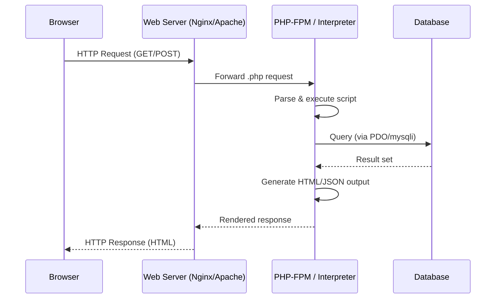

## PHP and Server-Side Web Scripting

### Overview

PHP (recursive acronym: "PHP: Hypertext Preprocessor") is a widely-used open-source scripting language designed specifically for server-side web development. It is embedded within HTML and executed on the server before the resulting output is sent to the client's browser as plain HTML, CSS, or JSON. PHP powers a substantial share of the web, including major platforms such as WordPress, Facebook (in its early architecture), and Wikipedia.

Unlike client-side languages such as JavaScript, PHP code never reaches the browser directly — only its output does. This makes it well-suited for tasks like database interaction, session management, form processing, and dynamic content generation.

### Core Characteristics

- **Server-side execution**: Code runs on the web server (via an interpreter like the Zend Engine) rather than in the user's browser.
- **Embedded syntax**: PHP code is typically mixed directly into HTML files using `<?php ... ?>` tags.
- **Loosely typed**: Variables do not require explicit type declarations; types are inferred and can change at runtime.
- **Interpreted**: PHP scripts are parsed and executed on each request (though opcode caching, such as OPcache, mitigates repeated parsing overhead).
- **Cross-platform**: Runs on Linux, Windows, macOS, and is compatible with most web servers (Apache, Nginx, LiteSpeed) via modules or FastCGI (PHP-FPM).

### Basic Syntax

A minimal PHP script embedded in HTML:

```php
<!DOCTYPE html>
<html>
<body>

<h1>Welcome</h1>

<?php
    $name = "World";
    echo "<p>Hello, " . $name . "!</p>";
?>

</body>
</html>
```

Key syntax elements:

- Statements end with a semicolon `;`.
- Variables are prefixed with `$` (e.g., `$name`).
- `echo` and `print` output content to the response stream.
- Comments use `//`, `#`, or `/* ... */`.

### Variables and Data Types

PHP supports several primitive and compound types:

| Type | Description | Example |
| --- | --- | --- |
| `int` | Whole numbers | `$age = 30;` |
| `float` | Decimal numbers | `$price = 19.99;` |
| `string` | Text data | `$city = "Manila";` |
| `bool` | True/false | `$active = true;` |
| `array` | Ordered/associative collections | `$fruits = ["apple", "banana"];` |
| `object` | Instances of classes | `$user = new User();` |
| `null` | Absence of value | `$data = null;` |

Type juggling occurs automatically in many contexts — for example, `"5" + 3` evaluates to the integer `8`. Since PHP 7.0, optional strict typing can be enabled per-file via `declare(strict_types=1);` to reduce implicit conversions.

### Control Structures

PHP supports standard control flow constructs familiar from C-like languages:

```php
<?php
$score = 85;

if ($score >= 90) {
    echo "Grade: A";
} elseif ($score >= 80) {
    echo "Grade: B";
} else {
    echo "Grade: C";
}

foreach (["red", "green", "blue"] as $color) {
    echo $color . " ";
}

for ($i = 0; $i < 5; $i++) {
    echo $i;
}

$count = 0;
while ($count < 3) {
    echo "Loop $count ";
    $count++;
}
?>
```

PHP also offers an alternative syntax for control structures (`if:`/`endif;`) that is commonly used when embedding logic directly within HTML templates, improving readability when mixing markup and logic.

### Functions

Functions are declared with the `function` keyword and support default parameters, variadic arguments, type hints, and return type declarations:

```php
<?php
function calculateTotal(float $price, int $quantity = 1): float {
    return $price * $quantity;
}

echo calculateTotal(9.99, 3); // 29.97

function sumAll(int ...$numbers): int {
    return array_sum($numbers);
}

echo sumAll(1, 2, 3, 4); // 10
?>
```

Anonymous functions (closures) and arrow functions (since PHP 7.4) are also supported:

```php
<?php
$multiply = fn($a, $b) => $a * $b;
echo $multiply(4, 5); // 20
?>
```

### Superglobals and Request Handling

PHP provides built-in superglobal arrays for accessing request data, which are central to server-side web scripting:

- `$_GET` — data from URL query strings
- `$_POST` — data submitted via HTTP POST (typically forms)
- `$_REQUEST` — merged `$_GET`, `$_POST`, and `$_COOKIE` data
- `$_SESSION` — persistent data across requests for a single user session
- `$_COOKIE` — data stored in the client's browser
- `$_SERVER` — server and execution environment information
- `$_FILES` — uploaded file metadata

**Example: Handling a form submission**

```php
<?php
if ($_SERVER["REQUEST_METHOD"] === "POST") {
    $username = htmlspecialchars(trim($_POST["username"] ?? ""));
    if (empty($username)) {
        echo "Username is required.";
    } else {
        echo "Welcome, " . $username . "!";
    }
}
?>
<form method="POST">
    <input type="text" name="username">
    <button type="submit">Submit</button>
</form>
```

Note the use of `htmlspecialchars()` to escape user input before output — a standard defense against cross-site scripting (XSS).

### Sessions and State Management

Because HTTP is stateless, PHP uses sessions and cookies to persist data across requests:

```php
<?php
session_start();

if (!isset($_SESSION["visits"])) {
    $_SESSION["visits"] = 0;
}
$_SESSION["visits"]++;

echo "You have visited this page " . $_SESSION["visits"] . " times.";
?>
```

`session_start()` must be called before any HTML output is sent, since it sets an HTTP cookie header. Session data is stored server-side by default (commonly as files in a temp directory), with only a session ID stored in the client's cookie.

### Database Interaction

PHP commonly interacts with relational databases (most often MySQL/MariaDB) using either the `mysqli` extension or PDO (PHP Data Objects). PDO is generally preferred for its support of multiple database drivers and consistent API.

**Example: PDO with prepared statements**

```php
<?php
$dsn = "mysql:host=localhost;dbname=shop;charset=utf8mb4";
$pdo = new PDO($dsn, "db_user", "db_password", [
    PDO::ATTR_ERRMODE => PDO::ERRMODE_EXCEPTION
]);

$stmt = $pdo->prepare("SELECT id, name, price FROM products WHERE category = :cat");
$stmt->execute(["cat" => "electronics"]);

foreach ($stmt->fetchAll(PDO::FETCH_ASSOC) as $row) {
    echo $row["name"] . ": $" . $row["price"] . "<br>";
}
?>
```

**Prepared statements** with bound parameters (`:cat` above) are the standard defense against SQL injection, since user input is transmitted separately from the query structure rather than concatenated into it.

### Request Lifecycle in a Web Server Context

The following diagram illustrates how a typical PHP request flows through a web server stack.



### Object-Oriented PHP

Since PHP 5, and more robustly since PHP 7 and 8, PHP supports full object-oriented programming: classes, interfaces, traits, abstract classes, namespaces, and visibility modifiers.

```php
<?php
interface Shape {
    public function area(): float;
}

abstract class BaseShape implements Shape {
    protected string $name;

    public function __construct(string $name) {
        $this->name = $name;
    }

    public function describe(): string {
        return $this->name . " has area " . $this->area();
    }
}

class Circle extends BaseShape {
    public function __construct(private float $radius) {
        parent::__construct("Circle");
    }

    public function area(): float {
        return M_PI * $this->radius ** 2;
    }
}

$c = new Circle(5);
echo $c->describe();
?>
```

PHP 8 introduced constructor property promotion (as seen with `private float $radius` in the constructor signature above), enums, named arguments, match expressions, and union types, significantly modernizing the language's OOP ergonomics.

**match expression example (PHP 8+):**

```php
<?php
$status = 2;
$label = match ($status) {
    0 => "Pending",
    1, 2 => "Active",
    default => "Unknown",
};
echo $label; // Active
?>
```

### Error Handling

PHP uses exceptions for structured error handling, alongside traditional error reporting:

```php
<?php
function divide(int $a, int $b): float {
    if ($b === 0) {
        throw new InvalidArgumentException("Division by zero.");
    }
    return $a / $b;
}

try {
    echo divide(10, 0);
} catch (InvalidArgumentException $e) {
    echo "Error: " . $e->getMessage();
} finally {
    echo " Operation attempted.";
}
?>
```

### Package Management: Composer

Composer is the de facto dependency manager for PHP, used to install libraries and autoload classes according to the PSR-4 autoloading standard.

```bash
composer require monolog/monolog
```

This generates a `composer.json` manifest and a `vendor/` directory; `require 'vendor/autoload.php';` at the top of a script then makes all installed libraries available.

### Common Frameworks and Ecosystem

| Framework | Primary Use Case |
| --- | --- |
| Laravel | Full-stack MVC framework, expressive syntax, large ecosystem |
| Symfony | Modular, enterprise-grade components; underlies many other frameworks |
| CodeIgniter | Lightweight framework, minimal configuration |
| WordPress | Content management system (not a framework per se, but PHP-based) |
| Slim | Micro-framework for APIs and microservices |

**[Inference]** Framework popularity shifts over time based on community trends and hiring demand; Laravel has been broadly regarded as the dominant modern PHP framework in recent years, but relative rankings should be verified against current job-market and survey data (e.g., JetBrains' annual PHP survey) rather than treated as fixed.

### Security Considerations

- **SQL Injection**: Mitigated via prepared statements/parameterized queries (PDO or mysqli), never raw string concatenation of user input into SQL.
- **Cross-Site Scripting (XSS)**: Mitigated by escaping output with `htmlspecialchars()` or templating engines that auto-escape (e.g., Blade, Twig).
- **Cross-Site Request Forgery (CSRF)**: Mitigated with anti-CSRF tokens embedded in forms and validated server-side.
- **File Upload Vulnerabilities**: Requires validating MIME types, restricting executable extensions, and storing uploads outside the web root where feasible.
- **Session Fixation/Hijacking**: Mitigated via `session_regenerate_id()` after login and using secure, HTTP-only cookies.

**Behavioral note**: The exact protections available depend on the PHP version, configured extensions, and framework in use; behavior may vary across environments and should be validated against the specific deployment's configuration.

### Performance Considerations

- **OPcache**: Caches compiled bytecode in shared memory, avoiding re-parsing PHP files on every request. Enabled by default in most modern PHP installations but should be verified in `php.ini`.
- **PHP-FPM (FastCGI Process Manager)**: Manages pools of PHP worker processes, allowing concurrent request handling independent of the web server's own process model.
- **JIT Compilation**: Introduced in PHP 8.0, providing just-in-time compilation for specific numerically-intensive workloads. [Unverified] The real-world performance benefit of JIT for typical web request workloads (as opposed to CPU-bound scripts) has been reported as modest in various benchmarks, since most web requests are I/O-bound (database, network) rather than CPU-bound; specific gains depend on workload and should not be assumed without benchmarking the target application.

### PHP Execution Model (Simplified)

The diagram below shows the essential layers involved when PHP serves a scripting request.

<svg xmlns="http://www.w3.org/2000/svg" viewBox="0 0 720 320">
<text x="360" y="28" text-anchor="middle" font-size="18" font-weight="bold" fill="#1a1a1a">PHP Server-Side Execution Layers (svg_diagram)</text>
<rect x="40" y="60" width="640" height="50" rx="8" fill="#dbeafe" stroke="#2563eb" stroke-width="1.5" />
<text x="360" y="90" text-anchor="middle" font-size="14" fill="#1e3a8a">Client Browser (HTTP Request / Renders HTML Response)</text>
<line x1="360" y1="110" x2="360" y2="130" stroke="#555" stroke-width="2" marker-end="url(#arrow)" />
<rect x="40" y="130" width="640" height="50" rx="8" fill="#dcfce7" stroke="#16a34a" stroke-width="1.5" />
<text x="360" y="160" text-anchor="middle" font-size="14" fill="#14532d">Web Server (Nginx / Apache) — routes .php requests</text>
<line x1="360" y1="180" x2="360" y2="200" stroke="#555" stroke-width="2" marker-end="url(#arrow)" />
<rect x="40" y="200" width="640" height="50" rx="8" fill="#fef9c3" stroke="#ca8a04" stroke-width="1.5" />
<text x="360" y="230" text-anchor="middle" font-size="14" fill="#713f12">PHP Interpreter / PHP-FPM (parses, executes, generates output)</text>
<line x1="360" y1="250" x2="360" y2="270" stroke="#555" stroke-width="2" marker-end="url(#arrow)" />
<rect x="40" y="270" width="640" height="40" rx="8" fill="#fce7f3" stroke="#db2777" stroke-width="1.5" />
<text x="360" y="295" text-anchor="middle" font-size="14" fill="#831843">Database / File System / External APIs</text>
</svg>

### Key Points

- PHP executes entirely on the server; the client only ever receives generated HTML/CSS/JS/JSON output.
- Superglobals (`$_GET`, `$_POST`, `$_SESSION`, etc.) are the primary interface for handling web requests and state.
- PDO with prepared statements is the standard, secure approach to database access.
- Modern PHP (7.4–8.x) supports strong OOP features, type declarations, enums, and match expressions, moving well beyond its scripting-only origins.
- Composer and PSR standards (especially PSR-4 autoloading and PSR-12 coding style) underpin most professional PHP codebases today.
- Security (input escaping, parameterized queries, CSRF tokens) is a first-class concern in server-side scripting due to direct exposure to untrusted client input.

### Related Topics

- PHP frameworks in depth: Laravel (routing, Eloquent ORM, Blade templating)
- RESTful API development in PHP
- Composer and PSR autoloading standards in detail
- PHP's type system evolution (PHP 7 vs PHP 8 typing features)
- Server-side templating engines (Twig, Blade) versus raw PHP templating
- Deploying PHP applications (PHP-FPM, Nginx configuration, containerization with Docker)
- Comparing PHP with other server-side scripting languages (Python/Django, Ruby/Rails, Node.js/Express)