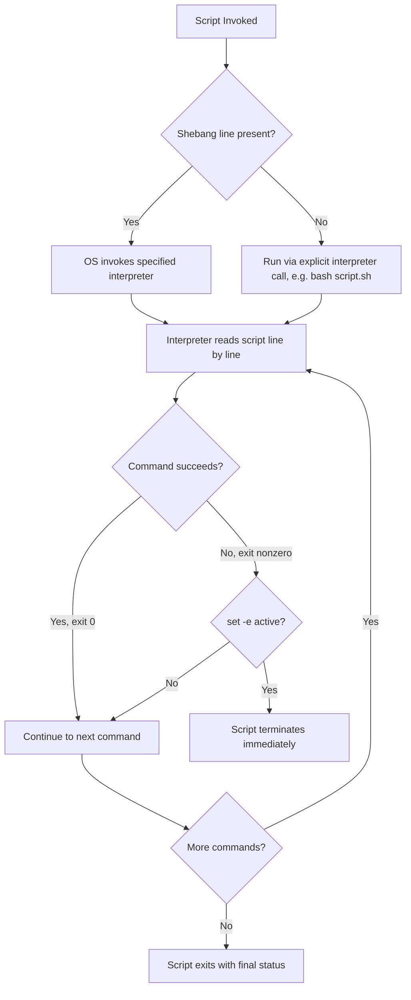

## Shell Scripting Fundamentals

### Overview

Shell scripting is the practice of writing sequences of commands for a Unix-like command-line interpreter (shell) to execute automatically. A shell script is a plain text file containing commands that would otherwise be typed interactively at a terminal prompt, combined with control structures, variables, and logic to automate repetitive tasks. The most common shell used for scripting on Linux and macOS systems is **Bash** (Bourne Again SHell), though other shells like `sh` (POSIX shell), `zsh`, `dash`, and `ksh` are also widely used.

Shell scripts are typically used for system administration tasks: automating backups, deploying applications, processing text files, managing services, and chaining together other command-line utilities.

### The Shebang Line

Every executable shell script conventionally begins with a **shebang** (`#!`) line, which tells the operating system which interpreter should execute the file:

```bash
#!/bin/bash
echo "This script runs under Bash"
```

- `#!/bin/bash` explicitly invokes Bash.
- `#!/bin/sh` invokes the system's default POSIX-compliant shell (which may be `dash` on Debian/Ubuntu, not Bash).
- `#!/usr/bin/env bash` locates Bash via the user's `PATH`, improving portability across systems where Bash isn't at a fixed location.

**Behavioral note**: The exact path resolved by `env` and the default shell behind `/bin/sh` varies by distribution; behavior may differ across Linux distributions, macOS, and BSD systems.

### Making a Script Executable

```bash
chmod +x myscript.sh
./myscript.sh
```

`chmod +x` grants execute permission. Without it, the script must be run by explicitly invoking the interpreter (`bash myscript.sh`).

### Variables

Shell variables are untyped and assigned without spaces around the `=` sign:

```bash
#!/bin/bash
name="Alice"
age=30

echo "Name: $name"
echo "Age: ${age}"
```

Key rules:

- No spaces allowed around `=` (`name = "Alice"` is a syntax error).
- Variables are referenced with `$name` or `${name}` (braces disambiguate boundaries, e.g., `${name}_suffix`).
- All variables are stored as strings internally; arithmetic requires explicit constructs like `$(( ))`.

**Environment vs. local variables**:

```bash
export PATH="$PATH:/usr/local/bin"   # exported to child processes
LOCAL_VAR="only in this shell"       # not exported
```

### Command Substitution and Arithmetic

```bash
#!/bin/bash
current_date=$(date +%Y-%m-%d)
echo "Today is $current_date"

count=$(ls | wc -l)
echo "Files: $count"

# Arithmetic
x=5
y=3
sum=$((x + y))
echo "Sum: $sum"
```

`$( )` is the modern, preferred command substitution syntax, superseding the older backtick syntax `` `command` `` (both are functionally equivalent, but `$( )` nests more cleanly).

### Positional Parameters and Arguments

Scripts can accept command-line arguments, accessed via positional parameters:

```bash
#!/bin/bash
echo "Script name: $0"
echo "First argument: $1"
echo "Second argument: $2"
echo "All arguments: $@"
echo "Argument count: $#"
```

Running `./script.sh foo bar` produces:



```
Script name: ./script.sh
First argument: foo
Second argument: bar
All arguments: foo bar
Argument count: 2
```

### Conditionals

Bash uses `if`/`then`/`elif`/`else`/`fi`, typically paired with the `test` command (`[ ]`) or the Bash-specific extended test (`[[ ]]`):

```bash
#!/bin/bash
age=20

if [[ $age -ge 18 ]]; then
    echo "Adult"
elif [[ $age -ge 13 ]]; then
    echo "Teenager"
else
    echo "Child"
fi
```

**Common comparison operators:**

| Numeric | String | Meaning |
| --- | --- | --- |
| `-eq` | `==` or `=` | equal |
| `-ne` | `!=` | not equal |
| `-gt` | `>` (inside `[[ ]]`) | greater than |
| `-lt` | `<` (inside `[[ ]]`) | less than |
| `-ge` | — | greater or equal |
| `-le` | — | less or equal |

File test operators are also common: `-f` (file exists), `-d` (directory exists), `-x` (executable), `-z` (empty string), `-n` (non-empty string).

```bash
if [[ -f "config.txt" ]]; then
    echo "Config file found."
fi
```

**Note**: `[[ ]]` is a Bash/Korn-shell extension offering safer word-splitting and pattern-matching behavior than the POSIX `[ ]`; scripts intended to run under strict `/bin/sh` should use `[ ]` instead, since `[[ ]]` is not guaranteed to be available there.

### Loops

**for loop:**

```bash
#!/bin/bash
for fruit in apple banana cherry; do
    echo "Fruit: $fruit"
done

for i in {1..5}; do
    echo "Number: $i"
done

for file in *.txt; do
    echo "Processing $file"
done
```

**while loop:**

```bash
#!/bin/bash
count=1
while [[ $count -le 5 ]]; do
    echo "Count: $count"
    count=$((count + 1))
done
```

**until loop:**

```bash
#!/bin/bash
n=0
until [[ $n -ge 3 ]]; do
    echo "n is $n"
    n=$((n + 1))
done
```

### Functions

```bash
#!/bin/bash
greet() {
    local name=$1
    echo "Hello, $name!"
}

greet "World"

# Function with return status
is_even() {
    if (( $1 % 2 == 0 )); then
        return 0   # success
    else
        return 1   # failure
    fi
}

if is_even 4; then
    echo "4 is even"
fi
```

Note that shell functions do not return arbitrary values like other languages — `return` sets an integer **exit status** (0–255, where 0 conventionally means success). To "return" data such as a string, functions typically `echo` the value and the caller captures it via command substitution: `result=$(greet "World")`.

### Arrays

```bash
#!/bin/bash
fruits=("apple" "banana" "cherry")

echo "${fruits[0]}"        # apple
echo "${fruits[@]}"        # all elements
echo "${#fruits[@]}"       # array length

fruits+=("date")           # append

for f in "${fruits[@]}"; do
    echo "$f"
done
```

Bash 4.0+ also supports associative arrays (key-value maps):

```bash
declare -A colors
colors[apple]="red"
colors[banana]="yellow"
echo "${colors[apple]}"
```

**[Unverified]** Associative array availability depends on the Bash version installed; macOS ships an old Bash 3.2 by default for licensing reasons, so scripts relying on `declare -A` may fail there unless a newer Bash is installed separately — this should be verified against the target deployment environment rather than assumed.

### Input and Output Redirection

Shell scripting relies heavily on **streams**: standard input (stdin, fd 0), standard output (stdout, fd 1), and standard error (stderr, fd 2).

```bash
command > output.txt      # redirect stdout, overwrite
command >> output.txt     # redirect stdout, append
command 2> errors.txt     # redirect stderr
command > all.txt 2>&1    # redirect both stdout and stderr to same file
command < input.txt       # redirect stdin from file
command1 | command2       # pipe stdout of command1 into stdin of command2
```

**Example: reading input from the user**

```bash
#!/bin/bash
read -p "Enter your name: " user_name
echo "Hello, $user_name!"
```

### Exit Status and Error Handling

Every command returns an exit status accessible via `$?` — `0` indicates success, any nonzero value indicates failure (the specific nonzero value's meaning is command-defined).

```bash
#!/bin/bash
mkdir /tmp/testdir
if [[ $? -eq 0 ]]; then
    echo "Directory created successfully"
else
    echo "Failed to create directory"
fi
```

**Logical operators for chaining based on exit status:**

```bash
mkdir /tmp/testdir && echo "Success"     # runs echo only if mkdir succeeds
mkdir /tmp/testdir || echo "Failed"      # runs echo only if mkdir fails
```

**Defensive scripting options**, commonly placed at the top of production scripts:

```bash
set -e          # exit immediately if any command fails
set -u          # error on use of undefined variables
set -o pipefail # a pipeline fails if any command in it fails, not just the last
set -x          # print each command before executing (debugging)
```

These are frequently combined as `set -euo pipefail`, a widely recommended defensive header for robust scripts.

### Script Execution Flow



### Quoting Rules

Quoting is one of the most error-prone aspects of shell scripting, since word-splitting and glob expansion happen by default on unquoted variables.

```bash
name="John Smith"

echo $name      # Unsafe: may split into two words in some contexts
echo "$name"    # Safe: preserves as a single string "John Smith"

# Single quotes prevent ALL expansion
echo '$name'    # Output: $name (literal, no substitution)

# Double quotes allow variable/command substitution
echo "$name is $(whoami)"
```

**Rule of thumb**: variables should almost always be double-quoted (`"$var"`) unless intentional word-splitting or globbing is required, to avoid bugs with filenames or values containing spaces.

### Text Processing Companions

Shell scripts frequently delegate text processing to companion Unix utilities rather than implementing string logic natively:

| Tool | Purpose |
| --- | --- |
| `grep` | Pattern searching in text |
| `sed` | Stream-based find/replace and text transformation |
| `awk` | Field-based text processing and reporting |
| `cut` | Extract columns/fields from lines |
| `sort` | Sort lines |
| `uniq` | Remove/report duplicate lines |
| `tr` | Character translation/deletion |
| `xargs` | Build and execute commands from stdin input |

**Example: combining utilities in a pipeline**

```bash
#!/bin/bash
# Count occurrences of each word in a file, sorted by frequency
cat article.txt | tr ' ' '\n' | sort | uniq -c | sort -rn | head -10
```

### Case Statements

`case` provides pattern-matching branching, often cleaner than long `if`/`elif` chains:

```bash
#!/bin/bash
read -p "Enter a fruit: " fruit

case $fruit in
    apple|pear)
        echo "Pome fruit"
        ;;
    banana)
        echo "Tropical fruit"
        ;;
    *)
        echo "Unknown fruit"
        ;;
esac
```

### Common Use Cases

- **Automation of repetitive CLI tasks**: batch renaming files, backups, log rotation.
- **Build and deployment pipelines**: CI/CD scripts (e.g., steps inside GitHub Actions, GitLab CI, Jenkins).
- **System administration**: user management, cron jobs, service health checks.
- **Environment setup**: dotfiles, installation scripts (`install.sh`), dependency bootstrapping.
- **Glue code**: chaining together other programs/tools that don't have a shared native API.

### Scheduling with Cron

Shell scripts are frequently invoked on a schedule via `cron`:



```
# crontab entry: run backup.sh every day at 2:00 AM
0 2 * * * /home/user/scripts/backup.sh >> /home/user/logs/backup.log 2>&1
```

### Debugging Techniques

- `bash -x script.sh` — trace execution, printing each command before it runs.
- `bash -n script.sh` — syntax check only, without executing.
- `set -x` / `set +x` — toggle tracing within specific sections of a script.
- `shellcheck script.sh` — a widely-used static analysis tool that flags common quoting, portability, and logic errors. **[Inference]** ShellCheck is generally considered a de facto standard linting tool in the Bash scripting community, though its adoption in any specific team or project depends on local tooling conventions.

### Portability: Bash vs. POSIX sh

Not all shell features are portable. Bash-specific features (arrays, `[[ ]]`, `(( ))`, `local`, string manipulation like `${var//search/replace}`) are not guaranteed to work under strictly POSIX-compliant shells such as `dash`, which some systems use for `/bin/sh` (e.g., Debian/Ubuntu's `sh` is `dash`, not `bash`).

For maximum portability across Unix-like systems, scripts should:

- Use `#!/bin/sh` and avoid Bash-only syntax, **or**
- Explicitly require Bash via `#!/bin/bash` and document the dependency.

**Behavioral note**: Script behavior when run under a different shell than intended (e.g., invoking a Bash script with `sh script.sh`) may silently produce different results rather than a clear error, depending on which constructs are used; this should be tested explicitly rather than assumed safe.

### Key Points

- Shell scripts automate command-line workflows by sequencing shell commands, variables, and control structures.
- Variables are untyped strings by default; quoting (`"$var"`) is essential to avoid word-splitting bugs.
- Exit status (`$?`, 0 = success) is the primary mechanism for error handling and command chaining (`&&`, `||`).
- `set -euo pipefail` is a common defensive pattern to make scripts fail fast and loudly rather than silently continuing after errors.
- Bash extends POSIX `sh` with conveniences (arrays, `[[ ]]`, associative arrays) that are not portable to strictly POSIX shells like `dash`.
- Shell scripts commonly act as orchestration "glue" around other Unix utilities (`grep`, `sed`, `awk`) rather than reimplementing text-processing logic natively.

### Related Topics

- Advanced Bash string manipulation and parameter expansion (`${var#pattern}`, `${var%pattern}`, `${var//x/y}`)
- Writing portable POSIX-compliant `sh` scripts
- `awk` and `sed` in depth for text processing
- Process substitution and here-documents (`<<EOF`)
- Signal trapping and cleanup (`trap ... EXIT`)
- Shell scripting in CI/CD pipelines (GitHub Actions, GitLab CI)
- Comparing Bash, Zsh, and Fish for interactive vs. scripting use cases