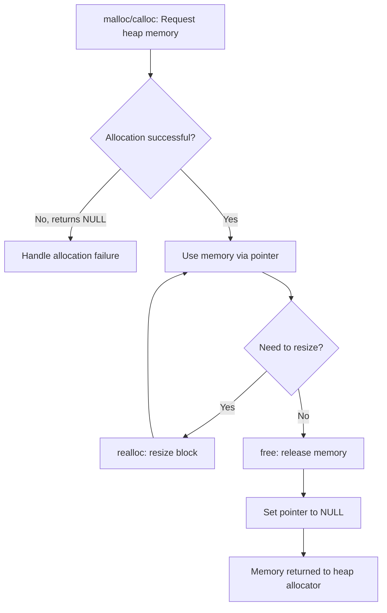
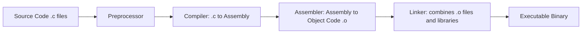

## C and Low-Level Control Philosophy

### Overview

C is a general-purpose, procedural programming language developed by Dennis Ritchie at Bell Labs between 1969 and 1973, originally to reimplement the Unix operating system. Its enduring influence stems from a specific design philosophy: give the programmer direct, minimally-mediated access to the machine's memory and instructions, while providing just enough abstraction to remain portable across hardware architectures. This philosophy — often summarized as "trust the programmer" — distinguishes C from higher-level languages that prioritize safety guarantees or automatic resource management over raw control.

C remains foundational to systems programming: operating system kernels, embedded firmware, device drivers, interpreters/runtimes for other languages, and performance-critical libraries are frequently written in C or C-derived languages.

### The "Trust the Programmer" Philosophy

C's design deliberately omits many safety nets found in other languages:

- No automatic bounds checking on arrays.
- No garbage collection; memory must be manually allocated and freed.
- No built-in string type (strings are conventionally null-terminated `char` arrays).
- Minimal runtime; the language assumes the programmer understands memory layout and lifetime.

This is not an oversight — it reflects a deliberate trade-off: C provides performance and control by removing guardrails, placing correctness responsibility entirely on the developer. This trade-off is central to understanding why C is chosen for systems work despite being comparatively easy to misuse.

**[Inference]** This design stance is often summarized by the phrase "C trusts the programmer," a characterization widely used in discussions of the language's philosophy (including by figures associated with its history), though it should be treated as a description of design intent rather than a formally documented specification claim.

### Memory: Stack vs. Heap

Understanding C requires understanding two distinct memory regions:

- **Stack**: Automatically managed, fixed-size at compile time (per call frame), extremely fast allocation/deallocation, used for local variables and function call bookkeeping. Memory is reclaimed automatically when a function returns.
- **Heap**: Manually managed via `malloc`, `calloc`, `realloc`, and `free`. Persists until explicitly freed, useful for data whose size or lifetime isn't known at compile time.

```c
#include <stdio.h>
#include <stdlib.h>

int main(void) {
    int stack_var = 42;                          // stack allocation

    int *heap_var = malloc(sizeof(int));         // heap allocation
    if (heap_var == NULL) {
        return 1;  // allocation failed
    }
    *heap_var = 100;

    printf("Stack: %d, Heap: %d\n", stack_var, *heap_var);

    free(heap_var);   // manual deallocation — required
    heap_var = NULL;  // avoid dangling pointer

    return 0;
}
```

Failing to call `free()` on heap-allocated memory that is no longer needed results in a **memory leak**. Using memory after it has been freed (a **use-after-free**) or freeing it twice (a **double-free**) are undefined behavior and common sources of security vulnerabilities.

### Pointers

Pointers are variables that store memory addresses, and they are the mechanism through which C exposes low-level memory control.

```c
#include <stdio.h>

int main(void) {
    int x = 10;
    int *ptr = &x;       // ptr holds the address of x

    printf("Value of x: %d\n", x);
    printf("Address of x: %p\n", (void*)&x);
    printf("Value via ptr: %d\n", *ptr);  // dereference

    *ptr = 20;            // modifies x through the pointer
    printf("New value of x: %d\n", x);

    return 0;
}
```

Pointers enable:

- **Pass-by-reference semantics** (C is otherwise strictly pass-by-value; pointers simulate reference passing).
- **Dynamic data structures** (linked lists, trees) built from `struct`s containing pointers to other `struct`s.
- **Direct hardware/memory manipulation**, common in embedded and systems code.
- **Function pointers**, enabling callback patterns and simple polymorphism.

**Pointer arithmetic**:

```c
int arr[5] = {10, 20, 30, 40, 50};
int *p = arr;            // array decays to pointer to first element

printf("%d\n", *(p + 2));  // equivalent to arr[2] -> 30
p++;                        // moves to next int (address + sizeof(int))
```

This tight coupling between arrays and pointers — where an array name decays into a pointer to its first element in most expressions — is a distinctive, sometimes error-prone feature of C's low-level model.

### Manual Memory Management Lifecycle



### Undefined Behavior

A defining characteristic of C's philosophy is **undefined behavior (UB)**: the language specification deliberately leaves certain operations unspecified, giving compilers latitude to assume they never occur, in exchange for aggressive optimization.

Common sources of UB include:

- Dereferencing a null or dangling pointer.
- Signed integer overflow.
- Accessing an array out of bounds.
- Using an uninitialized variable.
- Modifying a variable twice without an intervening sequence point (e.g., `i = i++ + 1;`).

**[Unverified]** The practical consequences of UB vary significantly by compiler, optimization level, and target architecture — code that "appears to work" under one compiler/flag combination may fail, crash, or behave unpredictably under another; this should be verified for the specific toolchain in use rather than assumed consistent, since the C standard itself imposes no requirement on the resulting behavior.

### The Compilation Model

C's low-level orientation is reflected in its build process, which produces machine code close to what the target CPU executes directly.



- **Preprocessor**: handles `#include`, `#define`, and conditional compilation (`#ifdef`) before real compilation begins.
- **Compiler**: translates C into target-specific assembly.
- **Assembler**: converts assembly into machine-code object files.
- **Linker**: resolves references across object files and libraries into a single executable.

This separation gives programmers fine control over what gets compiled, how libraries are linked (statically vs. dynamically), and what the final binary contains — control that is often abstracted away entirely in higher-level, interpreted, or VM-based languages.

### Structs and Manual Data Layout

C gives programmers explicit control over how composite data is laid out in memory, which matters for performance, hardware interfacing, and binary compatibility.

```c
#include <stdio.h>

struct Point {
    int x;
    int y;
};

struct Point make_point(int x, int y) {
    struct Point p;
    p.x = x;
    p.y = y;
    return p;
}

int main(void) {
    struct Point origin = make_point(0, 0);
    printf("(%d, %d)\n", origin.x, origin.y);
    printf("Size of struct: %zu bytes\n", sizeof(struct Point));
    return 0;
}
```

**Struct padding**: Compilers may insert padding bytes between struct members to satisfy alignment requirements of the target architecture, meaning `sizeof(struct Point)` is not always the simple sum of its members' sizes. Programmers who need precise control over layout (e.g., for network protocols or hardware registers) often use compiler-specific directives like `#pragma pack` or `__attribute__((packed))`.

**Behavioral note**: Struct alignment and padding rules are architecture- and compiler-dependent, so binary layout should be explicitly verified rather than assumed identical across platforms.

### Preprocessor and Macros

The C preprocessor performs textual substitution before compilation, another expression of low-level control — the programmer can manipulate source text itself:

```c
#define MAX_SIZE 100
#define SQUARE(x) ((x) * (x))

#ifdef DEBUG
    #define LOG(msg) printf("DEBUG: %s\n", msg)
#else
    #define LOG(msg)
#endif

int main(void) {
    int arr[MAX_SIZE];
    int result = SQUARE(5);  // expands to ((5) * (5))
    LOG("Program started");
    return 0;
}
```

Macros are a source of subtle bugs if not carefully parenthesized (e.g., `SQUARE(x)` without full parenthesization could misbehave under operator precedence with expressions like `SQUARE(a + b)`), which is itself illustrative of C's broader trade-off: powerful, low-level tools with few built-in protections against misuse.

### Manual Resource Management vs. Automatic Memory Management

| Aspect | C (manual) | Managed languages (e.g., Java, Python, Go) |
| --- | --- | --- |
| Allocation | Explicit (`malloc`) | Implicit (`new`, literals) |
| Deallocation | Explicit (`free`) | Automatic (garbage collector) |
| Runtime overhead | Minimal/none | GC pauses, tracking overhead |
| Failure modes | Leaks, dangling pointers, UB | Reduced (but GC pauses, less deterministic timing) |
| Determinism | High — freed exactly when programmer chooses | Lower — collection timing is not fully predictable |
| Programmer burden | High | Low |

This table captures the core trade-off underlying C's philosophy: predictability and control are gained in exchange for correctness burden shifted onto the developer.

### System Calls and the OS Boundary

C provides thin, direct wrappers around operating system services, reflecting its historical role as the implementation language of Unix:

```c
#include <unistd.h>
#include <fcntl.h>

int main(void) {
    int fd = open("data.txt", O_WRONLY | O_CREAT, 0644);
    if (fd == -1) {
        return 1;
    }
    write(fd, "Hello, OS\n", 10);
    close(fd);
    return 0;
}
```

These functions (`open`, `write`, `close`) map closely to actual system calls, with minimal abstraction layered on top — in contrast to higher-level languages, whose I/O APIs often wrap several layers of buffering, exception handling, and abstraction around the same underlying calls.

### Portability Despite Low-Level Access

Despite its closeness to hardware, C achieves portability through standardization (ANSI C / ISO C, with revisions C89, C99, C11, C17, C23) that defines behavior in terms of an abstract machine rather than any specific CPU. Type sizes (`int`, `long`, pointers) are permitted to vary by platform, which is itself a philosophical statement: C standardizes *behavior contracts*, not exact bit-level guarantees, leaving room for compilers to generate optimal code per target architecture.

```c
#include <stdio.h>

int main(void) {
    printf("int size: %zu bytes\n", sizeof(int));
    printf("long size: %zu bytes\n", sizeof(long));
    printf("pointer size: %zu bytes\n", sizeof(void*));
    return 0;
}
```

**[Unverified]** Exact type sizes are platform- and compiler-dependent (e.g., `long` is commonly 4 bytes on Windows/LLP64 and 8 bytes on Linux/macOS LP64 systems); this should be verified for the target platform using `sizeof` rather than assumed from general convention.

### Influence on Later Languages

C's low-level philosophy directly shaped, or was deliberately reacted against by, many subsequent languages:

- **C++**: extends C with object-orientation while preserving manual memory control (with optional higher-level tools like smart pointers).
- **Rust**: retains C-like performance and control but enforces memory safety at compile time via its ownership/borrow-checker model, explicitly aiming to prevent the UB classes common in C.
- **Go**: adopts C-like simplicity of syntax but adds garbage collection, trading some control for safety and developer ergonomics.
- **Java, Python, JavaScript**: largely abstract away manual memory management entirely, prioritizing safety and productivity over the fine-grained control C offers.

### Key Points

- C's core philosophy is to trust the programmer with direct memory and hardware access, prioritizing performance and control over built-in safety guarantees.
- Manual memory management (`malloc`/`free`) gives deterministic resource control but shifts correctness burden — leaks, dangling pointers, and double-frees are the programmer's responsibility.
- Pointers and array-pointer duality are the central mechanism for low-level control, enabling both power and a wide class of bugs.
- Undefined behavior is a deliberate design choice that grants compilers optimization freedom in exchange for unpredictable results when violated.
- C achieves portability not by fixing exact hardware details, but by standardizing behavior against an abstract machine, leaving type sizes and layout details to vary by platform.
- Many modern systems languages (Rust, Go, C++) can be understood as direct responses to specific trade-offs in C's original low-level control philosophy.

### Related Topics

- Pointers and dynamic data structures in depth (linked lists, trees, graphs in C)
- Undefined behavior and compiler optimization interactions
- Manual memory management pitfalls: leaks, use-after-free, double-free, and tools like Valgrind/AddressSanitizer
- The C preprocessor and macro-based metaprogramming
- Comparing C's memory model to Rust's ownership and borrow-checking system
- Struct alignment, padding, and binary layout control
- The C standard's evolution (C89 through C23) and abstract machine semantics