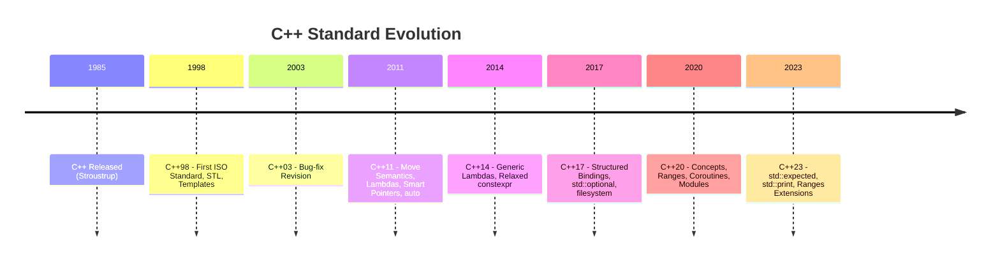
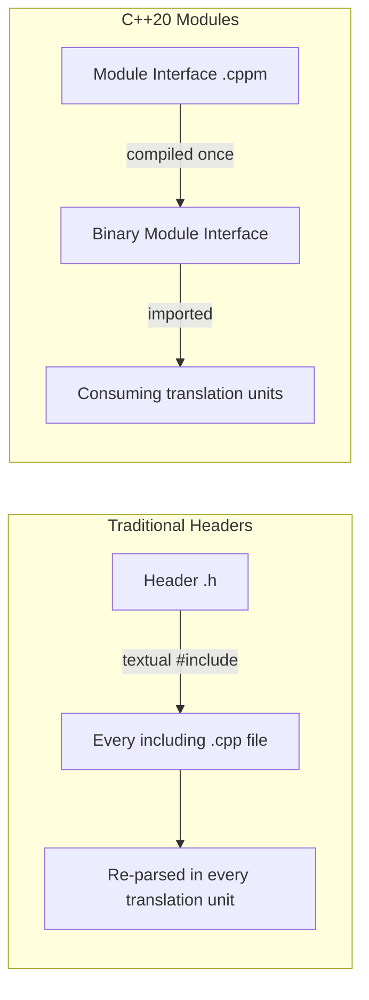

## C++ Evolution and Modern Standards

### Overview

C++ began as "C with Classes," designed by Bjarne Stroustrup starting in 1979 and formally released under the name C++ in 1985. It extended C with object-oriented programming while preserving C's low-level control and performance characteristics. Since its original standardization in 1998 (C++98), the language has undergone a series of major revisions — most significantly starting with **C++11**, which introduced sweeping changes so substantial that the language is often informally divided into "old C++" (pre-11) and "modern C++" (C++11 onward). Understanding C++'s evolution is essentially understanding how the language progressively added higher-level safety and expressiveness without sacrificing its core zero-overhead performance philosophy.

### Standardization Timeline

| Standard | Year | Informal Name | Significance |
| --- | --- | --- | --- |
| C++98 | 1998 | — | First ISO standard; templates, STL, exceptions |
| C++03 | 2003 | — | Minor bug-fix revision to C++98 |
| C++11 | 2011 | "C++0x" | Major overhaul: auto, lambdas, move semantics, smart pointers |
| C++14 | 2014 | — | Refinements to C++11 features |
| C++17 | 2017 | — | Structured bindings, `if constexpr`, filesystem library |
| C++20 | 2020 | — | Concepts, ranges, coroutines, modules |
| C++23 | 2023 | — | `std::expected`, further ranges/standard library extensions |

**[Inference]** C++26 is under active development by the ISO C++ committee at the time of this writing, with features under discussion including reflection and further contract-programming support; specific final feature sets should be verified against the current committee working papers rather than assumed settled, since proposals frequently change scope or get deferred before final ratification.

### C++11: The Modern Era Begins

C++11 is widely regarded as the most transformative revision in the language's history, introducing features that changed idiomatic C++ style substantially.

**Type inference with `auto`:**

```cpp
auto x = 42;              // inferred as int
auto y = 3.14;             // inferred as double
auto name = std::string("Alice");
```

**Lambda expressions:**

```cpp
#include <iostream>
#include <vector>
#include <algorithm>

int main() {
    std::vector<int> nums = {5, 2, 8, 1, 9};

    std::sort(nums.begin(), nums.end(), [](int a, int b) {
        return a < b;
    });

    int threshold = 5;
    auto count = std::count_if(nums.begin(), nums.end(),
        [threshold](int n) { return n > threshold; });

    std::cout << "Count above threshold: " << count << "\n";
    return 0;
}
```

**Move semantics and rvalue references**: perhaps C++11's most consequential addition, allowing resources (like heap-allocated buffers) to be transferred out of temporary objects rather than deep-copied.

```cpp
#include <iostream>
#include <vector>

std::vector<int> create_large_vector() {
    std::vector<int> v(1000000, 42);
    return v;  // move, not copy, under return value optimization / move semantics
}

int main() {
    std::vector<int> data = create_large_vector();  // no expensive copy
    std::vector<int> other = std::move(data);        // explicit move, data is now empty
    return 0;
}
```

**Smart pointers** (`<memory>` header): RAII-based automatic memory management wrappers, addressing C++'s historical reliance on manual `new`/`delete`.

```cpp
#include <memory>
#include <iostream>

class Resource {
public:
    Resource() { std::cout << "Resource acquired\n"; }
    ~Resource() { std::cout << "Resource released\n"; }
};

int main() {
    std::unique_ptr<Resource> ptr = std::make_unique<Resource>();
    // Automatically released when ptr goes out of scope — no manual delete needed

    std::shared_ptr<Resource> shared1 = std::make_shared<Resource>();
    std::shared_ptr<Resource> shared2 = shared1;  // reference-counted sharing

    return 0;
}
```

- `std::unique_ptr` — exclusive ownership, zero overhead compared to a raw pointer, non-copyable but movable.
- `std::shared_ptr` — reference-counted shared ownership, with runtime overhead for the reference count.
- `std::weak_ptr` — a non-owning reference to a `shared_ptr`-managed object, used to break reference cycles.

**Other notable C++11 features**: range-based `for` loops, `nullptr` (replacing the ambiguous `NULL` macro), variadic templates, `constexpr`, uniform initialization with `{}`, and the `<thread>` library for standardized multithreading.

### C++14 and C++17: Refinement and Practical Additions

C++14 was a comparatively small update, mainly polishing C++11 (generic lambdas, relaxed `constexpr` rules, `std::make_unique` addition).

C++17 introduced more substantial practical tools:

```cpp
#include <iostream>
#include <tuple>
#include <optional>
#include <variant>

// Structured bindings
std::tuple<int, std::string> get_data() {
    return {42, "answer"};
}

int main() {
    auto [number, label] = get_data();
    std::cout << number << ": " << label << "\n";

    // std::optional — explicit "may not have a value" type
    std::optional<int> maybe_value = std::nullopt;
    if (!maybe_value) {
        std::cout << "No value present\n";
    }

    return 0;
}
```

**`if constexpr`** enables compile-time branching within templates, eliminating many historical needs for template specialization tricks:

```cpp
template <typename T>
void print_value(T value) {
    if constexpr (std::is_pointer_v<T>) {
        std::cout << "Pointer to: " << *value << "\n";
    } else {
        std::cout << "Value: " << value << "\n";
    }
}
```

C++17 also standardized `std::filesystem` (path manipulation, directory iteration) and `std::variant` (a type-safe tagged union), both filling long-standing gaps that previously required third-party libraries like Boost.

### C++20: Concepts, Ranges, Coroutines, Modules

C++20 is considered another major milestone, comparable in scope of impact to C++11.

**Concepts** — constrain template parameters with readable, compile-time-checked requirements, replacing cryptic template error messages with clearer diagnostics:

```cpp
#include <concepts>
#include <iostream>

template <typename T>
concept Numeric = std::integral<T> || std::floating_point<T>;

template <Numeric T>
T add(T a, T b) {
    return a + b;
}

int main() {
    std::cout << add(3, 4) << "\n";       // OK: int satisfies Numeric
    std::cout << add(2.5, 1.5) << "\n";   // OK: double satisfies Numeric
    // add("a", "b");  // Compile error: string does not satisfy Numeric
    return 0;
}
```

**Ranges library** — composable, lazy-evaluated view-based operations over sequences, inspired by functional-style pipelines:

```cpp
#include <ranges>
#include <vector>
#include <iostream>

int main() {
    std::vector<int> nums = {1, 2, 3, 4, 5, 6, 7, 8, 9, 10};

    auto even_squares = nums
| std::views::filter([](int n) { return n % 2 == 0; })
| std::views::transform([](int n) { return n * n; });

    for (int n : even_squares) {
        std::cout << n << " ";
    }
    // Output: 4 16 36 64 100
    return 0;
}
```

**Coroutines** — language-level support for suspendable/resumable functions (`co_await`, `co_yield`, `co_return`), enabling asynchronous code without manual callback chains or external threading libraries.

**Modules** — an alternative to the traditional `#include` header/preprocessor model, intended to improve compile times and reduce macro-related coupling between translation units.

**[Unverified]** As of this writing, compiler support for C++20 modules has been reported as inconsistent across major toolchains (GCC, Clang, MSVC), with build-system integration (CMake, etc.) lagging behind language support in some cases; actual usability should be verified against the specific compiler and build-system versions in the target environment rather than assumed uniformly production-ready.

### C++23: Incremental but Meaningful

C++23 continued refining the standard library and ergonomics rather than introducing sweeping new paradigms:

- `std::expected<T, E>` — a standardized type for representing "value or error" without exceptions, similar in spirit to Rust's `Result`.
- `std::print` / `std::println` — a `printf`-style formatted output function built atop the C++20 `<format>` library, offering a more ergonomic alternative to `std::cout` chaining.
- Further ranges algorithm additions and `constexpr` extensions (more standard library functions usable at compile time).

```cpp
#include <expected>
#include <print>

std::expected<int, std::string> parse_number(const std::string& s) {
    try {
        return std::stoi(s);
    } catch (...) {
        return std::unexpected("Invalid number");
    }
}

int main() {
    auto result = parse_number("42");
    if (result) {
        std::println("Parsed: {}", *result);
    } else {
        std::println("Error: {}", result.error());
    }
    return 0;
}
```

### Evolution Timeline Visualization



### Core Design Philosophy Across Versions

Despite decades of additions, C++'s guiding principle has remained consistent: **"zero-overhead abstraction"** — new features should not impose runtime cost on programs that don't use them, and when used, should perform no worse than hand-written lower-level equivalents. This principle explains why C++ has historically favored compile-time mechanisms (templates, `constexpr`, concepts) over runtime ones wherever possible.

A second consistent thread is **backward compatibility**: C++ has rarely removed features outright (even historically discouraged ones like raw `new`/`delete` remain valid), instead layering safer idioms alongside older ones. This is a deliberate trade-off distinguishing C++'s evolution from languages that make more frequent breaking changes — it preserves an enormous existing codebase at the cost of an unusually large surface area of overlapping "ways to do the same thing."

### RAII as the Unifying Idiom

Across all these standards, one idiom — **RAII (Resource Acquisition Is Initialization)** — ties together memory management, file handles, locks, and more. Modern C++ features (smart pointers, `std::lock_guard`, `std::fstream`) are largely refinements and extensions of this single core idea: bind a resource's lifetime to an object's scope, so destructors handle cleanup automatically and deterministically.

```cpp
#include <mutex>

std::mutex mtx;

void safe_operation() {
    std::lock_guard<std::mutex> lock(mtx);  // acquires lock
    // ... critical section ...
}   // lock automatically released when 'lock' goes out of scope
```

### Comparison: Pre-C++11 vs. Modern C++ Idioms

| Task | Pre-C++11 Idiom | Modern C++ Idiom |
| --- | --- | --- |
| Heap allocation | `new`/`delete` (manual) | `std::make_unique` / `std::make_shared` |
| Iteration | Index-based `for` loop | Range-based `for` loop |
| Type declaration | Explicit type names | `auto` inference |
| Anonymous functions | Function objects (functors) | Lambda expressions |
| Optional values | Sentinel values, pointers | `std::optional` |
| Error handling (no exceptions) | Error codes, out-parameters | `std::expected` (C++23) |
| Template constraints | SFINAE tricks | Concepts (C++20) |

### Compilation Model Impact of Modules



### Key Points

- C++11 is the pivotal dividing line in the language's history, introducing move semantics, smart pointers, lambdas, and `auto` — the foundation of "modern C++" idioms.
- Each subsequent standard (14, 17, 20, 23) has followed a roughly three-year cadence, alternating between larger paradigm-shifting releases (11, 20) and more incremental refinement releases (14, 17, 23).
- C++20's Concepts, Ranges, Coroutines, and Modules represent the most significant expansion of the language's capabilities since C++11.
- The language's evolution is governed by two consistent principles: zero-overhead abstraction (new features shouldn't cost performance when unused) and strong backward compatibility (old code continues to compile).
- RAII remains the unifying idiom underlying most "modern" C++ safety features, from smart pointers to lock guards to file streams.
- Compiler and tooling support for the newest features (especially C++20 modules) can lag behind the published standard and should be verified for any specific toolchain before adoption.

### Related Topics

- Move semantics and rvalue references in depth
- Template metaprogramming and Concepts (C++20) compared to SFINAE-era techniques
- The Ranges library and functional-style pipeline composition
- Coroutines and asynchronous programming patterns in C++20
- RAII and exception safety guarantees (basic, strong, no-throw)
- Comparing C++'s evolution philosophy to Rust's edition system
- Build systems and C++20 Modules adoption (CMake, compiler-specific support)