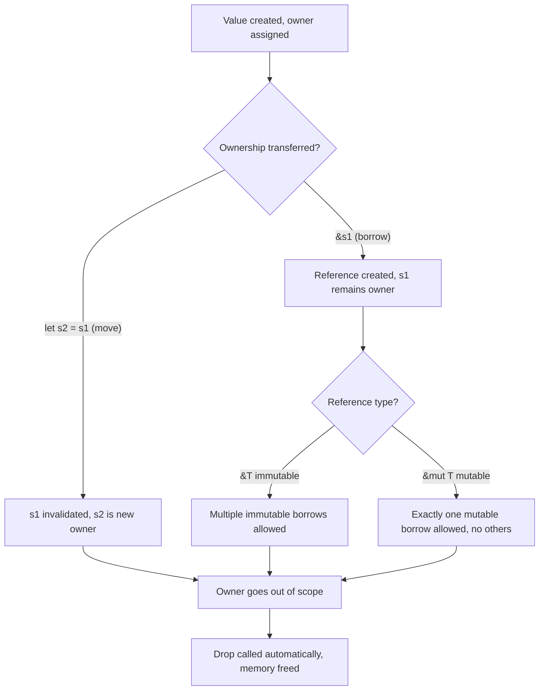

## Rust and Ownership-Based Memory Safety

### Overview

Rust is a systems programming language, originally developed at Mozilla Research and first released in 2010 (reaching a stable 1.0 in 2015), designed to deliver C/C++-level performance and control while eliminating entire classes of memory-safety bugs at **compile time**, without relying on a garbage collector. Its central innovation is the **ownership system**, enforced by a component of the compiler known as the **borrow checker**. Where C and C++ trust the programmer to manage memory correctly and only catch mistakes at runtime (if at all), Rust encodes memory-safety rules directly into the type system, rejecting unsafe programs before they ever run.

This makes Rust's core design philosophy almost a direct response to the trade-offs of C/C++: instead of "trust the programmer" or "trust the garbage collector," Rust's stance is "prove the program safe at compile time, with zero runtime cost."

### The Three Ownership Rules

Rust's memory model rests on three rules, enforced entirely at compile time:

1. Each value in Rust has a single **owner** (a variable).
2. There can only be **one owner** at a time.
3. When the owner goes out of scope, the value is **dropped** (its memory is freed automatically).

```rust
fn main() {
    let s1 = String::from("hello");
    let s2 = s1;  // ownership MOVES from s1 to s2

    // println!("{}", s1);  // COMPILE ERROR: s1 no longer valid (moved)
    println!("{}", s2);      // OK: s2 owns the value now
}
```

This is a critical departure from C++'s default copy semantics: assigning `s1` to `s2` does **not** copy the string data — it transfers ownership, and the compiler statically forbids further use of `s1`. This single rule eliminates use-after-free and double-free bugs by construction, since only one variable can ever be responsible for freeing a given piece of heap memory.

### Move Semantics vs. Clone

To explicitly duplicate data (rather than move it), Rust requires an explicit `.clone()` call — copying is never silent or implicit for heap-allocated types:

```rust
fn main() {
    let s1 = String::from("hello");
    let s2 = s1.clone();  // explicit deep copy

    println!("{} {}", s1, s2);  // both valid — no move occurred
}
```

Simple stack-only types (integers, booleans, chars) implement the `Copy` trait and are duplicated implicitly, since copying them is cheap and has no ownership implications:

```rust
fn main() {
    let x = 5;
    let y = x;  // i32 implements Copy — this is a copy, not a move

    println!("{} {}", x, y);  // both valid
}
```

### Borrowing and References

Since transferring ownership on every function call would be impractical, Rust allows **borrowing** — temporarily granting access to a value without transferring ownership, via references (`&`).

```rust
fn calculate_length(s: &String) -> usize {
    s.len()
}   // s goes out of scope here, but since it doesn't own the data, nothing is dropped

fn main() {
    let s1 = String::from("hello");
    let len = calculate_length(&s1);  // borrow s1, don't move it

    println!("The length of '{}' is {}.", s1, len);  // s1 still valid
}
```

**The borrowing rules**, enforced by the borrow checker at compile time:

- At any given time, you can have **either** exactly one mutable reference (`&mut T`) **or** any number of immutable references (`&T`) to a particular value — never both simultaneously.
- References must always be valid (no dangling references).

```rust
fn main() {
    let mut s = String::from("hello");

    let r1 = &s;       // immutable borrow
    let r2 = &s;       // another immutable borrow — OK, multiple reads allowed
    println!("{} {}", r1, r2);

    let r3 = &mut s;   // mutable borrow — only allowed once r1, r2 are no longer used
    r3.push_str(", world");
    println!("{}", r3);
}
```

Attempting to hold a mutable reference simultaneously with an immutable one, or two mutable references at once, is a **compile-time error** — this is the exact class of bug (data races on shared mutable state) that is often only discoverable at runtime, if at all, in C/C++.

### Ownership Flow Diagram



### Lifetimes

**Lifetimes** are Rust's mechanism for ensuring references never outlive the data they point to, preventing dangling references at compile time. Most lifetimes are inferred automatically, but explicit lifetime annotations are sometimes required in function signatures involving multiple references:

```rust
fn longest<'a>(x: &'a str, y: &'a str) -> &'a str {
    if x.len() > y.len() { x } else { y }
}

fn main() {
    let s1 = String::from("long string");
    let result;
    {
        let s2 = String::from("short");
        result = longest(s1.as_str(), s2.as_str());
        println!("Longest: {}", result);  // OK — used while s2 still valid
    }
    // println!("{}", result);  // Would be a COMPILE ERROR if used here — s2 dropped
}
```

The annotation `'a` here does not change any runtime behavior; it communicates to the compiler that the returned reference cannot outlive the shorter of the two input references' lifetimes, allowing the borrow checker to reject any usage that would otherwise produce a dangling reference.

### Structs, Enums, and Pattern Matching

```rust
struct User {
    username: String,
    active: bool,
}

enum Status {
    Active,
    Inactive,
    Banned(String),  // enum variant carrying data
}

fn describe_status(status: &Status) -> String {
    match status {
        Status::Active => String::from("User is active"),
        Status::Inactive => String::from("User is inactive"),
        Status::Banned(reason) => format!("User banned: {}", reason),
    }
}

fn main() {
    let user = User {
        username: String::from("alice"),
        active: true,
    };

    let status = Status::Banned(String::from("spam"));
    println!("{}", describe_status(&status));
    println!("Username: {}", user.username);
}
```

Rust's `match` expressions are **exhaustive** — the compiler enforces that every possible enum variant is handled (or an explicit `_` wildcard catch-all is present), eliminating an entire class of "forgot to handle a case" bugs common in languages with less strict switch statements.

### Error Handling: `Result` and `Option`

Rust has no exceptions and no null pointers in safe code. Instead, absence and failure are represented explicitly in the type system via `Option<T>` and `Result<T, E>`:

```rust
fn divide(a: f64, b: f64) -> Result<f64, String> {
    if b == 0.0 {
        Err(String::from("Division by zero"))
    } else {
        Ok(a / b)
    }
}

fn find_user(id: u32) -> Option<String> {
    if id == 1 {
        Some(String::from("Alice"))
    } else {
        None
    }
}

fn main() {
    match divide(10.0, 2.0) {
        Ok(result) => println!("Result: {}", result),
        Err(e) => println!("Error: {}", e),
    }

    if let Some(name) = find_user(1) {
        println!("Found: {}", name);
    } else {
        println!("Not found");
    }
}
```

Because the compiler forces every `Result` and `Option` to eventually be handled (unused `Result` values trigger a warning, and calling `.unwrap()` on a `None`/`Err` panics explicitly rather than silently corrupting state), Rust eliminates the class of bugs stemming from ignored error codes or unchecked null dereferences — a direct structural response to C's historical reliance on sentinel values (`NULL`, `-1`) that are easy to forget to check.

### `unsafe` Rust: The Escape Hatch

Rust acknowledges that some operations (raw pointer dereferencing, calling C functions via FFI, certain low-level optimizations) cannot be verified by the borrow checker. These are permitted only within explicitly marked `unsafe` blocks:

```rust
fn main() {
    let mut num = 5;
    let r1 = &num as *const i32;       // raw pointer, no borrow-checking

    unsafe {
        println!("r1 is: {}", *r1);    // dereferencing raw pointers requires unsafe
    }
}
```

Critically, `unsafe` does not disable *all* of Rust's checks — it only permits a small, explicit list of additional operations (raw pointer deref, calling `unsafe` functions, mutable access to statics, implementing `unsafe` traits, accessing union fields). The philosophy is containment: unsafe code is opt-in, explicitly marked, and ideally isolated to small, auditable regions, so that the vast majority of a codebase remains provably safe while still allowing low-level work when genuinely necessary.

### Comparison: Memory Safety Approaches

| Approach | Language(s) | Mechanism | Runtime Cost |
| --- | --- | --- | --- |
| Manual management | C | Programmer calls `malloc`/`free` | None, but high bug risk |
| Manual + RAII | C++ | Smart pointers, destructors | Minimal (ref-counting for `shared_ptr`) |
| Garbage collection | Java, Go, Python | Runtime tracks and reclaims unused memory | GC pauses, tracking overhead |
| Ownership + borrow checking | Rust | Compile-time proof of safety | None at runtime |

**[Inference]** This "zero-cost memory safety" positioning is widely cited as Rust's key differentiator relative to both C/C++ and garbage-collected languages; the specific performance parity with hand-written C in any given workload depends on the code and should be benchmarked rather than assumed universally equivalent, since real-world results vary by use case.

### Concurrency: "Fearless Concurrency"

Rust's ownership rules extend naturally to concurrent programming: because the borrow checker already prevents simultaneous mutable access to data, many data-race bugs are caught at compile time rather than manifesting as intermittent runtime failures.

```rust
use std::thread;
use std::sync::{Arc, Mutex};

fn main() {
    let counter = Arc::new(Mutex::new(0));
    let mut handles = vec![];

    for _ in 0..10 {
        let counter = Arc::clone(&counter);
        let handle = thread::spawn(move || {
            let mut num = counter.lock().unwrap();
            *num += 1;
        });
        handles.push(handle);
    }

    for handle in handles {
        handle.join().unwrap();
    }

    println!("Result: {}", *counter.lock().unwrap());
}
```

`Arc` (atomic reference counting) allows shared ownership across threads, and `Mutex` enforces exclusive access — but crucially, the compiler statically prevents a `Mutex`-guarded value from being accessed without first acquiring the lock, since the value can only be reached through the lock's guard type. Data races on shared state that would compile (and potentially fail only intermittently) in C++ are compile errors in Rust.

### The Compiler as a Collaborator

A defining aspect of Rust's philosophy is that compiler error messages are treated as a first-class part of the language design, not an afterthought — the compiler frequently explains *why* code was rejected and suggests specific fixes, reflecting a broader design goal of making the ownership model learnable rather than merely enforceable.

```plaintext
error[E0382]: borrow of moved value: `s1`
 --> src/main.rs:4:20
|
2 |     let s1 = String::from("hello");
|         -- move occurs because `s1` has type `String`
3 |     let s2 = s1;
|              -- value moved here
4 |     println!("{}", s1);
|                    ^^ value borrowed here after move
```

### Package Management: Cargo

Rust ships with an integrated build tool and package manager, **Cargo**, which handles dependency resolution, compilation, testing, and publishing to the central registry (crates.io):

```bash
cargo new my_project
cargo build
cargo run
cargo test
cargo add serde       # add a dependency
```

Dependencies and their versions are declared in `Cargo.toml`, and Cargo's integration is often cited as reducing the tooling fragmentation historically associated with C/C++ build systems.

### Key Points

- Rust's ownership system (single owner, move-by-default, explicit `.clone()`) statically eliminates use-after-free and double-free bugs without requiring a garbage collector.
- The borrow checker enforces that data is either read by many (`&T`) or mutated by one (`&mut T`), never both simultaneously — this single rule prevents both dangling references and many classes of data races at compile time.
- Lifetimes are a compile-time-only annotation mechanism ensuring references never outlive the data they point to; they impose no runtime cost.
- `Option<T>` and `Result<T, E>` replace null pointers and unchecked error codes with types the compiler forces the programmer to handle.
- `unsafe` blocks provide a deliberately contained escape hatch for operations the borrow checker cannot verify, keeping the vast majority of code provably safe.
- Rust's ownership model extends to concurrency, converting many classes of data races from runtime bugs (common in C/C++) into compile-time errors — often summarized as "fearless concurrency."

### Related Topics

- The borrow checker's non-lexical lifetimes and how they refine scope-based reasoning
- Traits and generics as Rust's mechanism for polymorphism (compared to C++ templates/concepts)
- `unsafe` Rust in depth: raw pointers, FFI with C, and safety invariants
- Smart pointer types in Rust (`Box`, `Rc`, `RefCell`) and interior mutability
- Async/await and Rust's concurrency model beyond threads
- Comparing Rust's ownership model to C++'s RAII and smart pointers
- Error handling patterns: `?` operator, custom error types, and the `thiserror`/`anyhow` ecosystem